# Google Cloud News Summary <!-- omit in toc -->

**English** | [日本語](README.md)

A Claude Agent SDK skill that retrieves information from Google Cloud What's New and Release Notes, and generates detailed explanation reports in Japanese.

- [Architecture](#architecture)
  - [System Overview (High-level)](#system-overview-high-level)
  - [System Overview (Detailed)](#system-overview-detailed)
  - [Sequence Diagram](#sequence-diagram)
  - [Sequence Diagram (Phase 1 Detail: report-generator Subagent Internals)](#sequence-diagram-phase-1-detail-report-generator-subagent-internals)
  - [Sequence Diagram (Phase 2 Detail: infographic-generator Subagent Internals)](#sequence-diagram-phase-2-detail-infographic-generator-subagent-internals)
- [Project Structure](#project-structure)
- [MCP Servers](#mcp-servers)
- [Execution](#execution)
  - [CI/CD with Claude Agent SDK](#cicd-with-claude-agent-sdk)
  - [Local Development](#local-development)
- [Information Sources](#information-sources)
- [Output](#output)
- [References](#references)
  - [Claude Agent SDK](#claude-agent-sdk)
  - [CI/CD Setup](#cicd-setup)
- [License](#license)

## Architecture

This skill uses the Claude Agent SDK and is scheduled to run from GitHub Actions. `run.py` acts as a two-phase orchestrator, with both phases using the subagent pattern via `AgentDefinition` and the Task tool for parallel execution. In Phase 1, the orchestrator fetches and parses RSS feeds, filters updates, checks for duplicates, then delegates individual report creation to `report-generator` subagents. In Phase 2, `run.py` splits target reports into batches of 5 and launches a separate `query()` call per batch, spawning `infographic-generator` subagents in parallel within each batch to generate infographics.

### System Overview (High-level)

```mermaid
flowchart TD
    Trigger["⏰ CI/CD Scheduled Trigger"]
    SDK["🐍 run.py (Claude Agent SDK)"]

    Trigger --> SDK

    subgraph Phase1["Phase 1: Report Generation"]
        direction TB

        subgraph Orchestrator["🎯 Orchestrator"]
            direction LR
            Fetch["💻 Fetch RSS<br/>(curl)"]
            Parse["🐍 Parse<br/>(parse_gcp_release_notes.py)"]
            Filter["🔍 Filter<br/>& Dedup Check"]
            Fetch --> Parse --> Filter
        end

        subgraph Subagents1["📝 report-generator Subagents (parallel)"]
            direction LR
            SA1["📋 Update A<br/>Report"]
            SA2["📋 Update B<br/>Report"]
            SA3["📋 Update C<br/>Report"]
            SA1 ~~~ SA2 ~~~ SA3
        end

        Reports["📁 reports/"]

        Filter -->|"Delegate via<br/>Task tool"| Subagents1
        Subagents1 --> Reports
    end

    subgraph Phase2["Phase 2: Infographic Generation"]
        direction TB

        subgraph Subagents2["🎨 infographic-generator Subagents (parallel)"]
            direction LR
            IB1["📊 Report A<br/>Infographic"]
            IB2["📊 Report B<br/>Infographic"]
            IB3["📊 Report C<br/>Infographic"]
            IB1 ~~~ IB2 ~~~ IB3
        end

        Infographic["📁 infographic/"]
        Subagents2 --> Infographic
    end

    SDK --> Phase1
    Reports -.->|"Delegate via<br/>Task tool"| Phase2

    classDef ci fill:#F3E5F5,stroke:#CE93D8,stroke-width:2px,color:#6A1B9A
    classDef sdk fill:#E1BEE7,stroke:#CE93D8,stroke-width:2px,color:#6A1B9A
    classDef orchestrator fill:#E8EAF6,stroke:#9FA8DA,stroke-width:2px,color:#283593
    classDef subagent fill:#FFF3E0,stroke:#FFB74D,stroke-width:2px,color:#E65100
    classDef output fill:#E8F5E9,stroke:#A5D6A7,stroke-width:2px,color:#2E7D32
    classDef frame fill:none,stroke:#CCCCCC,stroke-width:2px,color:#666666

    class Trigger ci
    class SDK sdk
    class Fetch,Parse,Filter orchestrator
    class SA1,SA2,SA3,IB1,IB2,IB3 subagent
    class Reports,Infographic output
    class Phase1,Phase2,Orchestrator,Subagents1,Subagents2 frame
```



**Overall Flow:**

This skill runs periodically from CI/CD, with `run.py` orchestrating two phases. Both phases use the subagent pattern for parallel execution.

1. **Phase 1 - Report Generation**: The orchestrator fetches RSS feeds, parses, filters, and checks for duplicates, then delegates individual report creation to `report-generator` subagents via the Task tool for parallel execution (google-cloud-news-summary skill)
2. **Phase 2 - Infographic Generation**: `infographic-generator` subagents are spawned in parallel via the Task tool to generate HTML infographics for each report (creating-infographic skill)

### System Overview (Detailed)

The following diagram shows the actual technical implementation and data flow in detail. In Phase 1, the orchestrator fetches RSS feeds, parses, filters, and checks for duplicates, then delegates individual report creation to `report-generator` subagents via the Task tool in parallel. Each subagent uses MCP servers (google-developer-knowledge, cloud-cost) to gather detailed information.

```mermaid
flowchart TB
    subgraph CI["CI/CD Environment"]
        Trigger["⏰ Scheduled Trigger<br/>(GitHub Actions)"]
        SDK["Claude Agent SDK<br/>(run.py)"]
    end

    subgraph Claude["Claude Agent (Orchestrator)"]
        Agent["🤖 Claude<br/>(Bedrock API)"]
        SkillDef["📋 SKILL.md<br/>(Instructions)"]
        Template["📄 report_template.md"]
    end

    Bash["💻 Bash Tool<br/>(curl commands)"]
    Scripts["🐍 Python Scripts"]

    subgraph External["External Data Sources"]
        Feeds["📡 RSS/XML Feed<br/>• GCP Release Notes"]
        Docs["📚 Google Cloud Documentation<br/>(docs.cloud.google.com)"]
        Pricing["💰 Cloud Pricing Data<br/>(instances.vantage.sh)"]
    end

    subgraph TempStorage["Temporary Storage (/tmp/)"]
        XMLRelease["gcp_release_notes.xml"]
    end

    subgraph Parsers["Parser Scripts"]
        ParseRelease["parse_gcp_release_notes.py<br/>📥 Input: XML<br/>📤 Output: JSON"]
        ParseBlog["parse_gcp_blog.py<br/>📥 Input: XML<br/>📤 Output: JSON"]
    end

    subgraph MCP["MCP Servers"]
        GDK["google-developer-knowledge<br/>🔍 search_documents<br/>📖 get_document<br/>📚 batch_get_documents"]
        CloudCost["cloud-cost<br/>💰 compare_compute<br/>💰 compare_storage<br/>💰 compare_kubernetes"]
    end

    subgraph OrchestratorProcessing["Orchestrator Processing"]
        JSON1["📊 JSON Data<br/>(Release Notes items)"]
        Filter["🔍 Filter & Prioritize<br/>(Period, Exclusions)"]
        Check["✅ Duplicate Check<br/>(Existing reports)"]
    end

    subgraph SubagentProcessing["report-generator Subagents (parallel)"]
        SA1["📝 Subagent A"]
        SA2["📝 Subagent B"]
        SA3["📝 Subagent C"]
        SA1 ~~~ SA2 ~~~ SA3
    end

    subgraph Output["Output Storage"]
        Reports["reports/{YYYY}/<br/>{date}-{slug}.md"]
        Infographic["infographic/<br/>{YYYYMMDD}-{slug}.html"]
        Git["📤 Git Commit & Push"]
    end

    %% Flow
    Trigger --> SDK
    SDK --> Agent
    Agent --> SkillDef

    %% Data Collection Flow (Orchestrator)
    SkillDef -->|"1. Execute curl"| Bash
    Bash -->|"HTTP GET"| Feeds

    Feeds -->|"XML Response"| Bash
    Bash -->|"Save XML"| XMLRelease

    %% Parsing Flow (Orchestrator)
    SkillDef -->|"2. Execute python"| Scripts
    Scripts -->|"Run"| ParseRelease

    XMLRelease -->|"Read XML"| ParseRelease
    ParseRelease -->|"stdout JSON"| JSON1

    %% Filtering & Duplicate Check (Orchestrator)
    JSON1 --> Filter
    Filter --> Check

    %% Delegate to Subagents
    Check -->|"3. Delegate via<br/>Task tool (parallel)"| SubagentProcessing

    %% Subagent MCP Integration
    SubagentProcessing -->|"search_documents<br/>get_document"| GDK
    SubagentProcessing -->|"compare_compute<br/>compare_storage"| CloudCost
    GDK -->|"HTTP Request"| Docs
    CloudCost -->|"HTTP Request"| Pricing

    %% Report Generation (Subagents)
    Template --> SubagentProcessing
    SubagentProcessing --> Reports
    Reports --> Git
    Reports -.->|"Phase 2<br/>(subagent parallel)"| Infographic
    Infographic --> Git

    %% Styling
    classDef ci fill:#F3E5F5,stroke:#CE93D8,stroke-width:2px,color:#6A1B9A
    classDef claude fill:#E8EAF6,stroke:#9FA8DA,stroke-width:2px,color:#283593
    classDef tools fill:#FFF3E0,stroke:#FFB74D,stroke-width:2px,color:#E65100
    classDef external fill:#E3F2FD,stroke:#90CAF9,stroke-width:2px,color:#1565C0
    classDef temp fill:#F5F5F5,stroke:#BDBDBD,stroke-width:2px,color:#424242
    classDef parsers fill:#FFF9C4,stroke:#FFF176,stroke-width:2px,color:#F57F17
    classDef mcp fill:#FFF8E1,stroke:#FFE082,stroke-width:2px,color:#F57F17
    classDef process fill:#FFECB3,stroke:#FFD54F,stroke-width:2px,color:#F57C00
    classDef subagent fill:#FFF3E0,stroke:#FFB74D,stroke-width:2px,color:#E65100
    classDef output fill:#E8F5E9,stroke:#A5D6A7,stroke-width:2px,color:#2E7D32
    classDef data fill:#E1F5FE,stroke:#81D4FA,stroke-width:2px,color:#01579B
    classDef frame fill:none,stroke:#CCCCCC,stroke-width:2px,color:#666666

    class Trigger,SDK ci
    class Agent,SkillDef,Template claude
    class Bash,Scripts tools
    class Feeds,Docs,Pricing external
    class XMLRelease temp
    class ParseRelease,ParseBlog parsers
    class GDK,CloudCost mcp
    class Filter,Check process
    class JSON1 data
    class SA1,SA2,SA3 subagent
    class Reports,Git,Infographic output
    class CI,Claude,External,TempStorage,Parsers,MCP,OrchestratorProcessing,SubagentProcessing,Output frame
```



**Technical Implementation Details:**

1. **Data Collection Phase (Orchestrator)**
   - Executes `curl` commands via the Bash Tool provided by Claude Agent SDK
   - Saves the GCP Release Notes RSS feed as XML to the `/tmp/` directory

2. **Parsing Phase (Orchestrator)**
   - Executes the Python parser script (`parse_gcp_release_notes.py`)
   - Reads `/tmp/gcp_release_notes.xml`, applies period filtering
   - Outputs JSON to stdout

3. **Filtering & Duplicate Check (Orchestrator)**
   - Filters based on exclusion rules defined in SKILL.md
   - Uses Glob to check existing reports (`reports/{YYYY}/*.md`) and eliminates duplicates

4. **Report Generation Phase (report-generator subagent parallel execution)**
   - The orchestrator spawns `report-generator` subagents in parallel via the Task tool
   - Each subagent works in its own isolated context to:
     - Fetch Release Notes detail pages via curl
     - Search and retrieve related documentation via MCP server (`google-developer-knowledge`)
     - Retrieve pricing information via MCP server (`cloud-cost`) when applicable
     - Create a comprehensive report based on the template (`report_template.md`)
   - Reports are saved to `reports/{YYYY}/{date}-{slug}.md`

5. **Infographic Generation Phase (infographic-generator subagent parallel execution)**
   - `run.py` splits target reports into batches of 5 and launches a separate `query()` call per batch
   - Context resets between batches, preventing "Prompt is too long" errors even with many reports
   - Within each batch, `infographic-generator` subagents defined via `AgentDefinition` are spawned in parallel through the Task tool
   - Each subagent generates an HTML infographic using the `creating-infographic` skill in its own isolated context
   - Infographics are saved to `infographic/{YYYYMMDD}-{slug}.html`

### Sequence Diagram

The following shows the overall flow from CI/CD pipeline through run.py executing the Claude Agent SDK, generating reports and infographics in two phases. In Phase 1, the orchestrator fetches RSS feeds, parses, filters, and checks for duplicates, then delegates individual report creation to `report-generator` subagents via the Task tool in parallel. In Phase 2, `infographic-generator` subagents generate infographics in parallel. Context isolation between phases prevents generation failures due to context exhaustion.


### Sequence Diagram (Phase 1 Detail: report-generator Subagent Internals)

The following shows the detailed internal processing flow of `report-generator` subagents in Phase 1. `run.py` launches an orchestrator agent with a single `query()` call, which handles RSS fetching, parsing, filtering, and duplicate checking, then spawns `report-generator` subagents defined via `AgentDefinition` through the Task tool in parallel. Each subagent works in its own isolated context, leveraging MCP servers to gather detailed information and generate reports.

```mermaid
sequenceDiagram
    participant RunPy as 🐍 run.py
    participant SDK as Claude Agent SDK
    participant Orch as 🤖 Orchestrator Agent<br/>(Main Agent)
    participant Sub as 📝 report-generator<br/>(Subagent)
    participant Bash as 💻 Bash Tool
    participant MCP as 📚 MCP Server<br/>(google-developer-knowledge)
    participant Cost as 💰 MCP Server<br/>(cloud-cost)
    participant FS as 📁 File System

    Note over RunPy,FS: Phase 1 Start: run_skill()

    RunPy->>SDK: query(<br/>  prompt=orchestrator_prompt,<br/>  options=ClaudeAgentOptions(<br/>    allowed_tools=[..., "Task"],<br/>    agents={"report-generator":<br/>      AgentDefinition(<br/>        description="...",<br/>        prompt=subagent_prompt,<br/>        tools=["Skill","Read","Write",<br/>          "Bash","mcp__google-developer-knowledge__*",<br/>          "mcp__cloud-cost__*",...]<br/>      )}<br/>  )<br/>)
    activate SDK

    SDK->>Orch: Send prompt + AgentDefinition
    activate Orch

    Note over Orch: After RSS fetch, parse, filter,<br/>and duplicate check, delegate<br/>new items to subagents

    Orch->>SDK: tool_use: Task<br/>(report-generator,<br/>instructions for Update A)
    Orch->>SDK: tool_use: Task<br/>(report-generator,<br/>instructions for Update B)

    Note over SDK,Sub: Each Task runs as an independent subagent in parallel

    par Subagent 1: Update A
        SDK->>Sub: Start processing Update A
        activate Sub
        Sub->>Sub: Skill(google-cloud-news-summary)<br/>+ template (report_template.md) load
        Sub->>Bash: curl Release Notes detail page
        Bash-->>Sub: HTML/Markdown content
        Sub->>MCP: search_documents(Update A keywords)
        MCP-->>Sub: Document search results
        Sub->>MCP: get_document(detail page)
        MCP-->>Sub: Document content
        Sub->>Cost: compare_compute(related service)
        Cost-->>Sub: Pricing information
        Sub->>Sub: Generate report from template
        Sub->>FS: Write reports/2026/2026-xx-xx-aaa.md
        Sub-->>SDK: Complete (success)
        deactivate Sub
    and Subagent 2: Update B
        SDK->>Sub: Start processing Update B
        activate Sub
        Sub->>Sub: Skill(google-cloud-news-summary)<br/>+ template (report_template.md) load
        Sub->>Bash: curl Release Notes detail page
        Bash-->>Sub: HTML/Markdown content
        Sub->>MCP: search_documents(Update B keywords)
        MCP-->>Sub: Document search results
        Sub->>Sub: Generate report from template
        Sub->>FS: Write reports/2026/2026-xx-xx-bbb.md
        Sub-->>SDK: Complete (success)
        deactivate Sub
    end

    SDK-->>Orch: All subagent results
    Orch-->>SDK: Result summary (N/M succeeded)
    deactivate Orch

    SDK-->>RunPy: ResultMessage (new report paths)
    deactivate SDK
```



### Sequence Diagram (Phase 2 Detail: infographic-generator Subagent Internals)

The following shows the detailed internal processing flow of `infographic-generator` subagents in Phase 2. `run.py` splits target reports into batches of 5 and launches a separate `query()` call per batch, resetting context between batches to avoid "Prompt is too long" errors. Within each batch, `infographic-generator` subagents defined via `AgentDefinition` are spawned through the Task tool in parallel. Each subagent reads a report in its own isolated context and generates an HTML infographic using the creating-infographic skill.

```mermaid
sequenceDiagram
    participant RunPy as 🐍 run.py
    participant SDK as Claude Agent SDK
    participant Orch as 🤖 Orchestrator Agent<br/>(Main Agent)
    participant Sub as 🎨 infographic-generator<br/>(Subagent)
    participant FS as 📁 File System

    Note over RunPy,FS: Phase 2 Start: generate_infographics()

    RunPy->>RunPy: Filter target reports<br/>(skip existing infographics)
    RunPy->>RunPy: Split into batches<br/>(5 reports each)

    loop Per-batch query() call (e.g. Batch 1/3)
        RunPy->>SDK: query(<br/>  prompt=orchestrator_prompt,<br/>  options=ClaudeAgentOptions(<br/>    allowed_tools=[..., "Task"],<br/>    agents={"infographic-generator":<br/>      AgentDefinition(<br/>        description="...",<br/>        prompt=subagent_prompt,<br/>        tools=["Skill","Read","Write",...]<br/>      )}<br/>  )<br/>)
        activate SDK

        SDK->>Orch: Send prompt + AgentDefinition
        activate Orch

        Note over Orch: Parse batch task list and<br/>delegate each report to subagent

        Orch->>SDK: tool_use: Task<br/>(infographic-generator,<br/>instructions for report_1)
        Orch->>SDK: tool_use: Task<br/>(infographic-generator,<br/>instructions for report_2)

        Note over SDK,Sub: Each Task runs as an independent subagent in parallel

        par Subagent 1: report_1
            SDK->>Sub: Start processing report_1
            activate Sub
            Sub->>FS: Read reports/2026/2026-02-10-xxx.md
            FS-->>Sub: Report content
            Sub->>Sub: Skill(creating-infographic)<br/>+ theme (google-cloud-news.md) load
            Sub->>Sub: Generate HTML infographic
            Sub->>FS: Write infographic/20260210-xxx.html
            Sub-->>SDK: Complete (success)
            deactivate Sub
        and Subagent 2: report_2
            SDK->>Sub: Start processing report_2
            activate Sub
            Sub->>FS: Read reports/2026/2026-02-10-yyy.md
            FS-->>Sub: Report content
            Sub->>Sub: Skill(creating-infographic)<br/>+ theme (google-cloud-news.md) load
            Sub->>Sub: Generate HTML infographic
            Sub->>FS: Write infographic/20260210-yyy.html
            Sub-->>SDK: Complete (success)
            deactivate Sub
        end

        SDK-->>Orch: All subagent results
        Orch-->>SDK: Result summary (N/M succeeded)
        deactivate Orch

        SDK-->>RunPy: ResultMessage (generation results)
        deactivate SDK

        RunPy->>RunPy: Verify batch file creation
    end

    RunPy->>RunPy: Output overall summary<br/>(Infographic Summary: N/M created)
```



## Project Structure

```
google-cloud-news-summary/
├── .claude/                           # Claude Code settings
│   ├── settings.json                  # Permissions & MCP config
│   └── skills/
│       ├── google-cloud-news-summary/ # Skill definition (report generation)
│       │   ├── SKILL.md               # Skill instructions
│       │   ├── report_template.md     # Report template
│       │   └── scripts/               # Parser scripts
│       │       └── parse_gcp_release_notes.py  # GCP Release Notes parser
│       └── creating-infographic/      # Skill definition (infographic generation)
│           ├── SKILL.md               # Skill instructions
│           └── themes/                # Theme definitions
├── .github/workflows/                 # GitHub Actions
├── .mcp.json                          # MCP server configuration
├── reports/                           # Generated reports (by year)
│   ├── 2025/
│   └── 2026/
├── infographic/                       # Generated infographics (HTML)
├── docs/                              # Documentation
│   ├── SETUP.md                       # CI/CD setup guide (Japanese)
│   └── SETUP-en.md                    # CI/CD setup guide (English)
├── CLAUDE.md                          # Claude Code instructions
├── README.md                          # Japanese documentation
├── README-en.md                       # English documentation
├── requirements.txt                   # Python dependencies
└── run.py                             # CI/CD entry point (two-phase orchestrator)
```

**Note**: Skills are defined at project-level (`.claude/skills/`) to ensure they work in CI/CD environments where user-level skills (`~/.claude/skills/`) are not available. `run.py` orchestrates Phase 1 (parallel report generation via `report-generator` subagents) and Phase 2 (parallel infographic generation via `infographic-generator` subagents).

## MCP Servers

This project uses MCP servers configured in `.mcp.json`. The MCP configuration is automatically loaded by the Claude Agent SDK via `setting_sources=["project"]`.

| Server Name | Endpoint | Description |
|-------------|----------|-------------|
| google-developer-knowledge | `https://developerknowledge.googleapis.com/mcp` | Search and retrieve Google Cloud official documentation |
| cloud-cost | `npx cloud-cost-mcp` | Multi-cloud pricing comparison (GCP 287 instances, 40+ regions) |

**MCP server vs RSS feed**:

The MCP server (`search_documents`) can search documentation pages on `docs.cloud.google.com` and is useful for supplementing detailed information about individual updates. However, it does not support date filtering, so RSS feeds + curl are used to retrieve the latest updates list.

| Purpose | Method |
|---------|--------|
| Retrieve latest update list | RSS feed (curl + parser script) |
| Supplement detailed info for individual updates | MCP server (`search_documents`) |
| Retrieve pricing information | MCP server (`cloud-cost`) / curl fallback |

### google-developer-knowledge

A remote MCP server for searching and retrieving official documentation for Google Cloud, Firebase, Android, Maps, and more. It offers three tools:

- `search_documents`: Search documentation
- `get_document`: Retrieve full document content from search results
- `batch_get_documents`: Batch retrieve multiple documents

**Setup**:

1. Enable the [Developer Knowledge API](https://console.cloud.google.com/apis/library/developerknowledge.googleapis.com) in your Google Cloud project
2. Create an API key restricted to the Developer Knowledge API
3. Enable the MCP server:
   ```bash
   gcloud components update
   gcloud beta services mcp enable developerknowledge.googleapis.com --project=YOUR_PROJECT_ID
   ```
   > If `gcloud beta services mcp` is not found, update gcloud CLI to the latest version with `gcloud components update`.
4. Replace `YOUR_API_KEY` in `.mcp.json` with your actual API key
   - Local development: Edit `.mcp.json` directly
   - GitHub Actions: Set `GCP_DEVELOPER_KNOWLEDGE_API_KEY` in repository Secrets (automatically substituted in workflow)

**Reference**: [Developer Knowledge MCP server documentation](https://developers.google.com/knowledge/mcp)

### cloud-cost

A local MCP server specialized in multi-cloud pricing comparison. No API key required; it fetches real-time pricing data from public APIs (`instances.vantage.sh`, etc.).

**Key features:**

- GCP 287 instance types across 40+ regions
- Compute, storage, egress, and Kubernetes pricing comparison
- Full workload cost estimation
- Cross-cloud comparison with AWS / Azure / OCI

**Main tools:**

- `compare_compute`: Compare VM/instance pricing
- `compare_storage`: Compare storage pricing
- `compare_kubernetes`: Compare managed Kubernetes (GKE, etc.) pricing
- `refresh_gcp_pricing`: Refresh GCP pricing data

**Setup**: No additional configuration needed if Node.js is installed. Automatically downloaded and started via `npx cloud-cost-mcp`.

**Reference**: [cloud-cost-mcp (GitHub)](https://github.com/jasonwilbur/cloud-cost-mcp)

## Execution

### CI/CD with Claude Agent SDK

This skill is automatically executed from GitHub Actions using the Claude Agent SDK.

**Setup Instructions**: Running in CI/CD requires configuring AWS IAM OIDC provider, IAM role, and CI/CD variables. See the following documentation for detailed instructions:

📖 **[CI/CD Setup Guide (docs/SETUP-en.md)](docs/SETUP-en.md)**

The setup guide includes:

- Creating AWS IAM OIDC provider and IAM role (with automation script)
- Configuring GitHub Actions variables
- Troubleshooting

### Local Development

**Using Claude Code CLI**:
```bash
cd ~/.claude/skills/google-cloud-news-summary
claude "Report the latest Google Cloud news"
```

**Using run.py**:
```bash
cd google-cloud-news-summary
pip install -r requirements.txt

# Default prompt (past week)
python run.py

# Custom prompt - Filter by specific service
python run.py "Run the google-cloud-news-summary skill for Vertex AI updates"

# Custom prompt - Specify time period
python run.py "Run the google-cloud-news-summary skill for GCP updates from the past 2 weeks"
```

**Notes**:
- `run.py` requires AWS credentials configured for Bedrock access
- Include "Run the google-cloud-news-summary skill" in prompts to ensure the skill is invoked
- Current datetime is automatically added to the prompt for accurate date filtering

## Information Sources

| Source | URL | Format | Retrieval Method |
|--------|-----|--------|------------------|
| Google Cloud Release Notes | https://cloud.google.com/release-notes | RSS/XML | curl + parse_gcp_release_notes.py |
| Google Cloud Blog | https://cloud.google.com/blog/products/ | RSS/XML | curl + parser (to be implemented) |

## Output

Two types of artifacts are generated.

- **Reports**: Japanese Markdown, `reports/{YYYY}/{YYYY}-{MM}-{DD}-{slug}.md`
- **Infographics**: HTML, `infographic/{YYYYMMDD}-{slug}.html`

## References

### Claude Agent SDK
- [Claude Agent SDK - Skills](https://platform.claude.com/docs/en/agent-sdk/skills) - Agent Skills in the SDK
- [Claude Agent SDK - Subagents](https://platform.claude.com/docs/en/agent-sdk/subagents) - Subagents in the SDK (parallel execution)
- [Claude Agent SDK - MCP](https://platform.claude.com/docs/en/agent-sdk/mcp) - MCP in the SDK
- [Claude Agent SDK - Python](https://platform.claude.com/docs/en/agent-sdk/python) - Python SDK Reference

### CI/CD Setup
- [aws-actions/configure-aws-credentials](https://github.com/aws-actions/configure-aws-credentials) - Official action to configure AWS credentials in GitHub Actions
- [GitHub Actions: Configuring OpenID Connect in AWS](https://docs.github.com/en/actions/security-for-github-actions/security-hardening-your-deployments/configuring-openid-connect-in-amazon-web-services)

## License

MIT License - See [LICENSE](LICENSE) for details.
