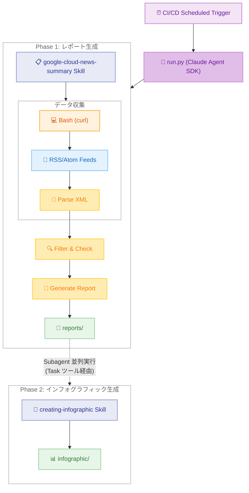

# Google Cloud News Summary <!-- omit in toc -->

[English](README-en.md) | **日本語**

Google Cloud の What's New と Release Notes の情報を取得し、日本語で詳細な解説レポートを作成する Claude Agent SDK スキル。

- [アーキテクチャ](#アーキテクチャ)
  - [システム概要 (ハイレベル)](#システム概要-ハイレベル)
- [プロジェクト構造](#プロジェクト構造)
- [MCP サーバー](#mcp-サーバー)
- [実行方法](#実行方法)
  - [CI/CD での実行 (Claude Agent SDK)](#cicd-での実行-claude-agent-sdk)
  - [ローカル開発](#ローカル開発)
- [情報ソース](#情報ソース)
- [出力](#出力)
- [参考資料](#参考資料)
  - [Claude Agent SDK](#claude-agent-sdk)
  - [CI/CD セットアップ](#cicd-セットアップ)
- [ライセンス](#ライセンス)

## アーキテクチャ

このスキルは Claude Agent SDK を使用し、GitHub Actions からスケジュール実行される。`run.py` が 2 フェーズのオーケストレーターとして動作し、Phase 1 で Bedrock API 経由で Claude を呼び出して SKILL.md の定義に従い日本語レポートを自動生成し、Phase 2 では `AgentDefinition` で定義した `infographic-generator` subagent を Task ツール経由で並列に起動し、インフォグラフィックを生成する。

### システム概要 (ハイレベル)



**全体フロー:**

このスキルは CI/CD から定期実行され、`run.py` が 2 フェーズで処理を行います。

1. **Phase 1 - レポート生成**: RSS/Atom フィードから情報を取得し、テンプレートベースで構造化された日本語レポートを作成 (google-cloud-news-summary スキル)
2. **Phase 2 - インフォグラフィック生成**: メインエージェントが `AgentDefinition` で定義された `infographic-generator` subagent を Task ツール経由で並列に起動し、各レポートの HTML インフォグラフィックを生成 (creating-infographic スキル)

## プロジェクト構造

```
google-cloud-news-summary/
├── .claude/                           # Claude Code 設定
│   ├── settings.json                  # 権限と MCP 設定
│   └── skills/
│       ├── google-cloud-news-summary/ # スキル定義 (レポート生成)
│       │   ├── SKILL.md               # スキル指示
│       │   ├── report_template.md     # レポートテンプレート
│       │   └── scripts/               # パーサースクリプト
│       │       └── parse_gcp_release_notes.py  # GCP Release Notes パーサー
│       └── creating-infographic/      # スキル定義 (インフォグラフィック生成)
│           ├── SKILL.md               # スキル指示
│           └── themes/                # テーマ定義
├── .github/workflows/                 # GitHub Actions
├── .mcp.json                          # MCP サーバー設定
├── reports/                           # 生成されたレポート (年別)
│   ├── 2025/
│   └── 2026/
├── infographic/                       # 生成されたインフォグラフィック (HTML)
├── docs/                              # ドキュメント
│   ├── SETUP.md                       # CI/CD セットアップガイド (日本語)
│   └── SETUP-en.md                    # CI/CD セットアップガイド (英語)
├── CLAUDE.md                          # Claude Code 指示
├── README.md                          # 日本語ドキュメント
├── README-en.md                       # 英語ドキュメント
├── requirements.txt                   # Python 依存関係
└── run.py                             # CI/CD エントリポイント (2 フェーズオーケストレーター)
```

**注意**: スキルはプロジェクトレベル (`.claude/skills/`) で定義されている。これは、ユーザーレベルのスキル (`~/.claude/skills/`) が利用できない CI/CD 環境でも動作することを保証するため。`run.py` が Phase 1 (レポート生成) と Phase 2 (subagent 並列インフォグラフィック生成) をオーケストレーションする。

## MCP サーバー

このプロジェクトでは `.mcp.json` で設定された MCP サーバーを使用します。MCP 設定は Claude Agent SDK の `setting_sources=["project"]` により自動的に読み込まれる。

| サーバー名 | エンドポイント | 説明 |
|-----------|---------------|------|
| google-developer-knowledge | `https://developerknowledge.googleapis.com/mcp` | Google Cloud 公式ドキュメントの検索・取得 |
| cloud-cost | `npx cloud-cost-mcp` | マルチクラウド料金比較 (GCP 287 インスタンス、40+ リージョン対応) |

**MCP サーバーと RSS フィードの使い分け**:

MCP サーバー (`search_documents`) は `docs.cloud.google.com` 等のドキュメントページを検索でき、リリースノートの詳細情報の補完に活用できる。ただし日付フィルタリングには対応していないため、「過去 N 日間の新着一覧」の取得には RSS フィード + curl を使用している。

| 用途 | 方法 |
|------|------|
| 最新アップデートの一覧取得 | RSS フィード (curl + パーサースクリプト) |
| 個別アップデートの詳細情報補完 | MCP サーバー (`search_documents`) |
| 料金情報の取得 | MCP サーバー (`cloud-cost`) / curl フォールバック |

### google-developer-knowledge

Google Cloud、Firebase、Android、Maps などの公式ドキュメントを検索・取得できるリモート MCP サーバーです。以下の 3 つのツールを提供します。

- `search_documents`: ドキュメントの検索
- `get_document`: 検索結果から完全なドキュメントを取得
- `batch_get_documents`: 複数ドキュメントの一括取得

**セットアップ手順**:

1. Google Cloud プロジェクトで [Developer Knowledge API](https://console.cloud.google.com/apis/library/developerknowledge.googleapis.com) を有効化
2. API キーを作成し、Developer Knowledge API のみに制限
3. MCP server を有効化:
   ```bash
   gcloud components update
   gcloud beta services mcp enable developerknowledge.googleapis.com --project=YOUR_PROJECT_ID
   ```
   > `gcloud beta services mcp` が見つからない場合は `gcloud components update` で gcloud CLI を最新版に更新してください。
4. `.mcp.json` の `YOUR_API_KEY` を実際の API キーに置き換え
   - ローカル開発: `.mcp.json` を直接編集
   - GitHub Actions: リポジトリの Secrets に `GCP_DEVELOPER_KNOWLEDGE_API_KEY` を設定 (ワークフロー内で自動置換)

**参考**: [Developer Knowledge MCP server ドキュメント](https://developers.google.com/knowledge/mcp)

### cloud-cost

マルチクラウドの料金比較に特化したローカル MCP サーバーです。API キー不要で、公開 API (`instances.vantage.sh` 等) からリアルタイムの料金データを取得します。

**主な機能:**

- GCP 287 インスタンスタイプ、40+ リージョンの料金データ
- コンピュート、ストレージ、Egress、Kubernetes の料金比較
- ワークロード全体のコスト見積もり
- AWS / Azure / OCI との横断比較

**主要ツール:**

- `compare_compute`: VM/インスタンスの料金比較
- `compare_storage`: ストレージ料金の比較
- `compare_kubernetes`: マネージド Kubernetes (GKE 等) の料金比較
- `refresh_gcp_pricing`: GCP 料金データの最新化

**セットアップ手順**: Node.js がインストールされていれば、追加の設定は不要です。`npx cloud-cost-mcp` で自動的にダウンロード・起動されます。

**参考**: [cloud-cost-mcp (GitHub)](https://github.com/jasonwilbur/cloud-cost-mcp)

## 実行方法

### CI/CD での実行 (Claude Agent SDK)

このスキルは Claude Agent SDK を使用して GitHub Actions から自動実行される。

**セットアップ手順**: CI/CD 環境での実行には、AWS IAM OIDC プロバイダー、IAM ロール、CI/CD 変数の設定が必要です。詳細な手順は以下のドキュメントを参照してください。

📖 **[CI/CD セットアップガイド (docs/SETUP.md)](docs/SETUP.md)**

セットアップガイドには以下の内容が含まれます。

- AWS IAM OIDC プロバイダーと IAM ロールの作成 (自動化スクリプト付き)
- GitHub Actions 変数の設定
- トラブルシューティング

### ローカル開発

**Claude Code CLI を使用**:
```bash
cd ~/.claude/skills/google-cloud-news-summary
claude "Google Cloud の最新ニュースをレポートして"
```

**run.py を使用**:
```bash
cd google-cloud-news-summary
pip install -r requirements.txt

# デフォルトプロンプト (過去 1 週間)
python run.py

# カスタムプロンプト - 特定のサービスに絞る
python run.py "Run the google-cloud-news-summary skill for Vertex AI updates"

# カスタムプロンプト - 特定の期間を指定
python run.py "Run the google-cloud-news-summary skill for GCP updates from the past 2 weeks"
```

**注意**:
- `run.py` は Bedrock アクセス用の AWS 認証情報が設定されている必要がある
- プロンプトには「Run the google-cloud-news-summary skill」を含めることで、スキルが確実に呼び出されます
- 実行時の現在日時が自動的にプロンプトに追加されるため、期間指定が正確に処理されます

## 情報ソース

| ソース | URL | フォーマット | 取得方法 |
|--------|-----|--------------|----------|
| Google Cloud Release Notes | https://cloud.google.com/release-notes | RSS/XML | curl + parse_gcp_release_notes.py |
| Google Cloud Blog | https://cloud.google.com/blog/products/ | RSS/XML | curl + パーサー (今後実装) |

## 出力

レポートとインフォグラフィックの 2 種類の成果物を生成する。

- **レポート**: 日本語 Markdown、`reports/{YYYY}/{YYYY}-{MM}-{DD}-{slug}.md`
- **インフォグラフィック**: HTML、`infographic/{YYYYMMDD}-{slug}.html`

## 参考資料

### Claude Agent SDK
- [Claude Agent SDK - Skills](https://platform.claude.com/docs/en/agent-sdk/skills) - SDK のエージェントスキル
- [Claude Agent SDK - Subagents](https://platform.claude.com/docs/en/agent-sdk/subagents) - SDK の Subagent (並列実行)
- [Claude Agent SDK - MCP](https://platform.claude.com/docs/en/agent-sdk/mcp) - SDK の MCP
- [Claude Agent SDK - Python](https://platform.claude.com/docs/en/agent-sdk/python) - Python SDK リファレンス

### CI/CD セットアップ
- [aws-actions/configure-aws-credentials](https://github.com/aws-actions/configure-aws-credentials) - GitHub Actions で AWS 認証情報を設定するための公式アクション
- [GitHub Actions: AWS での OpenID Connect の設定](https://docs.github.com/en/actions/security-for-github-actions/security-hardening-your-deployments/configuring-openid-connect-in-amazon-web-services)

## ライセンス

MIT License - 詳細は [LICENSE](LICENSE) を参照。
