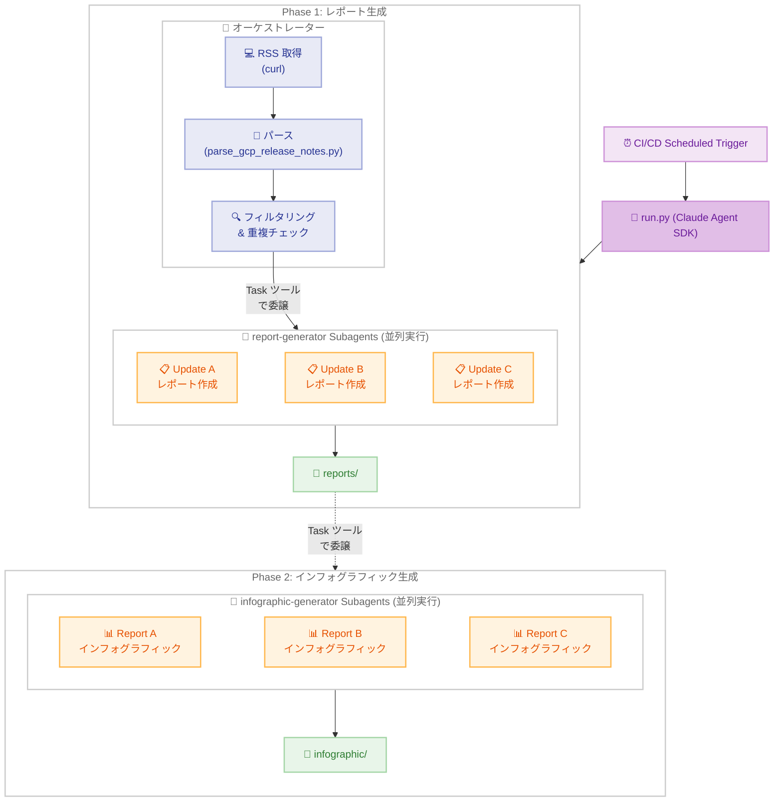
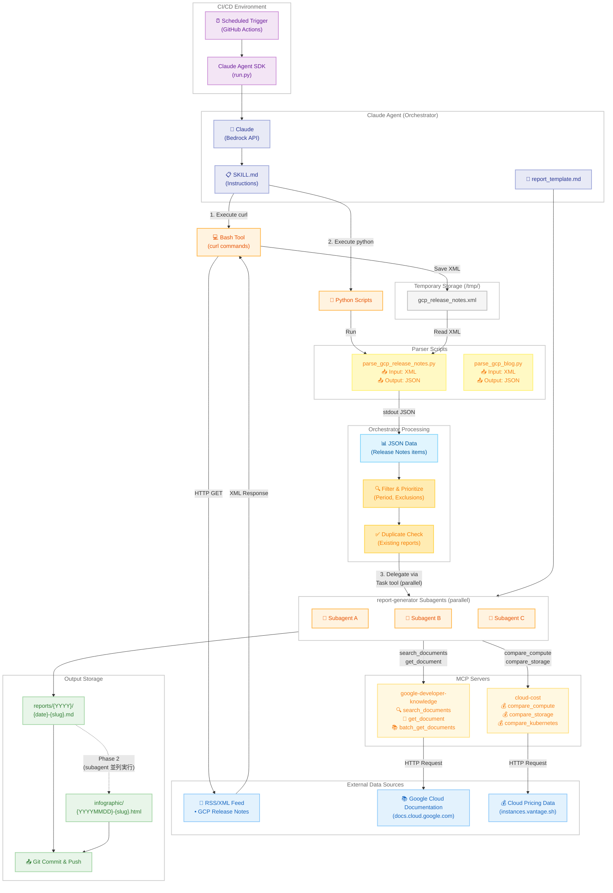
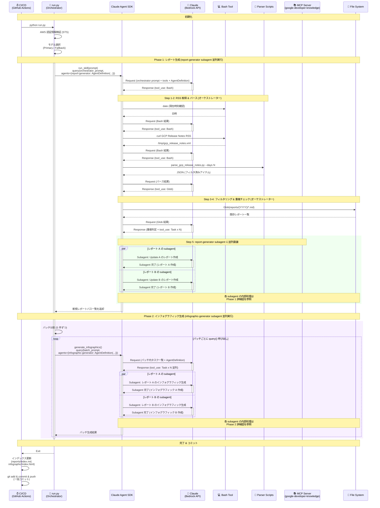
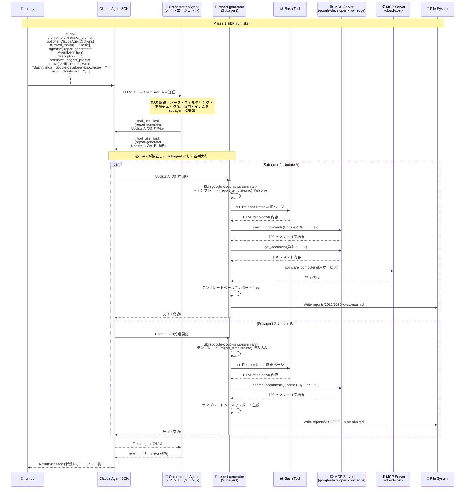
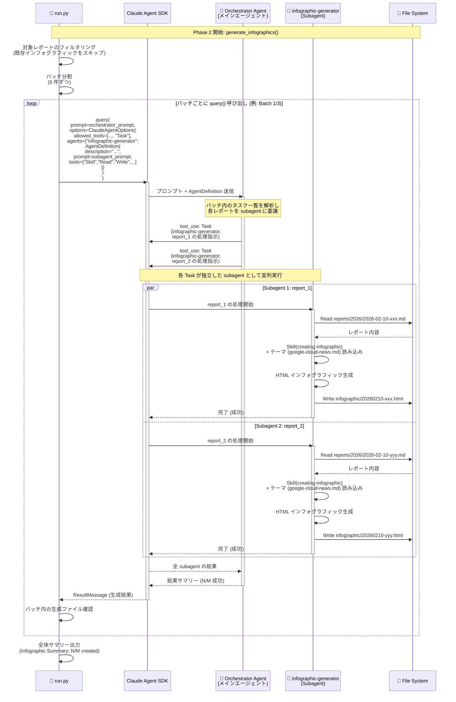

# Google Cloud News Summary <!-- omit in toc -->

[English](README-en.md) | **日本語**

Google Cloud の What's New と Release Notes の情報を取得し、日本語で詳細な解説レポートを作成する Claude Agent SDK スキル。

- [アーキテクチャ](#アーキテクチャ)
  - [システム概要 (ハイレベル)](#システム概要-ハイレベル)
  - [システム概要 (詳細版)](#システム概要-詳細版)
  - [シーケンス図](#シーケンス図)
  - [シーケンス図 (Phase 2 詳細: Subagent 内部処理)](#シーケンス図-phase-2-詳細-subagent-内部処理)
- [プロジェクト構造](#プロジェクト構造)
- [MCP サーバー](#mcp-サーバー)
  - [google-developer-knowledge](#google-developer-knowledge)
  - [cloud-cost](#cloud-cost)
- [実行方法](#実行方法)
  - [CI/CD での実行 (Claude Agent SDK)](#cicd-での実行-claude-agent-sdk)
  - [ローカル開発](#ローカル開発)
- [情報ソース](#情報ソース)
- [出力](#出力)
- [参考資料](#参考資料)
  - [Claude Agent SDK](#claude-agent-sdk)
  - [CI/CD セットアップ](#cicd-セットアップ)
- [ライセンス](#ライセンス)

## アーキテクチャ

このスキルは Claude Agent SDK を使用し、GitHub Actions からスケジュール実行される。`run.py` が 2 フェーズのオーケストレーターとして動作し、両フェーズとも `AgentDefinition` で定義した subagent を Task ツール経由で並列に起動する。Phase 1 ではオーケストレーターが RSS 取得・パース・フィルタリング・重複チェックを行い、個別レポート作成を `report-generator` subagent に委譲する。Phase 2 では `run.py` が対象レポートを 5 件ずつのバッチに分割し、バッチごとに個別の `query()` 呼び出しで `infographic-generator` subagent を並列起動してインフォグラフィックを生成する。

### システム概要 (ハイレベル)


```mermaid
flowchart TD
    Trigger["⏰ CI/CD Scheduled Trigger"]
    SDK["🐍 run.py (Claude Agent SDK)"]

    Trigger --> SDK

    subgraph Phase1["Phase 1: レポート生成"]
        direction TB

        subgraph Orchestrator["🎯 オーケストレーター"]
            direction LR
            Fetch["💻 RSS 取得<br/>(curl)"]
            Parse["🐍 パース<br/>(parse_gcp_release_notes.py)"]
            Filter["🔍 フィルタリング<br/>& 重複チェック"]
            Fetch --> Parse --> Filter
        end

        subgraph Subagents1["📝 report-generator Subagents (並列実行)"]
            direction LR
            SA1["📋 Update A<br/>レポート作成"]
            SA2["📋 Update B<br/>レポート作成"]
            SA3["📋 Update C<br/>レポート作成"]
            SA1 ~~~ SA2 ~~~ SA3
        end

        Reports["📁 reports/"]

        Filter -->|"Task ツール<br/>で委譲"| Subagents1
        Subagents1 --> Reports
    end

    subgraph Phase2["Phase 2: インフォグラフィック生成"]
        direction TB

        subgraph Subagents2["🎨 infographic-generator Subagents (並列実行)"]
            direction LR
            IB1["📊 Report A<br/>インフォグラフィック"]
            IB2["📊 Report B<br/>インフォグラフィック"]
            IB3["📊 Report C<br/>インフォグラフィック"]
            IB1 ~~~ IB2 ~~~ IB3
        end

        Infographic["📁 infographic/"]
        Subagents2 --> Infographic
    end

    SDK --> Phase1
    Reports -.->|"Task ツール<br/>で委譲"| Phase2

    classDef ci fill:#F3E5F5,stroke:#CE93D8,stroke-width:2px,color:#6A1B9A
    classDef sdk fill:#E1BEE7,stroke:#CE93D8,stroke-width:2px,color:#6A1B9A
    classDef orchestrator fill:#E8EAF6,stroke:#9FA8DA,stroke-width:2px,color:#283593
    classDef subagent fill:#FFF3E0,stroke:#FFB74D,stroke-width:2px,color:#E65100
    classDef output fill:#E8F5E9,stroke:#A5D6A7,stroke-width:2px,color:#2E7D32
    classDef frame fill:none,stroke:#CCCCCC,stroke-width:2px,color:#666666

    class Trigger ci
    class SDK sdk
    class Fetch,Parse,Filter orchestrator
    class SA1,SA2,SA3,IB1,IB2,IB3 subagent
    class Reports,Infographic output
    class Phase1,Phase2,Orchestrator,Subagents1,Subagents2 frame
```

**全体フロー:**

このスキルは CI/CD から定期実行され、`run.py` が 2 フェーズで処理を行います。両フェーズとも subagent パターンを採用し、並列実行で処理を高速化しています。

1. **Phase 1 - レポート生成**: オーケストレーターが RSS フィード取得・パース・フィルタリング・重複チェックを行い、`report-generator` subagent に個別レポート作成を Task ツール経由で並列に委譲 (google-cloud-news-summary スキル)
2. **Phase 2 - インフォグラフィック生成**: `infographic-generator` subagent を Task ツール経由で並列に起動し、各レポートの HTML インフォグラフィックを生成 (creating-infographic スキル)

### システム概要 (詳細版)

以下は実際の技術的な実装とデータフローを詳細に表現した図です。Phase 1 ではオーケストレーターが RSS 取得・パース・フィルタリング・重複チェックを行い、`report-generator` subagent に個別レポート作成を Task ツール経由で並列に委譲する。各 subagent は MCP サーバー (google-developer-knowledge、cloud-cost) を使用して詳細情報を収集する。


```mermaid
flowchart TB
    subgraph CI["CI/CD Environment"]
        Trigger["⏰ Scheduled Trigger<br/>(GitHub Actions)"]
        SDK["Claude Agent SDK<br/>(run.py)"]
    end

    subgraph Claude["Claude Agent (Orchestrator)"]
        Agent["🤖 Claude<br/>(Bedrock API)"]
        SkillDef["📋 SKILL.md<br/>(Instructions)"]
        Template["📄 report_template.md"]
    end

    Bash["💻 Bash Tool<br/>(curl commands)"]
    Scripts["🐍 Python Scripts"]

    subgraph External["External Data Sources"]
        Feeds["📡 RSS/XML Feed<br/>• GCP Release Notes"]
        Docs["📚 Google Cloud Documentation<br/>(docs.cloud.google.com)"]
        Pricing["💰 Cloud Pricing Data<br/>(instances.vantage.sh)"]
    end

    subgraph TempStorage["Temporary Storage (/tmp/)"]
        XMLRelease["gcp_release_notes.xml"]
    end

    subgraph Parsers["Parser Scripts"]
        ParseRelease["parse_gcp_release_notes.py<br/>📥 Input: XML<br/>📤 Output: JSON"]
        ParseBlog["parse_gcp_blog.py<br/>📥 Input: XML<br/>📤 Output: JSON"]
    end

    subgraph MCP["MCP Servers"]
        GDK["google-developer-knowledge<br/>🔍 search_documents<br/>📖 get_document<br/>📚 batch_get_documents"]
        CloudCost["cloud-cost<br/>💰 compare_compute<br/>💰 compare_storage<br/>💰 compare_kubernetes"]
    end

    subgraph OrchestratorProcessing["Orchestrator Processing"]
        JSON1["📊 JSON Data<br/>(Release Notes items)"]
        Filter["🔍 Filter & Prioritize<br/>(Period, Exclusions)"]
        Check["✅ Duplicate Check<br/>(Existing reports)"]
    end

    subgraph SubagentProcessing["report-generator Subagents (parallel)"]
        SA1["📝 Subagent A"]
        SA2["📝 Subagent B"]
        SA3["📝 Subagent C"]
        SA1 ~~~ SA2 ~~~ SA3
    end

    subgraph Output["Output Storage"]
        Reports["reports/{YYYY}/<br/>{date}-{slug}.md"]
        Infographic["infographic/<br/>{YYYYMMDD}-{slug}.html"]
        Git["📤 Git Commit & Push"]
    end

    %% Flow
    Trigger --> SDK
    SDK --> Agent
    Agent --> SkillDef

    %% Data Collection Flow (Orchestrator)
    SkillDef -->|"1. Execute curl"| Bash
    Bash -->|"HTTP GET"| Feeds

    Feeds -->|"XML Response"| Bash
    Bash -->|"Save XML"| XMLRelease

    %% Parsing Flow (Orchestrator)
    SkillDef -->|"2. Execute python"| Scripts
    Scripts -->|"Run"| ParseRelease

    XMLRelease -->|"Read XML"| ParseRelease
    ParseRelease -->|"stdout JSON"| JSON1

    %% Filtering & Duplicate Check (Orchestrator)
    JSON1 --> Filter
    Filter --> Check

    %% Delegate to Subagents
    Check -->|"3. Delegate via<br/>Task tool (parallel)"| SubagentProcessing

    %% Subagent MCP Integration
    SubagentProcessing -->|"search_documents<br/>get_document"| GDK
    SubagentProcessing -->|"compare_compute<br/>compare_storage"| CloudCost
    GDK -->|"HTTP Request"| Docs
    CloudCost -->|"HTTP Request"| Pricing

    %% Report Generation (Subagents)
    Template --> SubagentProcessing
    SubagentProcessing --> Reports
    Reports --> Git
    Reports -.->|"Phase 2<br/>(subagent 並列実行)"| Infographic
    Infographic --> Git

    %% Styling
    classDef ci fill:#F3E5F5,stroke:#CE93D8,stroke-width:2px,color:#6A1B9A
    classDef claude fill:#E8EAF6,stroke:#9FA8DA,stroke-width:2px,color:#283593
    classDef tools fill:#FFF3E0,stroke:#FFB74D,stroke-width:2px,color:#E65100
    classDef external fill:#E3F2FD,stroke:#90CAF9,stroke-width:2px,color:#1565C0
    classDef temp fill:#F5F5F5,stroke:#BDBDBD,stroke-width:2px,color:#424242
    classDef parsers fill:#FFF9C4,stroke:#FFF176,stroke-width:2px,color:#F57F17
    classDef mcp fill:#FFF8E1,stroke:#FFE082,stroke-width:2px,color:#F57F17
    classDef process fill:#FFECB3,stroke:#FFD54F,stroke-width:2px,color:#F57C00
    classDef subagent fill:#FFF3E0,stroke:#FFB74D,stroke-width:2px,color:#E65100
    classDef output fill:#E8F5E9,stroke:#A5D6A7,stroke-width:2px,color:#2E7D32
    classDef data fill:#E1F5FE,stroke:#81D4FA,stroke-width:2px,color:#01579B
    classDef frame fill:none,stroke:#CCCCCC,stroke-width:2px,color:#666666

    class Trigger,SDK ci
    class Agent,SkillDef,Template claude
    class Bash,Scripts tools
    class Feeds,Docs,Pricing external
    class XMLRelease temp
    class ParseRelease,ParseBlog parsers
    class GDK,CloudCost mcp
    class Filter,Check process
    class JSON1 data
    class SA1,SA2,SA3 subagent
    class Reports,Git,Infographic output
    class CI,Claude,External,TempStorage,Parsers,MCP,OrchestratorProcessing,SubagentProcessing,Output frame
```

**技術的な実装詳細:**

1. **データ収集フェーズ (オーケストレーター)**
   - Claude Agent SDK が提供する Bash Tool 経由で `curl` コマンドを実行
   - GCP Release Notes の RSS フィードを XML として `/tmp/` ディレクトリに保存

2. **パース処理フェーズ (オーケストレーター)**
   - Python パーサースクリプト (`parse_gcp_release_notes.py`) を実行
   - `/tmp/gcp_release_notes.xml` を読み込み、期間フィルタリングを適用
   - JSON を stdout に出力

3. **フィルタリング & 重複チェック (オーケストレーター)**
   - SKILL.md の除外ルールに基づきフィルタリング
   - Glob で既存レポート (`reports/{YYYY}/*.md`) を確認し重複を排除

4. **レポート生成フェーズ (report-generator subagent 並列実行)**
   - オーケストレーターが Task ツール経由で `report-generator` subagent を並列に起動
   - 各 subagent が独立したコンテキストで以下を実行:
     - Release Notes 詳細ページを curl で取得
     - MCP サーバー (`google-developer-knowledge`) で関連ドキュメントを検索・取得
     - MCP サーバー (`cloud-cost`) で料金情報を取得 (該当する場合)
     - テンプレート (`report_template.md`) ベースでレポート作成
   - `reports/{YYYY}/{date}-{slug}.md` に保存

5. **インフォグラフィック生成フェーズ (infographic-generator subagent 並列実行)**
   - `run.py` が対象レポートを 5 件ずつのバッチに分割し、バッチごとに個別の `query()` 呼び出しでオーケストレーターエージェントを起動
   - バッチごとにコンテキストがリセットされるため、大量のレポートでも「Prompt is too long」エラーを回避
   - 各バッチ内では `AgentDefinition` で定義した `infographic-generator` subagent を Task ツール経由で並列に起動
   - 各 subagent が独立したコンテキストで `creating-infographic` スキルを使用して HTML インフォグラフィックを生成
   - `infographic/{YYYYMMDD}-{slug}.html` に保存

### シーケンス図

以下は、CI/CD パイプラインから run.py が Claude Agent SDK を実行し、2 フェーズでレポートとインフォグラフィックを生成する全体フローを示す。Phase 1 ではオーケストレーターが RSS 取得・パース・フィルタリング・重複チェックを行い、`report-generator` subagent に個別レポート作成を Task ツール経由で並列に委譲する。Phase 2 では `infographic-generator` subagent がインフォグラフィックを並列生成する。各フェーズのコンテキストが分離されることで、コンテキスト枯渇による生成漏れを防止する。


```mermaid
sequenceDiagram
    participant CI as ⏰ CI/CD<br/>(GitHub Actions)
    participant RunPy as 🐍 run.py<br/>(Orchestrator)
    participant SDK as Claude Agent SDK
    participant LLM as 🤖 Claude<br/>(Bedrock API)
    participant Bash as 💻 Bash Tool
    participant Scripts as 🐍 Parser Scripts
    participant MCP as 📚 MCP Server<br/>(google-developer-knowledge)
    participant FS as 📁 File System

    Note over CI,FS: 初期化

    CI->>RunPy: python run.py
    RunPy->>RunPy: AWS 認証情報検証 (STS)
    RunPy->>RunPy: モデル選択<br/>(Primary / Fallback)

    Note over CI,FS: Phase 1: レポート生成 (report-generator subagent 並列実行)

    activate RunPy
    RunPy->>SDK: run_skill(prompt)<br/>query(orchestrator_prompt,<br/>agents={report-generator: AgentDefinition(...)})
    activate SDK

    SDK->>LLM: Request (orchestrator prompt + tools + AgentDefinition)
    activate LLM
    LLM-->>SDK: Response (tool_use: Bash)
    deactivate LLM

    rect rgb(255, 255, 255)
        Note over SDK,Scripts: Step 1-2: RSS 取得 & パース (オーケストレーター)
        SDK->>Bash: date (現在時刻確認)
        Bash-->>SDK: 日時
        SDK->>LLM: Request (Bash 結果)
        activate LLM
        LLM-->>SDK: Response (tool_use: Bash)
        deactivate LLM
        SDK->>Bash: curl GCP Release Notes RSS
        Bash-->>SDK: /tmp/gcp_release_notes.xml
        SDK->>LLM: Request (Bash 結果)
        activate LLM
        LLM-->>SDK: Response (tool_use: Bash)
        deactivate LLM
        SDK->>Scripts: parse_gcp_release_notes.py --days N
        Scripts-->>SDK: JSON (フィルタ済みアイテム)
    end

    SDK->>LLM: Request (パース結果)
    activate LLM
    LLM-->>SDK: Response (tool_use: Glob)
    deactivate LLM

    rect rgb(255, 255, 255)
        Note over SDK,FS: Step 3-4: フィルタリング & 重複チェック (オーケストレーター)
        SDK->>FS: Glob(reports/{YYYY}/*.md)
        FS-->>SDK: 既存レポート一覧
        SDK->>LLM: Request (Glob 結果)
        activate LLM
        LLM-->>SDK: Response (重複判定 + tool_use: Task x N)
        deactivate LLM
    end

    rect rgb(240, 255, 240)
        Note over SDK,MCP: Step 5: report-generator subagent に並列委譲

        par レポート A の subagent
            SDK->>LLM: Subagent: Update A のレポート作成
            activate LLM
            LLM-->>SDK: Subagent 完了 (レポート A 作成)
            deactivate LLM
        and レポート B の subagent
            SDK->>LLM: Subagent: Update B のレポート作成
            activate LLM
            LLM-->>SDK: Subagent 完了 (レポート B 作成)
            deactivate LLM
        end

        Note over SDK,FS: 各 subagent の内部処理は<br/>Phase 1 詳細図を参照
    end

    SDK-->>RunPy: 新規レポートパス一覧を返却
    deactivate SDK

    Note over CI,FS: Phase 2: インフォグラフィック生成 (infographic-generator subagent 並列実行)

    rect rgb(248, 240, 255)
        RunPy->>RunPy: バッチ分割 (5 件ずつ)

        loop バッチごとに query() 呼び出し
            RunPy->>SDK: generate_infographics()<br/>query(batch_prompt,<br/>agents={infographic-generator: AgentDefinition(...)})
            activate SDK
            SDK->>LLM: Request (バッチ内タスク一覧 + AgentDefinition)
            activate LLM
            LLM-->>SDK: Response (tool_use: Task x N 並列)
            deactivate LLM

            par レポート A の subagent
                SDK->>LLM: Subagent: レポート A のインフォグラフィック生成
                activate LLM
                LLM-->>SDK: Subagent 完了 (インフォグラフィック A 作成)
                deactivate LLM
            and レポート B の subagent
                SDK->>LLM: Subagent: レポート B のインフォグラフィック生成
                activate LLM
                LLM-->>SDK: Subagent 完了 (インフォグラフィック B 作成)
                deactivate LLM
            end

            Note over SDK,FS: 各 subagent の内部処理は<br/>Phase 2 詳細図を参照

            SDK-->>RunPy: バッチ生成結果
            deactivate SDK
        end
    end

    deactivate RunPy

    Note over CI,FS: 完了 & コミット

    RunPy-->>CI: Exit

    CI->>CI: インデックス更新<br/>(reports/index.md,<br/>infographic/index.html)
    CI->>CI: git add & commit & push<br/>(一括コミット)
```

### シーケンス図 (Phase 1 詳細: report-generator Subagent 内部処理)

以下は、Phase 1 における `report-generator` subagent の内部処理フローの詳細を示す。`run.py` が 1 つの `query()` 呼び出しでオーケストレーターエージェントを起動し、RSS 取得・パース・フィルタリング・重複チェック後、`AgentDefinition` で定義された `report-generator` subagent を Task ツール経由で並列に起動する。各 subagent は独立したコンテキストで MCP サーバーを活用しながらレポートを生成する。


```mermaid
sequenceDiagram
    participant RunPy as 🐍 run.py
    participant SDK as Claude Agent SDK
    participant Orch as 🤖 Orchestrator Agent<br/>(メインエージェント)
    participant Sub as 📝 report-generator<br/>(Subagent)
    participant Bash as 💻 Bash Tool
    participant MCP as 📚 MCP Server<br/>(google-developer-knowledge)
    participant Cost as 💰 MCP Server<br/>(cloud-cost)
    participant FS as 📁 File System

    Note over RunPy,FS: Phase 1 開始: run_skill()

    RunPy->>SDK: query(<br/>  prompt=orchestrator_prompt,<br/>  options=ClaudeAgentOptions(<br/>    allowed_tools=[..., "Task"],<br/>    agents={"report-generator":<br/>      AgentDefinition(<br/>        description="...",<br/>        prompt=subagent_prompt,<br/>        tools=["Skill","Read","Write",<br/>          "Bash","mcp__google-developer-knowledge__*",<br/>          "mcp__cloud-cost__*",...]<br/>      )}<br/>  )<br/>)
    activate SDK

    SDK->>Orch: プロンプト + AgentDefinition 送信
    activate Orch

    Note over Orch: RSS 取得・パース・フィルタリング・<br/>重複チェック後、新規アイテムを<br/>subagent に委譲

    Orch->>SDK: tool_use: Task<br/>(report-generator,<br/>Update A の処理指示)
    Orch->>SDK: tool_use: Task<br/>(report-generator,<br/>Update B の処理指示)

    Note over SDK,Sub: 各 Task が独立した subagent として並列実行

    par Subagent 1: Update A
        SDK->>Sub: Update A の処理開始
        activate Sub
        Sub->>Sub: Skill(google-cloud-news-summary)<br/>+ テンプレート (report_template.md) 読み込み
        Sub->>Bash: curl Release Notes 詳細ページ
        Bash-->>Sub: HTML/Markdown 内容
        Sub->>MCP: search_documents(Update A キーワード)
        MCP-->>Sub: ドキュメント検索結果
        Sub->>MCP: get_document(詳細ページ)
        MCP-->>Sub: ドキュメント内容
        Sub->>Cost: compare_compute(関連サービス)
        Cost-->>Sub: 料金情報
        Sub->>Sub: テンプレートベースでレポート生成
        Sub->>FS: Write reports/2026/2026-xx-xx-aaa.md
        Sub-->>SDK: 完了 (成功)
        deactivate Sub
    and Subagent 2: Update B
        SDK->>Sub: Update B の処理開始
        activate Sub
        Sub->>Sub: Skill(google-cloud-news-summary)<br/>+ テンプレート (report_template.md) 読み込み
        Sub->>Bash: curl Release Notes 詳細ページ
        Bash-->>Sub: HTML/Markdown 内容
        Sub->>MCP: search_documents(Update B キーワード)
        MCP-->>Sub: ドキュメント検索結果
        Sub->>Sub: テンプレートベースでレポート生成
        Sub->>FS: Write reports/2026/2026-xx-xx-bbb.md
        Sub-->>SDK: 完了 (成功)
        deactivate Sub
    end

    SDK-->>Orch: 全 subagent の結果
    Orch-->>SDK: 結果サマリー (N/M 成功)
    deactivate Orch

    SDK-->>RunPy: ResultMessage (新規レポートパス一覧)
    deactivate SDK
```

### シーケンス図 (Phase 2 詳細: infographic-generator Subagent 内部処理)

以下は、Phase 2 における `infographic-generator` subagent の内部処理フローの詳細を示す。`run.py` が対象レポートを 5 件ずつのバッチに分割し、バッチごとに個別の `query()` 呼び出しでオーケストレーターエージェントを起動する。各バッチ内では `AgentDefinition` で定義された `infographic-generator` subagent を Task ツール経由で並列に起動する。バッチごとにコンテキストがリセットされるため、大量のレポートでも安定して処理できる。


```mermaid
sequenceDiagram
    participant RunPy as 🐍 run.py
    participant SDK as Claude Agent SDK
    participant Orch as 🤖 Orchestrator Agent<br/>(メインエージェント)
    participant Sub as 🎨 infographic-generator<br/>(Subagent)
    participant FS as 📁 File System

    Note over RunPy,FS: Phase 2 開始: generate_infographics()

    RunPy->>RunPy: 対象レポートのフィルタリング<br/>(既存インフォグラフィックをスキップ)
    RunPy->>RunPy: バッチ分割<br/>(5 件ずつ)

    loop バッチごとに query() 呼び出し (例: Batch 1/3)
        RunPy->>SDK: query(<br/>  prompt=orchestrator_prompt,<br/>  options=ClaudeAgentOptions(<br/>    allowed_tools=[..., "Task"],<br/>    agents={"infographic-generator":<br/>      AgentDefinition(<br/>        description="...",<br/>        prompt=subagent_prompt,<br/>        tools=["Skill","Read","Write",...]<br/>      )}<br/>  )<br/>)
        activate SDK

        SDK->>Orch: プロンプト + AgentDefinition 送信
        activate Orch

        Note over Orch: バッチ内のタスク一覧を解析し<br/>各レポートを subagent に委譲

        Orch->>SDK: tool_use: Task<br/>(infographic-generator,<br/>report_1 の処理指示)
        Orch->>SDK: tool_use: Task<br/>(infographic-generator,<br/>report_2 の処理指示)

        Note over SDK,Sub: 各 Task が独立した subagent として並列実行

        par Subagent 1: report_1
            SDK->>Sub: report_1 の処理開始
            activate Sub
            Sub->>FS: Read reports/2026/2026-02-10-xxx.md
            FS-->>Sub: レポート内容
            Sub->>Sub: Skill(creating-infographic)<br/>+ テーマ (google-cloud-news.md) 読み込み
            Sub->>Sub: HTML インフォグラフィック生成
            Sub->>FS: Write infographic/20260210-xxx.html
            Sub-->>SDK: 完了 (成功)
            deactivate Sub
        and Subagent 2: report_2
            SDK->>Sub: report_2 の処理開始
            activate Sub
            Sub->>FS: Read reports/2026/2026-02-10-yyy.md
            FS-->>Sub: レポート内容
            Sub->>Sub: Skill(creating-infographic)<br/>+ テーマ (google-cloud-news.md) 読み込み
            Sub->>Sub: HTML インフォグラフィック生成
            Sub->>FS: Write infographic/20260210-yyy.html
            Sub-->>SDK: 完了 (成功)
            deactivate Sub
        end

        SDK-->>Orch: 全 subagent の結果
        Orch-->>SDK: 結果サマリー (N/M 成功)
        deactivate Orch

        SDK-->>RunPy: ResultMessage (生成結果)
        deactivate SDK

        RunPy->>RunPy: バッチ内の生成ファイル確認
    end

    RunPy->>RunPy: 全体サマリー出力<br/>(Infographic Summary: N/M created)
```

## プロジェクト構造

```
google-cloud-news-summary/
├── .claude/                           # Claude Code 設定
│   ├── settings.json                  # 権限と MCP 設定
│   └── skills/
│       ├── google-cloud-news-summary/ # スキル定義 (レポート生成)
│       │   ├── SKILL.md               # スキル指示
│       │   ├── report_template.md     # レポートテンプレート
│       │   └── scripts/               # パーサースクリプト
│       │       └── parse_gcp_release_notes.py  # GCP Release Notes パーサー
│       └── creating-infographic/      # スキル定義 (インフォグラフィック生成)
│           ├── SKILL.md               # スキル指示
│           └── themes/                # テーマ定義
├── .github/workflows/                 # GitHub Actions
├── .mcp.json                          # MCP サーバー設定
├── reports/                           # 生成されたレポート (年別)
│   ├── 2025/
│   └── 2026/
├── infographic/                       # 生成されたインフォグラフィック (HTML)
├── docs/                              # ドキュメント
│   ├── SETUP.md                       # CI/CD セットアップガイド (日本語)
│   └── SETUP-en.md                    # CI/CD セットアップガイド (英語)
├── CLAUDE.md                          # Claude Code 指示
├── README.md                          # 日本語ドキュメント
├── README-en.md                       # 英語ドキュメント
├── requirements.txt                   # Python 依存関係
└── run.py                             # CI/CD エントリポイント (2 フェーズオーケストレーター)
```

**注意**: スキルはプロジェクトレベル (`.claude/skills/`) で定義されている。これは、ユーザーレベルのスキル (`~/.claude/skills/`) が利用できない CI/CD 環境でも動作することを保証するため。`run.py` が Phase 1 (`report-generator` subagent 並列レポート生成) と Phase 2 (`infographic-generator` subagent 並列インフォグラフィック生成) をオーケストレーションする。

## MCP サーバー

このプロジェクトでは `.mcp.json` で設定された MCP サーバーを使用します。MCP 設定は Claude Agent SDK の `setting_sources=["project"]` により自動的に読み込まれる。

| サーバー名 | エンドポイント | 説明 |
|-----------|---------------|------|
| google-developer-knowledge | `https://developerknowledge.googleapis.com/mcp` | Google Cloud 公式ドキュメントの検索・取得 |
| cloud-cost | `npx cloud-cost-mcp` | マルチクラウド料金比較 (GCP 287 インスタンス、40+ リージョン対応) |

**MCP サーバーと RSS フィードの使い分け**:

MCP サーバー (`search_documents`) は `docs.cloud.google.com` 等のドキュメントページを検索でき、リリースノートの詳細情報の補完に活用できる。ただし日付フィルタリングには対応していないため、「過去 N 日間の新着一覧」の取得には RSS フィード + curl を使用している。

| 用途 | 方法 |
|------|------|
| 最新アップデートの一覧取得 | RSS フィード (curl + パーサースクリプト) |
| 個別アップデートの詳細情報補完 | MCP サーバー (`search_documents`) |
| 料金情報の取得 | MCP サーバー (`cloud-cost`) / curl フォールバック |

### google-developer-knowledge

Google Cloud、Firebase、Android、Maps などの公式ドキュメントを検索・取得できるリモート MCP サーバーです。以下の 3 つのツールを提供します。

- `search_documents`: ドキュメントの検索
- `get_document`: 検索結果から完全なドキュメントを取得
- `batch_get_documents`: 複数ドキュメントの一括取得

**セットアップ手順**:

1. Google Cloud プロジェクトで [Developer Knowledge API](https://console.cloud.google.com/apis/library/developerknowledge.googleapis.com) を有効化
2. API キーを作成し、Developer Knowledge API のみに制限
3. MCP server を有効化:
   ```bash
   gcloud components update
   gcloud beta services mcp enable developerknowledge.googleapis.com --project=YOUR_PROJECT_ID
   ```
   > `gcloud beta services mcp` が見つからない場合は `gcloud components update` で gcloud CLI を最新版に更新してください。
4. `.mcp.json` の `YOUR_API_KEY` を実際の API キーに置き換え
   - ローカル開発: `.mcp.json` を直接編集
   - GitHub Actions: リポジトリの Secrets に `GCP_DEVELOPER_KNOWLEDGE_API_KEY` を設定 (ワークフロー内で自動置換)

**参考**: [Developer Knowledge MCP server ドキュメント](https://developers.google.com/knowledge/mcp)

### cloud-cost

マルチクラウドの料金比較に特化したローカル MCP サーバーです。API キー不要で、公開 API (`instances.vantage.sh` 等) からリアルタイムの料金データを取得します。

**主な機能:**

- GCP 287 インスタンスタイプ、40+ リージョンの料金データ
- コンピュート、ストレージ、Egress、Kubernetes の料金比較
- ワークロード全体のコスト見積もり
- AWS / Azure / OCI との横断比較

**主要ツール:**

- `compare_compute`: VM/インスタンスの料金比較
- `compare_storage`: ストレージ料金の比較
- `compare_kubernetes`: マネージド Kubernetes (GKE 等) の料金比較
- `refresh_gcp_pricing`: GCP 料金データの最新化

**セットアップ手順**: Node.js がインストールされていれば、追加の設定は不要です。`npx cloud-cost-mcp` で自動的にダウンロード・起動されます。

**参考**: [cloud-cost-mcp (GitHub)](https://github.com/jasonwilbur/cloud-cost-mcp)

## 実行方法

### CI/CD での実行 (Claude Agent SDK)

このスキルは Claude Agent SDK を使用して GitHub Actions から自動実行される。

**セットアップ手順**: CI/CD 環境での実行には、AWS IAM OIDC プロバイダー、IAM ロール、CI/CD 変数の設定が必要です。詳細な手順は以下のドキュメントを参照してください。

📖 **[CI/CD セットアップガイド (docs/SETUP.md)](docs/SETUP.md)**

セットアップガイドには以下の内容が含まれます。

- AWS IAM OIDC プロバイダーと IAM ロールの作成 (自動化スクリプト付き)
- GitHub Actions 変数の設定
- トラブルシューティング

### ローカル開発

**Claude Code CLI を使用**:
```bash
cd ~/.claude/skills/google-cloud-news-summary
claude "Google Cloud の最新ニュースをレポートして"
```

**run.py を使用**:
```bash
cd google-cloud-news-summary
pip install -r requirements.txt

# デフォルトプロンプト (過去 1 週間)
python run.py

# カスタムプロンプト - 特定のサービスに絞る
python run.py "Run the google-cloud-news-summary skill for Vertex AI updates"

# カスタムプロンプト - 特定の期間を指定
python run.py "Run the google-cloud-news-summary skill for GCP updates from the past 2 weeks"
```

**注意**:
- `run.py` は Bedrock アクセス用の AWS 認証情報が設定されている必要がある
- プロンプトには「Run the google-cloud-news-summary skill」を含めることで、スキルが確実に呼び出されます
- 実行時の現在日時が自動的にプロンプトに追加されるため、期間指定が正確に処理されます

## 情報ソース

| ソース | URL | フォーマット | 取得方法 |
|--------|-----|--------------|----------|
| Google Cloud Release Notes | https://cloud.google.com/release-notes | RSS/XML | curl + parse_gcp_release_notes.py |
| Google Cloud Blog | https://cloud.google.com/blog/products/ | RSS/XML | curl + パーサー (今後実装) |

## 出力

レポートとインフォグラフィックの 2 種類の成果物を生成する。

- **レポート**: 日本語 Markdown、`reports/{YYYY}/{YYYY}-{MM}-{DD}-{slug}.md`
- **インフォグラフィック**: HTML、`infographic/{YYYYMMDD}-{slug}.html`

## 参考資料

### Claude Agent SDK
- [Claude Agent SDK - Skills](https://platform.claude.com/docs/en/agent-sdk/skills) - SDK のエージェントスキル
- [Claude Agent SDK - Subagents](https://platform.claude.com/docs/en/agent-sdk/subagents) - SDK の Subagent (並列実行)
- [Claude Agent SDK - MCP](https://platform.claude.com/docs/en/agent-sdk/mcp) - SDK の MCP
- [Claude Agent SDK - Python](https://platform.claude.com/docs/en/agent-sdk/python) - Python SDK リファレンス

### CI/CD セットアップ
- [aws-actions/configure-aws-credentials](https://github.com/aws-actions/configure-aws-credentials) - GitHub Actions で AWS 認証情報を設定するための公式アクション
- [GitHub Actions: AWS での OpenID Connect の設定](https://docs.github.com/en/actions/security-for-github-actions/security-hardening-your-deployments/configuring-openid-connect-in-amazon-web-services)

## ライセンス

MIT License - 詳細は [LICENSE](LICENSE) を参照。
