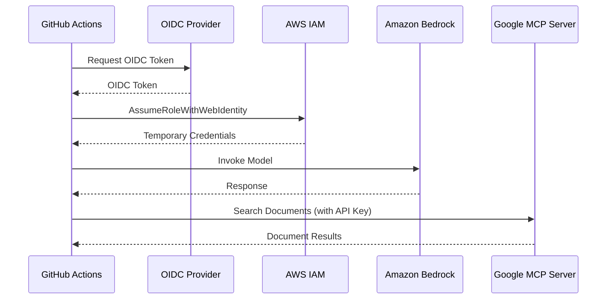
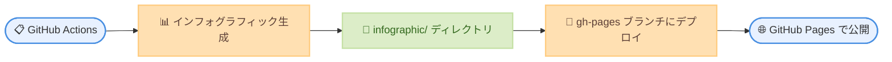

# CI/CD セットアップガイド <!-- omit in toc -->

[← README に戻る](../README.md)

このガイドでは、OpenID Connect (OIDC) 認証を使用して GitHub Actions で Google Cloud News Summary の自動化を設定する方法を説明します。

- [概要](#概要)
- [前提条件](#前提条件)
- [パート 1: AWS セットアップ](#パート-1-aws-セットアップ)
  - [Amazon Bedrock モデルアクセスを有効化](#amazon-bedrock-モデルアクセスを有効化)
  - [OIDC プロバイダーと IAM ロールを作成](#oidc-プロバイダーと-iam-ロールを作成)
- [パート 2: Google Cloud セットアップ](#パート-2-google-cloud-セットアップ)
  - [Developer Knowledge API の有効化](#developer-knowledge-api-の有効化)
  - [API キーの作成](#api-キーの作成)
  - [API キーの制限 (推奨)](#api-キーの制限-推奨)
  - [MCP server の有効化](#mcp-server-の有効化)
- [パート 3: GitHub Actions セットアップ](#パート-3-github-actions-セットアップ)
  - [ステップ 1: GitHub リポジトリ変数を設定](#ステップ-1-github-リポジトリ変数を設定)
  - [ステップ 2: ワークフロー設定を確認](#ステップ-2-ワークフロー設定を確認)
  - [ステップ 3: ワークフローをテスト](#ステップ-3-ワークフローをテスト)
- [パート 4: GitHub Pages セットアップ](#パート-4-github-pages-セットアップ)
  - [ステップ 1: GitHub Pages を有効化](#ステップ-1-github-pages-を有効化)
  - [ステップ 2: INFOGRAPHIC\_BASE\_URL を設定](#ステップ-2-infographic_base_url-を設定)
  - [ステップ 3: デプロイを確認](#ステップ-3-デプロイを確認)
- [トラブルシューティング](#トラブルシューティング)
  - [よくある問題](#よくある問題)
    - ["Not authorized to perform sts:AssumeRoleWithWebIdentity"](#not-authorized-to-perform-stsassumerolewithwebidentity)
    - [Bedrock で "Access denied"](#bedrock-で-access-denied)
    - [MCP server で "API key not valid"](#mcp-server-で-api-key-not-valid)
    - [Git push エラー](#git-push-エラー)
  - [OIDC トークンクレームの確認](#oidc-トークンクレームの確認)
- [参考資料](#参考資料)

## 概要

GitHub Actions は AWS との OIDC 認証をサポートしており、長期間有効な AWS 認証情報を保存せずに CI/CD パイプラインで IAM ロールを引き受けることができます。これはセキュリティ上推奨されるアプローチです。



## 前提条件

- Amazon Bedrock アクセスが有効な AWS アカウント
- IAM ID プロバイダーとロールを作成する権限
- Google Cloud プロジェクト
- GitHub リポジトリ

## パート 1: AWS セットアップ

### Amazon Bedrock モデルアクセスを有効化

1. [Amazon Bedrock コンソール](https://console.aws.amazon.com/bedrock/)を開く
2. 左サイドバーで **Model access** に移動
3. **Modify model access** をクリック
4. 以下のモデルへのアクセスを有効化する。
   - `Anthropic Claude Opus 4.5`
   - `Anthropic Claude Sonnet 4.5` (フォールバック用)
5. **Save changes** をクリック

### OIDC プロバイダーと IAM ロールを作成

以下のスクリプトで、GitHub OIDC プロバイダー、Bedrock 用 IAM ポリシー、IAM ロールを CloudFormation スタックとして一括作成できます。

```bash
./scripts/deploy-iam.sh -o <OWNER>
```

- `<OWNER>`: GitHub リポジトリのオーナー/org (例: `myorg`)

リポジトリ名はデフォルトで `google-cloud-news-summary` が使用されます。別のリポジトリ名を使用する場合は `-r` オプションで指定できます。

**自動検出機能**: スクリプトは自動的に既存の GitHub Actions OIDC プロバイダーを検出します。既存のプロバイダーが見つかった場合は、それを使用します (新規作成をスキップ)。見つからない場合は、新しいプロバイダーを作成します。

#### オプション

オプションの詳細は `./scripts/deploy-iam.sh --help` を参照してください。

**作成されるリソース**:

| リソース | 名前 | 説明 |
|---------|------|------|
| CloudFormation スタック | `google-cloud-news-summary-github-iam` | すべてのリソースを管理 |
| OIDC プロバイダー | `token.actions.githubusercontent.com` | GitHub Actions 認証用 |
| IAM Managed Policy | `GitHubActions-GoogleCloudNewsSummary-BedrockInvoke` | Bedrock モデル呼び出し権限 |
| IAM ロール | `GitHubActions-GoogleCloudNewsSummary` | GitHub Actions が引き受けるロール |

**カスタマイズオプション**:

```bash
# カスタムリポジトリ名を指定
./scripts/deploy-iam.sh -o myorg -r my-custom-repo

# カスタムロール名とリージョンを指定
./scripts/deploy-iam.sh -o myorg \
  -n MyCustomRole -R us-west-2

# カスタムスタック名を指定
./scripts/deploy-iam.sh -o myorg \
  -s my-custom-stack

# 明示的に OIDC プロバイダー ARN を指定 (自動検出をオーバーライド)
./scripts/deploy-iam.sh -o myorg \
  -p arn:aws:iam::123456789012:oidc-provider/token.actions.githubusercontent.com
```

<details>
<summary>作成される IAM ポリシーの内容</summary>

このポリシーは [Global cross-Region inference](https://docs.aws.amazon.com/bedrock/latest/userguide/global-cross-region-inference.html) に対応しており、`global.*` inference profile 経由でのモデル呼び出しを許可します。

```json
{
    "Version": "2012-10-17",
    "Statement": [
        {
            "Sid": "BedrockInvokeModel",
            "Effect": "Allow",
            "Action": [
                "bedrock:InvokeModel",
                "bedrock:InvokeModelWithResponseStream"
            ],
            "Resource": [
                "arn:aws:bedrock:*:*:inference-profile/global.anthropic.claude-*",
                "arn:aws:bedrock:*::foundation-model/anthropic.claude-*",
                "arn:aws:bedrock:*::foundation-model/us.anthropic.claude-*",
                "arn:aws:bedrock:::foundation-model/anthropic.claude-*"
            ]
        }
    ]
}
```

各 Resource ARN の役割は以下の通りです。

- `inference-profile/global.anthropic.claude-*`: `global.*` inference profile 自体へのアクセス
- `bedrock:*::foundation-model/anthropic.claude-*`: リクエスト元リージョンの Foundation Model へのアクセス
- `bedrock:*::foundation-model/us.anthropic.claude-*`: US リージョン固有の Foundation Model へのアクセス
- `bedrock:::foundation-model/anthropic.claude-*`: グローバルルーティング先の Foundation Model へのアクセス (リージョン・アカウント指定なし)

> **参考**: [AWS 公式ドキュメント](https://docs.aws.amazon.com/bedrock/latest/userguide/global-cross-region-inference.html)

</details>

<details>
<summary>手動で設定する場合</summary>

#### OIDC プロバイダーの作成

**AWS CLI を使用する場合:**

```bash
aws iam create-open-id-connect-provider \
    --url https://token.actions.githubusercontent.com \
    --client-id-list sts.amazonaws.com
```

**AWS コンソールを使用する場合:**

1. [IAM コンソール - Identity providers](https://console.aws.amazon.com/iam/home#/identity_providers) を開く
2. **Add provider** をクリック
3. 以下を設定する。
   - **Provider type**: OpenID Connect
   - **Provider URL**: `https://token.actions.githubusercontent.com`
   - **Audience**: `sts.amazonaws.com`
4. **Get thumbprint** をクリック
5. **Add provider** をクリック

#### IAM ロールの作成

1. [IAM コンソール - Roles](https://console.aws.amazon.com/iam/home#/roles) を開き、[Create role](https://console.aws.amazon.com/iam/home#/roles/create) をクリック
2. **Custom trust policy** を選択
3. 以下の信頼ポリシーを貼り付ける (プレースホルダーを置換)。

```json
{
    "Version": "2012-10-17",
    "Statement": [
        {
            "Effect": "Allow",
            "Principal": {
                "Federated": "arn:aws:iam::<AWS_ACCOUNT_ID>:oidc-provider/token.actions.githubusercontent.com"
            },
            "Action": "sts:AssumeRoleWithWebIdentity",
            "Condition": {
                "StringEquals": {
                    "token.actions.githubusercontent.com:aud": "sts.amazonaws.com"
                },
                "StringLike": {
                    "token.actions.githubusercontent.com:sub": "repo:<OWNER>/<REPO>:*"
                }
            }
        }
    ]
}
```

4. **Next** をクリックし、Bedrock 用 IAM ポリシー (上記「作成される IAM ポリシーの内容」参照) を手動で作成してアタッチ
5. ロール名を入力 (例: `GitHubActions-GoogleCloudNewsSummary`)
6. **Create role** をクリック

置換する値は以下の通りです。
- `<AWS_ACCOUNT_ID>`: AWS アカウント ID
- `<OWNER>/<REPO>`: GitHub リポジトリ (例: `myorg/google-cloud-news-summary`)

</details>

## パート 2: Google Cloud セットアップ

### Developer Knowledge API の有効化

[Developer Knowledge API](https://console.cloud.google.com/apis/library/developerknowledge.googleapis.com) を開き、「有効にする」をクリックします。

または gcloud CLI で有効化します。

```bash
gcloud services enable developerknowledge.googleapis.com --project=YOUR_PROJECT_ID
```

### API キーの作成

Google Cloud コンソールの場合:

1. プロジェクトレベルの [認証情報ページ](https://console.cloud.google.com/apis/credentials) を開く (API の詳細ページ内の「認証情報」タブではなく、左メニューの「認証情報」から開く)
2. 「認証情報を作成」→「API キー」を選択
3. API キーが作成されるので、文字列を控える

> API の詳細ページ内の「認証情報」タブからは API キーを作成できません。必ずプロジェクトレベルの認証情報ページから作成してください。

gcloud CLI の場合:

```bash
gcloud services api-keys create --project=YOUR_PROJECT_ID --display-name="DK API Key"
```

### API キーの制限 (推奨)

セキュリティのため、作成した API キーを Developer Knowledge API のみに制限します。

1. 認証情報ページで作成した API キーの「API キーを編集」をクリック
2. 「API の制限」で「キーを制限」を選択
3. 「Select APIs」リストから「Developer Knowledge API」を選択して「OK」
4. 「保存」をクリック

> API を有効化した直後は「Select APIs」リストに Developer Knowledge API が表示されるまで数分かかる場合があります。

### MCP server の有効化

gcloud CLI の beta コンポーネントが必要です。

```bash
# beta コンポーネントの更新
gcloud components update

# MCP server の有効化
gcloud beta services mcp enable developerknowledge.googleapis.com --project=YOUR_PROJECT_ID
```

> `gcloud beta services mcp` コマンドが見つからない場合は、`gcloud components update` で gcloud CLI を最新版に更新してください。

参考: [Developer Knowledge MCP server ドキュメント](https://developers.google.com/knowledge/mcp)

## パート 3: GitHub Actions セットアップ

### ステップ 1: GitHub リポジトリ変数を設定

1. リポジトリ → **Settings** → **Secrets and variables** → **Actions** に移動
2. **Variables** タブ → **New repository variable** をクリックして以下の変数を追加
3. **Secrets** タブ → **New repository secret** をクリックして以下のシークレットを追加

**Variables**:

| 名前 | 値 | 説明 |
|------|-----|------|
| `AWS_ROLE_ARN` | `arn:aws:iam::<ACCOUNT_ID>:role/GitHubActions-GoogleCloudNewsSummary` | IAM ロール ARN (スクリプト実行後の出力を使用) |
| `AWS_REGION` | `us-east-1` | Bedrock 用 AWS リージョン |
| `INFOGRAPHIC_BASE_URL` | `https://yourusername.github.io/google-cloud-news-summary` | インフォグラフィックのリンク用ベース URL (末尾スラッシュなし) |

**Secrets**:

| 名前 | 値 | 説明 |
|------|-----|------|
| `GCP_DEVELOPER_KNOWLEDGE_API_KEY` | `<API キー文字列>` | Google Developer Knowledge API キー (パート 2 で作成) |

### ステップ 2: ワークフロー設定を確認

リポジトリには `.github/workflows/google-cloud-news-summary.yml` が含まれています。主要なセクションは以下の通りです。

```yaml
permissions:
  id-token: write    # OIDC に必要
  contents: write    # レポートのプッシュに必要

steps:
  - name: Configure AWS credentials
    uses: aws-actions/configure-aws-credentials@v4
    with:
      role-to-assume: ${{ vars.AWS_ROLE_ARN }}
      aws-region: ${{ vars.AWS_REGION }}
```

### ステップ 3: ワークフローをテスト

1. リポジトリの **Actions** タブに移動
2. **Google Cloud News Summary** ワークフローを選択
3. **Run workflow** → **Run workflow** をクリック

## パート 4: GitHub Pages セットアップ

このプロジェクトでは、生成されたインフォグラフィック (HTML ファイル) を GitHub Pages で公開します。



### ステップ 1: GitHub Pages を有効化

1. リポジトリ → **Settings** → **Pages** に移動
2. **Source** セクションで以下を設定する。
   - **Branch**: `gh-pages`
   - **Folder**: `/ (root)`
3. **Save** をクリック

数分後、ページが公開されます。以下のような URL が表示されます。

```
Your site is published at https://<username>.github.io/<repository>/
```

### ステップ 2: INFOGRAPHIC_BASE_URL を設定

**重要**: `INFOGRAPHIC_BASE_URL` には GitHub Pages のベース URL のみを設定し、`/infographic` などのサブディレクトリは含めないでください。

1. リポジトリ → **Settings** → **Secrets and variables** → **Actions** に移動
2. **Variables** タブで `INFOGRAPHIC_BASE_URL` を確認
3. 値が以下の形式であることを確認する。
   - ✅ 正しい例: `https://yourusername.github.io/google-cloud-news-summary`
   - ❌ 間違った例: `https://yourusername.github.io/google-cloud-news-summary/infographic`

既に設定済みの場合は、値が正しいことを確認してください。

### ステップ 3: デプロイを確認

1. **Actions** タブで最新のワークフロー実行を確認
2. `deploy-pages` ジョブが成功していることを確認
3. ブラウザで以下の URL にアクセスする。
   - インデックスページ: `https://<username>.github.io/<repository>/`
   - 個別のインフォグラフィック: `https://<username>.github.io/<repository>/20260214-*.html`

**デプロイの流れ**:

GitHub Actions ワークフローは以下の 2 つのジョブで構成されています。

1. **generate-reports**: レポートとインフォグラフィックを生成し、main ブランチにコミット
2. **deploy-pages**: インフォグラフィックを `gh-pages` ブランチにデプロイ

`deploy-pages` ジョブは `generate-reports` ジョブの完了後に実行され、`infographic/` ディレクトリ内のすべての HTML ファイルを `gh-pages` ブランチの root にコピーします。

## トラブルシューティング

### よくある問題

#### "Not authorized to perform sts:AssumeRoleWithWebIdentity"

- 信頼ポリシーの条件がリポジトリパスと正確に一致していることを確認
- OIDC プロバイダー URL が一致していることを確認 (末尾のスラッシュなし)
- Audience が正しく設定されていることを確認

#### Bedrock で "Access denied"

- IAM ロールに `BedrockInvokePolicy` がアタッチされていることを確認
- Bedrock コンソールでモデルアクセスが有効になっていることを確認
- サポートされているリージョン (例: `us-east-1`) を使用していることを確認

#### MCP server で "API key not valid"

- API キーが正しく設定されていることを確認
- API キーの制限で Developer Knowledge API が許可されていることを確認
- Developer Knowledge API が有効になっていることを確認
- MCP server が有効化されていることを確認

#### Git push エラー

- GitHub Actions のワークフロー設定で `permissions.contents: write` が設定されていることを確認
- ブランチ保護ルールを確認 (main ブランチが保護されている場合、Actions からのプッシュを許可する設定が必要)

#### GitHub Pages が表示されない

- **Settings → Pages** で GitHub Pages が有効化されていることを確認
- Source が `gh-pages` ブランチの `/ (root)` に設定されていることを確認
- **Actions** タブで `deploy-pages` ジョブが成功していることを確認
- `gh-pages` ブランチが存在し、HTML ファイルが含まれていることを確認

#### インフォグラフィックへのリンクが 404 エラーになる

- `INFOGRAPHIC_BASE_URL` の値を確認 (末尾に `/infographic` が含まれていないこと)
- GitHub Pages の URL と `INFOGRAPHIC_BASE_URL` が一致していることを確認
- レポート内のリンクが絶対 URL (例: `https://yourusername.github.io/repository/20260214-*.html`) であることを確認

### OIDC トークンクレームの確認

**GitHub Actions**:

```yaml
- name: Debug OIDC
  run: |
    echo "Subject: $GITHUB_REPOSITORY:$GITHUB_REF"
```

## 参考資料

- [GitHub Actions: AWS での OpenID Connect の設定](https://docs.github.com/en/actions/security-for-github-actions/security-hardening-your-deployments/configuring-openid-connect-in-amazon-web-services)
- [aws-actions/configure-aws-credentials](https://github.com/aws-actions/configure-aws-credentials) - GitHub Actions で AWS 認証情報を設定するための公式アクション
- [GitHub Actions のワークフロー構文](https://docs.github.com/en/actions/reference/workflow-syntax-for-github-actions)
- [変数に情報を格納](https://docs.github.com/en/actions/how-tos/write-workflows/choose-what-workflows-do/use-variables)
- [OpenID Connect (OIDC) ID プロバイダーの作成](https://docs.aws.amazon.com/IAM/latest/UserGuide/id_roles_providers_create_oidc.html)
- [Amazon Bedrock ユーザーガイド](https://docs.aws.amazon.com/bedrock/latest/userguide/)
- [IAM JSON ポリシー要素: Condition](https://docs.aws.amazon.com/IAM/latest/UserGuide/reference_policies_elements_condition.html)
- [Developer Knowledge MCP server](https://developers.google.com/knowledge/mcp)
