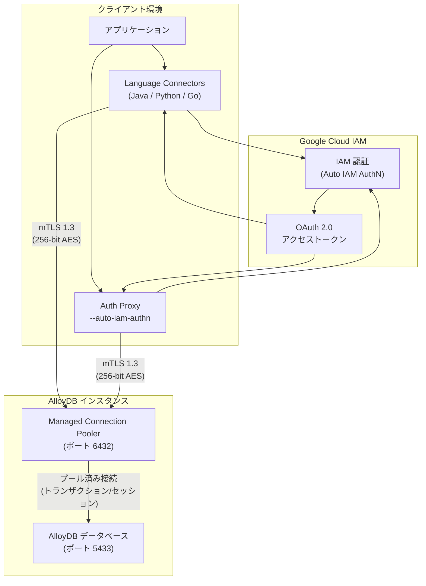

# AlloyDB for PostgreSQL: Language Connectors の Auto IAM Authentication と Managed Connection Pooling 対応

**リリース日**: 2026-02-09
**サービス**: AlloyDB for PostgreSQL
**機能**: Language Connectors と Auth Proxy における Auto IAM Authentication および Managed Connection Pooling のサポート
**ステータス**: FIXED

[このアップデートのインフォグラフィックを見る](https://takech9203.github.io/google-cloud-news-summary/20260209-alloydb-language-connectors-auto-iam-auth.html)

## 概要

AlloyDB for PostgreSQL の Language Connectors および Auth Proxy において、Auto IAM Authentication と Managed Connection Pooling のサポートに関する修正がリリースされました。この修正はメンテナンスバージョン 20260107.02_05 以降で利用可能です。

AlloyDB Language Connectors (Java、Python、Go) と Auth Proxy は、アプリケーションから AlloyDB インスタンスへの安全な接続を確立するためのライブラリおよびプロキシツールです。今回の修正により、これらのコネクタを通じた Auto IAM Authentication と Managed Connection Pooling の組み合わせがより安定的に動作するようになりました。メンテナンスウィンドウの設定によりこのリリースをまだ受け取っていないクラスタは、セルフサービスメンテナンスを使用してメンテナンスアップデートを実行できます。

この修正は、IAM ベースの認証とコネクションプーリングを併用するエンタープライズワークロードを運用するデータベース管理者やアプリケーション開発者にとって重要な改善です。

**アップデート前の課題**

- Language Connectors や Auth Proxy で Auto IAM Authentication と Managed Connection Pooling を組み合わせて使用する際に問題が発生していた
- メンテナンスウィンドウの設定によっては、最新の修正が自動的に適用されるまでに時間がかかる場合があった
- IAM 認証を使用したコネクションプーリング接続の安定性に課題があった

**アップデート後の改善**

- メンテナンスバージョン 20260107.02_05 で Auto IAM Authentication と Managed Connection Pooling の問題が修正された
- セルフサービスメンテナンスにより、メンテナンスウィンドウを待たずに即座にアップデートを適用可能
- Language Connectors (Java、Python、Go) と Auth Proxy の両方で修正が適用され、接続の安定性が向上

## アーキテクチャ図



AlloyDB Language Connectors と Auth Proxy は IAM 認証を通じてアクセストークンを自動取得し、Managed Connection Pooler を経由して AlloyDB データベースに mTLS で安全に接続します。Connection Pooler はクライアント接続をサーバー接続にマッピングし、リソース効率を最適化します。

## サービスアップデートの詳細

### 主要機能

1. **Auto IAM Authentication (自動 IAM 認証)**
   - IAM プリンシパルの認証情報を使用して、アクセストークンの取得と管理をコネクタに委任
   - アプリケーションは IAM データベースユーザー名のみを接続リクエストに渡すだけでよい
   - コネクタがクライアントに代わってパスワード属性のアクセストークン情報を送信
   - パスワード管理が不要になり、IAM によるアクセス制御の一元管理が可能

2. **Managed Connection Pooling (マネージドコネクションプーリング)**
   - AlloyDB がネイティブに提供するコネクションプーリング機能
   - プリエスタブリッシュされた接続のプールを維持し、接続の開閉オーバーヘッドを削減
   - トランザクションモードとセッションモードの 2 つのプーリングモードを選択可能
   - ポート 6432 で接続を受け付け、最大 262,042 の同時クライアント接続をサポート

3. **Language Connectors (言語コネクタ)**
   - AlloyDB Java Connector、Python Connector、Go Connector の 3 言語に対応
   - 自動 mTLS (TLS 1.3) 接続によるセキュアな通信
   - IAM ベースの認可サポート
   - Private IP、Public IP、Private Service Connect の各接続方式に対応

### メンテナンスバージョンの適用

今回の修正はメンテナンスバージョン **20260107.02_05** で提供されています。

- メンテナンスウィンドウが設定されていないクラスタ: リージョン営業時間外に自動適用
- メンテナンスウィンドウが設定されているクラスタ: 設定されたウィンドウに従って適用
- 即座に適用が必要な場合: セルフサービスメンテナンスを実行

## 技術仕様

### Managed Connection Pooling の設定パラメータ

| パラメータ | デフォルト値 | 説明 |
|------|------|------|
| Connection mode | transaction | トランザクション単位またはセッション単位のプーリング |
| Maximum pool size | 50 | ユーザー/データベースペアあたりの最大プールサイズ |
| Minimum pool size | 0 | プールの最小サイズ |
| Maximum client connections | 5,000 | 同時クライアント接続の最大数 (最大 262,042) |
| Idle client connection timeout | 0 秒 | クライアント接続のアイドルタイムアウト |
| Idle server connection timeout | 600 秒 | サーバー接続のアイドルタイムアウト |
| Query wait timeout | 120 秒 | クエリ待機タイムアウト |
| Server lifetime | 3,600 秒 | サーバー接続の最大存続時間 |

### IAM 認証に必要なロール

| 必要なロール | 説明 |
|------|------|
| `roles/alloydb.client` | AlloyDB Client ロール (接続権限) |
| `roles/serviceusage.serviceUsageConsumer` | Service Usage Consumer ロール |
| `roles/alloydb.admin` | Managed Connection Pooling の有効化に必要 |

### Language Connectors の接続例 (Python / pg8000 / Auto IAM AuthN)

```python
from google.cloud.alloydb.connector import Connector

# Auto IAM Authentication を有効にしたコネクタの初期化
connector = Connector()

def getconn():
    conn = connector.connect(
        "projects/my-project/locations/us-central1/clusters/my-cluster/instances/my-instance",
        "pg8000",
        user="iam-user@my-project.iam",
        enable_iam_auth=True,
        db="mydb",
    )
    return conn
```

### Auth Proxy の起動例 (Auto IAM AuthN 有効)

```bash
# Auto IAM Authentication を有効にして Auth Proxy を起動
./alloydb-auth-proxy \
  "projects/PROJECT_ID/locations/REGION/clusters/CLUSTER_ID/instances/INSTANCE_ID" \
  --auto-iam-authn
```

## 設定方法

### 前提条件

1. AlloyDB API が有効化されていること
2. AlloyDB インスタンスが作成済みであること
3. IAM ユーザーに `roles/alloydb.client` と `roles/serviceusage.serviceUsageConsumer` ロールが付与されていること
4. Managed Connection Pooling の管理には `roles/alloydb.admin` ロールが必要

### 手順

#### ステップ 1: メンテナンスバージョンの確認と適用

```bash
# クラスタのメンテナンス状態を確認
gcloud alloydb clusters describe CLUSTER_ID \
  --region=REGION_ID

# セルフサービスメンテナンスを実行 (最新バージョンに更新)
gcloud alloydb clusters update CLUSTER_ID \
  --region=REGION_ID \
  --trigger-maintenance
```

メンテナンスウィンドウが設定されているクラスタでまだリリースを受け取っていない場合は、セルフサービスメンテナンスを実行してバージョン 20260107.02_05 以降に更新します。

#### ステップ 2: Managed Connection Pooling の有効化

```bash
# 既存インスタンスで Managed Connection Pooling を有効化
gcloud alloydb instances update INSTANCE_ID \
  --project=PROJECT_ID \
  --region=REGION_ID \
  --cluster=CLUSTER_ID \
  --enable-connection-pooling
```

Managed Connection Pooling はデフォルトで無効になっています。明示的に有効化する必要があります。

#### ステップ 3: Auto IAM Authentication を使用した接続

```bash
# Auth Proxy を Auto IAM Authentication で起動
./alloydb-auth-proxy \
  "projects/PROJECT_ID/locations/REGION_ID/clusters/CLUSTER_ID/instances/INSTANCE_ID" \
  --auto-iam-authn

# Managed Connection Pooling ポート (6432) に接続
psql "host=127.0.0.1 port=6432 dbname=postgres user=IAM_USER@PROJECT_ID.iam sslmode=disable"
```

Auth Proxy の `--auto-iam-authn` フラグにより、IAM 認証情報が自動的に処理されます。

## メリット

### ビジネス面

- **運用コスト削減**: IAM による認証の一元管理により、データベース固有のパスワード管理が不要になり、セキュリティ運用の負荷を軽減
- **スケーラビリティ向上**: Managed Connection Pooling により、急激な接続スパイクを吸収し、アプリケーションの安定稼働を維持

### 技術面

- **セキュリティ強化**: Auto IAM Authentication により、パスワードではなく一時的なアクセストークンを使用した認証が実現され、認証情報漏洩のリスクが軽減
- **接続効率の最適化**: コネクションプーリングによりサーバーリソースの利用効率が向上し、短命な接続が多いワークロードで特に効果を発揮
- **柔軟なメンテナンス管理**: セルフサービスメンテナンスにより、修正パッチの適用タイミングを管理者が制御可能

## デメリット・制約事項

### 制限事項

- Managed Connection Pooling は Public IP 接続ではサポートされていない
- トランザクションプーリングモードでは、SET/RESET、LISTEN、WITH HOLD CURSOR、PREPARE/DEALLOCATE、セッションレベルアドバイザリロック、Protocol-level prepared plans などの SQL 機能が使用不可
- REPLICATION ロールを持つユーザーからの接続は Managed Connection Pooling ではサポートされていない

### 考慮すべき点

- 2024 年 11 月以前に作成された AlloyDB インスタンスで Managed Connection Pooling を有効化する場合、ネットワーク設定の一回限りの更新が必要 (VPC ネットワーク接続に通常 15 秒未満の短時間の中断が発生)
- メンテナンスバージョンの適用には、クラスタ内の全インスタンスの更新が必要で、通常 1 時間以内に完了
- コンテキストアウェアアクセスを IAM 構成で使用している場合、Auth Proxy や Language Connectors での IAM 認証は使用不可

## ユースケース

### ユースケース 1: マイクロサービスアーキテクチャでの接続管理

**シナリオ**: 多数のマイクロサービスが AlloyDB に短命な接続を頻繁に確立するアプリケーション環境。各サービスは Kubernetes 上で動作し、サービスアカウントを使用した IAM 認証を採用。

**実装例**:
```bash
# 各マイクロサービスの Pod で Auth Proxy をサイドカーとして起動
./alloydb-auth-proxy \
  "projects/my-project/locations/us-central1/clusters/prod-cluster/instances/primary" \
  --auto-iam-authn \
  --port 6432

# アプリケーションは localhost:6432 に接続
# Managed Connection Pooling がサーバー側で接続を管理
```

**効果**: 各マイクロサービスのデータベースパスワード管理が不要になり、コネクションプーリングにより接続オーバーヘッドが大幅に削減される。

### ユースケース 2: サーバーレスアプリケーションからの接続

**シナリオ**: Cloud Run や Cloud Functions から AlloyDB に接続するサーバーレスアプリケーション。リクエストごとに接続が発生するため、コネクションプーリングが不可欠。

**実装例**:
```python
from google.cloud.alloydb.connector import Connector
import sqlalchemy

connector = Connector(refresh_strategy="lazy")  # サーバーレス環境では lazy を推奨

engine = sqlalchemy.create_engine(
    "postgresql+pg8000://",
    creator=lambda: connector.connect(
        "projects/my-project/locations/us-central1/clusters/my-cluster/instances/my-instance",
        "pg8000",
        user="sa@my-project.iam",
        enable_iam_auth=True,
        db="mydb",
    ),
)
```

**効果**: サーバーレス環境でのコールドスタート時の接続遅延を最小化し、IAM サービスアカウントによるセキュアな認証を実現。

## 料金

AlloyDB for PostgreSQL は従量課金モデルを採用しています。Language Connectors、Auth Proxy、Managed Connection Pooling の使用自体に追加料金は発生しません。AlloyDB の料金はインスタンスリソース (vCPU とメモリ)、ストレージ、ネットワーク Egress に基づいて課金されます。

### 料金例

| 構成 | 月額料金 (概算、us-central1) |
|--------|-----------------|
| 16 vCPU / 128 GB RAM (HA プライマリ) | 約 $3,635 (オンデマンド) |
| 16 vCPU / 128 GB RAM (1 年 CUD 25% 割引) | 約 $2,728 |
| 16 vCPU / 128 GB RAM (3 年 CUD 52% 割引) | 約 $1,746 |

詳細な料金情報は [AlloyDB for PostgreSQL pricing](https://cloud.google.com/alloydb/pricing) を参照してください。

## 関連サービス・機能

- **AlloyDB Auth Proxy**: アプリケーションと AlloyDB 間の認可済み暗号化接続を提供するプロキシ。Auto IAM Authentication に対応
- **AlloyDB Language Connectors**: Java、Python、Go のライブラリで、mTLS 接続と IAM 認証を自動管理
- **Cloud IAM**: AlloyDB インスタンスへのアクセス制御を一元管理。`roles/alloydb.client` ロールによる接続認可
- **Cloud Monitoring**: Managed Connection Pooling のメトリクス (クライアント接続数、サーバー接続数、平均待機時間) を監視可能
- **VPC ネットワーク**: Private IP、Public IP、Private Service Connect による AlloyDB への接続経路を提供

## 参考リンク

- [このアップデートのインフォグラフィック](https://takech9203.github.io/google-cloud-news-summary/20260209-alloydb-language-connectors-auto-iam-auth.html)
- [公式リリースノート](https://cloud.google.com/release-notes#February_09_2026)
- [AlloyDB Language Connectors で接続する](https://cloud.google.com/alloydb/docs/connect-language-connectors)
- [AlloyDB Language Connectors の概要](https://cloud.google.com/alloydb/docs/language-connectors-overview)
- [AlloyDB Auth Proxy の概要](https://cloud.google.com/alloydb/docs/auth-proxy/overview)
- [Managed Connection Pooling の構成](https://cloud.google.com/alloydb/docs/configure-managed-connection-pooling)
- [IAM 認証の管理](https://cloud.google.com/alloydb/docs/manage-iam-authn)
- [セルフサービスメンテナンス](https://cloud.google.com/alloydb/docs/self-service-maintenance)
- [AlloyDB for PostgreSQL の料金](https://cloud.google.com/alloydb/pricing)

## まとめ

今回の修正 (メンテナンスバージョン 20260107.02_05) により、AlloyDB Language Connectors および Auth Proxy における Auto IAM Authentication と Managed Connection Pooling の組み合わせ利用時の安定性が向上しました。IAM 認証とコネクションプーリングを併用しているワークロードでは、セルフサービスメンテナンスを使用して速やかにアップデートを適用することを推奨します。メンテナンスウィンドウが設定されているクラスタは、ウィンドウの到来を待つか、セルフサービスメンテナンスで即座に適用するかを運用要件に応じて判断してください。

---

**タグ**: #AlloyDB #PostgreSQL #IAM #Authentication #ConnectionPooling #LanguageConnectors #AuthProxy #メンテナンス #セキュリティ #データベース
