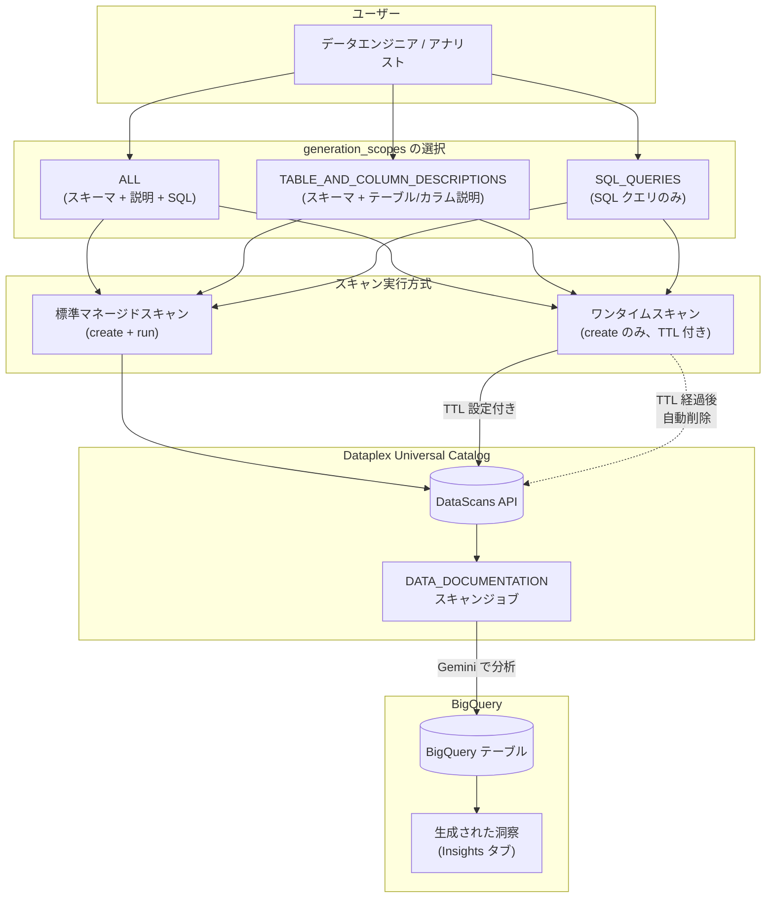

# BigQuery: データドキュメンテーションスキャンのカスタマイズ

**リリース日**: 2026-02-09
**サービス**: BigQuery / Dataplex Universal Catalog
**機能**: データドキュメンテーションスキャンのスコープカスタマイズとワンタイムスキャン
**ステータス**: FEATURE

[このアップデートのインフォグラフィックを見る](https://takech9203.github.io/google-cloud-news-summary/20260209-bigquery-data-documentation-scan-customization.html)

## 概要

BigQuery テーブルのデータドキュメンテーションスキャン (Dataplex Universal Catalog の DATA_DOCUMENTATION スキャンタイプ) に、生成する洞察のスコープをカスタマイズする機能が追加された。従来はスキャン実行時にすべての洞察 (SQL クエリ、テーブル/カラム説明、スキーマ情報) が一括生成されていたが、今回のアップデートにより `generation_scopes` パラメータを使用して生成対象を選択できるようになった。

さらに、ワンタイムスキャン (one-time scan) が導入され、スキャンの作成と実行を単一の API コールで完結させることが可能になった。従来は `dataScans.create` でスキャンリソースを作成した後に `dataScans.run` で別途実行する必要があったが、ワンタイムスキャンでは作成と同時に即座に実行される。加えて、Time to Live (TTL) 設定により、スキャン完了後にスキャンリソースを自動削除することができる。

このアップデートは、データカタログの運用を効率化したいデータエンジニア、データアナリスト、およびデータガバナンスチームを対象としている。必要な洞察のみを生成することで処理時間とコストを削減でき、ワンタイムスキャンと TTL によりリソース管理の負担も軽減される。

**アップデート前の課題**

- データドキュメンテーションスキャンでは SQL クエリ、テーブル/カラム説明、スキーマ情報がすべて一括で生成され、特定の種類の洞察のみを選択的に生成することができなかった
- スキャンの実行には `dataScans.create` と `dataScans.run` の 2 段階の API コールが必要で、簡易的な一回限りのスキャンでも管理対象のリソースが残り続けた
- 一時的なスキャンリソースの手動クリーンアップが必要で、不要なリソースが蓄積する可能性があった

**アップデート後の改善**

- `generation_scopes` パラメータにより、`ALL`、`TABLE_AND_COLUMN_DESCRIPTIONS`、`SQL_QUERIES` の 3 種類からスキャン対象を選択できるようになった
- ワンタイムスキャンにより、単一の API コールでスキャンの作成と実行が同時に行われるようになった
- TTL 設定 (`ttl_after_scan_completion`) により、スキャン完了後に指定した時間でスキャンリソースが自動削除されるようになった

## アーキテクチャ図



このフローチャートは、ユーザーが generation_scopes で生成対象を選択し、標準スキャンまたはワンタイムスキャンのいずれかの方式で Dataplex DataScans API 経由でスキャンを実行する流れを示している。ワンタイムスキャンでは TTL 経過後にスキャンリソースが自動削除される。

## サービスアップデートの詳細

### 主要機能

1. **スキャンスコープのカスタマイズ (`generation_scopes` パラメータ)**
   - `ALL`: スキーマ、テーブル説明、カラム説明、SQL クエリをすべて生成する (デフォルト動作)
   - `TABLE_AND_COLUMN_DESCRIPTIONS`: スキーマ、テーブル説明、カラム説明のみを生成し、SQL クエリは生成しない
   - `SQL_QUERIES`: SQL クエリのみを生成し、テーブル/カラム説明は生成しない
   - `dataDocumentationSpec` を空にした場合は `ALL` と同じ動作になる

2. **ワンタイムスキャン (One-time Scan)**
   - `dataScans.create` メソッドの呼び出しだけでスキャンが即座に実行される
   - 従来のように `dataScans.run` を別途呼び出す必要がない
   - ワンタイムスキャンでは後続の `run` や `update` 操作はサポートされない

3. **Time to Live (TTL) 設定**
   - `ttl_after_scan_completion` パラメータでスキャン完了後の自動削除までの時間を指定できる
   - デフォルト値は 24 時間、最小値は 0 秒、最大値は 365 日
   - 0 秒に設定した場合、ジョブの成功・失敗に関わらず即座に削除される
   - 時間はスキャンジョブの完了時点から計算される

## 技術仕様

### generation_scopes パラメータの詳細

| スコープ | 生成内容 | ユースケース |
|---------|---------|-------------|
| `ALL` | スキーマ + テーブル説明 + カラム説明 + SQL クエリ | テーブルの包括的なドキュメンテーション |
| `TABLE_AND_COLUMN_DESCRIPTIONS` | スキーマ + テーブル説明 + カラム説明 | カタログ用メタデータの充実 |
| `SQL_QUERIES` | SQL クエリのみ | データ探索クエリの自動生成 |

### TTL 設定の仕様

| 項目 | 詳細 |
|------|------|
| パラメータ名 | `ttl_after_scan_completion` |
| デフォルト値 | 24 時間 (86400 秒) |
| 最小値 | 0 秒 (即座削除) |
| 最大値 | 365 日 |
| 形式 | 秒単位 (例: `"3600"` = 1 時間) |
| 起算点 | スキャンジョブ完了時 |

### REST API: ワンタイムスキャンの例

```json
{
  "data": {
    "resource": "//bigquery.googleapis.com/projects/PROJECT_ID/datasets/DATASET_ID/tables/TABLE_ID"
  },
  "type": "DATA_DOCUMENTATION",
  "dataDocumentationSpec": {
    "generation_scopes": "ALL"
  },
  "executionSpec": {
    "trigger": {
      "one_time": {
        "ttl_after_scan_completion": {
          "seconds": 3600
        }
      }
    }
  }
}
```

### gcloud CLI: ワンタイムスキャンの例

```bash
gcloud dataplex datascans create data-documentation DATASCAN_ID \
  --project=PROJECT_ID \
  --location=LOCATION \
  --data-source-resource="//bigquery.googleapis.com/projects/PROJECT_ID/datasets/DATASET_ID/tables/TABLE_ID" \
  --one-time \
  --ttl-after-scan-completion="3600s"
```

### IAM 権限

| 操作 | 必要なロール |
|------|-------------|
| スキャンの作成・管理・取得 | `roles/dataplex.dataScanEditor` または `roles/dataplex.dataScanAdmin` |
| テーブルデータの読み取り | `roles/bigquery.dataViewer` および `roles/bigquery.dataEditor` |
| ジョブの作成 | `roles/bigquery.user` または `roles/bigquery.studioUser` |
| 洞察の閲覧のみ | `roles/dataplex.dataScanDataViewer` |
| 洞察の Dataplex への公開 | `roles/dataplex.catalogEditor` および `roles/dataplex.entryOwner` |

## 設定方法

### 前提条件

1. Dataplex API、BigQuery API、Gemini for Google Cloud API が有効化されていること
2. 適切な IAM ロール (上記参照) がユーザーまたはサービスアカウントに付与されていること
3. Gemini in BigQuery がプロジェクトでセットアップ済みであること

### 手順

#### ステップ 1: スコープを指定した標準スキャンの作成

```bash
# テーブル/カラム説明のみ生成するスキャンを作成
gcurl -X POST \
  https://dataplex.googleapis.com/v1/projects/PROJECT_ID/locations/LOCATION/dataScans?dataScanId=DATASCAN_ID \
  -d '{
    "data": {
      "resource": "//bigquery.googleapis.com/projects/PROJECT_ID/datasets/DATASET_ID/tables/TABLE_ID"
    },
    "executionSpec": {
      "trigger": { "onDemand": {} }
    },
    "type": "DATA_DOCUMENTATION",
    "dataDocumentationSpec": {
      "generation_scopes": "TABLE_AND_COLUMN_DESCRIPTIONS"
    }
  }'
```

スキャンリソースが作成される。この時点ではまだ実行されない。

#### ステップ 2: スキャンの実行 (標準スキャンの場合)

```bash
gcurl -X POST \
  https://dataplex.googleapis.com/v1/projects/PROJECT_ID/locations/LOCATION/dataScans/DATASCAN_ID:run
```

ジョブ ID が返却される。

#### ステップ 3: スキャンステータスの確認

```bash
gcurl -X GET \
  https://dataplex.googleapis.com/v1/projects/PROJECT_ID/locations/LOCATION/dataScans/DATASCAN_ID/jobs/JOB_ID
```

ステータスが `SUCCEEDED` または `FAILURE` になるまで待機する。

#### (代替) ワンタイムスキャンの場合は単一コールで完結

```bash
gcurl -X POST \
  "https://dataplex.googleapis.com/v1/projects/PROJECT_ID/locations/LOCATION/dataScans?dataScanId=DATASCAN_ID" \
  -d '{
    "data": {
      "resource": "//bigquery.googleapis.com/projects/PROJECT_ID/datasets/DATASET_ID/tables/TABLE_ID"
    },
    "type": "DATA_DOCUMENTATION",
    "dataDocumentationSpec": {
      "generation_scopes": "SQL_QUERIES"
    },
    "executionSpec": {
      "trigger": {
        "one_time": {
          "ttl_after_scan_completion": {
            "seconds": 3600
          }
        }
      }
    }
  }'
```

作成と同時にスキャンが実行され、完了から 1 時間後にリソースが自動削除される。

## メリット

### ビジネス面

- **コスト最適化**: 必要な洞察のみを生成することで、不要な Gemini 処理を回避し、API コールとコンピュートリソースのコストを削減できる
- **運用効率の向上**: ワンタイムスキャンと TTL により、一時的なデータ分析タスクのワークフローが簡素化され、リソース管理の負担が軽減される
- **データガバナンスの柔軟性**: カタログ用メタデータのみを生成するか、探索クエリのみを生成するかを用途に応じて使い分けることで、データガバナンスポリシーに沿った運用が可能

### 技術面

- **API 呼び出しの簡素化**: ワンタイムスキャンにより create + run の 2 ステップが 1 ステップに集約され、CI/CD パイプラインへの組み込みが容易になる
- **リソースの自動クリーンアップ**: TTL 機能により不要なスキャンリソースが自動削除され、プロジェクト内のリソース管理が簡潔になる
- **スキャン時間の短縮**: 必要なスコープのみを指定することで、全項目を生成する場合と比較してスキャンの実行時間を短縮できる

## デメリット・制約事項

### 制限事項

- ワンタイムスキャンでは後続の `run` や `update` 操作がサポートされない。スキャン結果を再利用する場合は標準マネージドスキャンを使用する必要がある
- データインサイトは `Geo` および `JSON` カラムタイプをサポートしていない
- マルチクラウドのデータソースからのデータは利用できない
- Gemini in BigQuery は BigQuery と同じコンプライアンス・セキュリティ認証をサポートしていないため、コンプライアンス要件が厳しいプロジェクトでは利用に注意が必要

### 考慮すべき点

- データプロファイルスキャンの結果が公開されている場合、洞察の品質が向上するため、事前にプロファイルスキャンの実行と結果の公開を推奨する
- TTL を 0 秒に設定するとジョブの成否に関わらず即座にリソースが削除されるため、結果の確認が間に合わない場合がある
- ワンタイムスキャンは一回限りの用途に適しており、定期的なスキャンが必要な場合は `--schedule` オプションによる RECURRING スキャンを使用する

## ユースケース

### ユースケース 1: データカタログの大規模メタデータ充実化

**シナリオ**: 大規模な BigQuery データウェアハウスで数百テーブルのカタログメタデータ (テーブル説明・カラム説明) を一括で生成し、Dataplex Universal Catalog に公開したい。SQL クエリの生成は不要。

**実装例**:
```bash
# テーブル/カラム説明のみを生成するワンタイムスキャン (TTL: 1時間)
for TABLE in table1 table2 table3; do
  gcloud dataplex datascans create data-documentation "doc-scan-${TABLE}" \
    --project=my-project \
    --location=us-central1 \
    --data-source-resource="//bigquery.googleapis.com/projects/my-project/datasets/my-dataset/tables/${TABLE}" \
    --one-time \
    --ttl-after-scan-completion="3600s"
done
```

**効果**: SQL クエリ生成をスキップすることで各テーブルのスキャン時間を短縮でき、TTL により完了後のリソースが自動クリーンアップされる。

### ユースケース 2: CI/CD パイプラインでのアドホックデータ探索

**シナリオ**: データパイプラインの一部として、新しくロードされたテーブルに対して探索用 SQL クエリを自動生成し、データ品質チェックに活用したい。

**実装例**:
```json
{
  "data": {
    "resource": "//bigquery.googleapis.com/projects/my-project/datasets/staging/tables/new_load"
  },
  "type": "DATA_DOCUMENTATION",
  "dataDocumentationSpec": {
    "generation_scopes": "SQL_QUERIES"
  },
  "executionSpec": {
    "trigger": {
      "one_time": {
        "ttl_after_scan_completion": {
          "seconds": 0
        }
      }
    }
  }
}
```

**効果**: SQL クエリのみを生成し、結果取得後にスキャンリソースを即座に削除することで、パイプライン内での一時的な利用に最適化される。

## 料金

データドキュメンテーションスキャンは Gemini in BigQuery の機能として提供される。料金の詳細については [Gemini for Google Cloud の料金ページ](https://cloud.google.com/products/gemini/pricing#gemini-in-bigquery-pricing) を参照。

BigQuery のオンデマンドコンピュート、Enterprise エディション、または Enterprise Plus エディションを使用しているユーザーがデータインサイトおよびメタデータ自動生成機能を利用できる。BigQuery Standard エディションのみを使用している場合は、Gemini Code Assist Standard のサブスクリプションが必要となる。

## 利用可能リージョン

データインサイトはすべての [BigQuery ロケーション](https://cloud.google.com/bigquery/docs/locations) で利用可能。Gemini in BigQuery がデータを処理するロケーションの詳細については [Gemini in BigQuery のデータ処理ロケーション](https://cloud.google.com/bigquery/docs/gemini-locations) を参照。

## 関連サービス・機能

- **Dataplex Universal Catalog**: データドキュメンテーションスキャンは Dataplex Universal Catalog の DataScans API を基盤としており、スキャン結果は Dataplex のメタデータアスペクトとして公開可能
- **Gemini in BigQuery**: 洞察の生成には Gemini AI モデルが使用され、テーブルメタデータに基づいて自然言語の質問と SQL クエリを生成する
- **Dataplex データプロファイルスキャン**: データプロファイルスキャンの結果が利用可能な場合、洞察の品質が向上する。プロファイルスキャンの結果は Gemini のグラウンディングに使用される
- **BigQuery Data Canvas**: 生成された洞察からフォローアップの質問を Data Canvas で行うことができる

## 参考リンク

- [インフォグラフィック](https://takech9203.github.io/google-cloud-news-summary/20260209-bigquery-data-documentation-scan-customization.html)
- [公式リリースノート](https://cloud.google.com/release-notes#February_09_2026)
- [BigQuery テーブルインサイトの生成](https://cloud.google.com/bigquery/docs/generate-table-insights)
- [Dataplex Universal Catalog データインサイト概要](https://cloud.google.com/dataplex/docs/data-insights)
- [gcloud dataplex datascans create data-documentation リファレンス](https://cloud.google.com/sdk/gcloud/reference/dataplex/datascans/create/data-documentation)
- [Gemini in BigQuery 概要](https://cloud.google.com/bigquery/docs/gemini-overview)
- [Gemini for Google Cloud 料金](https://cloud.google.com/products/gemini/pricing)
- [Dataplex Universal Catalog 料金](https://cloud.google.com/dataplex/pricing)

## まとめ

BigQuery データドキュメンテーションスキャンのカスタマイズ機能により、生成する洞察の種類を `generation_scopes` パラメータで選択できるようになり、不要な処理を省いた効率的なスキャンが可能になった。ワンタイムスキャンと TTL 設定の追加により、一時的なデータ分析やパイプラインへの組み込みが大幅に簡素化された。BigQuery テーブルのドキュメンテーションやデータ探索を行っているチームは、用途に応じたスコープ選択とワンタイムスキャンの活用を検討されたい。

---

**タグ**: BigQuery, Dataplex Universal Catalog, Data Documentation, DataScans, Gemini in BigQuery, generation_scopes, one-time scan, TTL, データインサイト, メタデータ管理
