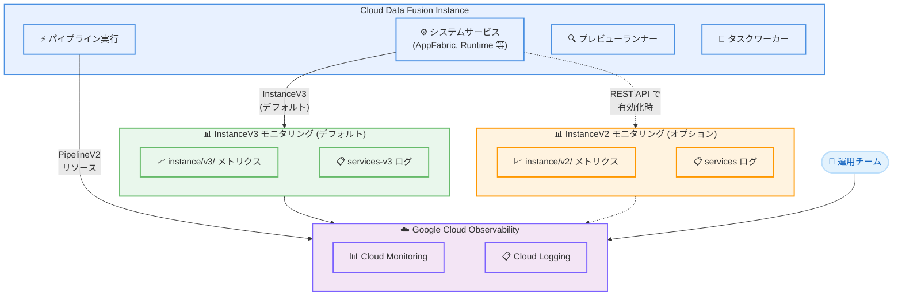

# Cloud Data Fusion: v6.11.1.1 GA リリース (InstanceV3 モニタリングリソース導入)

**リリース日**: 2026-02-09
**サービス**: Cloud Data Fusion
**機能**: InstanceV3 モニタリングリソース、セキュリティ修正、信頼性向上
**ステータス**: GA (一般提供)

[このアップデートのインフォグラフィックを見る](https://takech9203.github.io/google-cloud-news-summary/20260209-cloud-data-fusion-v6-11-1-1.html)

## 概要

Cloud Data Fusion v6.11.1.1 が一般提供 (GA) として公開された。本リリースの主要な変更点は、インスタンスレベルのメトリクスおよびシステムサービスログにおけるデフォルトのモニタリングリソースが `datafusion.googleapis.com/InstanceV2` から `datafusion.googleapis.com/InstanceV3` に変更されたことである。InstanceV3 では `org_id` および `namespace` ラベルが削除され、よりシンプルな構造となっている。

また、メッセージングサービスの一時停止時におけるリトライ処理の修正、プレビューランナーでのセキュリティ脆弱性の修正、タスクワーカーのハング問題の修正、ページネーション使用時のアプリ一覧 API の修正など、複数の重要なバグ修正が含まれている。

このアップデートは、Cloud Data Fusion を利用してデータ統合パイプラインを運用するデータエンジニア、プラットフォームエンジニア、および Cloud Monitoring でメトリクスやログを監視する運用チームに関連する。

**アップデート前の課題**

InstanceV2 モニタリングリソースには以下の課題があった。

- InstanceV2 には `org_id` と `namespace` ラベルが含まれており、インスタンスレベルのメトリクスに不要な複雑さが生じていた
- メトリクスパスが `instance/v2/` であり、新しいメトリクスラベル構造に最適化されていなかった
- プレビューランナーでユーザー提供コードが他のプレビュー実行の機密データにアクセスできるセキュリティ脆弱性が存在していた (CDAP-21211)
- メッセージングサービスの一時停止時にメッセージ発行のリトライが正しく動作しなかった (CDAP-21043)
- 内部タスクワーカーが無期限にハングする可能性があった (CDAP-21213)

**アップデート後の改善**

今回のアップデートにより以下の改善が実現した。

- InstanceV3 がデフォルトのモニタリングリソースとなり、`instance_id` ラベルによるインスタンス間のメトリクス識別が改善された
- `org_id` と `namespace` ラベルが削除され、インスタンスレベルメトリクスの構造が簡素化された
- セキュリティ脆弱性が修正され、プレビューランナー間のデータ分離が強化された
- タスクワーカーにヘルスチェック機構が追加され、完了タスクの強制終了と応答しないワーカーの再起動が可能になった
- ページネーション使用時の list apps API エンドポイントが修正され、すべてのデプロイ済みパイプラインが正しく返されるようになった

## アーキテクチャ図



Cloud Data Fusion v6.11.1.1 では、インスタンスレベルのメトリクスとシステムサービスログが InstanceV3 モニタリングリソースを介してデフォルトで Cloud Monitoring および Cloud Logging に送信される。InstanceV2 は REST API を使用してオプションで再有効化が可能。

## サービスアップデートの詳細

### 主要機能

1. **InstanceV3 モニタリングリソースの導入**
   - `datafusion.googleapis.com/InstanceV3` がインスタンスレベルのメトリクスおよびシステムサービスログのデフォルトリソースとなった
   - InstanceV2 に含まれていた `org_id` および `namespace` ラベルが削除された
   - 新規インスタンスおよび v6.11.1.1 にアップグレードされたインスタンスは自動的に InstanceV3 を使用する
   - InstanceV2 メトリクスおよびログの出力はデフォルトで無効化されるが、REST API で再有効化が可能

2. **セキュリティ脆弱性の修正 (CDAP-21211)**
   - プレビューランナーにおいて、ユーザー提供コードが他のプレビュー実行の機密データにアクセスできる脆弱性が修正された
   - プレビュー実行間のデータ分離が強化された

3. **タスクワーカーのハング問題の修正 (CDAP-21213)**
   - ユーザーコードを実行する内部タスクワーカーが無期限にハングする問題が修正された
   - 完了したタスクの強制終了機構が追加された
   - ヘルスチェックによる応答しないワーカーの自動再起動が導入された

4. **メッセージング信頼性の改善 (CDAP-21043)**
   - メッセージングサービスが一時的に利用不能な場合のメッセージ発行リトライ処理が修正された

5. **list apps API の修正 (CDAP-21220)**
   - ページネーション使用時に list apps API エンドポイントがすべてのデプロイ済みパイプラインを返さない問題が修正された

## 技術仕様

### InstanceV3 と InstanceV2 のラベル比較

以下の表は、InstanceV3 と InstanceV2 のモニタリングリソースラベルの違いを示している。

| ラベル名 | InstanceV3 | InstanceV2 |
|---------|-----------|-----------|
| `resource_container` | あり | あり |
| `location` | あり | あり |
| `edition` | あり | あり |
| `is_private_ip_enabled` | あり | あり |
| `version` | あり | あり |
| `instance_id` | あり | あり |
| `org_id` | **なし** | あり |
| `namespace` | **なし** | あり |

### InstanceV3 メトリクス一覧

InstanceV3 で利用可能な主要なメトリクスは以下の通りである。

| メトリクス名 | メトリクスパス | 説明 |
|-------------|-------------|------|
| Service status | `instance/v3/service_available` | Cloud Data Fusion サービスの可用性 |
| Deployed pipeline count | `instance/v3/pipelines` | デプロイ済みパイプライン数 |
| Concurrent pipelines running | `instance/v3/concurrent_pipelines_running` | 同時実行中のパイプライン数 |
| Concurrent pipeline launches | `instance/v3/concurrent_pipelines_launched` | Provisioning または Starting 状態のパイプライン数 |
| API request count | `instance/v3/api_request_count` | REST API リクエストの累積カウント |
| API response count | `instance/v3/api_response_count` | REST API レスポンスの累積カウント |
| Authorization check count | `instance/v3/authorization_check_count` | 認可チェックの累積カウント |
| Authorization check time | `instance/v3/authorization_check_time` | 認可チェックのレイテンシ |
| Draft pipeline count | `instance/v3/draft_pipelines` | ドラフトパイプライン数 |
| Namespace count | `instance/v3/namespaces` | ネームスペース数 |

### InstanceV2 メトリクスの再有効化

InstanceV2 メトリクスの出力を再有効化する REST API コマンドは以下の通りである。

```bash
curl -X PATCH \
  -H "Authorization: Bearer $(gcloud auth print-access-token)" \
  -H "Content-Type: application/json" \
  "https://datafusion.googleapis.com/v1/projects/PROJECT_ID/locations/LOCATION/instances/INSTANCE_ID?updateMask=monitoring_config" \
  --data '{"monitoringConfig": {"enable_instance_v2_metrics": true}}'
```

### InstanceV2 ログの再有効化

InstanceV2 ログの出力を再有効化する REST API コマンドは以下の通りである。

```bash
curl -X PATCH \
  -H "Authorization: Bearer $(gcloud auth print-access-token)" \
  -H "Content-Type: application/json" \
  -H "X-GFE-SSL: yes" \
  -H "Host: datafusion.googleapis.com" \
  -d '{"loggingConfig": {"enable_instance_v2_logs": true}}' \
  "https://datafusion.googleapis.com/v1/projects/PROJECT_ID/locations/LOCATION/instances/INSTANCE_ID?updateMask=loggingConfig"
```

### Monitoring クエリの移行例

既存の InstanceV2 クエリを InstanceV3 に移行する手順は以下の通りである。

**移行前 (InstanceV2)**:

```
fetch datafusion.googleapis.com/InstanceV2
| metric 'datafusion.googleapis.com/instance/v2/pipelines'
| filter resource.labels.instance_id == 'my-instance'
| group_by 1m, [value_pipelines_mean: mean(value.pipelines)]
| every 1m
```

**移行後 (InstanceV3)**:

```
fetch datafusion.googleapis.com/InstanceV3
| metric 'datafusion.googleapis.com/instance/v3/pipelines'
| filter resource.labels.instance_id == 'my-instance'
| group_by 1m, [value_pipelines_mean: mean(value.pipelines)]
| every 1m
```

### サービスログのクエリ変更

システムサービスログのクエリも InstanceV3 に合わせて更新が必要である。

| サービス名 | InstanceV2 クエリ | InstanceV3 クエリ |
|-----------|------------------|------------------|
| Appfabric | `resource.type="datafusion.googleapis.com/InstanceV2" labels.".serviceId"="appfabric"` | `resource.type="datafusion.googleapis.com/InstanceV3" labels.".serviceId"="appfabric"` |
| Runtime | `resource.type="datafusion.googleapis.com/InstanceV2" labels.".serviceId"="runtime"` | `resource.type="datafusion.googleapis.com/InstanceV3" labels.".serviceId"="runtime"` |
| Metrics | `resource.type="datafusion.googleapis.com/InstanceV2" labels.".serviceId"="metrics"` | `resource.type="datafusion.googleapis.com/InstanceV3" labels.".serviceId"="metrics"` |

## 設定方法

### 前提条件

1. Cloud Data Fusion インスタンスがバージョン 6.11.1.1 以上であること
2. Cloud Monitoring および Cloud Logging が有効化されていること
3. `gcloud` CLI が認証済みであること

### 手順

#### ステップ 1: インスタンスのアップグレード

```bash
gcloud beta data-fusion instances update INSTANCE_ID \
  --location=LOCATION \
  --version=6.11.1.1
```

アップグレード後、インスタンスは自動的に InstanceV3 モニタリングリソースを使用してメトリクスとログを出力する。

#### ステップ 2: 既存の Monitoring ダッシュボードの移行

既存のダッシュボード、チャート、アラートポリシーで InstanceV2 を使用している場合は、以下の 3 点を更新する。

1. `resource.type` を `datafusion.googleapis.com/InstanceV2` から `datafusion.googleapis.com/InstanceV3` に変更
2. メトリクスパスを `instance/v2/` から `instance/v3/` に変更
3. `resource.labels.org_id` および `resource.labels.namespace` に基づくフィルタや集約を削除

#### ステップ 3: (オプション) InstanceV2 の再有効化

既存のダッシュボードやクエリとの後方互換性が必要な場合は、REST API を使用して InstanceV2 メトリクスおよびログの出力を再有効化できる。

```bash
# InstanceV2 メトリクスの再有効化
curl -X PATCH \
  -H "Authorization: Bearer $(gcloud auth print-access-token)" \
  -H "Content-Type: application/json" \
  "https://datafusion.googleapis.com/v1/projects/PROJECT_ID/locations/LOCATION/instances/INSTANCE_ID?updateMask=monitoring_config" \
  --data '{"monitoringConfig": {"enable_instance_v2_metrics": true}}'
```

この設定により、InstanceV2 と InstanceV3 の両方のメトリクスが出力される。

## メリット

### ビジネス面

- **運用可視性の向上**: `instance_id` ラベルによりインスタンスごとのメトリクスを明確に識別でき、マルチインスタンス環境での運用監視が改善される
- **セキュリティの強化**: プレビューランナーのデータ分離が強化され、データガバナンス要件への準拠が容易になる
- **システム信頼性の向上**: タスクワーカーのヘルスチェック機構により、パイプライン実行の安定性が向上する

### 技術面

- **モニタリングの簡素化**: 不要な `org_id` および `namespace` ラベルが削除され、インスタンスレベルメトリクスのクエリと集約が簡素化される
- **後方互換性**: REST API を使用して InstanceV2 メトリクスとログを再有効化できるため、段階的な移行が可能
- **パイプラインメトリクスへの影響なし**: パイプライン実行に関連するメトリクスは引き続き `PipelineV2` モニタリングリソースを使用するため、パイプライン監視への影響はない

## デメリット・制約事項

### 制限事項

- InstanceV2 メトリクスおよびログはデフォルトで無効化されるため、既存のダッシュボードやアラートポリシーが InstanceV2 を参照している場合は手動での移行または再有効化が必要
- InstanceV3 では `org_id` および `namespace` ラベルが利用できないため、これらのラベルに依存していたクエリは動作しなくなる
- InstanceV2 の再有効化は REST API のみで設定可能であり、Google Cloud Console からの操作は現時点で記載されていない

### 考慮すべき点

- アップグレード前に、既存の Monitoring ダッシュボード、チャート、アラートポリシーで InstanceV2 リソースを使用しているかどうかを確認し、移行計画を策定する必要がある
- InstanceV2 と InstanceV3 の両方を有効化すると、メトリクスとログの出力が重複するため、Cloud Monitoring および Cloud Logging のコストが増加する可能性がある
- パイプラインメトリクスは `PipelineV2` を引き続き使用するため、パイプラインレベルの監視には影響しない

## ユースケース

### ユースケース 1: マルチインスタンス環境のメトリクス監視

**シナリオ**: 開発、ステージング、本番の 3 つの Cloud Data Fusion インスタンスを運用しており、それぞれのインスタンスのデプロイ済みパイプライン数と同時実行パイプライン数を個別に監視したい。

**実装例**:

```
fetch datafusion.googleapis.com/InstanceV3
| metric 'datafusion.googleapis.com/instance/v3/pipelines'
| filter resource.labels.instance_id == 'production-instance'
| group_by 1m, [value_pipelines_mean: mean(value.pipelines)]
| every 1m
```

**効果**: `instance_id` ラベルを使用してインスタンスごとのメトリクスを正確にフィルタリングでき、環境間の比較分析が容易になる。

### ユースケース 2: 段階的なモニタリング移行

**シナリオ**: 既存の InstanceV2 ベースのダッシュボードとアラートを維持しながら、新しい InstanceV3 ベースのモニタリングへ段階的に移行したい。

**実装例**:

```bash
# InstanceV2 メトリクスを再有効化 (両方出力)
curl -X PATCH \
  -H "Authorization: Bearer $(gcloud auth print-access-token)" \
  -H "Content-Type: application/json" \
  "https://datafusion.googleapis.com/v1/projects/my-project/locations/us-central1/instances/my-instance?updateMask=monitoring_config" \
  --data '{"monitoringConfig": {"enable_instance_v2_metrics": true}}'
```

**効果**: 移行期間中は InstanceV2 と InstanceV3 の両方のメトリクスが出力されるため、既存の監視を維持しながら新しいダッシュボードを構築・検証できる。

## 料金

Cloud Data Fusion の料金はインスタンスのエディションと実行時間に基づいて課金される。今回の v6.11.1.1 リリースによる追加料金は発生しない。ただし、InstanceV2 と InstanceV3 の両方を有効化した場合、メトリクスとログの出力量が増加し、Cloud Monitoring および Cloud Logging の利用料金が増加する可能性がある。

詳細な料金情報については、[Cloud Data Fusion 料金ページ](https://cloud.google.com/data-fusion/pricing) を参照。

## 利用可能リージョン

Cloud Data Fusion v6.11.1.1 は、Cloud Data Fusion がサポートするすべてのリージョンで利用可能。サポートされるリージョンの一覧については、[Cloud Data Fusion の料金ページのリージョンセクション](https://cloud.google.com/data-fusion/pricing#supported_regions) を参照。

## 関連サービス・機能

- **Cloud Monitoring**: InstanceV3 メトリクスの可視化、ダッシュボード作成、アラートポリシー設定に使用
- **Cloud Logging**: InstanceV3 システムサービスログおよびパイプラインログの確認に使用
- **Dataproc**: Cloud Data Fusion がパイプライン実行時にエフェメラル Dataproc クラスタをプロビジョニングする実行環境
- **Cloud Data Fusion v6.11.1 (前バージョン)**: HTTP アクセストークンのサポート追加、Java 11 への移行、パイプライン JSON サイズ制限の 5MB への拡大などの機能が含まれていた

## 参考リンク

- [インフォグラフィック](https://takech9203.github.io/google-cloud-news-summary/20260209-cloud-data-fusion-v6-11-1-1.html)
- [公式リリースノート](https://docs.cloud.google.com/data-fusion/docs/release-notes)
- [メトリクスの概要](https://docs.cloud.google.com/data-fusion/docs/concepts/metrics-overview)
- [パイプラインログの表示](https://docs.cloud.google.com/data-fusion/docs/how-to/view-datafusion-logs)
- [Cloud Data Fusion の概要](https://docs.cloud.google.com/data-fusion/docs/concepts/overview)
- [料金ページ](https://cloud.google.com/data-fusion/pricing)

## まとめ

Cloud Data Fusion v6.11.1.1 は、InstanceV3 モニタリングリソースの導入によりインスタンスレベルのメトリクスとログの管理を簡素化し、セキュリティ脆弱性の修正やタスクワーカーの信頼性向上を実現する重要なリリースである。既存の InstanceV2 ベースの Monitoring ダッシュボードやアラートポリシーを使用している場合は、InstanceV3 への移行計画を策定し、必要に応じて InstanceV2 の再有効化による段階的な移行を検討することを推奨する。

---

**タグ**: #CloudDataFusion #Monitoring #InstanceV3 #GA #セキュリティ修正 #メトリクス #CloudMonitoring #CloudLogging #DataIntegration
