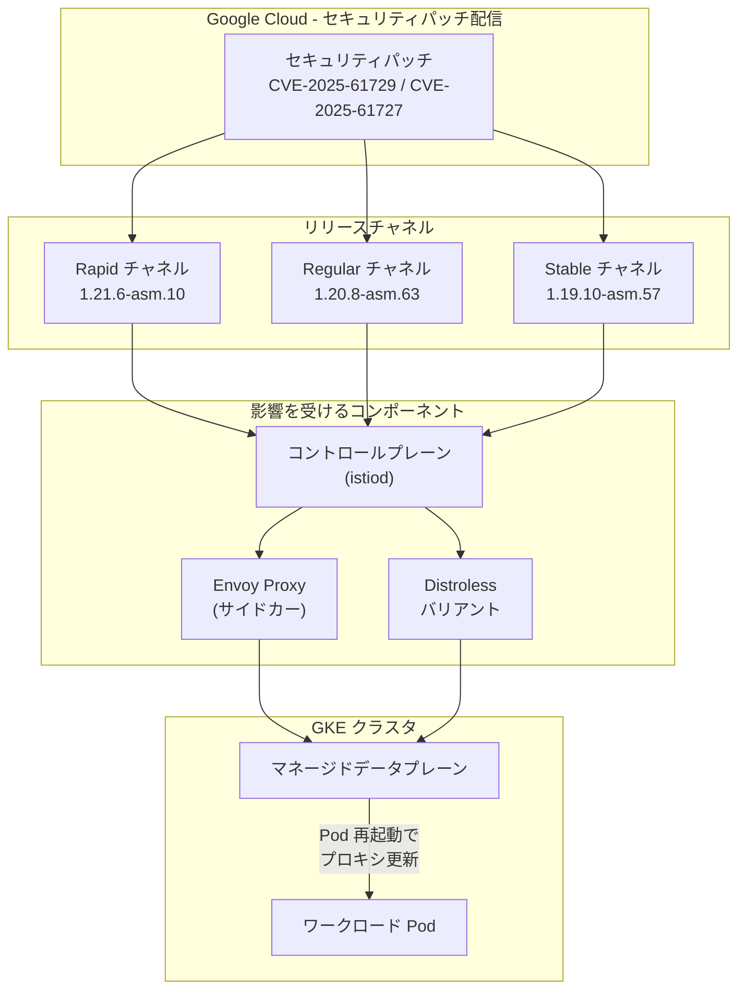

# Cloud Service Mesh: セキュリティパッチ (CVE-2025-61729, CVE-2025-61727)

**リリース日**: 2026-02-09
**サービス**: Cloud Service Mesh
**機能**: マネージド Cloud Service Mesh セキュリティパッチリリース
**ステータス**: ローリングアウト中

[このアップデートのインフォグラフィックを見る](https://takech9203.github.io/google-cloud-news-summary/20260209-cloud-service-mesh-security-patches-cve-2025.html)

## 概要

Google Cloud は、マネージド Cloud Service Mesh に対して複数のセキュリティ脆弱性を修正する新バージョンのローリングアウトを開始した。今回のパッチでは、Proxy およびコントロールプレーンに影響する 2 件の CVE (CVE-2025-61729、CVE-2025-61727) が修正される。これらの脆弱性は Distroless バリアントにも影響する。

パッチは Cloud Service Mesh の 3 つのリリースチャネル (Rapid、Regular、Stable) すべてに対してそれぞれ異なるバージョンとしてローリングアウトされる。マネージドデータプレーンを有効にしている場合、プロキシの更新は自動的に行われる。CVE に関連するロールアウトでは、GKE メンテナンスウィンドウの設定に関わらず、高優先度のアクティブ更新として即座に適用が開始される。

対象ユーザーは、マネージド Cloud Service Mesh を利用しているすべての GKE クラスタ管理者およびプラットフォームエンジニアである。特に CVE-2025-61729 は深刻度 High (CVSS 7.5) であるため、速やかな対応が推奨される。

**アップデート前の課題**

- Proxy およびコントロールプレーンに CVE-2025-61729 (深刻度: High 7.5) の脆弱性が存在し、悪用される可能性があった
- CVE-2025-61727 (深刻度: Medium) により、Proxy およびコントロールプレーンにセキュリティリスクが存在していた
- 通常の Envoy イメージだけでなく Distroless バリアントも同様に脆弱な状態であった

**アップデート後の改善**

- CVE-2025-61729 および CVE-2025-61727 が修正され、Proxy とコントロールプレーンの脆弱性が解消される
- 全 3 リリースチャネルに対応するパッチバージョンが提供され、段階的にセキュリティ修正が適用される
- Distroless バリアントを含むすべてのイメージで脆弱性が修正される

## アーキテクチャ図



セキュリティパッチが Google Cloud から各リリースチャネルに配信され、コントロールプレーンとプロキシ (Distroless を含む) に適用される流れを示す。マネージドデータプレーンが有効な場合、ワークロード Pod は自動的に再起動されてプロキシが更新される。

## サービスアップデートの詳細

### 主要機能

1. **CVE-2025-61729 の修正 (深刻度: High 7.5)**
   - Proxy およびコントロールプレーンに影響する高深刻度の脆弱性を修正
   - CVSS スコア 7.5 であり、リモートから悪用される可能性がある脆弱性
   - Distroless バリアントにも影響するため、すべてのデプロイメント形態で修正が必要

2. **CVE-2025-61727 の修正 (深刻度: Medium)**
   - Proxy およびコントロールプレーンに影響する中程度の深刻度の脆弱性を修正
   - Distroless バリアントにも同様に影響

3. **全リリースチャネルへの段階的ローリングアウト**
   - Rapid チャネル: 1.21.6-asm.10
   - Regular チャネル: 1.20.8-asm.63
   - Stable チャネル: 1.19.10-asm.57
   - 各チャネルに対応するバージョンで段階的にパッチが適用される

## 技術仕様

### パッチバージョン一覧

| リリースチャネル | パッチバージョン | GKE チャネルとの対応 | 影響コンポーネント |
|-----------------|-----------------|---------------------|-------------------|
| Rapid | 1.21.6-asm.10 | GKE Rapid | Proxy, Control Plane |
| Regular | 1.20.8-asm.63 | GKE Regular | Proxy, Control Plane |
| Stable | 1.19.10-asm.57 | GKE Stable | Proxy, Control Plane |

### CVE 詳細

| CVE ID | 深刻度 | CVSS スコア | 影響範囲 | Distroless 影響 |
|--------|--------|------------|---------|----------------|
| CVE-2025-61729 | High | 7.5 | Proxy, Control Plane | あり |
| CVE-2025-61727 | Medium | - | Proxy, Control Plane | あり |

### リリースチャネルとリビジョンラベル

| チャネル | リビジョンラベル | 用途 |
|---------|----------------|------|
| Rapid | `asm-managed-rapid` | 最新機能の早期利用、プレプロダクション環境での検証 |
| Regular | `asm-managed` | 機能の安定性と新機能のバランス (推奨) |
| Stable | `asm-managed-stable` | 安定性を最優先とする本番環境 |

### マネージドデータプレーンの更新動作

```yaml
# マネージドデータプレーンの更新動作 (CVE パッチの場合)
update_behavior:
  priority: high  # CVE 関連は高優先度
  maintenance_window: ignored  # CVE ロールアウトはメンテナンスウィンドウを無視
  method: pod_eviction  # Pod エビクションによる段階的更新
  pdb_honored: true  # PodDisruptionBudget は尊重される
  completion_time: "通常 2 週間以内"
  excluded_workloads:
    - StatefulSets
    - Jobs
    - DaemonSets
    - manually_injected_pods
```

## 設定方法

### 前提条件

1. マネージド Cloud Service Mesh が有効化された GKE クラスタ
2. クラスタが適切なリリースチャネル (Rapid / Regular / Stable) に登録されていること

### 手順

#### ステップ 1: 現在のチャネルとバージョンの確認

```bash
# クラスタのリリースチャネルを確認
gcloud container clusters describe CLUSTER_NAME \
  --zone ZONE \
  --format="value(releaseChannel.channel)"

# 現在の Cloud Service Mesh コントロールプレーンバージョンを確認
kubectl get controlplanerevision -n istio-system
```

#### ステップ 2: マネージドデータプレーンの有効化状態を確認

```bash
# 名前空間のリビジョンラベルを確認
kubectl get namespace NAMESPACE -o jsonpath='{.metadata.labels.istio\.io/rev}{"\n"}'

# マネージドデータプレーンの状態を確認
kubectl get dataplanecontrol -n istio-system
```

#### ステップ 3: プロキシバージョンの確認

```bash
# 各 Pod のサイドカープロキシバージョンを確認
kubectl get pods -n NAMESPACE -o jsonpath='{range .items[*]}{.metadata.name}{"\t"}{.spec.containers[?(@.name=="istio-proxy")].image}{"\n"}{end}'
```

マネージドデータプレーンが有効な場合、Google がプロキシの更新を自動的に管理する。CVE 関連の高優先度更新は、GKE メンテナンスウィンドウの設定に関わらず即座にローリングアウトが開始される。

#### ステップ 4: 手動でプロキシを更新する場合 (マネージドデータプレーン無効時)

```bash
# ワークロードを再起動してプロキシを更新
kubectl rollout restart deployment -n NAMESPACE
```

マネージドデータプレーンが無効の場合、プロキシの更新は Pod の自然なライフサイクルに依存するため、手動でワークロードを再起動する必要がある。

## メリット

### ビジネス面

- **セキュリティリスクの低減**: 深刻度 High の CVE を含む脆弱性が修正され、サービスメッシュ内の通信の安全性が向上する
- **コンプライアンス維持**: セキュリティパッチの迅速な適用により、セキュリティ基準への準拠を維持できる

### 技術面

- **自動更新**: マネージドデータプレーンを有効にしている場合、プロキシの更新が自動的に行われるため、運用負荷が最小限に抑えられる
- **段階的ロールアウト**: PodDisruptionBudget を尊重した段階的なロールアウトにより、サービスの可用性を維持しながらパッチが適用される
- **全チャネル対応**: Rapid、Regular、Stable のすべてのリリースチャネルに同時にパッチが提供される

## デメリット・制約事項

### 制限事項

- マネージドデータプレーンは StatefulSets、Jobs、DaemonSets、手動インジェクションされた Pod の更新は管理しない。これらは手動での対応が必要
- マネージドデータプレーンが無効の場合、プロキシの更新は Pod の再作成またはワークロードの手動再起動に依存する

### 考慮すべき点

- CVE パッチのローリングアウトは GKE メンテナンスウィンドウを無視して実施されるため、ワークロードの Pod が予期しないタイミングで再起動される可能性がある
- PodDisruptionBudget は尊重されるが、適切に設定されていない場合はサービスに影響が出る可能性がある
- パッチの完全な適用には通常最大 2 週間程度かかる場合がある

## ユースケース

### ユースケース 1: マネージドデータプレーンによる自動パッチ適用

**シナリオ**: 本番環境の GKE クラスタでマネージドデータプレーンを有効にしており、CVE パッチを自動的に適用したい場合

**確認手順**:
```bash
# パッチのロールアウト状況を確認
kubectl get pods -n NAMESPACE -o jsonpath='{range .items[*]}{.metadata.name}{"\t"}{.spec.containers[?(@.name=="istio-proxy")].image}{"\n"}{end}'

# コントロールプレーンのバージョンを確認
kubectl get controlplanerevision -n istio-system -o yaml
```

**効果**: 運用チームの介入なしに、セキュリティパッチが段階的に適用される。PodDisruptionBudget により可用性も維持される。

### ユースケース 2: 手動管理環境での迅速なパッチ適用

**シナリオ**: マネージドデータプレーンを無効にしている環境で、深刻度 High の CVE-2025-61729 に対して迅速にパッチを適用したい場合

**実装例**:
```bash
# 名前空間ごとにワークロードを順次再起動
for ns in namespace1 namespace2 namespace3; do
  kubectl rollout restart deployment -n $ns
  kubectl rollout status deployment -n $ns --timeout=300s
done
```

**効果**: マネージドデータプレーン無効環境でも、手動再起動によりコントロールプレーンの更新後すぐにプロキシを最新パッチバージョンに更新できる。

## 料金

Cloud Service Mesh のセキュリティパッチ適用に追加料金は発生しない。Cloud Service Mesh 自体の料金は GKE Enterprise に含まれている。Cloud Service Mesh 証明機関 (Cloud Service Mesh CA) のコストは Cloud Service Mesh の料金に含まれるが、Certificate Authority Service を使用する場合は別途課金される。

詳細は [Cloud Service Mesh の料金ページ](https://cloud.google.com/service-mesh/pricing) を参照。

## 関連サービス・機能

- **Google Kubernetes Engine (GKE)**: Cloud Service Mesh のリリースチャネルは GKE クラスタのリリースチャネルと連動している。クラスタのチャネル設定が Cloud Service Mesh のバージョンを決定する
- **Cloud Service Mesh セキュリティ速報**: CVE の詳細と影響範囲が公開される。セキュリティ速報の XML フィードを購読して最新情報を入手できる
- **GKE メンテナンスウィンドウ**: 通常のデータプレーン更新はメンテナンスウィンドウに従うが、CVE 関連のロールアウトはメンテナンスウィンドウを無視する
- **Cloud Monitoring / Cloud Logging**: パッチ適用後のサービスメッシュの動作を監視し、異常がないか確認するために活用

## 参考リンク

- [このアップデートのインフォグラフィック](https://takech9203.github.io/google-cloud-news-summary/20260209-cloud-service-mesh-security-patches-cve-2025.html)
- [公式リリースノート](https://cloud.google.com/release-notes#February_09_2026)
- [Cloud Service Mesh リリースノート](https://cloud.google.com/service-mesh/docs/release-notes)
- [Cloud Service Mesh セキュリティ速報](https://cloud.google.com/service-mesh/docs/security-bulletins)
- [マネージド Cloud Service Mesh リリースチャネル](https://cloud.google.com/service-mesh/docs/managed/select-a-release-channel)
- [マネージドデータプレーンのプロビジョニング](https://cloud.google.com/service-mesh/docs/onboarding/provision-control-plane)
- [Cloud Service Mesh のアップグレード](https://cloud.google.com/service-mesh/docs/upgrade/upgrade)
- [料金ページ](https://cloud.google.com/service-mesh/pricing)

## まとめ

今回の Cloud Service Mesh セキュリティパッチは、Proxy およびコントロールプレーンに影響する 2 件の CVE (うち 1 件は深刻度 High) を修正する重要なアップデートである。マネージドデータプレーンを有効にしている環境では自動的にパッチが適用されるが、無効にしている環境ではワークロードの手動再起動が必要となる。特に CVE-2025-61729 (CVSS 7.5) は深刻度が高いため、すべての Cloud Service Mesh ユーザーは速やかにパッチの適用状況を確認し、必要に応じてワークロードの再起動を実施することが推奨される。

---

**タグ**: #CloudServiceMesh #Security #CVE #GKE #ServiceMesh #セキュリティパッチ #Envoy #Proxy #ControlPlane
