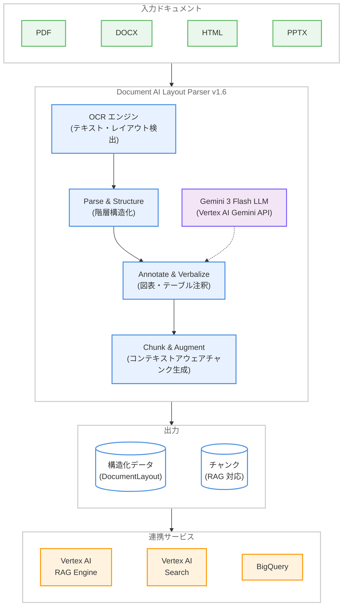

# Document AI: Layout Parser v1.6 (Gemini 3 Flash) Preview

**リリース日**: 2026-02-09
**サービス**: Document AI
**機能**: Layout Parser v1.6 (pretrained-layout-parser-v1.6-2026-01-13)
**ステータス**: Preview (Release Candidate)

[このアップデートのインフォグラフィックを見る](https://takech9203.github.io/google-cloud-news-summary/20260209-document-ai-layout-parser-v1-6.html)

## 概要

Google Cloud Document AI の Layout Parser に新しいプロセッサバージョン `pretrained-layout-parser-v1.6-2026-01-13` が Preview としてリリースされた。このバージョンは Gemini 3 Flash LLM を搭載しており、US および EU リージョンで ML 処理が利用可能である。v1 API と v1beta3 API の両方で使用できる。

Layout Parser は、非構造化ドキュメントから構造化された情報を抽出する高度なテキスト解析サービスである。Google の専用 OCR モデルと Gemini の生成 AI 機能を組み合わせることで、テーブル、図表、リスト、見出しなどのドキュメント要素を認識し、要素間のコンテキスト関係を保持する。特に検索 (Search) や RAG (Retrieval Augmented Generation) パイプライン向けにコンテキストアウェアなチャンクを生成することで、情報検索の品質と生成回答の精度を大幅に向上させる。

今回の v1.6 は、内部で Vertex AI Gemini API のグローバルエンドポイントを使用しており、Data Residency (DMZ) 基準には準拠していない点に注意が必要である。US および EU エンドポイントでのリクエストがグローバルにルーティングされる可能性がある。

**アップデート前の課題**

v1.6 以前のバージョンには以下の制約があった。

- v1.0 (Stable) は従来型のレイアウト解析であり、Gemini LLM による高度な解析機能を利用できなかった
- v1.5 (Preview) は Gemini 2.5 Flash / Pro LLM を搭載していたが、最新の Gemini 3 世代のモデルは利用できなかった
- v1.6-pro (Preview、2025 年 12 月リリース) は Gemini 3.0 Pro LLM を搭載しているが、レイテンシが高い傾向がある

**アップデート後の改善**

今回のアップデートにより以下の改善が実現された。

- Gemini 3 Flash LLM の搭載により、最新世代の生成 AI モデルによるレイアウト解析が可能になった
- Flash モデルであるため、Pro バージョン (v1.6-pro) と比較して低レイテンシでの処理が期待できる
- US および EU の両リージョンで ML 処理が利用可能になった

## アーキテクチャ図



Document AI Layout Parser v1.6 の処理パイプラインを示す。入力ドキュメントは OCR エンジンでテキストとレイアウトが検出された後、Gemini 3 Flash LLM によるアノテーション処理を経て、コンテキストアウェアなチャンクとして出力される。出力データは Vertex AI RAG Engine、Vertex AI Search、BigQuery などの下流サービスと連携可能である。

## サービスアップデートの詳細

### 主要機能

1. **Gemini 3 Flash LLM によるレイアウト解析**
   - 最新世代の Gemini 3 Flash LLM を搭載し、PDF ファイルに対する高品質なレイアウト解析を提供
   - テーブル認識、読み取り順序、テキスト認識の精度が向上
   - Flash モデルによる低レイテンシ処理

2. **マルチステージ処理パイプライン**
   - Parse and Structure: ドキュメントを取り込み、すべての要素をツリー形式で識別・整理。`DocumentLayout` proto フィールドにドキュメントの階層構造を保持
   - Annotate and Verbalize (Preview): Gemini の生成 AI 機能を使用して、図表やテーブルなどの視覚的要素をリッチなテキスト記述でアノテーション
   - Chunk and Augment: パースされたドキュメントとアノテーションからセマンティックに一貫性のあるチャンクを生成。祖先見出しなどのコンテキスト情報でチャンクを補強

3. **高度なテーブル解析**
   - 結合セルや複雑なヘッダーを持つテーブルからのデータ抽出に優れる
   - 財務レポートや技術マニュアルなどの複雑なテーブル構造を正確に解析

4. **ハルシネーション低減**
   - 高度な OCR を基盤としているため、ドキュメントの実際のコンテンツに基づいた抽出を実現
   - 純粋な LLM ベースのパーサーと比較して、存在しないテキストの読み取りを大幅に低減

5. **レイアウトアウェアチャンキング**
   - ドキュメントの階層構造を理解し、祖先見出しやテーブルヘッダーを含むコンテキストアウェアなチャンクを生成
   - 取得されたチャンクにはテキストだけでなく、正確な LLM 応答に必要な構造的コンテキストが含まれる

## 技術仕様

### プロセッサバージョン一覧

Layout Parser で利用可能なすべてのモデルバージョンを以下に示す。

| モデルバージョン | 搭載 LLM | リリースチャネル | リリース日 |
|---|---|---|---|
| `pretrained-layout-parser-v1.0-2024-06-03` | なし (従来型) | Stable | 2024-06-03 |
| `pretrained-layout-parser-v1.5-2025-08-25` | Gemini 2.5 Flash | Release Candidate | 2025-08-25 |
| `pretrained-layout-parser-v1.5-pro-2025-08-25` | Gemini 2.5 Pro | Release Candidate | 2025-08-25 |
| `pretrained-layout-parser-v1.6-pro-2025-12-01` | Gemini 3.0 Pro | Release Candidate | 2025-12-01 |
| `pretrained-layout-parser-v1.6-2026-01-13` | **Gemini 3 Flash** | **Release Candidate** | **2026-01-13** |

### 処理制限

Layout Parser の処理制限は以下の通りである。

| 処理タイプ | 制限事項 |
|---|---|
| オンライン処理: ファイルサイズ | 最大 20 MB (全ファイルタイプ) |
| オンライン処理: PDF ページ数 | 最大 15 ページ |
| バッチ処理: ファイルサイズ | 最大 1 GB (PDF) |
| バッチ処理: PDF ページ数 | 最大 500 ページ |

### 対応ファイルタイプ

Layout Parser が検出可能な要素をファイルタイプ別に示す。

| ファイルタイプ | 検出要素 | 制限事項 |
|---|---|---|
| PDF | figure、paragraph、table、title、heading、page header、page footer | 複数ページにまたがるテーブルは 2 つに分割される場合がある |
| HTML | paragraph、table、list、title、heading、page header、page footer | CSS ベースのフォーマットはキャプチャされない場合がある |
| DOCX | paragraph、table (複数ページ対応)、list、title、heading | ネストされたテーブルは非対応 |
| PPTX | paragraph、table、list、title、heading | 見出しの正確な識別には PowerPoint 内でのマークアップが必要。ネストされたテーブルと非表示スライドは非対応 |
| XLSX / XLSM | テーブル (INT、FLOAT、STRING) | 複数テーブル検出は非対応。最大 500 万セル |

### LayoutConfig API 設定

Layout Parser の処理オプションを設定する `ProcessOptions.LayoutConfig` の主要フィールドを以下に示す。

```json
{
  "processOptions": {
    "layoutConfig": {
      "chunkingConfig": {
        "chunkSize": 1024,
        "includeAncestorHeadings": true
      },
      "enableTableAnnotation": true,
      "enableImageAnnotation": true,
      "enableLlmLayoutParsing": true
    }
  }
}
```

## 設定方法

### 前提条件

1. Google Cloud プロジェクトで Document AI API が有効であること
2. 適切な IAM 権限 (Document AI Editor 以上) が付与されていること
3. Vertex AI Gemini API へのアクセスが有効であること (v1.6 は内部で Vertex AI Gemini API を使用)

### 手順

#### ステップ 1: Layout Parser プロセッサの作成

Google Cloud コンソールの Document AI セクションから、Processor Gallery で Layout Parser を検索し、プロセッサを作成する。

1. [Processor Gallery](https://console.cloud.google.com/ai/document-ai/processor-library) を開く
2. "Layout parser" を検索し、`Create` を選択
3. プロセッサ名を入力 (例: `layout-parser-v16`)
4. リージョンを選択 (US または EU)
5. `Create` をクリック

#### ステップ 2: プロセッサバージョンの設定

作成したプロセッサのバージョンを v1.6 に変更する。

1. プロセッサの詳細ページで `Manage versions` をクリック
2. Versions テーブルから `pretrained-layout-parser-v1.6-2026-01-13` を選択
3. `Mark as default` をクリックし、プロセッサ名を入力して確認

#### ステップ 3: Python クライアントでのドキュメント処理

```python
from google.cloud import documentai

def process_with_layout_parser_v16(
    project_id: str,
    location: str,
    processor_id: str,
    gcs_uri: str,
    mime_type: str
):
    client = documentai.DocumentProcessorServiceClient()

    # v1.6 プロセッサバージョンを指定
    processor_version_id = "pretrained-layout-parser-v1.6-2026-01-13"
    name = client.processor_version_path(
        project_id, location, processor_id, processor_version_id
    )

    gcs_document = documentai.GcsDocument(
        gcs_uri=gcs_uri,
        mime_type=mime_type
    )

    process_options = documentai.ProcessOptions(
        layout_config=documentai.ProcessOptions.LayoutConfig(
            enable_table_annotation=True,
            enable_image_annotation=True,
            chunking_config=documentai.ProcessOptions.LayoutConfig.ChunkingConfig(
                chunk_size=1024,
                include_ancestor_headings=True,
            ),
        ),
    )

    request = documentai.ProcessRequest(
        name=name,
        gcs_document=gcs_document,
        process_options=process_options,
    )

    result = client.process_document(request=request)
    document = result.document

    for i, chunk in enumerate(document.chunked_document.chunks):
        print(f"Chunk {i}: {chunk.content[:100]}...")

    return result
```

## メリット

### ビジネス面

- **RAG パイプラインの品質向上**: コンテキストアウェアなチャンキングにより、情報検索の精度と生成回答の品質が大幅に向上する。財務レポート、契約書、技術ドキュメントなどの複雑なドキュメントから正確な情報抽出が可能
- **処理速度の改善**: Gemini 3 Flash モデルの採用により、Pro バージョンと比較して低レイテンシでの処理が期待でき、大量のドキュメント処理ワークロードに適している
- **ハルシネーションリスクの低減**: OCR ベースのグラウンディングにより、LLM が存在しない情報を生成するリスクを低減し、信頼性の高いデータ抽出を実現

### 技術面

- **最新 LLM の活用**: Gemini 3 Flash LLM により、テーブル認識、読み取り順序、テキスト認識の精度が向上
- **多様なファイル形式対応**: PDF、HTML、DOCX、PPTX、XLSX、XLSM に対応し、幅広いドキュメント処理ニーズをカバー
- **Vertex AI エコシステムとの統合**: RAG Engine、Vertex AI Search、BigQuery との連携が可能で、エンドツーエンドのドキュメント処理パイプラインを構築できる

## デメリット・制約事項

### 制限事項

- Data Residency (DMZ) 基準に準拠していない。US および EU エンドポイントでのリクエストがグローバルにルーティングされる可能性がある。データレジデンシー要件が厳格な場合は Stable バージョン (v1.0) を使用する必要がある
- Preview (Release Candidate) ステータスのため、本番環境での使用には注意が必要。安定性が保証されず、仕様変更の可能性がある
- 非 PDF ファイルに対しては、v1.5 以降のバージョンでも v1.0 と同等の動作となる (Gemini LLM による拡張解析は PDF のみ対応)

### 考慮すべき点

- Vertex AI Gemini API のグローバルエンドポイントを内部的に使用するため、Gemini API の利用に伴う追加コストが発生する可能性がある
- データレジデンシー要件がある規制業界 (金融、医療など) では、データがグローバルにルーティングされるリスクを評価する必要がある
- Stable バージョン (v1.0) からの移行時は、出力形式や精度の差異を検証する必要がある

## ユースケース

### ユースケース 1: 財務レポートの RAG パイプライン構築

**シナリオ**: 大量の有価証券報告書 (10-K ファイリングなど) を処理し、RAG パイプラインで検索・回答生成を行う。

**実装例**:

```python
from vertexai import rag
import vertexai

vertexai.init(project="my-project", location="us-central1")

# Layout Parser v1.6 を使用して RAG ファイルをインポート
response = rag.import_files(
    corpus_name="projects/my-project/locations/us-central1/ragCorpora/my-corpus",
    paths=["gs://my-bucket/financial-reports/"],
    transformation_config=rag.TransformationConfig(
        rag.ChunkingConfig(chunk_size=1024, chunk_overlap=256)
    ),
    layout_parser=rag.LayoutParserConfig(
        processor_name="projects/my-project/locations/us/processors/my-processor/processorVersions/pretrained-layout-parser-v1.6-2026-01-13",
        max_parsing_requests_per_min=120,
    ),
)
```

**効果**: 複雑なテーブル構造を持つ財務レポートから正確なデータを抽出し、RAG パイプラインでの検索精度と回答品質を向上させる。

### ユースケース 2: 技術ドキュメントの構造化データ取り込み

**シナリオ**: 大量の技術マニュアルや仕様書を BigQuery に取り込み、構造化データとして分析する。

**効果**: レイアウトアウェアなチャンキングにより、見出し・段落・テーブルの関係性を保持したまま構造化データとして BigQuery に格納できる。テーブル内のデータの正確性が向上し、分析の信頼性が高まる。

## 料金

Document AI の料金はデプロイされたプロセッサ数と処理されたページ数に基づいて課金される。v1.6 では内部的に Vertex AI Gemini API を使用するため、追加の Gemini API 利用料金が発生する可能性がある。詳細な料金体系については公式料金ページを参照。

- [Document AI 料金ページ](https://cloud.google.com/document-ai/pricing)
- [Vertex AI Generative AI 料金ページ](https://cloud.google.com/vertex-ai/generative-ai/pricing)

## 利用可能リージョン

v1.6 (pretrained-layout-parser-v1.6-2026-01-13) は以下のリージョンで ML 処理が利用可能である。

| リージョン | ML 処理 |
|---|---|
| US (マルチリージョン) | 利用可能 |
| EU (マルチリージョン) | 利用可能 |

Vertex AI Gemini API のグローバルエンドポイントを使用するため、リクエストがグローバルにルーティングされる可能性がある。Data Residency (DMZ) 基準には準拠していない。

## 関連サービス・機能

- **Vertex AI RAG Engine**: Layout Parser で生成されたチャンクを RAG Engine のコーパスにインポートし、高品質な検索・回答生成パイプラインを構築できる
- **Vertex AI Search**: Layout Parser によるレイアウト検出とコンテンツアウェアなチャンキングを活用し、ドキュメント検索の精度を向上させる
- **BigQuery**: Layout Parser で抽出された構造化データを BigQuery に格納し、大規模なドキュメント分析を実行できる
- **Document AI Custom Extractor**: Layout Parser と組み合わせて使用することで、カスタムエンティティの抽出精度を向上させる
- **Vertex AI Gemini API**: v1.6 が内部的に使用する基盤 API。Gemini 3 Flash モデルによる生成 AI 機能を提供する

## 参考リンク

- [インフォグラフィック](https://takech9203.github.io/google-cloud-news-summary/20260209-document-ai-layout-parser-v1-6.html)
- [公式リリースノート](https://docs.cloud.google.com/release-notes#February_09_2026)
- [Document AI Release Notes](https://cloud.google.com/document-ai/docs/release-notes)
- [Layout Parser ドキュメント](https://cloud.google.com/document-ai/docs/layout-parse-chunk)
- [Layout Parser Quickstart](https://cloud.google.com/document-ai/docs/layout-parse-quickstart)
- [Vertex AI RAG Engine - Layout Parser Integration](https://cloud.google.com/vertex-ai/generative-ai/docs/rag-engine/layout-parser-integration)
- [プロセッサバージョン管理](https://cloud.google.com/document-ai/docs/manage-processor-versions)
- [Document AI 料金ページ](https://cloud.google.com/document-ai/pricing)
- [Document AI クォータと制限](https://cloud.google.com/document-ai/quotas)

## まとめ

Document AI Layout Parser v1.6 は、Gemini 3 Flash LLM を搭載した最新の Preview バージョンであり、PDF ドキュメントのレイアウト解析品質を大幅に向上させる。特に RAG パイプラインや検索アプリケーションを構築する Solutions Architect にとって、コンテキストアウェアなチャンキングとハルシネーション低減は重要な改善点である。Data Residency 要件がない環境では早期に検証を開始し、Pro バージョン (v1.6-pro) との性能・レイテンシの比較評価を行うことを推奨する。

---

**タグ**: #DocumentAI #LayoutParser #Gemini3Flash #RAG #Preview #VertexAI #OCR #DocumentProcessing
