# Gemini Enterprise: Notion データコネクタ (Public Preview)

**リリース日**: 2026-02-09
**サービス**: Gemini Enterprise
**機能**: Notion データコネクタ (データフェデレーション)
**ステータス**: Public Preview

[このアップデートのインフォグラフィックを見る](infographic/20260209-gemini-enterprise-notion-connector.html)

## 概要

Gemini Enterprise に Notion のデータコネクタが Public Preview として追加された。このアップデートにより、組織が Notion に蓄積しているナレッジベース、プロジェクトドキュメント、Wiki などのデータを Gemini Enterprise に接続し、AI アシスタントを通じてアクセス・活用できるようになる。

Notion コネクタはデータフェデレーション方式で動作する。データフェデレーションでは、Notion のデータを Vertex AI Search のインデックスにコピーせず、検索時に直接 Notion からデータを取得する。これによりデータストレージの消費を抑えつつ、Gemini Enterprise の統合検索基盤を通じて Notion 上の情報に自然言語でアクセスできる。

このコネクタは、Jira Cloud、Confluence Cloud、Microsoft SharePoint、ServiceNow など既存のサードパーティデータコネクタエコシステムの一部として提供される。Notion を利用している組織にとって、社内の分散したナレッジを Gemini Enterprise で一元的に検索・活用できる点が大きな価値となる。

**アップデート前の課題**

Notion に蓄積された組織のナレッジを Gemini Enterprise で活用するには、以下の課題があった。

- Notion のデータを Gemini Enterprise から直接検索する手段がなく、ユーザーは Notion と Gemini Enterprise を個別に利用する必要があった
- Notion に保存されたドキュメントやナレッジベースの情報は、Gemini Enterprise のグラウンディング (根拠付け) に活用できなかった
- Notion のデータを Gemini Enterprise に取り込むにはカスタムコネクタを構築する必要があり、開発・運用コストが発生していた

**アップデート後の改善**

今回のアップデートにより、以下が可能になった。

- Notion データストアを Gemini Enterprise に接続し、AI アシスタントから直接 Notion のデータにアクセスできるようになった
- データフェデレーション方式により、Notion のデータをコピーせずにリアルタイムで検索可能になった
- Google Cloud コンソールからの設定で Notion コネクタを構成でき、カスタム開発が不要になった

## アーキテクチャ図

```mermaid
flowchart LR
    subgraph Notion["Notion"]
        direction LR
        NW["📝 Wiki /<br/>ナレッジベース"]
        NP["📋 プロジェクト<br/>ドキュメント"]
        ND["🗄️ データベース"]
        NW ~~~ NP ~~~ ND
    end

    subgraph GCP["☁️ Google Cloud"]
        subgraph GE["Gemini Enterprise"]
            DC["🔌 Notion<br/>データコネクタ"]
            DS[("📦 データストア<br/>(フェデレーション)")]
            VA["🔍 Vertex AI Search"]
            GA["🤖 Gemini<br/>AI アシスタント"]
        end
    end

    User(["👤 ユーザー"]) --> GA
    GA --> VA
    VA --> DS
    DS --> DC
    DC -.->|データフェデレーション| Notion

    classDef cloud fill:none,stroke:#CCCCCC,stroke-width:2px,color:#666666
    classDef notion fill:#FFFFFF,stroke:#000000,stroke-width:2px,color:#333333
    classDef connector fill:#E8F1FF,stroke:#4A90E2,stroke-width:2px,color:#333333
    classDef storage fill:#E8EAF6,stroke:#C5CAE9,stroke-width:2px,color:#283593
    classDef search fill:#E9F7EC,stroke:#66BB6A,stroke-width:2px,color:#333333
    classDef ai fill:#FFF3E0,stroke:#FF9800,stroke-width:2px,color:#333333
    classDef user fill:#E3F2FD,stroke:#BBDEFB,stroke-width:2px,color:#1565C0
    classDef notionItem fill:#F5F5F5,stroke:#999999,stroke-width:1px,color:#333333

    class GCP cloud
    class GE cloud
    class Notion notion
    class NW,NP,ND notionItem
    class DC connector
    class DS storage
    class VA search
    class GA ai
    class User user
```

Notion のデータはデータフェデレーション方式で Gemini Enterprise に接続される。ユーザーが Gemini AI アシスタントに質問すると、Vertex AI Search が Notion データコネクタを通じて Notion のデータをリアルタイムに検索し、回答を生成する。

## サービスアップデートの詳細

### 主要機能

1. **Notion データフェデレーション**
   - Notion のデータを Vertex AI Search のインデックスにコピーせず、検索時に直接取得する方式
   - データストレージの消費を抑えられるため、ストレージコストの懸念が軽減される
   - データは常に Notion 側の最新状態が反映される

2. **Gemini Enterprise AI アシスタントとの統合**
   - Notion に蓄積されたナレッジを Gemini Enterprise の AI アシスタントで自然言語検索できる
   - 他のデータソース (Google Drive、Jira、Confluence など) と横断的に検索結果をブレンドして表示
   - パーミッション対応のエンタープライズ検索に対応

3. **サードパーティコネクタエコシステムの拡充**
   - 既に GA となっている Confluence Cloud、Jira Cloud、Microsoft SharePoint Online、ServiceNow などに加え、Public Preview として Notion が追加された
   - 同日に Linear データコネクタも Public Preview として発表されており、サードパーティ連携が拡大している

## 技術仕様

### データ接続方式

Notion コネクタの技術仕様は以下の通り。

| 項目 | 詳細 |
|------|------|
| 接続方式 | データフェデレーション (検索時にリアルタイム取得) |
| ステータス | Public Preview |
| 対応ロケーション | Global、US、EU |
| データ形式 | 非構造化データ (ドキュメント) / 構造化データ (データベース) |
| 暗号化 | US / EU ロケーションではデータ暗号化が必要 (Google マネージド鍵または CMEK) |

### エディション別の対応状況

Gemini Enterprise のエディションによってデータコネクタの利用範囲が異なる。

| エディション | コネクタアクセス | ストレージ (ユーザーあたり/月) |
|-------------|----------------|-------------------------------|
| Business | セグメント限定コネクタのみ | 25 GiB (プール) |
| Standard | フルコネクタエコシステム | 30 GiB (プール) |
| Plus | フルコネクタエコシステム | 75 GiB (プール) |
| Frontline | フルコネクタエコシステム | 2 GiB (プール) |

Standard、Plus、Frontline エディションではフルデータコネクタエコシステムにアクセスでき、Notion コネクタを含むすべてのサードパーティコネクタを利用できる。Business エディションはセグメント限定コネクタへのアクセスとなるため、Notion コネクタの対応状況は公式ドキュメントで確認が必要。

## 設定方法

### 前提条件

1. Gemini Enterprise のサブスクリプションとライセンスが有効であること
2. Google Cloud プロジェクトに Gemini Enterprise がセットアップ済みであること
3. Notion 側で Gemini Enterprise 接続用のインテグレーション設定が完了していること
4. Discovery Engine Admin ロールまたは適切な IAM 権限が付与されていること

### 手順

#### ステップ 1: Notion インテグレーションの設定

Notion 側で Gemini Enterprise と接続するためのインテグレーションを設定する。詳細な設定手順は公式ドキュメント「Notion configuration」を参照。

#### ステップ 2: Gemini Enterprise でデータストアを作成

Google Cloud コンソールで Gemini Enterprise のデータストアを作成し、Notion をデータソースとして選択する。

1. Google Cloud コンソールで Gemini Enterprise ページに移動
2. **Data stores** を選択し、**Create data store** をクリック
3. ソースとして **Notion** を選択
4. ロケーション (Global / US / EU) を選択
5. データコネクタ名を入力
6. 暗号化設定を構成 (US / EU ロケーションの場合)
7. **Create** をクリック

#### ステップ 3: アプリへの接続

作成したデータストアを Gemini Enterprise アプリに接続し、検索対象として有効化する。

## メリット

### ビジネス面

- **ナレッジの一元検索**: Notion に分散している社内情報を Gemini Enterprise の AI アシスタントで横断検索できるため、情報の発見性が大幅に向上する
- **業務効率の改善**: ユーザーが複数のツールを切り替えることなく、Gemini Enterprise から Notion のデータに直接アクセスできるため、情報検索にかかる時間を削減できる
- **カスタム開発不要**: マネージドコネクタとして提供されるため、自前で API 連携を構築・運用する必要がない

### 技術面

- **データフェデレーションによるストレージ効率**: データを Vertex AI Search にコピーしないため、追加のストレージコストが発生しない
- **権限対応の検索**: Gemini Enterprise のパーミッション対応検索により、ユーザーのアクセス権限に基づいた検索結果が提供される
- **データ同期の自動化**: データフェデレーションにより、Notion 側の最新データに常にアクセスでき、手動でのデータ同期が不要

## デメリット・制約事項

### 制限事項

- Notion データストアは **Global、US、EU** ロケーションのみサポートされている (アジアリージョンは未対応)
- 現時点では **データフェデレーション** のみの対応であり、データインジェスト (インデックス作成) には対応していない
- データフェデレーション方式のため、インデックス付き検索と比較して検索品質が低くなる可能性がある
- Public Preview 段階であるため、GA 前にサービス仕様が変更される可能性がある

### 考慮すべき点

- データフェデレーションでは検索時に Notion API を直接呼び出すため、Notion API のレート制限や応答速度が検索パフォーマンスに影響する可能性がある
- Notion 側のアクセス権限と Gemini Enterprise 側のアクセス制御の整合性を事前に確認する必要がある
- US / EU ロケーションを選択する場合はデータ暗号化の設定が必要

## ユースケース

### ユースケース 1: 社内ナレッジベースの AI 検索

**シナリオ**: 大規模組織で Notion を社内 Wiki やナレッジベースとして活用しており、社員が必要な情報を効率的に見つけたい。

**効果**: Gemini Enterprise の AI アシスタントに自然言語で質問するだけで、Notion のナレッジベースから関連する情報を検索し、要約された回答が得られる。従来のキーワード検索では見つけにくかった情報にもアクセスしやすくなる。

### ユースケース 2: マルチソース横断検索によるプロジェクト管理

**シナリオ**: プロジェクトチームが Notion (ドキュメント)、Jira (タスク管理)、Google Drive (ファイル共有) を併用しており、情報が分散している。

**効果**: Gemini Enterprise のデータコネクタエコシステムを活用し、Notion、Jira、Google Drive のデータを横断的に検索できる。プロジェクトに関連する設計書 (Notion)、課題チケット (Jira)、添付ファイル (Google Drive) を一度の検索で発見でき、情報の散逸によるコミュニケーションロスを削減できる。

### ユースケース 3: オンボーディング支援

**シナリオ**: 新入社員が組織のプロセス、ポリシー、手順書などを Notion で管理しており、入社時に大量の情報をキャッチアップする必要がある。

**効果**: 新入社員が Gemini Enterprise に「休暇申請の手順は?」「開発環境のセットアップ方法は?」と質問するだけで、Notion に保存された関連ドキュメントから回答が生成される。オンボーディングにかかる時間と先輩社員の負荷を軽減できる。

## 料金

Gemini Enterprise の料金はエディション別のサブスクリプション制で、月額または年額の契約が可能。Notion データコネクタの利用はサブスクリプションに含まれる。データフェデレーション方式のため、追加のデータストレージ料金は発生しない。

具体的なサブスクリプション料金については、以下の公式ページを参照。

- [Gemini Enterprise エディション比較](https://docs.cloud.google.com/gemini/enterprise/docs/editions)
- [Gemini Enterprise ライセンス管理](https://docs.cloud.google.com/gemini/enterprise/docs/licenses)

## 利用可能リージョン

公式ドキュメントで確認された、Notion データコネクタの対応ロケーションは以下の通り。

| ロケーション | 対応状況 |
|-------------|---------|
| Global | 対応 |
| US (米国マルチリージョン) | 対応 |
| EU (欧州マルチリージョン) | 対応 |

Gemini Enterprise 自体は上記に加え、東京 (asia-northeast1)、ロンドン (europe-west2)、オーストラリア (au)、カナダ (ca)、インド (in) のリージョンにも対応しているが、Notion データストアは現時点で Global、US、EU のみサポートされている。

## 関連サービス・機能

- **Vertex AI Search**: Gemini Enterprise のデータコネクタはバックエンドで Vertex AI Search を使用してデータの検索・取得を行う
- **Discovery Engine API**: カスタムコネクタを構築する場合に使用する API。Notion コネクタはマネージドコネクタとして提供されるため直接使用する必要はない
- **他のサードパーティコネクタ**: Confluence Cloud、Jira Cloud、Microsoft SharePoint Online、ServiceNow (GA)、Box、Dropbox、Microsoft Teams、Linear、Zendesk (Public Preview) など
- **NotebookLM Enterprise**: Gemini Enterprise Standard / Plus エディションに含まれ、ノートブック形式での情報整理・共有が可能

## 参考リンク

- [インフォグラフィック](infographic/20260209-gemini-enterprise-notion-connector.html)
- [公式リリースノート](https://docs.cloud.google.com/release-notes#February_09_2026)
- [Notion データストア概要](https://docs.cloud.google.com/gemini/enterprise/docs/notion)
- [サードパーティデータソースの接続](https://docs.cloud.google.com/gemini/enterprise/docs/connect-third-party-data-source)
- [コネクタとデータストアの概要](https://docs.cloud.google.com/gemini/enterprise/docs/introduction-to-connectors-and-data-stores)
- [Gemini Enterprise エディション比較](https://docs.cloud.google.com/gemini/enterprise/docs/editions)
- [Gemini Enterprise ライセンス管理](https://docs.cloud.google.com/gemini/enterprise/docs/licenses)
- [Gemini Enterprise ロケーション](https://docs.cloud.google.com/gemini/enterprise/docs/locations)

## まとめ

Gemini Enterprise に Notion データコネクタが Public Preview として追加され、Notion に蓄積された組織のナレッジを AI アシスタントから直接検索・活用できるようになった。データフェデレーション方式のためストレージコストを抑えつつリアルタイムに最新データにアクセスでき、Confluence、Jira、SharePoint など既存コネクタと組み合わせたマルチソース横断検索も実現できる。Notion を社内ナレッジ管理に活用している組織は、この機能を評価し、Gemini Enterprise による情報検索の効率化を検討することを推奨する。

---

**タグ**: #GeminiEnterprise #Notion #DataConnector #PublicPreview #DataFederation #VertexAISearch #EnterpriseSearch
