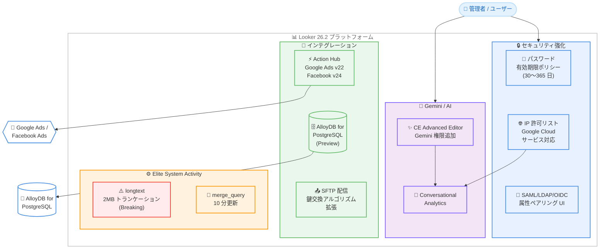

# Looker: 26.2 リリース

**リリース日**: 2026-02-09
**サービス**: Looker
**機能**: Looker 26.2 リリース
**ステータス**: GA (Generally Available)

## 概要

Looker 26.2 は、Looker (Google Cloud core) および Looker (original) の両方を対象としたメジャーリリースである。Action Hub の API バージョン更新、Gemini 関連権限の拡充、AlloyDB for PostgreSQL のダイアレクトサポート (Preview)、パスワード有効期限ポリシー、IP 許可リストの Google Cloud サービス対応など、セキュリティ・インテグレーション・データベース接続の 3 つの柱で機能強化が行われている。

本リリースでは、Breaking Change として Elite System Activity の longtext フィールドに対する 2MB 上限のトランケーションが導入されるため、大容量のシステムアクティビティデータを利用しているユーザーは事前に影響を確認する必要がある。デプロイスケジュールとして、Looker (original) は 2026 年 2 月 9 日にデプロイ開始、2 月 16 日に最終デプロイおよびダウンロード提供、Looker (Google Cloud core) は 2 月 9 日にデプロイ開始、2 月 27 日に最終デプロイが予定されている。

**アップデート前の課題**

今回のアップデート以前には以下の制限が存在していた。

- Action Hub が Google Ads v19 および Facebook Custom Audiences v22 という旧バージョンの API を使用しており、最新の広告プラットフォーム機能を活用できなかった
- Customer Engineer Advanced Editor ロールに Gemini 関連の権限が含まれておらず、Conversational Analytics を利用するには個別の権限付与が必要だった
- AlloyDB for PostgreSQL への接続には PostgreSQL 9.5+ ダイアレクトを使用する必要があり、AlloyDB 固有の最適化が活用できなかった
- Looker (original) にパスワード有効期限ポリシーの設定機能がなく、セキュリティコンプライアンスの要件を満たすことが困難だった
- IP 許可リストが有効な環境では Conversational Analytics などの Google Cloud サービスがブロックされる場合があった
- SAML/LDAP/OpenID Connect の属性ペアリング管理が直感的でなく、フィルタリングやページネーションの機能が不足していた

**アップデート後の改善**

今回のリリースにより以下の改善が実現された。

- Action Hub が Google Ads v22 および Facebook Custom Audiences v24 に対応し、最新の広告プラットフォーム API を利用可能になった
- Customer Engineer Advanced Editor ロールに `gemini_in_looker`、`chat_with_agent`、`chat_with_explore`、`save_agents` 権限が含まれるようになり、追加設定なしで Gemini 機能と Conversational Analytics が利用可能になった
- AlloyDB for PostgreSQL 専用のダイアレクトが追加され、接続作成時に「Google Cloud AlloyDB for PostgreSQL」を選択可能になった (Preview)
- 30〜365 日の範囲でパスワード有効期限ポリシーを設定可能になった (Looker (original) のみ)
- IP 許可リストが有効な環境でも Conversational Analytics などの Google Cloud サービスへのアクセスを許可できるようになった (Looker (original) のみ)
- SAML/LDAP/OpenID Connect の属性ペアリング管理に新しい「Manage Pairings」サイドパネルが追加され、フィルタリング・ページネーション・単一クレームの複数属性関連付けが可能になった

## アーキテクチャ図

Looker 26.2 のアーキテクチャ図は、セキュリティ強化、インテグレーション、Gemini/AI、Elite System Activity の 4 つの主要領域で構成される機能強化を示している。管理者はセキュリティ設定と AI 機能を管理し、Action Hub と AlloyDB ダイアレクトにより外部サービスとの接続性が向上している。

## サービスアップデートの詳細

### 主要機能

1. **Action Hub API バージョン更新**
   - Google Ads の API バージョンを v19 から v22 にアップデート
   - Facebook Custom Audiences の API バージョンを v22 から v24 にアップデート
   - 最新の広告プラットフォーム API に対応することで、新機能やパフォーマンス改善を活用可能
   - 対象: Looker (Google Cloud core) および Looker (original)

2. **CE Advanced Editor ロールへの Gemini 権限追加**
   - Customer Engineer Advanced Editor デフォルトロールに以下の権限が追加された
     - `gemini_in_looker`: Gemini in Looker 機能へのアクセス
     - `chat_with_agent`: Conversational Analytics のデータエージェントとのチャット
     - `chat_with_explore`: Explore データとの対話型分析
     - `save_agents`: データエージェントの保存
   - これにより、CE Advanced Editor ロールを持つユーザーは追加設定なしで Gemini 機能と Conversational Analytics にアクセス可能
   - 対象: Looker (Google Cloud core) および Looker (original)

3. **AlloyDB for PostgreSQL ダイアレクトサポート (Preview)**
   - Looker の接続作成画面で「Google Cloud AlloyDB for PostgreSQL」をダイアレクトとして選択可能
   - 対称集計、派生テーブル、永続化 SQL 派生テーブル、タイムゾーン、SSL、接続プーリング、HLL スケッチ、集計認識、増分 PDT、マテリアライズドビューなど幅広い機能をサポート
   - 既存の PostgreSQL 9.5+ ダイアレクトで作成された AlloyDB 接続には影響しない
   - Preview 期間中に問題が発生した場合は looker-alloydb-preview-external@google.com に報告可能
   - 対象: Looker (Google Cloud core) および Looker (original)

4. **パスワード有効期限ポリシー**
   - 管理者がメールとパスワード認証を使用するすべてのユーザーアカウントにパスワード有効期限を設定可能
   - 有効期限は 30 日から 365 日の範囲で設定可能 (プリセット: 90、180、365 日、またはカスタム)
   - パスワード期限切れ 14 日前からバナーで通知
   - アクティブセッション中にパスワードが期限切れになった場合、自動ログアウトされずバナーで通知
   - 対象: Looker (original) のみ

5. **IP 許可リストの Google Cloud サービス対応**
   - IP 許可リストが有効な Looker インスタンスでも、Conversational Analytics などの Google Cloud サービスにアクセスを許可可能
   - IP Allowlist ページの管理画面から「Grant access to essential Google Cloud services」オプションで設定
   - 対象: Looker (original) のみ

6. **SAML/LDAP/OpenID Connect 属性ペアリング UI 更新**
   - 認証属性のペアリング管理に新しい「Manage Pairings」サイドパネルを導入
   - フィルタリング機能とページネーション機能を搭載
   - 単一のクレームを複数の Looker ユーザー属性に関連付け可能
   - 対象: Looker (Google Cloud core) および Looker (original)

7. **SFTP 配信の鍵交換アルゴリズム拡張**
   - SFTP サーバーへのコンテンツ配信で、追加の鍵交換アルゴリズムおよびホスト鍵アルゴリズムをサポート
   - 対象: Looker (Google Cloud core) および Looker (original)

8. **Elite System Activity の改善**
   - `merge_query` テーブルのリフレッシュ間隔が 10 分に設定
   - longtext フィールドの 2MB トランケーション (Breaking Change、詳細は後述)

### Breaking Change: Elite System Activity longtext トランケーション

Elite System Activity を使用している場合、longtext 型のすべての System Activity フィールドについて、2MB を超えるデータはトランケーションされる。

トランケーションの詳細は以下の通りである。

| 条件 | 動作 |
|------|------|
| テーブルに longtext カラムが 1 つ | 最大 1.9MB に制限 |
| テーブルに longtext カラムが複数 (x 個) | 合計最大 2MB、各カラムは 2MB / x に均等分配 |

この変更は自動的に適用されるため、2MB を超える longtext データに依存しているワークフローやクエリがある場合は事前に確認が必要である。

### バグ修正

今回のリリースには以下のバグ修正が含まれている。

- Cookieless Embed 有効時に一部のドリルリンクが動作しない問題を修正
- LookML Dashboards フォルダで一部のユーザーにページネーションオプションが表示されない問題を修正
- 数値フィールドに基づくカスタムディメンションが文字列に変換され、不正なソートが発生する問題を修正
- 条件付きフォーマットでデフォルト以外のカラーコレクションを選択後にカスタムカラーを選択するとデフォルトに戻る問題を修正
- 「Along a scale...」条件付きフォーマットのカラーパレット変更が保存されない問題を修正
- 非管理者ユーザーが LookML ダッシュボードをお気に入りに追加できない問題を修正
- LookML コミット時の 500 エラーを修正
- Table から Single Value への条件付きフォーマットの問題を修正
- 条件付きフォーマットのダッシュボードタイルに関する問題を修正
- 条件付きフォーマットのコレクションスタイルに関する問題を修正
- フィルターバーの展開に関する問題を修正
- フィルタータイプの切り替えに関する問題を修正
- 条件付きフォーマットの新規フィールド追加に関する問題を修正
- Safari でダウンロード時に % 記号が正しく処理されない問題を修正

## 技術仕様

### デプロイスケジュール

| プラットフォーム | デプロイ開始 | 最終デプロイ |
|-----------------|-------------|-------------|
| Looker (original) | 2026 年 2 月 9 日 (月) | 2026 年 2 月 16 日 (月) - ダウンロード提供開始 |
| Looker (Google Cloud core) | 2026 年 2 月 9 日 (月) | 2026 年 2 月 27 日 (金) |

### 機能の対象プラットフォーム

各機能の対象プラットフォームは以下の通りである。

| 機能 | Looker (Google Cloud core) | Looker (original) |
|------|---------------------------|-------------------|
| Action Hub API 更新 | 対象 | 対象 |
| CE Advanced Editor Gemini 権限 | 対象 | 対象 |
| Elite System Activity longtext トランケーション | 対象 | 対象 |
| Elite System Activity merge_query 更新 | 対象 | 対象 |
| SFTP 鍵交換アルゴリズム | 対象 | 対象 |
| AlloyDB for PostgreSQL ダイアレクト (Preview) | 対象 | 対象 |
| SAML/LDAP/OIDC 属性ペアリング UI | 対象 | 対象 |
| パスワード有効期限ポリシー | -- | 対象 |
| IP 許可リスト Google Cloud サービス対応 | -- | 対象 |

### AlloyDB for PostgreSQL ダイアレクトの機能サポート

AlloyDB for PostgreSQL ダイアレクトがサポートする主要な Looker 機能は以下の通りである。

| 機能 | サポート |
|------|---------|
| Looker (Google Cloud core) | 対応 |
| 対称集計 (Symmetric Aggregates) | 対応 |
| 派生テーブル (Derived Tables) | 対応 |
| 永続化 SQL 派生テーブル (Persistent SQL Derived Tables) | 対応 |
| 永続化ネイティブ派生テーブル (Persistent Native Derived Tables) | 対応 |
| 安定ビュー (Stable Views) | 対応 |
| クエリキル (Query Killing) | 対応 |
| SQL ベースピボット | 対応 |
| タイムゾーン | 対応 |
| SSL | 対応 |
| 小計 (Subtotals) | 対応 |
| 接続プーリング | 対応 |
| HLL スケッチ | 対応 |
| 集計認識 (Aggregate Awareness) | 対応 |
| 増分 PDT | 対応 |
| マテリアライズドビュー | 対応 |
| 期間比較メジャー (Period-over-period Measures) | 対応 |
| 近似カウントディスティンクト | 対応 |

### パスワード有効期限ポリシーの設定

パスワード有効期限ポリシーの設定手順は以下の通りである。

1. Admin パネルの Authentication セクションから Password Policy ページにアクセス
2. Password Expiration セクションで「Enable Password Expiration」トグルを有効化
3. Expiration Window (days) ドロップダウンから有効期限を選択
   - プリセット: 90 日、180 日、365 日
   - Custom: 30〜365 日の任意の日数を指定

## メリット

### ビジネス面

- **広告運用の最適化**: Action Hub の API バージョン更新により、Google Ads v22 と Facebook Custom Audiences v24 の最新機能を活用したデータ連携が可能になり、広告キャンペーンの精度向上に貢献
- **AI 活用の促進**: CE Advanced Editor ロールへの Gemini 権限自動付与により、Conversational Analytics の利用開始までの管理工数が削減
- **セキュリティコンプライアンスの強化**: パスワード有効期限ポリシーの導入により、NIST や ISO 27001 などのセキュリティフレームワークのパスワードポリシー要件への準拠が容易に

### 技術面

- **データベース接続の拡充**: AlloyDB for PostgreSQL 専用ダイアレクトにより、PostgreSQL 互換のフルマネージドデータベースとの最適化された接続が利用可能。対称集計、永続化派生テーブル、増分 PDT、マテリアライズドビューなど高度な Looker 機能をフルサポート
- **セキュリティアーキテクチャの柔軟性向上**: IP 許可リスト有効時でも Google Cloud サービスへのアクセスを許可できるようになり、セキュリティと機能性のトレードオフが解消
- **認証管理の効率化**: SAML/LDAP/OpenID Connect の属性ペアリング UI が刷新され、単一クレームから複数ユーザー属性への関連付けやフィルタリング・ページネーションが可能に

## デメリット・制約事項

### 制限事項

- AlloyDB for PostgreSQL ダイアレクトは Preview ステータスであり、GA 前の機能として「Pre-GA Offerings Terms」が適用される。限定的なサポートとなる場合がある
- パスワード有効期限ポリシーは Looker (original) のみで利用可能であり、Looker (Google Cloud core) では利用不可
- IP 許可リストの Google Cloud サービス対応も Looker (original) のみで利用可能

### 考慮すべき点

- **Breaking Change への対応**: Elite System Activity の longtext フィールドの 2MB トランケーションは自動適用される。2MB を超えるデータを参照しているダッシュボードやクエリが存在する場合、データの切り捨てにより表示内容が変わる可能性がある。事前にシステムアクティビティクエリの影響範囲を確認することを推奨する
- **AlloyDB ダイアレクト移行**: 既存の PostgreSQL 9.5+ ダイアレクトで作成された AlloyDB 接続はそのまま動作する。新規接続から順次移行を検討することを推奨する
- **デプロイ期間の考慮**: Looker (Google Cloud core) の最終デプロイは 2 月 27 日まで段階的に行われるため、すべてのインスタンスに即座に反映されるわけではない

## 関連サービス・機能

- **AlloyDB for PostgreSQL**: Google Cloud のフルマネージド PostgreSQL 互換データベースサービス。今回の Looker ダイアレクトサポートにより、Looker からの直接接続が最適化された
- **Gemini in Looker**: Looker に統合された Gemini AI 機能。自然言語によるデータ探索、Conversational Analytics、データエージェントなどの機能を提供
- **Conversational Analytics**: Gemini を活用した対話型データ分析機能。Explore やデータエージェントとチャット形式でデータを分析可能
- **Google Ads**: Google の広告プラットフォーム。Action Hub を通じて Looker のデータを Google Ads Customer Match に連携可能
- **Elite System Activity**: Looker のシステムアクティビティデータを分析するための高度な機能セット

## 参考リンク

- [公式リリースノート](https://cloud.google.com/looker/docs/release-notes#February_09_2026)
- [AlloyDB for PostgreSQL ダイアレクト設定](https://cloud.google.com/looker/docs/db-config-alloydb)
- [パスワードポリシー設定](https://cloud.google.com/looker/docs/admin-panel-authentication-password)
- [IP 許可リスト設定](https://cloud.google.com/looker/docs/admin-panel-server-ip-allowlist)
- [Gemini in Looker の設定](https://cloud.google.com/looker/docs/admin-panel-platform-gil)
- [Conversational Analytics のセットアップ](https://cloud.google.com/looker/docs/conversational-analytics-looker-setup)
- [ロールと権限](https://cloud.google.com/looker/docs/admin-panel-users-roles)
- [SFTP サーバーへの配信](https://cloud.google.com/looker/docs/delivering-looks-explores#delivery_options_for_sftp_servers)
- [Elite System Activity](https://cloud.google.com/looker/docs/elite-system-activity)
- [料金ページ](https://cloud.google.com/looker/pricing)

## まとめ

Looker 26.2 は、セキュリティ強化 (パスワード有効期限、IP 許可リスト)、AI 統合の深化 (Gemini 権限の自動付与)、データベース接続の拡充 (AlloyDB for PostgreSQL ダイアレクト) を中心とした包括的なリリースである。特に Breaking Change として Elite System Activity の longtext トランケーションが導入されるため、影響を受ける可能性のあるクエリやダッシュボードの事前確認を推奨する。AlloyDB for PostgreSQL を利用しているユーザーは、Preview ステータスの新しい専用ダイアレクトへの移行を検討し、Looker (original) の管理者はパスワード有効期限ポリシーの設定によるセキュリティ強化を検討することを推奨する。

---

**タグ**: data-analytics, business-intelligence, looker, gemini, alloydb, security, action-hub
