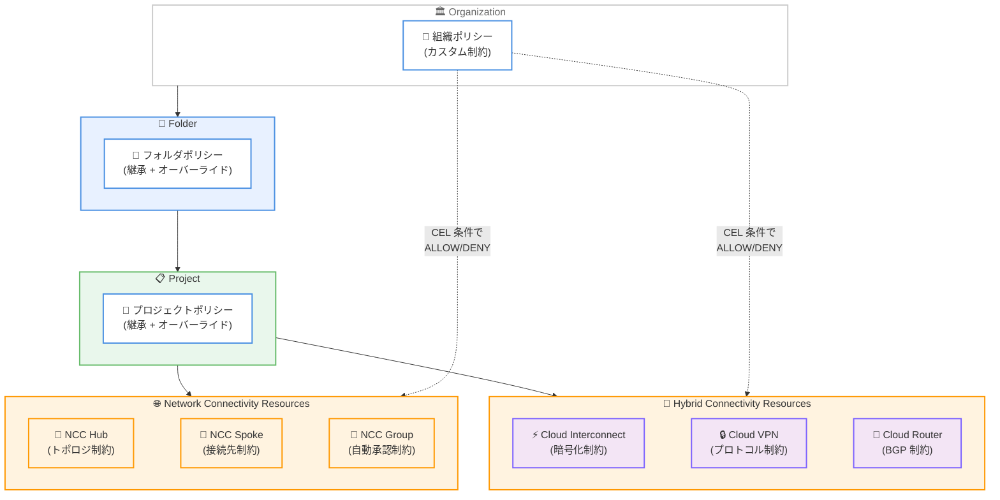

# Resource Manager: Network Connectivity カスタム制約

**リリース日**: 2026-02-09
**サービス**: Resource Manager (Organization Policy Service)
**機能**: Network Connectivity リソースへのカスタム組織ポリシー制約
**ステータス**: Feature

[このアップデートのインフォグラフィックを見る](../../infographic/20260209-resource-manager-network-connectivity-constraints.html)

## 概要

Google Cloud の Organization Policy Service で、Network Connectivity リソースに対するカスタム制約 (Custom Constraints) が利用可能になりました。これにより、組織ポリシー管理者は Network Connectivity Center (NCC) の Hub、Spoke、Group リソースや、Cloud Interconnect、Cloud VPN、Cloud Router のリソースに対して、Common Expression Language (CEL) を使用した独自の制約条件を定義し、組織全体にわたるネットワークガバナンスを強化できます。

カスタム制約は、あらかじめ定義されたマネージド制約 (Predefined Constraints) では対応できないきめ細かな制御を実現する機能です。リソースの特定フィールドに対して CEL 条件を定義し、リソースの作成 (CREATE) や更新 (UPDATE) 時に条件を満たさないリクエストを拒否できます。Organization Policy Service のリソース階層継承により、組織レベル、フォルダレベル、プロジェクトレベルで一貫したポリシー適用が可能です。

このアップデートの主な対象ユーザーは、エンタープライズ環境でマルチプロジェクトのネットワーク接続を管理する組織ポリシー管理者、ネットワーク管理者、セキュリティ管理者です。

**アップデート前の課題**

今回のアップデート以前に存在していた課題は以下の通りです。

- Network Connectivity Center の Hub、Spoke、Group リソースに対して、組織全体で統一的な制約を適用する手段が限られていた
- マネージド制約 (Predefined Constraints) のみでは、NCC Hub のトポロジタイプや Spoke の接続先、Cloud Interconnect の暗号化設定などの細かなフィールドレベルの制御ができなかった
- Cloud Router の BGP ピア ASN や Cloud VPN Gateway のスタックタイプなど、ネットワーク接続に関するセキュリティ・コンプライアンス要件を個々のプロジェクトに委ねる必要があった

**アップデート後の改善**

今回のアップデートにより可能になったことは以下の通りです。

- NCC の Hub、Spoke、Group リソースのフィールドに対して CEL ベースのカスタム制約を定義し、Hub トポロジの制限、Spoke 接続先の制御、Group の自動承認設定の管理が可能になった
- Cloud Interconnect、Cloud VPN、Cloud Router のリソースに対してもカスタム制約が適用でき、暗号化要件、プロトコル制約、BGP 設定の統一管理が実現した
- 組織、フォルダ、プロジェクトの階層に沿ったポリシー継承により、大規模環境での一貫したネットワークガバナンスが適用可能になった

## アーキテクチャ図



Organization Policy Service のリソース階層を通じて、カスタム制約が組織からフォルダ、プロジェクトへと継承され、Network Connectivity Center リソースおよびハイブリッド接続リソースに適用される構成を示しています。

## サービスアップデートの詳細

### 主要機能

1. **Network Connectivity Center (NCC) リソースのカスタム制約**
   - Hub (`networkconnectivity.googleapis.com/Hub`): トポロジ (`presetTopology`)、ポリシーモード (`policyMode`)、PSC エクスポート (`exportPsc`) の制約が可能
   - Spoke (`networkconnectivity.googleapis.com/Spoke`): 接続先の VPC ネットワーク、VPN トンネル、Interconnect Attachment、サイト間データ転送設定の制約が可能
   - Group (`networkconnectivity.googleapis.com/Group`): 自動承認プロジェクト (`autoAccept.autoAcceptProjects`) の制約が可能

2. **Cloud Interconnect リソースのカスタム制約**
   - Interconnect (`compute.googleapis.com/Interconnect`): NOC 連絡先メール、MACsec 設定、リンクタイプ、接続タイプの制約が可能
   - InterconnectAttachment (`compute.googleapis.com/InterconnectAttachment`): 暗号化 (`encryption`)、帯域幅、MTU、スタックタイプの制約が可能

3. **Cloud VPN リソースのカスタム制約**
   - VpnGateway (`compute.googleapis.com/VpnGateway`): スタックタイプ (`stackType`) の制約が可能
   - VpnTunnel (`compute.googleapis.com/VpnTunnel`): IKE バージョン (`ikeVersion`) の制約が可能
   - ExternalVpnGateway (`compute.googleapis.com/ExternalVpnGateway`) および TargetVpnGateway (`compute.googleapis.com/TargetVpnGateway`) もサポート

4. **Cloud Router リソースのカスタム制約**
   - Router (`compute.googleapis.com/Router`): BGP ピア ASN (`bgpPeers.peerAsn`)、NAT 設定、ルートアドバタイズメント、キープアライブ間隔の制約が可能

### カスタム制約とマネージド制約の比較

以下の表は、カスタム制約とマネージド制約の違いをまとめたものです。

| 項目 | マネージド制約 (Predefined) | カスタム制約 (Custom) |
|------|---------------------------|---------------------|
| 定義方法 | Google が事前定義 | 管理者が YAML + CEL で定義 |
| 対象フィールド | 限定的 (事前に決められたもの) | サポートされるリソースの各フィールド |
| 条件式 | なし (Boolean のみ) | CEL による柔軟な条件定義 |
| アクション | ALLOW のみ | ALLOW または DENY |
| 適用メソッド | サービスに依存 | CREATE、UPDATE (サービスに依存) |
| 制約数上限 | なし | リソースタイプあたり最大 20 |

## 技術仕様

### カスタム制約の YAML 形式

カスタム制約は以下の YAML 形式で定義します。

```yaml
name: organizations/ORGANIZATION_ID/customConstraints/CONSTRAINT_NAME
resourceTypes:
- RESOURCE_NAME
methodTypes:
- CREATE
- UPDATE
condition: "CEL_CONDITION"
actionType: ALLOW
displayName: DISPLAY_NAME
description: DESCRIPTION
```

### NCC カスタム制約で使用可能なフィールド

以下の表は、NCC リソースで制約対象にできるフィールドの一覧です。

| リソース | 主要フィールド |
|---------|-------------|
| `networkconnectivity.googleapis.com/Hub` | `resource.description`、`resource.exportPsc`、`resource.policyMode`、`resource.presetTopology` |
| `networkconnectivity.googleapis.com/Spoke` | `resource.description`、`resource.group`、`resource.hub`、`resource.linkedVpcNetwork.*`、`resource.linkedVpnTunnels.*`、`resource.linkedInterconnectAttachments.*`、`resource.linkedRouterApplianceInstances.*`、`resource.linkedProducerVpcNetwork.*` |
| `networkconnectivity.googleapis.com/Group` | `resource.autoAccept.autoAcceptProjects`、`resource.description` |

### 必要な IAM ロール

カスタム制約の管理には以下の IAM ロールが必要です。

| ロール | 説明 |
|--------|------|
| `roles/orgpolicy.policyAdmin` | Organization Policy Administrator。カスタム制約の作成、更新、削除、およびポリシーの設定が可能 |

## 設定方法

### 前提条件

1. Google Cloud 組織が存在し、組織 ID を把握していること
2. `roles/orgpolicy.policyAdmin` IAM ロールが付与されていること
3. Google Cloud CLI がインストールされていること

### 手順

#### ステップ 1: カスタム制約の定義

NCC Hub のトポロジを Mesh のみに制限する例です。

```yaml
# constraint-allow-only-mesh-topology-hubs.yaml
name: organizations/ORGANIZATION_ID/customConstraints/custom.allowOnlyMeshTopologyHubs
resourceTypes:
- networkconnectivity.googleapis.com/Hub
methodTypes:
- CREATE
condition: "resource.presetTopology == MESH"
actionType: ALLOW
displayName: Only allow the creation of mesh topology hubs.
description: New hubs that are created can only be mesh topology hubs.
```

#### ステップ 2: カスタム制約の登録

```bash
gcloud org-policies set-custom-constraint constraint-allow-only-mesh-topology-hubs.yaml
```

#### ステップ 3: 組織ポリシーの作成と適用

```yaml
# policy-allow-only-mesh-topology-hubs.yaml
name: projects/PROJECT_ID/policies/custom.allowOnlyMeshTopologyHubs
spec:
  rules:
  - enforce: true
```

```bash
# ドライランモードでテスト
gcloud org-policies set-policy policy-allow-only-mesh-topology-hubs.yaml \
  --update-mask=dryRunSpec

# 本番適用
gcloud org-policies set-policy policy-allow-only-mesh-topology-hubs.yaml \
  --update-mask=spec
```

#### ステップ 4: 動作確認

```bash
# Star トポロジの Hub 作成を試行 (拒否されることを確認)
gcloud network-connectivity hubs create test-hub \
    --policy-mode="PRESET" \
    --preset-topology="STAR" \
    --description="A new hub with star topology"

# 期待される出力:
# Operation denied by custom org policies:
# ["customConstraints/custom.allowOnlyMeshTopologyHubs":
#  "Only allow the creation of mesh topology hubs"]
```

## メリット

### ビジネス面

- **コンプライアンスの自動化**: ネットワーク接続に関するセキュリティ・コンプライアンス要件を組織ポリシーとして定義し、違反する操作を自動的にブロックできる
- **ガバナンスの一元管理**: 組織階層を通じたポリシー継承により、数百のプロジェクトにわたるネットワーク接続ポリシーを一元的に管理可能

### 技術面

- **きめ細かな制御**: CEL を使用して、リソースの特定フィールドに対する柔軟な条件を定義できる (例: BGP ピア ASN の制限、暗号化の必須化)
- **ドライランモード**: 本番適用前にポリシーの影響をテストし、既存リソースへの影響を事前に把握できる
- **Policy Simulator 連携**: ポリシー変更のシミュレーションにより、違反するリソースを事前に特定できる

## デメリット・制約事項

### 制限事項

- リソースタイプあたりのカスタム制約数は最大 20 個
- 新たに適用された制約は既存のリソースには自動的に適用されない (新規作成・更新時のみ適用)
- Cloud Router の `resource.bgpPeers` および `resource.interfaces` の一部サブフィールドはまだサポートされていない
- ポリシー適用後、反映に最大 15 分かかる場合がある

### 考慮すべき点

- 既存リソースへの制約適用が必要な場合は、まずドライランモードで違反リソースを特定し、リソースの更新を通じて制約に準拠させる必要がある
- カスタム制約を削除しても、その制約を参照するポリシーは残存するが無視される。同名のカスタム制約を再作成することはできない

## ユースケース

### ユースケース 1: NCC Hub トポロジの標準化

**シナリオ**: エンタープライズ組織で、すべての NCC Hub を Mesh トポロジで統一し、Star トポロジの Hub 作成を禁止したい。

**実装例**:

```yaml
name: organizations/123456789/customConstraints/custom.allowOnlyMeshTopologyHubs
resourceTypes:
- networkconnectivity.googleapis.com/Hub
methodTypes:
- CREATE
condition: "resource.presetTopology == MESH"
actionType: ALLOW
displayName: Mesh トポロジのみ許可
description: すべての NCC Hub は Mesh トポロジで作成する必要があります。
```

**効果**: 組織全体で一貫したネットワークトポロジを維持し、意図しない Star トポロジの Hub 作成を防止できる。

### ユースケース 2: Cloud Interconnect 暗号化の必須化

**シナリオ**: セキュリティ要件として、すべての Interconnect Attachment に IPsec 暗号化を必須にしたい。

**実装例**:

```yaml
name: organizations/123456789/customConstraints/custom.requireEncryption
resourceTypes:
- compute.googleapis.com/InterconnectAttachment
methodTypes:
- CREATE
- UPDATE
condition: "has(resource.encryption) && resource.encryption == 'IPSEC'"
actionType: ALLOW
displayName: Interconnect Attachment の暗号化を必須化
description: すべての Interconnect Attachment は IPSEC 暗号化を使用する必要があります。
```

**効果**: 暗号化されていない Interconnect Attachment の作成・更新を防止し、通信の機密性を保証できる。

### ユースケース 3: Cloud VPN の IKEv2 プロトコル強制

**シナリオ**: すべての VPN トンネルで IKEv2 プロトコルを使用することをセキュリティ要件として強制したい。

**実装例**:

```yaml
name: organizations/123456789/customConstraints/custom.requireIkev2
resourceTypes:
- compute.googleapis.com/VpnTunnel
methodTypes:
- CREATE
condition: "resource.ikeVersion == 2"
actionType: ALLOW
displayName: IKEv2 プロトコルの強制
description: すべての VPN トンネルは IKEv2 プロトコルを使用する必要があります。
```

**効果**: セキュリティ上の脆弱性がある IKEv1 の使用を防止し、すべての VPN 接続で IKEv2 の使用を保証できる。

## 料金

Organization Policy Service (カスタム制約を含む) は無料で提供されています。カスタム制約の作成、管理、適用に追加料金は発生しません。

詳細については [Organization Policy Service のドキュメント](https://cloud.google.com/resource-manager/docs/organization-policy/overview) を参照してください。

## 関連サービス・機能

- **[VPC カスタム組織ポリシー](https://cloud.google.com/vpc/docs/custom-constraints)**: VPC の Network、Subnetwork、Route、Address、InternalRange などのリソースに対するカスタム制約。2026-02-10 のアップデートで InternalRange リソースへの対応が追加された
- **[Organization Policy Service](https://cloud.google.com/resource-manager/docs/organization-policy/overview)**: 組織全体のリソース制御を一元管理するサービス。マネージド制約とカスタム制約の両方を提供
- **[Policy Simulator](https://cloud.google.com/policy-intelligence/docs/test-organization-policies)**: 組織ポリシーの変更が環境に与える影響をシミュレーションするツール
- **[Network Connectivity Center](https://cloud.google.com/network-connectivity/docs/network-connectivity-center/concepts/overview)**: Hub と Spoke モデルでネットワーク接続を管理するオーケストレーションフレームワーク

## 参考リンク

- [このアップデートのインフォグラフィック](../../infographic/20260209-resource-manager-network-connectivity-constraints.html)
- [公式リリースノート](https://cloud.google.com/release-notes#February_09_2026)
- [NCC カスタム組織ポリシーのドキュメント](https://cloud.google.com/network-connectivity/docs/network-connectivity-center/how-to/org-policy-constraints)
- [Cloud Interconnect カスタム制約のドキュメント](https://cloud.google.com/network-connectivity/docs/interconnect/how-to/custom-constraints)
- [Cloud VPN カスタム制約のドキュメント](https://cloud.google.com/network-connectivity/docs/vpn/how-to/custom-constraints)
- [Cloud Router カスタム制約のドキュメント](https://cloud.google.com/network-connectivity/docs/router/how-to/custom-constraints)
- [VPC カスタム組織ポリシーのドキュメント](https://cloud.google.com/vpc/docs/custom-constraints)
- [カスタム制約の作成と管理](https://cloud.google.com/resource-manager/docs/organization-policy/creating-managing-custom-constraints)

## まとめ

Organization Policy Service の Network Connectivity リソース向けカスタム制約の追加により、NCC Hub/Spoke/Group、Cloud Interconnect、Cloud VPN、Cloud Router のリソースに対してきめ細かなガバナンスを組織全体で適用できるようになりました。エンタープライズ環境でネットワーク接続のコンプライアンスやセキュリティ要件を管理している組織は、マネージド制約では対応できなかった細かなフィールドレベルの制御を実現するために、カスタム制約の導入を検討することを推奨します。まずはドライランモードで既存環境への影響を確認してから本番適用するのがベストプラクティスです。

---

**タグ**: networking, governance, organization-policy, network-connectivity-center, cloud-interconnect, cloud-vpn, cloud-router, custom-constraints, compliance
