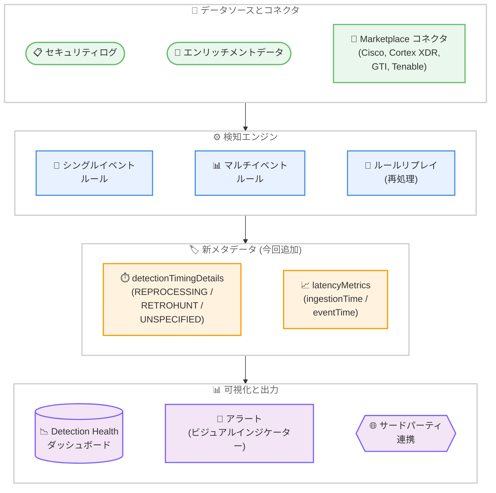

# Google SecOps: ルール可観測性強化と Marketplace コネクタアップデート

**リリース日**: 2026-02-09 / 2026-02-11
**サービス**: Google SecOps / Google SecOps Marketplace
**機能**: ルール可観測性の強化 (メタデータ、ビジュアルインジケーター、ダッシュボード) および Marketplace コネクタ v15.0-v22.0
**ステータス**: Feature / Change

[このアップデートのインフォグラフィックを見る](https://takech9203.github.io/google-cloud-news-summary/20260209-secops-rule-observability-marketplace.html)

## 概要

Google Security Operations (SecOps) は、検知ルールの可観測性を大幅に強化するアップデートを発表した。このアップデートにより、検知およびアラートデータの処理方法と可視化方法が改善され、SOC チームがプライマリルール実行とルールリプレイを明確に区別できるようになった。これにより、検知遅延の原因や遅延到着したエンリッチメントデータの影響を正確に把握できる。

加えて、2026 年 2 月 11 日には Google SecOps Marketplace で 4 つのコネクタアップデートがリリースされた。CiscoUmbrella v15.0、Palo Alto Cortex XDR v22.0、Google Threat Intelligence v9.0、Tenable.io v13.0 がそれぞれ更新され、新しいアクションの追加やイベント処理の最適化が行われている。

これらのアップデートは、セキュリティアナリストや SOC チームを主な対象としており、検知精度の向上、トラブルシューティングの効率化、サードパーティインテグレーションの強化を実現する。

**アップデート前の課題**

ルール可観測性の強化以前には、以下の課題が存在していた。

- プライマリルール実行とルールリプレイ (再処理) による検知を区別する手段がなく、検知遅延の原因特定が困難だった
- 遅延到着したエンリッチメントデータがアクティブなルールに与える影響を定量的に把握できなかった
- ルールパフォーマンスやリプレイステータスを一元的に監視するダッシュボードが存在しなかった
- MTTD (Mean Time To Detect) メトリクスが、ルールリプレイによる検知遅延と実際の検知能力不足を区別できず、正確な評価が困難だった

**アップデート後の改善**

今回のアップデートにより、以下の改善が実現された。

- 検知およびアラートオブジェクトに新しいメタデータ (`detectionTimingDetails`、`latencyMetrics`) が追加され、実行タイプの識別が可能になった
- 新しい Detection Health ダッシュボードにより、ルールパフォーマンスとリプレイステータスの視覚的なモニタリングが可能になった
- Alerts ページに検知タイミング詳細のフィルターファセットが追加され、効率的なトリアージが可能になった
- Marketplace コネクタの更新により、Cisco Umbrella、Cortex XDR、Google Threat Intelligence、Tenable.io との連携機能が向上した

## アーキテクチャ図

この図は、Google SecOps のルール可観測性強化の全体アーキテクチャを示している。セキュリティログとエンリッチメントデータが検知エンジンで処理され、今回追加された新しいメタデータ (detectionTimingDetails、latencyMetrics) を経由して、Detection Health ダッシュボードやアラート画面、サードパーティシステムに出力される流れを表現している。

## サービスアップデートの詳細

### Part 1: ルール可観測性の強化 (2026 年 2 月 9 日)

1. **メタデータの強化**
   - 検知およびアラートオブジェクトに、プライマリルール実行、ルールリプレイ、レトロハントのいずれで生成されたかを識別するメタデータが追加された
   - `detectionTimingDetails` フィールドにより、検知の生成元となった実行タイプを enum で識別可能
   - `latencyMetrics` フィールドにより、`oldestIngestionTime`、`newestIngestionTime`、`oldestEventTime`、`newestEventTime` の各タイムスタンプを取得可能

2. **Detection Health ダッシュボード**
   - ルールパフォーマンスとリプレイステータスを視覚的に表現する新しいダッシュボードが追加された
   - Detections スキーマに新しいフィールドが追加され、カスタムダッシュボードの構築にも対応

3. **ビジュアルインジケーターとフィルター**
   - Detection Type カラムに新しいビジュアルインジケーターが追加され、ホバーで詳細情報を確認可能
   - Alerts リストページに検知タイミング詳細のフィルターファセットが追加
   - SOAR の Case Overview でも、Composite Detections テーブルに同じアイコノグラフィが適用され、一貫した調査体験を提供

4. **トラブルシューティングの改善**
   - 検知遅延の原因がルールリプレイによるものか、実際の検知能力不足によるものかを特定可能
   - 遅延到着したエンリッチメントデータがアクティブなルールに与える具体的な影響を定量化可能

### Part 2: Marketplace コネクタアップデート (2026 年 2 月 11 日)

以下の 4 つのコネクタがアップデートされた。

| コネクタ | バージョン | タイプ | 主な変更内容 |
|---------|-----------|--------|-------------|
| CiscoUmbrella | v15.0 | Feature | 新アクション追加: 「Is Domain In Cisco Popularity List」「List Top Domains」 |
| Palo Alto Cortex XDR | v22.0 | Change | Palo Alto Cortex XDR Connector のイベント処理とダイナミックリスト処理を更新。特定のアーティファクトタイプを無視する機能を追加 |
| Google Threat Intelligence | v9.0 | Change | Submit File アクションにハッシュのデータ鮮度閾値を定義する機能を追加。DTM Alerts Connector にモニター名でフィルターする機能を追加。接続テスト方法を更新し API クォータ消費を回避 |
| Tenable.io | v13.0 | Change | TenableIO - Vulnerabilities Connector のアセット処理を最適化。Enrich Entities、List Endpoint Vulnerabilities、Scan Endpoints のエンティティ処理ロジックを更新 |

## 技術仕様

### 新しいメタデータフィールド

今回のアップデートで追加された主要なメタデータフィールドは以下の通りである。

| フィールド | 型 | 説明 |
|-----------|------|------|
| `detectionTimingDetails` | enum | 検知の実行タイプを識別する。`DETECTION_TIMING_DETAILS_REPROCESSING` (ルールリプレイ)、`DETECTION_TIMING_DETAILS_RETROHUNT` (レトロハント)、`DETECTION_TIMING_DETAILS_UNSPECIFIED` (プライマリ実行) |
| `latencyMetrics.oldestIngestionTime` | timestamp | 検知対象イベントの最も古い取り込み時刻 |
| `latencyMetrics.newestIngestionTime` | timestamp | 検知対象イベントの最も新しい取り込み時刻 |
| `latencyMetrics.oldestEventTime` | timestamp | 検知対象イベントの最も古いイベント時刻 |
| `latencyMetrics.newestEventTime` | timestamp | 検知対象イベントの最も新しいイベント時刻 |

### ルールリプレイの仕組み

Google SecOps のルールリプレイは、ルールタイプに応じて以下のように動作する。

| 項目 | シングルイベントルール | マルチイベントルール |
|------|----------------------|---------------------|
| 実行トリガー | UDM エンリッチメント更新時 | スケジュール実行 |
| リプレイタイミング | イベント更新直後 | 5-8 時間後、24-48 時間後 |
| 検知レイテンシ | 通常 5 分未満 | スケジュール頻度に依存 |
| 適用例 | 単一ログエントリの評価 | 複数イベントの相関分析、UEBA |

### detection.ruleType フィールド

検知 API において、`detection.ruleType` フィールドはルールのタイプを以下の値で示す。

- `SINGLE_EVENT`: シングルイベントルール (match セクションなし、または 1 イベントの存在確認のみ)
- `MULTI_EVENT`: マルチイベントルール (match セクションあり、複数イベントの相関を評価)

## メリット

### ビジネス面

- **MTTD メトリクスの正確化**: ルールリプレイによる検知遅延と実際の検知能力不足を区別できるため、SOC のパフォーマンス評価がより正確になる
- **インシデント対応の効率化**: 検知タイミングの透明性向上により、アナリストがアラートの優先順位付けを迅速に行える

### 技術面

- **サードパーティ連携の強化**: `detectionTimingDetails` と `latencyMetrics` フィールドにより、外部 SIEM やチケットシステムとの連携時に検知コンテキストを正確に伝達可能
- **カスタムダッシュボード構築**: Detections スキーマの新フィールドを活用して、組織固有のモニタリング要件に対応したダッシュボードを構築可能
- **Marketplace コネクタの機能拡張**: CiscoUmbrella のドメイン人気度チェック、Cortex XDR のアーティファクトフィルタリング、GTI のデータ鮮度管理など、実用的な機能が追加された

## デメリット・制約事項

### 制限事項

- マルチイベントルールのリプレイは 5-8 時間後および 24-48 時間後に実行されるため、この間の検知遅延は避けられない (公式ドキュメント記載の既知の制限事項)
- エンリッチメントの再処理は最大 24 時間にわたって UDM イベントを更新する可能性がある
- マルチイベントルールのイベントサンプルは、ルールで定義されたイベント変数ごとに最大 10 個に制限される

### 考慮すべき点

- 既存のサードパーティ連携で検知データを消費しているシステムは、新しいメタデータフィールドに対応するための更新が必要になる可能性がある
- Marketplace コネクタのバージョンアップ後は、既存の Playbook やコネクタ設定の動作確認を推奨する

## ユースケース

### ユースケース 1: ルールリプレイ起因の検知遅延の識別

**シナリオ**: SOC チームが MTTD メトリクスの悪化を検出した際に、その原因がルールリプレイ (遅延到着データの再処理) によるものか、実際の検知ルールの問題によるものかを特定する必要がある。

**効果**: `detectionTimingDetails` フィールドで `DETECTION_TIMING_DETAILS_REPROCESSING` をフィルタリングすることで、ルールリプレイによる検知を除外した正味の MTTD を算出できる。Detection Health ダッシュボードを活用して、リプレイ頻度の高いルールを特定し、エンリッチメント依存度の最適化を検討できる。

### ユースケース 2: Marketplace コネクタを活用した統合脅威インテリジェンス

**シナリオ**: セキュリティチームが複数のセキュリティ製品 (Cisco Umbrella、Palo Alto Cortex XDR、Google Threat Intelligence、Tenable.io) を運用しており、Google SecOps をハブとして統合管理している。

**効果**: CiscoUmbrella v15.0 の新アクション「Is Domain In Cisco Popularity List」により、検知されたドメインの正当性を自動判定できる。Cortex XDR v22.0 の Artifacts To Ignore 機能により、不要なアーティファクトを除外してノイズを削減できる。GTI v9.0 のモニター名フィルター機能により、特定の DTM モニターに関連するアラートのみを効率的に取得できる。

## 関連サービス・機能

- **Google SecOps SIEM**: 検知エンジンの基盤であり、YARA-L 2.0 ルールの実行環境を提供
- **Google SecOps SOAR**: Case Overview での Composite Detections 表示が今回のアップデートで強化された
- **UDM (Unified Data Model)**: イベントデータの正規化とエンリッチメントの基盤
- **Entity Context Graph (ECG)**: エンリッチメントデータの提供元であり、ルールリプレイのトリガーとなる遅延データの主要なソース
- **Cloud Monitoring / Cloud Logging**: SecOps の運用メトリクスやログの外部連携先

## 参考リンク

- [このアップデートのインフォグラフィック](https://takech9203.github.io/google-cloud-news-summary/20260209-secops-rule-observability-marketplace.html)
- [公式リリースノート (Google SecOps)](https://cloud.google.com/chronicle/docs/release-notes#February_09_2026)
- [公式リリースノート (Google SecOps Marketplace)](https://cloud.google.com/chronicle/docs/soar/marketplace-integrations/release-notes)
- [Understand rule replays and MTTD](https://cloud.google.com/chronicle/docs/detection/rule-replays)
- [Understand rule detection delays](https://cloud.google.com/chronicle/docs/detection/detection-delays)
- [Rules Dashboard](https://cloud.google.com/chronicle/docs/detection/view-all-rules)
- [Detection Engine API - detection.ruleType](https://cloud.google.com/chronicle/docs/reference/detection-engine-api)
- [YARA-L 2.0 ルール例 (シングルイベント / マルチイベント)](https://cloud.google.com/chronicle/docs/yara-l/yara-l-2-0-examples)
- [Composite Detections 概要](https://cloud.google.com/chronicle/docs/detection/composite-detections)
- [Palo Alto Cortex XDR 連携](https://cloud.google.com/chronicle/docs/soar/marketplace-integrations/palo-alto-cortex-xdr)
- [Google Threat Intelligence 連携](https://cloud.google.com/chronicle/docs/soar/marketplace-integrations/google-threat-intelligence)
- [Detections スキーマ (カスタムダッシュボード用)](https://cloud.google.com/chronicle/docs/reference/sample-yaral-for-native-dashboard#detections)

## まとめ

今回のアップデートは、Google SecOps の検知パイプラインにおける透明性と可観測性を大幅に向上させるものである。特に `detectionTimingDetails` と `latencyMetrics` メタデータの追加により、SOC チームはルールリプレイによる「見かけ上の遅延」と実際の検知性能の問題を明確に区別できるようになった。Marketplace コネクタの 4 件のアップデートも、サードパーティ製品との連携を実務レベルで強化する内容であり、Google SecOps を中心としたセキュリティオペレーションの最適化に貢献する。SOC チームには、Detection Health ダッシュボードの活用と Marketplace コネクタの更新適用を推奨する。

---

**タグ**: #google-secops #security #siem #detection-rules #rule-observability #marketplace #soar #mttd
