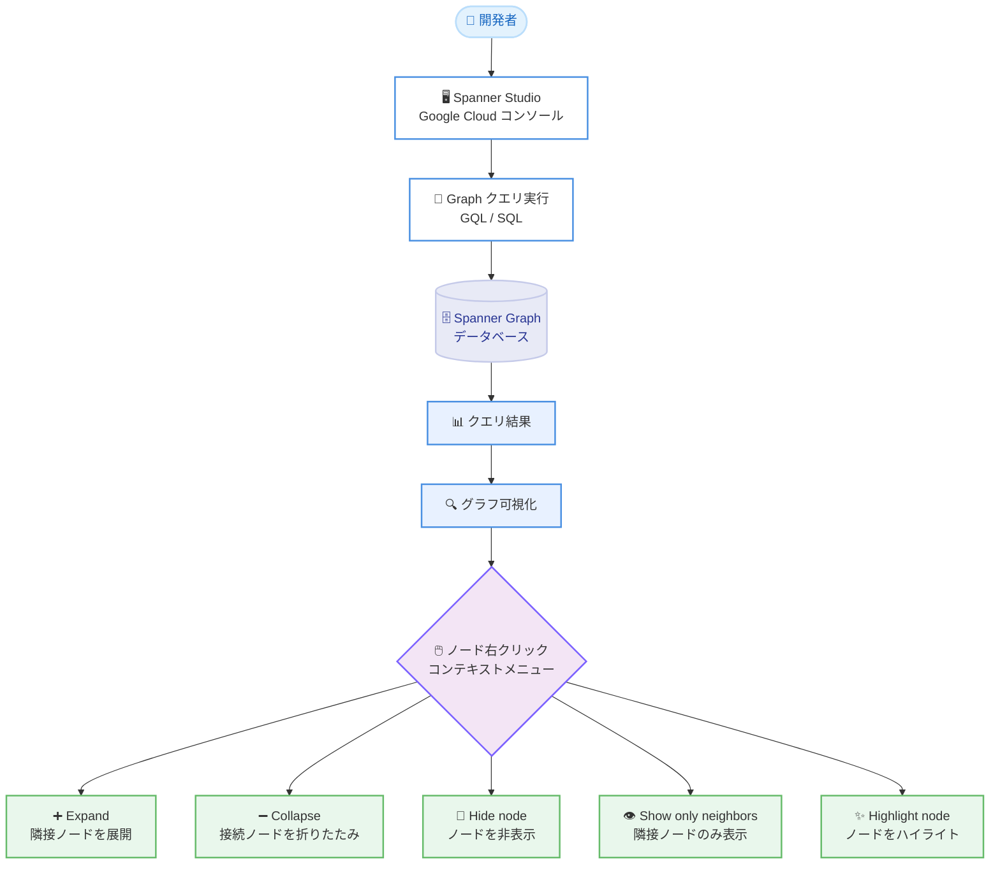

# Spanner: Graph クエリ可視化の操作性向上

**リリース日**: 2026-02-09
**サービス**: Spanner
**機能**: Graph クエリ可視化の右クリックコンテキストメニュー
**ステータス**: Feature (機能改善)

[このアップデートのインフォグラフィックを見る](https://takech9203.github.io/google-cloud-news-summary/20260209-spanner-graph-query-visualization.html)

## 概要

Spanner Graph のクエリ可視化機能に、ノードの右クリックによるコンテキストメニューが追加された。このアップデートにより、可視化されたグラフ上でノードを右クリックすることで、隣接ノードの展開・折りたたみ、ノードのハイライト・非表示、特定ノードの隣接ノードのみ表示といった操作が可能になった。

Spanner Graph は、Spanner のスケーラビリティ、可用性、一貫性を維持しながら、プロパティグラフデータベース機能を提供するサービスである。ISO Graph Query Language (GQL) 互換のクエリインターフェースを備え、リレーショナルモデルとグラフモデルの相互運用を実現している。今回のアップデートは、Google Cloud コンソールの Spanner Studio における可視化体験を大幅に改善するものであり、複雑なグラフデータの探索と分析を行う開発者やデータアナリストにとって有用な機能強化である。

**アップデート前の課題**

今回の機能追加以前は、Spanner Graph のクエリ可視化において以下の課題があった。

- 可視化されたグラフ上での操作はノードやエッジのクリックによるプロパティ確認に限られていた
- 大規模なグラフの一部分を重点的に調査したい場合、クエリ自体を書き換える必要があった
- 特定のノードの関連ノードだけに注目するためのインタラクティブな操作手段がなかった

**アップデート後の改善**

今回のアップデートにより、以下の操作がコンテキストメニューから直接可能になった。

- ノードを右クリックするだけで Expand、Collapse、Hide、Show only neighbors、Highlight の各操作にアクセスできるようになった
- クエリを書き換えることなく、可視化上でインタラクティブにグラフの表示範囲を制御できるようになった
- 大規模なグラフデータの中から注目すべきノードとその関連を効率的に特定できるようになった

## アーキテクチャ図



Spanner Studio でグラフクエリを実行し、可視化結果上のノードを右クリックすることで、コンテキストメニューから 5 つの操作にアクセスできるワークフローを示している。

## サービスアップデートの詳細

### 主要機能

1. **Expand (隣接ノードの展開)**
   - 選択したノードの隣接ノードを可視化に追加する
   - すべての受信エッジ (incoming edges)、送信エッジ (outgoing edges) を辿って隣接ノードをレンダリングする
   - 特定のエッジタイプでフィルタリングして展開することも可能

2. **Collapse (接続ノードの折りたたみ)**
   - 選択したノードに接続されているノードを可視化から除去する
   - 受信エッジ、送信エッジ、または特定のエッジタイプを指定して折りたたむことが可能
   - 大規模なグラフを段階的に簡略化する際に有用

3. **Hide node (ノードの非表示)**
   - 選択したノードを現在の可視化ビューから削除する
   - 分析対象外のノードを一時的に除外し、注目すべきノードに集中できる

4. **Show only neighbors (隣接ノードのみ表示)**
   - 選択したノードとそのノードに直接接続されたノード以外を非表示にする
   - 特定のノードの関係性を集中的に分析する際に有用

5. **Highlight node (ノードのハイライト)**
   - 選択したノードを視覚的に強調表示する
   - 大規模なグラフ内で注目すべきノードを明確に識別できる

## 技術仕様

### クエリ可視化の要件

Spanner Graph のクエリ結果を可視化するには、以下の要件を満たす必要がある。

| 項目 | 詳細 |
|------|------|
| クエリ形式 | グラフ要素を JSON 形式で返す必要がある |
| 使用する関数 | `SAFE_TO_JSON` または `TO_JSON` |
| 推奨する返却形式 | 個別のノード・エッジではなくグラフパスを返却 |
| データサイズ制限 | 可視化は最大 10 MB のデータに対応 |
| 対応レイアウト | Force layout (デフォルト)、Hierarchical、Sequential |
| カスタマイズ | ノードの色、表示プロパティの変更が可能 |

### 可視化クエリの例

以下は可視化に対応したクエリの例である。

```sql
GRAPH FinGraph
MATCH result_paths = (account:Account {is_blocked: True})-[:Transfers]->(dest_account:Account)
RETURN SAFE_TO_JSON(result_paths) AS result_paths
```

パスを返却する形式を使用することで、以下のメリットがある。

- パスにはノードとエッジの完全なデータが含まれる
- 複雑なクエリの中間ノードやエッジが欠落しない
- `RETURN` 文がシンプルになる

### 既存の可視化オプションとの組み合わせ

今回追加された右クリックメニューは、既存の可視化オプションと組み合わせて使用できる。

| 既存機能 | 説明 |
|---------|------|
| レイアウト選択 | Force layout、Hierarchical、Sequential から選択可能 |
| ノードの表示プロパティ変更 | スキーマビューからノードタイプごとに表示するプロパティを変更 |
| ノードの色変更 | スキーマビューからノードタイプごとに色をカスタマイズ |
| スキーマビュー切り替え | クエリ結果の可視化とスキーマ可視化を切り替え |
| ラベル表示 | すべてのズームレベルでノード・エッジのラベルを表示 |

## 設定方法

### 前提条件

1. Spanner Enterprise エディションまたは Enterprise Plus エディションのインスタンスが必要 (Spanner Graph は Standard エディションでは利用不可)
2. Google Cloud コンソールへのアクセス権限
3. Spanner Graph スキーマが定義されたデータベース

### 手順

#### ステップ 1: Spanner Studio でクエリを実行

Google Cloud コンソールで Spanner Studio を開き、グラフ要素を JSON 形式で返すクエリを実行する。

```sql
GRAPH FinGraph
MATCH result_paths = (person:Person)-[:Owns]->(account:Account)
RETURN SAFE_TO_JSON(result_paths) AS result_paths
```

#### ステップ 2: 可視化結果でコンテキストメニューを使用

クエリ結果の可視化が表示されたら、任意のノードを右クリックしてコンテキストメニューから操作を選択する。

- **Expand**: 隣接ノードを展開 (受信エッジ、送信エッジ、特定エッジタイプを選択可能)
- **Collapse**: 接続ノードを折りたたみ
- **Hide node**: ノードを非表示
- **Show only neighbors**: 隣接ノードのみ表示
- **Highlight node**: ノードをハイライト

## メリット

### ビジネス面

- **データ分析の効率化**: クエリを書き換えることなく、可視化上で直接グラフの探索範囲を操作できるため、分析作業の効率が向上する
- **不正検知ワークフローの改善**: 金融詐欺検知などのユースケースで、疑わしいノードの隣接関係をインタラクティブに調査できる

### 技術面

- **開発者体験の向上**: 右クリックメニューによる直感的な操作で、グラフの探索が容易になる
- **大規模グラフの段階的探索**: Expand と Collapse を組み合わせることで、大規模なグラフデータを段階的に探索できる
- **既存機能との統合**: レイアウト選択やノード色変更など、既存の可視化オプションと組み合わせて使用できる

## デメリット・制約事項

### 制限事項

- 可視化は最大 10 MB のデータまでサポートしている。これを超えるクエリ結果は部分的にしか表示されない
- 可視化のカスタマイズ (レイアウト、色、表示プロパティ) は現在のセッション中のみ有効であり、同じクエリを再実行すると設定は保持されない
- クエリがグラフ要素を JSON 形式で返さない場合、テーブル形式でのみ表示される

### 考慮すべき点

- Spanner Graph は Enterprise エディションおよび Enterprise Plus エディションでのみ利用可能であり、Standard エディションでは使用できない
- 可視化は Google Cloud コンソールの Spanner Studio 上で利用する機能であり、API やクライアントライブラリからは直接利用できない

## ユースケース

### ユースケース 1: 金融詐欺ネットワークの調査

**シナリオ**: セキュリティアナリストが、ブロックされたアカウントの送金関係を調査する場面。可視化されたグラフ上で疑わしいアカウントノードを右クリックし、Expand で送金先を展開していくことで、不正送金のネットワーク全体を段階的に特定できる。

**実装例**:

```sql
GRAPH FinGraph
MATCH result_paths = (account:Account {is_blocked: True})-[:Transfers]->(dest_account:Account)
RETURN SAFE_TO_JSON(result_paths) AS result_paths
```

**効果**: クエリを繰り返し書き換えることなく、疑わしいノードから隣接ノードを展開し、Show only neighbors で関連ノードに集中し、Highlight で重要ノードをマークすることで、調査の効率と精度が向上する。

### ユースケース 2: ソーシャルネットワーク分析

**シナリオ**: データアナリストが、ユーザー間の関係性を分析する場面。大規模なソーシャルグラフの中から特定のユーザーに注目し、Show only neighbors でそのユーザーの直接的なつながりだけを表示することで、コミュニティ構造の分析が容易になる。

**効果**: Collapse で不要な枝を折りたたみ、Highlight で注目するユーザーをマークすることで、関係性の分析が効率化される。

## 料金

Spanner Graph のクエリ可視化は Spanner Studio (Google Cloud コンソール) の機能として提供されており、可視化機能自体に追加料金は発生しない。ただし、Spanner Graph は Enterprise エディションまたは Enterprise Plus エディションで利用可能であり、Spanner のコンピュート容量とストレージ使用量に基づく標準的な Spanner 料金が適用される。

料金の詳細は [Spanner 料金ページ](https://cloud.google.com/spanner/pricing) を参照。

## 関連サービス・機能

- **Spanner Studio**: Google Cloud コンソール上でグラフクエリの実行と可視化を提供するインターフェース
- **Spanner Graph Notebook**: Colaboratory や Jupyter Notebooks で動作するオープンソースの可視化パッケージ。Spanner Studio と同様のユーザー体験を提供する
- **サードパーティ可視化ツール**: G.V()、Graphistry、Kineviz GraphXR、Linkurious Enterprise、Cambridge Intelligence など、Spanner Graph と統合された外部可視化ツールが利用可能
- **Vertex AI / LangChain 統合**: Spanner Graph と Vertex AI の連携による GraphRAG アプリケーションの構築

## 参考リンク

- [このアップデートのインフォグラフィック](https://takech9203.github.io/google-cloud-news-summary/20260209-spanner-graph-query-visualization.html)
- [公式リリースノート](https://cloud.google.com/release-notes#February_09_2026)
- [Work with Spanner Graph visualizations](https://cloud.google.com/spanner/docs/graph/work-with-visualizations)
- [Spanner Graph overview](https://cloud.google.com/spanner/docs/graph/overview)
- [Spanner Graph queries overview](https://cloud.google.com/spanner/docs/graph/queries-overview)
- [Spanner Graph visualization integrations](https://cloud.google.com/spanner/docs/graph/visualization-integrations)
- [Spanner 料金ページ](https://cloud.google.com/spanner/pricing)
- [Spanner エディション概要](https://cloud.google.com/spanner/docs/editions-overview)

## まとめ

今回のアップデートにより、Spanner Graph のクエリ可視化にコンテキストメニューが追加され、ノードの展開・折りたたみ・非表示・ハイライト・隣接ノードのみ表示といったインタラクティブな操作が可能になった。この機能強化は、グラフデータの探索と分析において開発者の生産性を向上させるものであり、特に大規模なグラフの段階的な調査や不正検知などのユースケースで効果を発揮する。Spanner Graph を利用中のユーザーは、Spanner Studio で早速この新機能を活用することを推奨する。

---

**タグ**: #Spanner #SpannerGraph #グラフデータベース #可視化 #GoogleCloud #データベース #GQL
