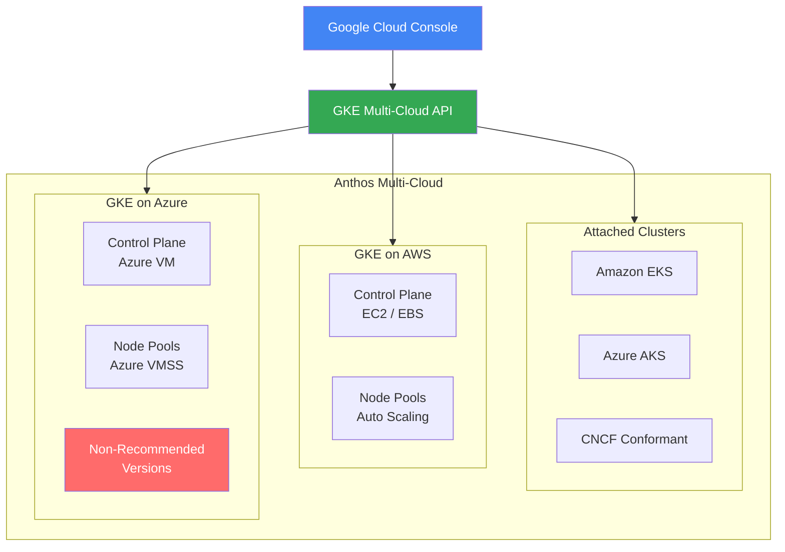

# Anthos Multi-Cloud: Kubernetes バージョンアップデート (Attached Clusters / AWS / Azure)

**リリース日**: 2026-02-10
**サービス**: Anthos Multi-Cloud (Attached Clusters, GKE on AWS, GKE on Azure)
**機能**: 新規 Kubernetes バージョンの提供および Azure 環境の非推奨バージョン通知
**ステータス**: Announcement / Issue

[このアップデートのインフォグラフィックを見る](https://takech9203.github.io/google-cloud-news-summary/20260210-anthos-multi-cloud-kubernetes-versions.html)

## 概要

2026 年 2 月 10 日、Google Cloud は Anthos Multi-Cloud の 3 つのクラスタタイプ (Attached Clusters、GKE on AWS、GKE on Azure) に対して、新しい Kubernetes バージョンを同時にリリースした。今回のアップデートでは、Kubernetes 1.34 系の新バージョンが各環境で利用可能となり、1.33 系および 1.32 系のパッチバージョンも更新されている。

特に重要な点として、GKE on Azure において一部のバージョン (1.33.4-gke.900、1.32.8-gke.600、1.32.4-gke.200) が**非推奨**と宣言されており、これらのバージョンを使用中のユーザーには 1.34 または最新パッチバージョンへのアップグレードが強く推奨されている。マルチクラウド環境で Kubernetes クラスタを運用するすべてのユーザーが対象であり、セキュリティパッチの適用とバージョンの統一管理の観点から迅速な対応が求められる。

今回リリースされた各バージョンには、複数の CVE (Common Vulnerabilities and Exposures) に対するセキュリティ修正が含まれている。特に Attached Clusters の 1.34.0-gke.1 では、anthos.googleapis.com サービスの有効化検証が不要になる破壊的変更や、Connect Agent がデフォルトで svc.id.goog ワークロード ID プールを使用するようになる機能変更が含まれている。

**アップデート前の課題**

- 以前のバージョンでは複数のセキュリティ脆弱性 (CVE-2025-12817、CVE-2025-12818、CVE-2025-9230、CVE-2025-9232 など) が修正されていなかった
- Attached Clusters では anthos.googleapis.com サービスの有効化検証が必要であり、GKE Standard ティアに含まれるようになった後も不要な検証が残っていた
- GKE on Azure の一部バージョン (1.33.4-gke.900、1.32.8-gke.600、1.32.4-gke.200) に既知の問題が存在していた

**アップデート後の改善**

- 各環境で Kubernetes 1.34 系が利用可能となり、最新のセキュリティパッチが適用された
- Attached Clusters が GKE Standard ティアに正式に含まれ、anthos.googleapis.com の検証が不要になった
- Connect Agent がデフォルトで svc.id.goog ワークロード ID プールを使用するようになり、追加の設定が不要になった
- GKE on Azure の非推奨バージョンが明確化され、安全なバージョンへの移行パスが提供された

## アーキテクチャ図



Anthos Multi-Cloud は、Google Cloud Console および GKE Multi-Cloud API を通じて、AWS、Azure、およびサードパーティの CNCF 準拠クラスタを統一的に管理するアーキテクチャを提供する。今回のアップデートでは 3 つのクラスタタイプすべてに新しい Kubernetes バージョンが提供され、Azure 環境には非推奨バージョンに関する警告が含まれている。

## サービスアップデートの詳細

### 主要機能

1. **Anthos Attached Clusters -- 新規 Kubernetes バージョン**
   - Kubernetes 1.34.0-gke.1: 破壊的変更として anthos.googleapis.com の検証廃止、Connect Agent が svc.id.goog ワークロード ID プールをデフォルト使用、セキュリティ修正 (CVE-2025-12817、CVE-2025-12818、CVE-2025-9230、CVE-2025-9232)
   - Kubernetes 1.33.0-gke.2: anthos.googleapis.com の検証廃止 (破壊的変更)、セキュリティ修正 (CVE-2025-12817、CVE-2025-12818、CVE-2025-9230、CVE-2025-9232)
   - Kubernetes 1.32.0-gke.3: anthos.googleapis.com の検証廃止 (破壊的変更)、セキュリティ修正 (CVE-2025-12817、CVE-2025-12818、CVE-2025-9230、CVE-2025-9232)

2. **GKE on AWS -- 新規 Kubernetes バージョン**
   - Kubernetes 1.34.1-gke.4700: 最新のセキュリティパッチを含む
   - Kubernetes 1.33.5-gke.1900: 最新のセキュリティパッチを含む
   - Kubernetes 1.32.9-gke.1800: 最新のセキュリティパッチを含む

3. **GKE on Azure -- 新規 Kubernetes バージョンおよび非推奨バージョン警告**
   - Kubernetes 1.34.1-gke.4700: 多数のセキュリティ修正 (CVE-2025-10230、CVE-2025-12817、CVE-2025-12818、CVE-2025-2312 など 20 件以上)
   - Kubernetes 1.33.5-gke.1900: 同様のセキュリティ修正を含む
   - Kubernetes 1.32.9-gke.1800: 同様のセキュリティ修正を含む
   - **非推奨バージョン**: 1.33.4-gke.900、1.32.8-gke.600、1.32.4-gke.200 は使用が推奨されない

## 技術仕様

### 各環境の新規サポートバージョン一覧

| 環境 | Kubernetes 1.34 | Kubernetes 1.33 | Kubernetes 1.32 |
|------|-----------------|-----------------|-----------------|
| Attached Clusters | 1.34.0-gke.1 | 1.33.0-gke.2 | 1.32.0-gke.3 |
| GKE on AWS | 1.34.1-gke.4700 | 1.33.5-gke.1900 | 1.32.9-gke.1800 |
| GKE on Azure | 1.34.1-gke.4700 | 1.33.5-gke.1900 | 1.32.9-gke.1800 |

### GKE on Azure -- 非推奨バージョン (要アップグレード)

| 非推奨バージョン | 推奨されるアップグレード先 | 重要度 |
|-----------------|-------------------------|--------|
| 1.33.4-gke.900 | 1.33.5-gke.1900 または 1.34.1-gke.4700 | 高 |
| 1.32.8-gke.600 | 1.32.9-gke.1800 または 1.33.5-gke.1900 以上 | 高 |
| 1.32.4-gke.200 | 1.32.9-gke.1800 または 1.33.5-gke.1900 以上 | 高 |

### GKE on Azure -- サポートされているバージョン全体

| マイナーバージョン | パッチリリース |
|-------------------|--------------|
| 1.34 | 1.34.1-gke.4700 |
| 1.33 | 1.33.5-gke.1900, 1.33.4-gke.900 |
| 1.32 | 1.32.9-gke.1800, 1.32.8-gke.600, 1.32.4-gke.200 |
| 1.31 | 1.31.11-gke.400, 1.31.7-gke.1000, 1.31.6-gke.200, 1.31.1-gke.1800 |

### Attached Clusters -- 破壊的変更の詳細

```text
Breaking Change:
GKE attached clusters no longer validate that the anthos.googleapis.com
service is enabled when creating or updating a cluster.
Attached clusters are now included in the GKE Standard tier,
so this validation is no longer required.

Feature:
The Connect Agent for Attached clusters now uses the svc.id.goog
workload identity pool by default. You don't need to take any action
because the agent is automatically authorized on the server side.
```

### バージョンスキューポリシー

```text
# ノードプールのバージョンはコントロールプレーンの 2 マイナーバージョン前まで許容
# 例: コントロールプレーン 1.34 の場合、ノードプールは 1.32 以上が必要
Control Plane: 1.34
Node Pool (OK):  1.34, 1.33, 1.32
Node Pool (NG):  1.31 以前
```

## 設定方法

### 前提条件

1. Google Cloud CLI (gcloud) がインストールされていること
2. GKE Multi-Cloud API が有効化されていること
3. 適切な IAM 権限 (`gkemulticloud.googleapis.com/awsClusters.update` または `gkemulticloud.googleapis.com/azureClusters.update`) が付与されていること
4. アップグレードはマイナーバージョンを飛ばすことができないため、現在のバージョンから対象バージョンまで順次アップグレードが必要

### 手順

#### ステップ 1: 利用可能なバージョンの確認

```bash
# GKE on AWS の場合
gcloud container aws get-server-config \
    --location=GOOGLE_CLOUD_LOCATION

# GKE on Azure の場合
gcloud container azure get-server-config \
    --location=GOOGLE_CLOUD_LOCATION
```

サポートされているバージョンは `enabled` フラグが `true` で返される。

#### ステップ 2: クラスタのアップグレード

```bash
# GKE on AWS クラスタのアップグレード
gcloud container aws clusters update CLUSTER_NAME \
    --location=GOOGLE_CLOUD_LOCATION \
    --cluster-version=CLUSTER_VERSION

# GKE on Azure クラスタのアップグレード
gcloud container azure clusters update CLUSTER_NAME \
    --location=GOOGLE_CLOUD_LOCATION \
    --cluster-version=CLUSTER_VERSION
```

アップグレードはローリングアップデート方式で実施され、コントロールプレーンのインスタンスが順次更新される。

#### ステップ 3: ノードプールのアップグレード

```bash
# クラスタのアップグレード完了後にノードプールをアップグレード
# GKE on AWS
gcloud container aws node-pools update NODE_POOL_NAME \
    --cluster=CLUSTER_NAME \
    --location=GOOGLE_CLOUD_LOCATION \
    --node-version=NODE_VERSION

# GKE on Azure
gcloud container azure node-pools update NODE_POOL_NAME \
    --cluster=CLUSTER_NAME \
    --location=GOOGLE_CLOUD_LOCATION \
    --node-version=NODE_VERSION
```

## メリット

### ビジネス面

- **セキュリティリスクの低減**: 20 件以上の CVE が修正されており、セキュリティ脆弱性への迅速な対応が可能
- **マルチクラウド統一管理**: AWS、Azure、サードパーティクラスタを Google Cloud Console から一元的に管理可能

### 技術面

- **最新 Kubernetes 機能の利用**: Kubernetes 1.34 の最新機能とセキュリティ改善を利用可能
- **ワークロード ID の簡素化**: Attached Clusters の Connect Agent が svc.id.goog をデフォルト使用することで設定が簡素化
- **GKE Standard ティアへの統合**: Attached Clusters が GKE Standard ティアに含まれることで、anthos.googleapis.com の個別有効化が不要

## デメリット・制約事項

### 制限事項

- マイナーバージョンのスキップアップグレードは不可 (例: 1.32 から 1.34 への直接アップグレードはできない。1.32 -> 1.33 -> 1.34 と順次実施が必要)
- バージョンスキューポリシーにより、ノードプールはコントロールプレーンの 2 マイナーバージョン前までに制限される
- GKE on Azure の非推奨バージョン (1.33.4-gke.900、1.32.8-gke.600、1.32.4-gke.200) を使用中の場合、既知の問題が存在する可能性がある

### 考慮すべき点

- **Azure 環境のユーザーは即座にバージョン確認が必要**: 非推奨バージョンを使用中の場合、安定性やセキュリティに影響する可能性があるため、早急なアップグレードが推奨される
- **Attached Clusters の破壊的変更**: anthos.googleapis.com の検証廃止は既存のデプロイメントスクリプトやオートメーションに影響する可能性がある
- アップグレード中はローリングアップデートによりコントロールプレーンの一時的なパフォーマンス低下が発生する可能性がある
- アップグレード失敗時はクラスタが DEGRADED 状態になるため、事前のバックアップとテスト環境での検証が推奨される

## ユースケース

### ユースケース 1: Azure 環境の緊急バージョンアップグレード

**シナリオ**: GKE on Azure で Kubernetes 1.33.4-gke.900 を使用中の組織が、非推奨バージョンの通知を受けてアップグレードを計画する。

**実装例**:
```bash
# 現在のクラスタバージョンを確認
gcloud container azure clusters describe my-cluster \
    --location=us-west1

# 1.33.5-gke.1900 にアップグレード (同一マイナーバージョン内のパッチ)
gcloud container azure clusters update my-cluster \
    --location=us-west1 \
    --cluster-version=1.33.5-gke.1900

# さらに 1.34 にアップグレードする場合
gcloud container azure clusters update my-cluster \
    --location=us-west1 \
    --cluster-version=1.34.1-gke.4700
```

**効果**: 既知の問題を回避し、最新のセキュリティパッチが適用された安定したバージョンで運用可能になる。

### ユースケース 2: マルチクラウドクラスタのバージョン統一

**シナリオ**: AWS と Azure の両方で GKE Multi-Cloud クラスタを運用している企業が、全環境のバージョンを 1.34 系に統一する。

**効果**: 全クラウド環境で同一の Kubernetes バージョンを使用することで、アプリケーションの互換性テストの簡素化、運用手順の標準化、セキュリティポリシーの一貫性が実現できる。

## 料金

GKE Multi-Cloud の料金は GKE Enterprise のライセンス体系に含まれる。詳細は公式料金ページを参照のこと。

- [GKE Enterprise 料金](https://cloud.google.com/anthos/pricing)

## 関連サービス・機能

- **GKE Enterprise (Anthos)**: GKE Multi-Cloud の上位プラットフォーム。マルチクラウドおよびハイブリッドクラウドの統一管理を提供
- **Connect Gateway**: 全クラウド環境のクラスタに Google Cloud ID で接続・認証するためのゲートウェイ
- **Config Sync**: Fleet 全体にクラスタ構成をデプロイするための構成管理ツール
- **Policy Controller**: Fleet 全体でポリシーとセキュリティを自動化
- **Cloud Service Mesh**: Fleet 全体のサービスメッシュの監視・管理・セキュリティ保護
- **Cloud Monitoring / Cloud Logging**: クラスタのテレメトリとログの収集・可視化
- **Fleet Management**: 複数クラウドのクラスタをフリートとして統一的に運用

## 参考リンク

- [このアップデートのインフォグラフィック](https://takech9203.github.io/google-cloud-news-summary/20260210-anthos-multi-cloud-kubernetes-versions.html)
- [公式リリースノート](https://docs.cloud.google.com/release-notes#February_10_2026)
- [GKE Multi-Cloud ドキュメント](https://docs.cloud.google.com/kubernetes-engine/multi-cloud/docs)
- [Attached Clusters バージョンノート (EKS)](https://docs.cloud.google.com/kubernetes-engine/multi-cloud/docs/attached/eks/reference/supported-versions)
- [Attached Clusters バージョンノート (AKS)](https://docs.cloud.google.com/kubernetes-engine/multi-cloud/docs/attached/aks/reference/supported-versions)
- [GKE on Azure バージョニング](https://docs.cloud.google.com/kubernetes-engine/multi-cloud/docs/azure/reference/versioning)
- [GKE on Azure サポート対象バージョン](https://docs.cloud.google.com/kubernetes-engine/multi-cloud/docs/azure/reference/supported-versions)
- [GKE on AWS クラスタアップグレード手順](https://docs.cloud.google.com/kubernetes-engine/multi-cloud/docs/aws/how-to/upgrade-cluster)
- [GKE on Azure クラスタアップグレード手順](https://docs.cloud.google.com/kubernetes-engine/multi-cloud/docs/azure/how-to/upgrade-cluster)
- [GKE Enterprise 料金](https://cloud.google.com/anthos/pricing)

## まとめ

今回のアップデートでは、Anthos Multi-Cloud の全 3 環境 (Attached Clusters、GKE on AWS、GKE on Azure) で Kubernetes 1.34 系を含む新しいバージョンが利用可能となり、多数のセキュリティ脆弱性が修正された。**特に GKE on Azure を使用中のユーザーは、非推奨バージョン (1.33.4-gke.900、1.32.8-gke.600、1.32.4-gke.200) を使用していないか直ちに確認し、該当する場合は 1.34 または最新パッチバージョンへの早急なアップグレードを実施することが強く推奨される。** Attached Clusters の anthos.googleapis.com 検証廃止は破壊的変更であるため、既存のオートメーションスクリプトへの影響も併せて確認すること。

---

**タグ**: Anthos, GKE Multi-Cloud, Kubernetes, GKE on AWS, GKE on Azure, Attached Clusters, セキュリティ, バージョンアップデート
