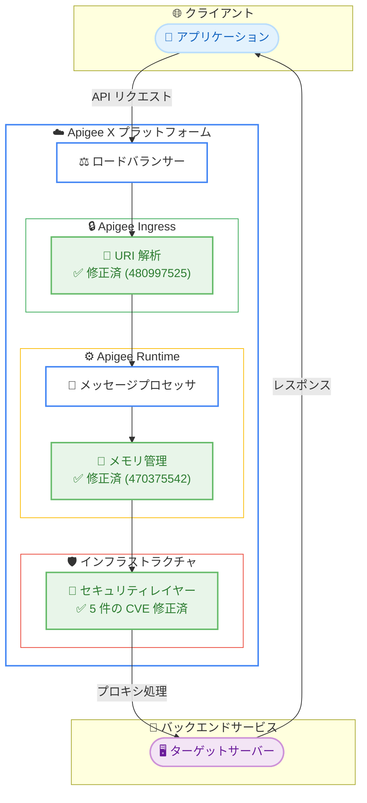

# Apigee X: セキュリティアップデート バージョン 1-17-0-apigee-2

**リリース日**: 2026-02-10
**サービス**: Apigee X
**機能**: セキュリティ修正およびバグ修正 (バージョン 1-17-0-apigee-2)
**ステータス**: Security

[このアップデートのインフォグラフィックを見る](https://takech9203.github.io/google-cloud-news-summary/20260210-apigee-x-security-update-1-17-0.html)

## 概要

2026 年 2 月 10 日、Google Cloud は Apigee の更新バージョン 1-17-0-apigee-2 をリリースした。本リリースは、Apigee インフラストラクチャに存在する複数のセキュリティ脆弱性 (CVE-2025-61730、CVE-2025-68156、CVE-2025-54388、CVE-2025-61727、CVE-2025-61729) を修正するとともに、503 レスポンスの急増を引き起こすメモリリーク、および Netty アップグレード後の URI 解析エラーを修正するものである。

本リリースは、2026 年 1 月 21 日にリリースされた 1-17-0-apigee-1 に続く 1-17-0 系列の 2 番目のリリースである。前バージョンでは CVE-2025-68161、CVE-2025-67735、CVE-2025-47914 など 13 件の CVE が修正されており、今回のリリースはそれを補完するセキュリティ強化となる。ロールアウトは 2 月 10 日に開始され、すべての Google Cloud ゾーンへの展開には 4 営業日以上かかる可能性がある。

Apigee X を利用するすべての組織が対象であり、ユーザー側でのアクション不要で自動的に適用される。API 管理プラットフォームのセキュリティを維持するため、ロールアウトの完了を確認することが推奨される。

**アップデート前の課題**

本アップデート適用前には、以下の課題が存在していた。

- Apigee インフラストラクチャに 5 件のセキュリティ脆弱性 (CVE-2025-61730、CVE-2025-68156、CVE-2025-54388、CVE-2025-61727、CVE-2025-61729) が存在していた
- メモリリークにより 503 レスポンスが "no_healthy_upstream" メッセージとともに急増する可能性があった (Bug ID: 470375542)
- Netty アップグレード後、プロキシ呼び出しが "The URI contains illegal characters" エラーで失敗するケースがあった (Bug ID: 480997525)

**アップデート後の改善**

今回のアップデートにより、以下の改善が実現した。

- 5 件のインフラストラクチャ CVE が修正され、Apigee 基盤のセキュリティが向上した
- メモリリークが解消され、503 レスポンスの急増が防止されることでサービスの安定性が向上した
- URI 解析の不具合が修正され、プロキシ呼び出しの信頼性が回復した

## アーキテクチャ図

この図は、Apigee X のリクエスト処理フローにおいて今回のアップデートで修正された 3 つの主要コンポーネントを示している。URI 解析 (Ingress 層)、メモリ管理 (Runtime 層)、セキュリティレイヤー (インフラストラクチャ層) のそれぞれで修正が適用されている。

## サービスアップデートの詳細

### 主要機能

1. **インフラストラクチャセキュリティ修正 (Bug ID: 481735779, 457138941, 471232237)**
   - CVE-2025-61730: Apigee インフラストラクチャのセキュリティ脆弱性を修正
   - CVE-2025-68156: Apigee インフラストラクチャのセキュリティ脆弱性を修正
   - CVE-2025-54388: Apigee インフラストラクチャのセキュリティ脆弱性を修正
   - CVE-2025-61727: Apigee インフラストラクチャのセキュリティ脆弱性を修正 (前バージョン 1-17-0-apigee-1 でも対処済みの CVE)
   - CVE-2025-61729: Apigee インフラストラクチャのセキュリティ脆弱性を修正 (前バージョン 1-17-0-apigee-1 でも対処済みの CVE)

2. **メモリリーク修正 (Bug ID: 470375542)**
   - 503 レスポンスが "no_healthy_upstream" メッセージとともに急増する原因となるメモリリークを修正
   - 長時間稼働する Apigee インスタンスにおける安定性が向上

3. **URI 解析エラー修正 (Bug ID: 480997525)**
   - Netty アップグレード後にプロキシ呼び出しが "The URI contains illegal characters" エラーで失敗する問題を修正
   - 2026 年 2 月 2 日に既知の問題として報告されていた不具合への対応

## 技術仕様

### CVE 一覧

以下の表は、本リリースで対処されたセキュリティ脆弱性の一覧である。

| CVE 番号 | Bug ID | 説明 |
|----------|--------|------|
| [CVE-2025-61730](https://nvd.nist.gov/vuln/detail/CVE-2025-61730) | 481735779, 457138941, 471232237 | Apigee インフラストラクチャのセキュリティ修正 |
| [CVE-2025-68156](https://nvd.nist.gov/vuln/detail/CVE-2025-68156) | 481735779, 457138941, 471232237 | Apigee インフラストラクチャのセキュリティ修正 |
| [CVE-2025-54388](https://nvd.nist.gov/vuln/detail/CVE-2025-54388) | 481735779, 457138941, 471232237 | Apigee インフラストラクチャのセキュリティ修正 |
| [CVE-2025-61727](https://nvd.nist.gov/vuln/detail/CVE-2025-61727) | 481735779, 457138941, 471232237 | Apigee インフラストラクチャのセキュリティ修正 |
| [CVE-2025-61729](https://nvd.nist.gov/vuln/detail/CVE-2025-61729) | 481735779, 457138941, 471232237 | Apigee インフラストラクチャのセキュリティ修正 |

### バグ修正一覧

| Bug ID | 説明 |
|--------|------|
| 470375542 | メモリリークにより 503 レスポンス ("no_healthy_upstream") が急増する問題を修正 |
| 480997525 | Netty アップグレード後にプロキシ呼び出しが "The URI contains illegal characters" エラーで失敗する問題を修正 |

### バージョン履歴 (1-17-0 系列)

| リリース日 | バージョン | 主な内容 |
|-----------|-----------|----------|
| 2026-01-21 | 1-17-0-apigee-1 | 13 件の CVE 修正、TLS 検証強化、SSE クォータ更新 |
| 2026-02-10 | 1-17-0-apigee-2 | 5 件の CVE 修正、メモリリーク修正、URI 解析修正 |

## メリット

### ビジネス面

- **サービス可用性の向上**: メモリリーク修正により 503 エラーの急増が防止され、API サービスの安定性が大幅に改善される。高トラフィック環境においてエンドユーザーへのサービス品質が維持される
- **セキュリティ体制の強化**: 5 件の CVE 修正により、API 管理プラットフォームのセキュリティが向上し、コンプライアンス要件への準拠が維持される

### 技術面

- **インフラストラクチャの堅牢性**: 複数のインフラストラクチャ脆弱性が解消され、Apigee 基盤の攻撃対象面が縮小された
- **URI 処理の信頼性**: Netty アップグレードに起因する URI 解析エラーが解消され、プロキシ呼び出しの信頼性が回復した
- **メモリ管理の改善**: メモリリークの修正により、長時間稼働するインスタンスの安定性が向上し、予期しない再起動や障害のリスクが低減された

## デメリット・制約事項

### 制限事項

- ロールアウトはすべての Google Cloud ゾーンへの展開に 4 営業日以上かかる場合がある
- ロールアウトが完了するまで、一部のインスタンスには修正が適用されない

### 考慮すべき点

- 自動ロールアウトのため、ユーザー側での適用タイミングの制御はできない
- Apigee Hybrid を利用している場合は、本リリースの対象外であるため、別途 Hybrid リリースノートを確認する必要がある
- CVE-2025-61727 および CVE-2025-61729 は前バージョン (1-17-0-apigee-1) でも対処されていたが、今回のリリースで追加の修正が適用されている

## ユースケース

### ユースケース 1: 高トラフィック API ゲートウェイの安定性確保

**シナリオ**: EC サイトやモバイルアプリのバックエンドとして Apigee X を利用する企業が、ピーク時に大量の API トラフィックを処理している。メモリリークに起因する 503 エラーの急増により、エンドユーザーへのサービスが断続的に中断していた。

**効果**: Bug ID 470375542 のメモリリーク修正により、"no_healthy_upstream" メッセージを伴う 503 レスポンスの急増が防止される。長時間稼働するインスタンスにおいても安定した API レスポンスが維持され、エンドユーザーの体験が改善される。

### ユースケース 2: 特殊文字を含む URI を使用する API の信頼性回復

**シナリオ**: 国際化対応の API プロキシを運用する企業が、Netty アップグレード後に "The URI contains illegal characters" エラーによりプロキシ呼び出しが失敗する問題に直面していた。

**効果**: Bug ID 480997525 の修正により、URI 解析の不具合が解消され、特殊文字を含む URI を使用する API プロキシの呼び出しが正常に動作するようになる。

## 料金

Apigee X のセキュリティアップデートは追加費用なしで自動的に適用される。Apigee X の通常の料金体系は変更されない。

### 料金例

以下は Apigee Pay-as-you-go の代表的な料金である (公式ドキュメントより)。

| 項目 | 料金 |
|------|------|
| Standard API Proxy 呼び出し (100 万回あたり、最大 5,000 万回) | $20 |
| Extensible API Proxy 呼び出し (100 万回あたり、最大 5,000 万回) | $100 |
| Base 環境使用量 (1 時間あたり、1 リージョン) | $0.5 |
| Intermediate 環境使用量 (1 時間あたり、1 リージョン) | $2.0 |
| Comprehensive 環境使用量 (1 時間あたり、1 リージョン) | $4.7 |

## 利用可能リージョン

Apigee X はグローバルに利用可能であり、本セキュリティアップデートのロールアウトはすべての Google Cloud ゾーンに順次適用される。具体的なリージョン対応状況は [Apigee ロケーション](https://cloud.google.com/apigee/docs/api-platform/get-started/install-cli#supported-regions) を参照。

## 関連サービス・機能

- **Apigee Hybrid**: Apigee のハイブリッドデプロイメントモデル。本リリース (1-17-0-apigee-2) は Apigee X のみが対象であり、Hybrid ユーザーは別途リリースノートを確認する必要がある
- **Cloud Monitoring**: Apigee のメトリクスを監視するサービス。503 レスポンスの発生状況をモニタリングし、メモリリーク修正の効果を確認するために活用できる
- **Cloud Logging**: Apigee のログを収集・分析するサービス。URI 解析エラーの発生状況を確認し、修正の適用を検証するために利用可能
- **Apigee Advanced API Security**: Apigee の高度な API セキュリティ機能を提供するアドオン。セキュリティアクションやボット検出などの機能で、API の保護をさらに強化できる

## 参考リンク

- [インフォグラフィック](https://takech9203.github.io/google-cloud-news-summary/20260210-apigee-x-security-update-1-17-0.html)
- [公式リリースノート (Apigee)](https://cloud.google.com/apigee/docs/release-notes#February_10_2026)
- [Apigee セキュリティ速報](https://cloud.google.com/apigee/docs/security-bulletins/security-bulletins)
- [Apigee ドキュメント](https://cloud.google.com/apigee/docs)
- [Apigee Pay-as-you-go 料金](https://cloud.google.com/apigee/docs/api-platform/reference/pay-as-you-go-updated-overview)
- [CVE-2025-61730 (NVD)](https://nvd.nist.gov/vuln/detail/CVE-2025-61730)
- [CVE-2025-68156 (NVD)](https://nvd.nist.gov/vuln/detail/CVE-2025-68156)
- [CVE-2025-54388 (NVD)](https://nvd.nist.gov/vuln/detail/CVE-2025-54388)

## まとめ

Apigee X バージョン 1-17-0-apigee-2 は、5 件のインフラストラクチャ CVE 修正に加え、503 レスポンスの急増を引き起こすメモリリークおよび URI 解析エラーを修正する重要なセキュリティ・安定性アップデートである。ロールアウトは 2026 年 2 月 10 日に開始され、すべての Google Cloud ゾーンへの展開には 4 営業日以上かかる可能性があるため、Cloud Monitoring を活用して適用状況を確認し、メモリリークに起因する 503 エラーが解消されていることを検証することが推奨される。

---

**タグ**: Apigee, Security, CVE-2025-61730, CVE-2025-68156, CVE-2025-54388, CVE-2025-61727, CVE-2025-61729, Infrastructure, Memory Leak, Bug Fix
