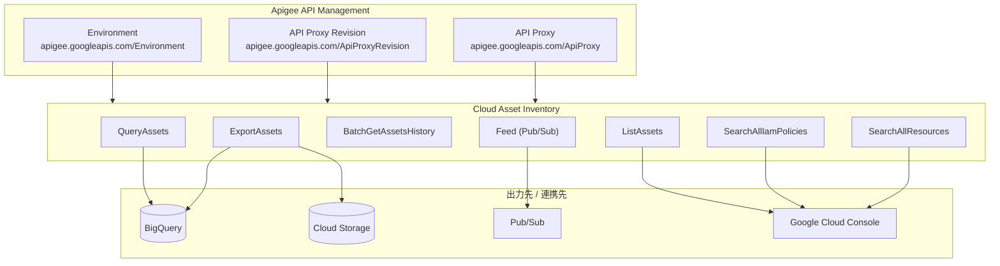

# Cloud Asset Inventory: Apigee リソースタイプのサポート追加

**リリース日**: 2026-02-10
**サービス**: Cloud Asset Inventory
**機能**: Apigee リソースタイプ (ApiProxy, ApiProxyRevision, Environment) の公開サポート
**ステータス**: 一般提供 (GA)

[このアップデートのインフォグラフィックを見る](https://takech9203.github.io/google-cloud-news-summary/20260210-cloud-asset-inventory-apigee-resource-types.html)

## 概要

Cloud Asset Inventory において、Apigee の 3 つのリソースタイプが新たに公開サポートされた。対象となるリソースタイプは `apigee.googleapis.com/ApiProxy`、`apigee.googleapis.com/ApiProxyRevision`、`apigee.googleapis.com/Environment` であり、ExportAssets、ListAssets、BatchGetAssetsHistory、QueryAssets、Feed、SearchAllResources、SearchAllIamPolicies の全 7 つの API で利用可能となった。

Cloud Asset Inventory は Google Cloud のグローバルメタデータインベントリサービスであり、クラウドリソースのメタデータの表示、検索、エクスポート、監視、分析を一元的に行うことができる。今回のアップデートにより、Apigee の API プロキシ管理に関わるリソースを Cloud Asset Inventory の統合管理基盤で可視化・追跡できるようになった。

このアップデートは、Apigee を利用して API 管理を行っている組織の Solutions Architect、セキュリティエンジニア、プラットフォームエンジニアにとって特に有用である。API プロキシとその環境のメタデータを他の Google Cloud リソースと同様に統合的に管理・監査できるようになる。

**アップデート前の課題**

- Apigee の ApiProxy、ApiProxyRevision、Environment リソースは Cloud Asset Inventory の主要 API で公開サポートされていなかった
- Apigee リソースの変更履歴を Cloud Asset Inventory 経由で追跡できなかった
- 組織全体のリソースインベントリに Apigee の API プロキシ情報を含めて一元管理することが困難だった
- API プロキシの IAM ポリシーを SearchAllIamPolicies で横断検索できなかった

**アップデート後の改善**

- Apigee の ApiProxy、ApiProxyRevision、Environment を Cloud Asset Inventory の全 7 API で利用可能になった
- Pub/Sub フィードを通じて Apigee リソースの変更をリアルタイムに監視できるようになった
- BigQuery や Cloud Storage へのエクスポートにより Apigee リソースのメタデータを分析基盤に統合できるようになった
- SearchAllResources / SearchAllIamPolicies で Apigee リソースを横断検索できるようになった

## アーキテクチャ図



Cloud Asset Inventory が Apigee の 3 つのリソースタイプからメタデータを収集し、各 API を通じて BigQuery、Cloud Storage、Pub/Sub、Google Cloud Console などに出力・連携する構成を示す。

## サービスアップデートの詳細

### 主要機能

1. **サポート対象リソースタイプ**
   - `apigee.googleapis.com/ApiProxy` - Apigee 組織内の API プロキシリソース
   - `apigee.googleapis.com/ApiProxyRevision` - API プロキシの各リビジョン
   - `apigee.googleapis.com/Environment` - API プロキシのデプロイ先となる環境リソース

2. **対応 API**
   - **ExportAssets** - アセットメタデータを BigQuery または Cloud Storage にエクスポート
   - **ListAssets** - プロジェクト、フォルダ、組織内のアセットを一覧表示
   - **BatchGetAssetsHistory** - 最大 35 日間のアセット変更履歴を取得
   - **QueryAssets** - BigQuery SQL を使用したアセットのクエリ
   - **Feed** - Pub/Sub を通じたアセット変更のリアルタイム監視
   - **SearchAllResources** - カスタムクエリによるリソース検索
   - **SearchAllIamPolicies** - IAM 許可ポリシーの横断検索

3. **既存の Apigee サポート対象リソースタイプとの関係**
   - 今回追加された 3 つのリソースタイプに加え、`apigee.googleapis.com/Instance` と `apigee.googleapis.com/Organization` は既にサポートされていた
   - これにより Apigee の主要リソースタイプ 5 種類すべてが Cloud Asset Inventory で管理可能となった

## 技術仕様

### サポートされる Apigee リソースタイプ一覧

| リソースタイプ | アセット名形式 | Effective Tags | Analysis API |
|---------------|---------------|:--------------:|:------------:|
| `apigee.googleapis.com/ApiProxy` | `//apigee.googleapis.com/organizations/ORGANIZATION_ID/apis/API_PROXY_ID` | 非対応 | 非対応 |
| `apigee.googleapis.com/ApiProxyRevision` | `//apigee.googleapis.com/organizations/ORGANIZATION_ID/apis/API_PROXY_ID/revisions/REVISION_ID` | 非対応 | 非対応 |
| `apigee.googleapis.com/Environment` | `//apigee.googleapis.com/organizations/ORGANIZATION_ID/environments/ENVIRONMENT_ID` | 非対応 | 非対応 |
| `apigee.googleapis.com/Instance` (既存) | `//apigee.googleapis.com/organizations/ORGANIZATION_ID/instances/INSTANCE_ID` | 非対応 | 対応 |
| `apigee.googleapis.com/Organization` (既存) | `//apigee.googleapis.com/organizations/ORGANIZATION_ID` | 非対応 | 対応 |

### 必要な権限

| 操作 | 必要な権限 |
|------|-----------|
| ExportAssets / BatchGetAssetsHistory | `cloudasset.assets.exportResource` |
| ListAssets | `cloudasset.assets.listResource` |
| QueryAssets | `cloudasset.assets.queryResource` |
| Feed (作成) | `cloudasset.feeds.create` + `cloudasset.assets.exportResource` |
| SearchAllResources | `cloudasset.assets.searchAllResources` |
| SearchAllIamPolicies | `cloudasset.assets.searchAllIamPolicies` |

全ての Cloud Asset Inventory API 呼び出しには、共通で `serviceusage.services.use` 権限も必要となる。

### 注意事項

- 今回追加された 3 つのリソースタイプは Effective Tags に非対応
- Analysis API (AnalyzeIamPolicy 等) では利用不可

## 設定方法

### 前提条件

1. Cloud Asset API が有効化されていること
2. 適切な IAM ロール (例: `roles/cloudasset.viewer`) が付与されていること
3. Apigee 組織が作成済みであること

### 手順

#### ステップ 1: Apigee リソースの一覧取得

```bash
# Apigee ApiProxy リソースを一覧表示
gcloud asset list \
  --project=PROJECT_ID \
  --asset-types="apigee.googleapis.com/ApiProxy" \
  --content-type=resource
```

#### ステップ 2: Apigee リソースの検索

```bash
# SearchAllResources で Apigee リソースを検索
gcloud asset search-all-resources \
  --scope=projects/PROJECT_ID \
  --asset-types="apigee.googleapis.com/ApiProxy,apigee.googleapis.com/Environment"
```

#### ステップ 3: BigQuery へのエクスポート

```bash
# Apigee リソースを BigQuery にエクスポート
gcloud asset export \
  --project=PROJECT_ID \
  --asset-types="apigee.googleapis.com/ApiProxy,apigee.googleapis.com/ApiProxyRevision,apigee.googleapis.com/Environment" \
  --content-type=resource \
  --bigquery-table=projects/PROJECT_ID/datasets/DATASET_ID/tables/TABLE_ID \
  --output-bigquery-force
```

#### ステップ 4: Pub/Sub フィードの作成 (変更監視)

```bash
# Apigee リソースの変更を監視するフィードを作成
gcloud asset feeds create FEED_ID \
  --project=PROJECT_ID \
  --asset-types="apigee.googleapis.com/ApiProxy,apigee.googleapis.com/Environment" \
  --content-type=resource \
  --pubsub-topic=projects/PROJECT_ID/topics/TOPIC_ID
```

## メリット

### ビジネス面

- **統合的なガバナンス**: Apigee の API プロキシと環境を他の Google Cloud リソースと同じ管理基盤で可視化でき、組織全体のリソースガバナンスが強化される
- **コンプライアンス監査の効率化**: API プロキシの変更履歴を最大 35 日間追跡でき、監査要件への対応が容易になる

### 技術面

- **リアルタイム変更検知**: Pub/Sub フィードにより Apigee リソースの変更をリアルタイムに検知し、自動化パイプラインと連携できる
- **BigQuery による高度な分析**: Apigee リソースのメタデータを BigQuery にエクスポートし、SQL で横断的な分析が可能になる
- **IAM ポリシーの横断検索**: SearchAllIamPolicies により、Apigee リソースに設定された IAM ポリシーを組織横断で可視化できる

## デメリット・制約事項

### 制限事項

- 今回追加された 3 つのリソースタイプは Effective Tags に非対応であり、タグベースのリソース管理には利用できない
- Analysis API (AnalyzeIamPolicy 等) では今回追加されたリソースタイプを利用できない
- アセットの変更履歴は最大 35 日間のみ保持される

### 考慮すべき点

- 大規模な Apigee 環境では ListAssets のパフォーマンスがタイムアウトする可能性があるため、BigQuery へのエクスポートを推奨
- 既存の `apigee.googleapis.com/Instance` および `apigee.googleapis.com/Organization` は Analysis API に対応しているが、今回追加分は非対応であるため、用途に応じて使い分けが必要

## ユースケース

### ユースケース 1: Apigee API プロキシの組織横断インベントリ管理

**シナリオ**: 大規模組織で複数のプロジェクトにまたがる Apigee API プロキシの全体像を把握したい場合

**実装例**:
```bash
# 組織全体の Apigee API プロキシを BigQuery にエクスポート
gcloud asset export \
  --organization=ORGANIZATION_ID \
  --asset-types="apigee.googleapis.com/ApiProxy,apigee.googleapis.com/ApiProxyRevision,apigee.googleapis.com/Environment" \
  --content-type=resource \
  --bigquery-table=projects/PROJECT_ID/datasets/asset_inventory/tables/apigee_resources \
  --output-bigquery-force
```

**効果**: 組織内の全 API プロキシ、リビジョン、環境を一元的に可視化し、リソースの散在や管理漏れを防止できる

### ユースケース 2: API プロキシの変更監視とアラート

**シナリオ**: 本番環境の Apigee API プロキシに対する予期しない変更を検知し、即座にアラートを発行したい場合

**実装例**:
```bash
# Pub/Sub トピックの作成
gcloud pubsub topics create apigee-asset-changes \
  --project=PROJECT_ID

# Cloud Asset Inventory フィードの作成
gcloud asset feeds create apigee-proxy-monitor \
  --project=PROJECT_ID \
  --asset-types="apigee.googleapis.com/ApiProxy,apigee.googleapis.com/ApiProxyRevision" \
  --content-type=resource \
  --pubsub-topic=projects/PROJECT_ID/topics/apigee-asset-changes
```

**効果**: API プロキシの作成・更新・削除をリアルタイムに検知し、Cloud Functions や Cloud Run と連携した自動対応が可能になる

### ユースケース 3: IAM ポリシーのセキュリティ監査

**シナリオ**: Apigee リソースに設定された IAM ポリシーを監査し、過剰な権限付与がないか確認したい場合

**実装例**:
```bash
# Apigee リソースの IAM ポリシーを横断検索
gcloud asset search-all-iam-policies \
  --scope=organizations/ORGANIZATION_ID \
  --query="policy:roles/apigee.admin" \
  --asset-types="apigee.googleapis.com/ApiProxy,apigee.googleapis.com/Environment"
```

**効果**: Apigee リソースに対する権限付与状況を組織横断で可視化し、最小権限の原則に基づいたアクセス管理を実現できる

## 料金

Cloud Asset Inventory の料金情報については、公式料金ページを参照のこと。主要な API (ExportAssets、ListAssets、SearchAllResources 等) はそれぞれ API コール数に基づいた料金体系となっている。

詳細: [Cloud Asset Inventory 料金ページ](https://cloud.google.com/asset-inventory/pricing)

## 関連サービス・機能

- **[Apigee](https://cloud.google.com/apigee/docs)**: Google Cloud のフルライフサイクル API 管理プラットフォーム。今回サポートされた ApiProxy、ApiProxyRevision、Environment はその中核リソースである
- **[Cloud Asset Inventory](https://cloud.google.com/asset-inventory/docs/overview)**: Google Cloud のグローバルメタデータインベントリサービス。最大 35 日間の変更履歴を保持する時系列データベースに基づく
- **[BigQuery](https://cloud.google.com/bigquery/docs)**: ExportAssets / QueryAssets を通じてアセットメタデータを格納・分析する先として連携
- **[Pub/Sub](https://cloud.google.com/pubsub/docs)**: Feed API と組み合わせてアセット変更のリアルタイム通知を実現
- **[Security Command Center](https://cloud.google.com/security-command-center/docs)**: Cloud Asset Inventory のデータを活用し、セキュリティ態勢の分析・改善を支援

## 参考リンク

- [このアップデートのインフォグラフィック](https://takech9203.github.io/google-cloud-news-summary/20260210-cloud-asset-inventory-apigee-resource-types.html)
- [公式リリースノート](https://docs.cloud.google.com/release-notes#February_10_2026)
- [Cloud Asset Inventory リリースノート](https://docs.cloud.google.com/asset-inventory/docs/release-notes)
- [Cloud Asset Inventory 概要](https://docs.cloud.google.com/asset-inventory/docs/overview)
- [サポートされるアセットタイプ](https://docs.cloud.google.com/asset-inventory/docs/asset-types)
- [アセット名一覧](https://docs.cloud.google.com/asset-inventory/docs/asset-names)
- [リソースの検索](https://docs.cloud.google.com/asset-inventory/docs/search-resources)
- [Cloud Asset Inventory REST API リファレンス](https://docs.cloud.google.com/asset-inventory/docs/reference/rest)
- [Apigee 環境の概要](https://docs.cloud.google.com/apigee/docs/api-platform/fundamentals/environments-overview)
- [Cloud Asset Inventory 料金ページ](https://cloud.google.com/asset-inventory/pricing)

## まとめ

今回のアップデートにより、Cloud Asset Inventory で Apigee の ApiProxy、ApiProxyRevision、Environment の 3 つのリソースタイプが全主要 API で公開サポートされた。これにより、既にサポートされていた Instance と Organization を含め、Apigee の主要リソースタイプ 5 種類すべてが Cloud Asset Inventory で統合管理可能となった。Apigee を利用して API 管理を行っている組織は、既存の Cloud Asset Inventory ワークフロー (BigQuery エクスポート、Pub/Sub 監視、IAM ポリシー監査など) に Apigee リソースを組み込むことを推奨する。

---

**タグ**: #CloudAssetInventory #Apigee #APIManagement #AssetManagement #Governance #Security
