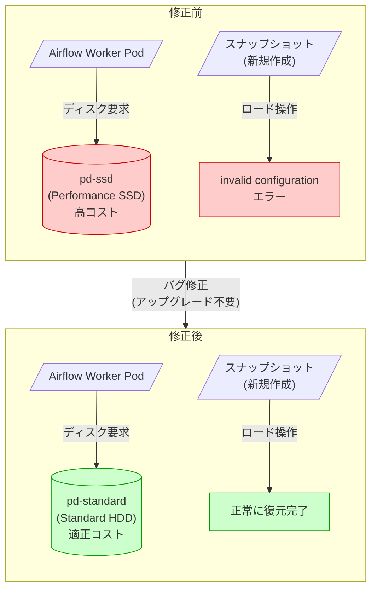

# Cloud Composer: ディスクタイプおよびスナップショットバグ修正

**リリース日**: 2026-02-10
**サービス**: Cloud Composer
**機能**: Airflow ワークロードのディスクタイプ修正、スナップショットロード操作の修正
**ステータス**: FIXED

[このアップデートのインフォグラフィックを見る](https://takech9203.github.io/google-cloud-news-summary/20260210-cloud-composer-disk-type-bugfix.html)

## 概要

Cloud Composer において、2 件の重要なバグ修正がリリースされた。1 つ目は、Airflow ワークロードが意図された Standard Persistent Disk (pd-standard) ではなく、Performance Persistent Disk (pd-ssd) を使用していた問題の修正である。この問題は予期しないコスト増加を引き起こす可能性があった。2 つ目は、Cloud Composer 3 において、最近作成されたスナップショットのロード操作が無効な構成エラーで失敗していた問題の修正である。

いずれの修正も「アップグレードなしで利用可能」(Available without upgrading) であり、既存の Cloud Composer 環境に対して自動的に適用される。ユーザー側でバージョンアップグレードを行う必要はない。

これらの修正は、Cloud Composer を利用するすべてのユーザー、特にコスト管理を重視する組織や、スナップショットを用いた環境移行・バックアップ運用を行っているチームにとって重要なアップデートである。

**アップデート前の課題**

- Airflow ワークロードが pd-standard (Standard Persistent Disk) ではなく pd-ssd (Performance Persistent Disk) を使用していたため、ディスクストレージのコストが意図せず高くなっていた
- Cloud Composer 3 において、最近作成されたスナップショットをロードしようとすると「invalid configuration」エラーが発生し、環境の復元や移行が失敗していた

**アップデート後の改善**

- Airflow ワークロードが正しく pd-standard を使用するようになり、ディスクストレージコストが想定通りの水準に戻った
- Cloud Composer 3 で最近作成されたスナップショットのロード操作が正常に動作するようになり、環境の復元・移行が確実に行えるようになった

## アーキテクチャ図



Cloud Composer 環境における修正前後の動作を示す。修正前は Airflow ワークロードが高コストの pd-ssd を使用し、スナップショットのロードがエラーで失敗していた。修正後はそれぞれ正しく動作するようになった。

## サービスアップデートの詳細

### 主要機能

1. **ディスクタイプの修正 (アップグレード不要)**
   - Airflow ワークロードで使用される Persistent Disk のタイプが、誤って pd-ssd (Performance Persistent Disk / SSD) に設定されていた問題を修正
   - 修正後は意図通り pd-standard (Standard Persistent Disk / HDD) が使用される
   - この修正はアップグレードなしで自動的に適用される
   - pd-ssd と pd-standard の料金差により、修正前の環境では予期しないコスト増加が発生していた可能性がある

2. **スナップショットロード操作の修正 (Cloud Composer 3、アップグレード不要)**
   - Cloud Composer 3 環境で、最近作成されたスナップショットをロードする際に「invalid configuration」エラーが発生する問題を修正
   - スナップショットのロード操作が正常に完了するようになった
   - この修正はアップグレードなしで Cloud Composer 3 環境に自動的に適用される

## 技術仕様

### Persistent Disk タイプの比較

| 項目 | pd-standard (修正後) | pd-ssd (修正前・誤使用) |
|------|---------------------|----------------------|
| ストレージメディア | HDD (ハードディスクドライブ) | SSD (ソリッドステートドライブ) |
| 主な用途 | シーケンシャル I/O が多いワークロード | 低レイテンシ・高 IOPS が必要なワークロード |
| 読み取り IOPS (GiB あたり) | 0.75 | 30 |
| 書き込み IOPS (GiB あたり) | 1.5 | 30 |
| コスト水準 | 低コスト | pd-standard の約 5 倍 |

### スナップショットに保存されるデータ

| 項目 | 詳細 |
|------|------|
| Airflow 構成オーバーライド | 環境に設定されたカスタム Airflow 設定 |
| 環境変数 | 環境に設定された変数 |
| PyPI パッケージ一覧 | requirements として保存 |
| Airflow データベースバックアップ | タスク実行状態、DAG 実行履歴を含む |
| バケットフォルダ | /dags、/data、/plugins フォルダの内容 |
| Fernet キー | 環境の暗号化キー |

## メリット

### ビジネス面

- **コスト最適化**: pd-ssd から pd-standard への修正により、Persistent Disk のストレージコストが大幅に削減される。pd-ssd は pd-standard と比較して約 5 倍のコストであるため、特にディスク使用量が多い環境では顕著なコスト削減効果がある
- **運用の信頼性向上**: スナップショットのロード操作が正常に動作するようになり、ディザスタリカバリや環境移行の計画が確実に実行可能になった

### 技術面

- **自動適用**: いずれの修正もアップグレード不要で適用されるため、ユーザー側でのアクション (バージョンアップグレードや環境再作成) が不要
- **環境管理の改善**: スナップショットによる環境の保存・復元が Cloud Composer 3 で確実に動作するようになり、環境管理のワークフローが安定した

## デメリット・制約事項

### 考慮すべき点

- ディスクタイプが pd-ssd から pd-standard に変更されることで、ディスク I/O の性能特性が変わる。ただし、Airflow ワークロードでは一般的にシーケンシャル I/O が中心であり、pd-standard が意図されたディスクタイプであるため、ほとんどのケースでパフォーマンスへの影響はない
- 修正前に pd-ssd が使用されていた期間のコスト増分について、Google Cloud の請求書を確認し、必要に応じて Google Cloud サポートに問い合わせることを推奨する
- スナップショット修正は Cloud Composer 3 環境のみが対象であり、Cloud Composer 2 環境には適用されない (Cloud Composer 2 では別の問題が発生していたかは不明)

## ユースケース

### ユースケース 1: コスト監査と最適化確認

**シナリオ**: Cloud Composer 環境を運用しているチームが、過去数か月の請求書を確認し、ディスクストレージのコストが想定より高かったことに気付いた。

**確認方法**:
```bash
# Cloud Composer 環境の詳細を確認
gcloud composer environments describe ENVIRONMENT_NAME \
    --location LOCATION

# 請求データのエクスポートで Persistent Disk コストを確認
# BigQuery に請求データをエクスポートしている場合
bq query --use_legacy_sql=false '
SELECT
  service.description,
  sku.description,
  SUM(cost) as total_cost
FROM `PROJECT.dataset.gcp_billing_export_v1_XXXXX`
WHERE service.description LIKE "%Composer%"
  OR sku.description LIKE "%Persistent Disk%"
GROUP BY 1, 2
ORDER BY total_cost DESC
'
```

**効果**: バグ修正後、Persistent Disk のコストが pd-standard の水準に戻り、以降の請求額が正常化される。

### ユースケース 2: Cloud Composer 3 環境のスナップショットによるバックアップ運用

**シナリオ**: Cloud Composer 3 環境でスケジュールされたスナップショットを活用し、定期的なバックアップと環境復元のテストを実施したい。

**実装例**:
```bash
# スナップショットの保存
gcloud composer environments snapshots save ENVIRONMENT_NAME \
    --location LOCATION

# スナップショットのロード (修正後は正常に動作)
gcloud composer environments snapshots load ENVIRONMENT_NAME \
    --location LOCATION \
    --snapshot-path gs://BUCKET_NAME/snapshots/SNAPSHOT_NAME
```

**効果**: 修正後は最近作成されたスナップショットのロードが「invalid configuration」エラーなく正常に完了し、ディザスタリカバリや環境クローンが確実に実行可能となる。

## 料金

今回のバグ修正はディスクタイプに直接関係するため、料金への影響が大きい。Persistent Disk の料金は以下の通りである。

### Persistent Disk 料金比較 (参考)

| ディスクタイプ | 月額料金 (GiB あたり) |
|--------------|---------------------|
| pd-standard (Standard) | $0.040 |
| pd-ssd (Performance SSD) | $0.170 |
| pd-balanced (Balanced) | $0.100 |

上記は参考値であり、リージョンによって異なる。詳細は [Compute Engine ディスク料金ページ](https://cloud.google.com/compute/disks-image-pricing) を参照のこと。

Cloud Composer 自体の料金体系については [Cloud Composer の料金](https://cloud.google.com/composer/pricing) を参照のこと。Cloud Composer の料金は、環境サイズ (Small / Medium / Large / Extra-Large)、ワークロードの CPU・メモリ・ストレージ、および基盤となる GKE クラスタのリソースによって決まる。

## 関連サービス・機能

- **[Compute Engine Persistent Disk](https://cloud.google.com/compute/docs/disks/persistent-disks)**: Cloud Composer 環境の GKE クラスタで使用されるブロックストレージ。今回のバグ修正で正しいディスクタイプ (pd-standard) が使用されるようになった
- **[Google Kubernetes Engine (GKE)](https://cloud.google.com/kubernetes-engine/docs)**: Cloud Composer 環境の基盤として使用される。Airflow ワークロード (Scheduler、Worker、Triggerer 等) は GKE 上の Pod として実行される
- **[Cloud Storage](https://cloud.google.com/storage/docs)**: Cloud Composer 環境のバケットとして使用され、DAG ファイル、プラグイン、データ、スナップショットの保存先となる
- **[Cloud Monitoring](https://cloud.google.com/monitoring/docs)**: Cloud Composer 環境のメトリクス (CPU、メモリ、ディスク使用率) の監視に使用。ディスクタイプ変更後のパフォーマンス監視にも活用可能

## 参考リンク

- [インフォグラフィック](https://takech9203.github.io/google-cloud-news-summary/20260210-cloud-composer-disk-type-bugfix.html)
- [公式リリースノート](https://cloud.google.com/release-notes#February_10_2026)
- [Cloud Composer リリースノート](https://cloud.google.com/composer/docs/release-notes)
- [Cloud Composer スナップショットの保存とロード (Composer 3)](https://cloud.google.com/composer/docs/composer-3/save-load-snapshots)
- [Cloud Composer スナップショットの保存とロード (Composer 2)](https://cloud.google.com/composer/docs/composer-2/save-load-snapshots)
- [Persistent Disk の概要](https://cloud.google.com/compute/docs/disks/persistent-disks)
- [Compute Engine ディスク料金](https://cloud.google.com/compute/disks-image-pricing)
- [Cloud Composer の料金](https://cloud.google.com/composer/pricing)

## まとめ

Cloud Composer の 2 件のバグ修正は、コスト管理とスナップショット運用の両面で重要なアップデートである。特にディスクタイプの修正は、pd-ssd と pd-standard の料金差 (約 4 倍以上) を考慮すると、影響を受けていた環境では顕著なコスト削減効果がある。いずれの修正もアップグレード不要で自動適用されるため、ユーザー側での対応は不要だが、過去の請求書を確認してコスト増分がなかったか確認することを推奨する。

---

**タグ**: #CloudComposer #Airflow #PersistentDisk #BugFix #CostOptimization #Snapshot #GKE
