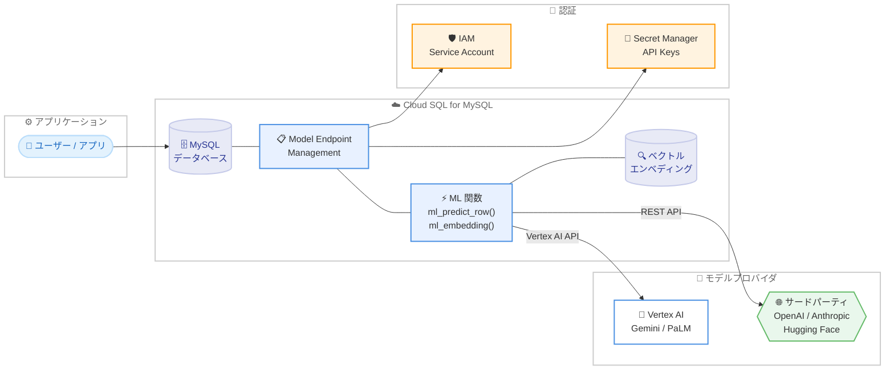

# Cloud SQL for MySQL: Vertex AI 統合と Model Endpoint Management の GA

**リリース日**: 2026-02-10
**サービス**: Cloud SQL for MySQL
**機能**: Vertex AI 統合 / Model Endpoint Management
**ステータス**: GA (一般提供)

## 概要

Cloud SQL for MySQL における Model Endpoint Management 機能および Vertex AI との統合が、一般提供 (GA) となった。この機能により、Cloud SQL for MySQL のデータベースから直接 SQL クエリを使用して、Vertex AI がホストする大規模言語モデル (LLM) にアクセスし、オンライン予測の実行やベクトルエンベディングの生成が可能になる。

この統合は、データベース内のデータに対して機械学習 (ML) モデルのセマンティックな理解力と予測能力を直接適用できる点が最大の特徴である。従来はアプリケーション層で別途 API を呼び出す必要があった ML 推論を、SQL 構文の拡張によってデータベース内で完結させることができる。データエンジニア、アプリケーション開発者、データサイエンティストなど、SQL を扱うすべてのユーザーが対象となる。

GA リリースにより、本番環境での利用がサポートされ、SLA の適用対象となる。Preview 期間中に提供されていた機能が安定版として利用可能になったことで、エンタープライズワークロードへの適用が推奨される段階に入った。

**アップデート前の課題**

Preview 期間中は、以下の制限や課題が存在していた。

- ML モデルを活用するにはアプリケーション層で Vertex AI API を別途呼び出す必要があり、データの移動やコードの複雑化が発生していた
- Model Endpoint Management は Pre-GA であり、本番環境での利用には SLA が適用されなかった
- サードパーティのモデルプロバイダ (Anthropic、Hugging Face、OpenAI など) のモデル登録は限定的なサポートだった

**アップデート後の改善**

GA リリースにより、以下の改善が実現された。

- SQL クエリ (`mysql.ml_predict_row()`、`mysql.ml_embedding()`) を使用して、データベースから直接 Vertex AI モデルにアクセス可能になった
- Model Endpoint Management が GA となり、本番環境での利用に SLA が適用されるようになった
- Vertex AI に加えて Anthropic、Hugging Face、OpenAI、カスタムホストモデルなど複数のモデルプロバイダに対応した

## アーキテクチャ図



Cloud SQL for MySQL から Vertex AI およびサードパーティのモデルプロバイダに接続するアーキテクチャを示す。Model Endpoint Management がモデルの登録と管理を担い、SQL 関数を通じて予測やエンベディング生成を実行する。

## サービスアップデートの詳細

### 主要機能

1. **Model Endpoint Management**
   - AI モデルのエンドポイントを Cloud SQL インスタンス内に登録・管理する機能
   - 一意のモデル ID を使用してモデルを参照し、SQL クエリでモデルを呼び出す
   - `mysql.ml_create_model_registration()` 関数でモデルエンドポイントを登録
   - `mysql.ml_create_sm_secret_registration()` 関数で Secret Manager のシークレットを管理

2. **オンライン予測 (`mysql.ml_predict_row()`)**
   - 登録されたジェネリックモデルエンドポイントを呼び出し、JSON ベースの API で予測を実行
   - Vertex AI Model Garden のモデル (Gemini など) やカスタムモデルに対応
   - SQL トランザクション内でモデルを呼び出し、リアルタイムに予測結果を取得

3. **ベクトルエンベディング生成 (`mysql.ml_embedding()`)**
   - テキストを数値ベクトルに変換し、セマンティック検索やベクトル類似性検索に活用
   - Vertex AI のエンベディングモデル (`gemini-embedding-001`、`text-embedding-005` など) にビルトインで対応
   - カスタムのテキストエンベディングモデルもトランスフォーム関数を作成して登録可能

4. **マルチプロバイダ対応**
   - Vertex AI (Gemini を含む)、Anthropic、Hugging Face、OpenAI、カスタムホストモデルをサポート
   - モデルプロバイダごとに適切な認証方式 (IAM または Secret Manager) を設定可能

## 技術仕様

### 対応モデルプロバイダ

以下の表は、Model Endpoint Management で対応するモデルプロバイダの一覧である。

| モデルプロバイダ | 関数内の設定値 | 認証方式 |
|-----------------|---------------|---------|
| Vertex AI (Gemini 含む) | `google` | Cloud SQL Service Agent IAM |
| Anthropic | `anthropic` | Secret Manager |
| Hugging Face | `hugging_face` | Secret Manager |
| OpenAI | `open_ai` | Secret Manager |
| カスタムモデル | `custom` | Secret Manager |

### モデルタイプ

登録可能なモデルタイプは以下の通りである。

| モデルタイプ | 設定値 | 用途 |
|------------|--------|------|
| テキストエンベディング | `text_embedding` | ベクトルエンベディング生成 |
| ジェネリック | `generic` (デフォルト) | オンライン予測 (JSON 入出力) |

### 主要な SQL 関数

以下の表は、この統合で使用する主要な SQL 関数を示す。

| 関数 | 用途 |
|------|------|
| `mysql.ml_create_model_registration()` | モデルエンドポイントの登録 |
| `mysql.ml_create_sm_secret_registration()` | Secret Manager シークレットの登録 |
| `mysql.ml_predict_row()` | ジェネリックモデルの予測呼び出し |
| `mysql.ml_embedding()` | テキストエンベディングの生成 |

### 必要な権限

モデルの登録と呼び出しには以下のデータベース権限が必要である。

```sql
-- cloudsqlsuperuser ロールのユーザーはデフォルトで権限を持つ
-- その他のユーザーには以下を付与
GRANT SELECT ON mysql.* TO 'username'@'%';
GRANT EXECUTE ON mysql.* TO 'username'@'%';
```

## 設定方法

### 前提条件

1. Cloud SQL for MySQL バージョン 8.0.36 以降のインスタンスであること
2. Model Endpoint Management を使用する場合、メンテナンスバージョン `MYSQL_VERSION.R20250531.01_14` 以降であること
3. Cloud SQL Admin API と Vertex AI API が有効化されていること
4. 共有コアインスタンスでは利用不可 (専用コアが必要)

### 手順

#### ステップ 1: Vertex AI 統合の有効化

```bash
# 新規インスタンス作成時
gcloud sql instances create INSTANCE_NAME \
  --database-version=MYSQL_8_0 \
  --tier=MACHINE_TYPE \
  --region=REGION_NAME \
  --edition=EDITION_NAME \
  --enable-google-ml-integration

# 既存インスタンスの更新
gcloud sql instances patch INSTANCE_NAME \
  --enable-google-ml-integration
```

Cloud SQL インスタンスで Vertex AI 統合を有効化する。`--enable-google-ml-integration` フラグを指定することで、インスタンスが Vertex AI に接続可能になる。

#### ステップ 2: IAM 権限の付与

```bash
gcloud projects add-iam-policy-binding PROJECT_ID \
  --member="serviceAccount:SERVICE_ACCOUNT_EMAIL" \
  --role="roles/aiplatform.user"
```

Cloud SQL サービスアカウントに Vertex AI へのアクセス権限を付与する。`SERVICE_ACCOUNT_EMAIL` は `gcloud sql instances describe INSTANCE_NAME` コマンドの `serviceAccountEmailAddress` パラメータから取得できる。

#### ステップ 3: モデルエンドポイントの登録

```sql
-- Vertex AI Gemini エンベディングモデルの登録例
CALL mysql.ml_create_model_registration(
  'gemini-embedding-001',
  'publishers/google/models/gemini-embedding-001',
  'google',
  'text_embedding',
  'gemini-embedding-001',
  'AUTH_TYPE_CLOUDSQL_SERVICE_AGENT_IAM',
  NULL,
  'mysql.cloudsql_ml_text_embedding_input_transform',
  'mysql.cloudsql_ml_text_embedding_output_transform',
  NULL
);
```

モデルエンドポイントを登録する。Vertex AI のエンベディングモデルはビルトインサポートがあるため、デフォルトのトランスフォーム関数を使用できる。

#### ステップ 4: 予測またはエンベディングの実行

```sql
-- エンベディング生成
SELECT mysql.ml_embedding(
  'gemini-embedding-001',
  'Cloud SQL is a managed database service'
);

-- Gemini モデルによる予測
SELECT mysql.ml_predict_row(
  'gemini-2.5-flash',
  '{"contents": [{"role": "user", "parts": [{"text": "Summarize this text..."}]}]}'
);
```

登録したモデルを使用して、エンベディング生成やオンライン予測を SQL から直接実行する。

## メリット

### ビジネス面

- **開発速度の向上**: SQL クエリだけで ML モデルにアクセスできるため、アプリケーション層の ML 統合コードが不要になり、開発サイクルが短縮される
- **運用コストの削減**: 別途ベクトルデータベースを管理する必要がなく、Cloud SQL 内でベクトルエンベディングの保存・検索が完結する
- **本番環境での信頼性**: GA リリースにより SLA が適用され、エンタープライズワークロードでの利用に適した安定性が提供される

### 技術面

- **データ移動の最小化**: データベース内で直接 ML 推論を実行するため、データをアプリケーション層に移動させる必要がない
- **マルチプロバイダ対応**: Vertex AI だけでなく、OpenAI、Anthropic、Hugging Face などのモデルも統一的な SQL インターフェースで利用可能
- **LangChain 統合**: Cloud SQL for MySQL は LangChain の Vector Store、Document Loader、Chat Message History インターフェースを提供しており、RAG アプリケーションの構築が容易

## デメリット・制約事項

### 制限事項

- Cloud SQL for MySQL バージョン 8.0.36 以降が必須。それ以前のバージョンでは利用できない
- 共有コアインスタンス (f1-micro、g1-small) では Vertex AI 統合を有効化できない
- Cloud SQL インスタンスと Vertex AI モデルは同一リージョンに配置する必要がある
- `mysqldump` によるエクスポート・インポートでは、モデルエンドポイントカタログはエクスポートされない
- トランスフォーム関数を含むユーザーデータベース名にピリオド (`.`) を使用できない
- gRPC の制限により、Vertex AI へのリクエストサイズは 1 リクエストあたり 4 MB が上限
- Vertex AI へのリクエストは 1 プロジェクト・1 リージョン・1 モデルあたり毎分 1,500 リクエストのクォータ制限がある

### 考慮すべき点

- モデル登録・シークレット管理関数の実行時に、セッション内のオープントランザクションが暗黙的にコミットされる (予測関数ではコミットされない)
- パブリック IP が設定されていないインスタンスでは、Vertex AI 以外のモデルプロバイダを使用できない
- ベクトルエンベディングを使用する場合、`cloudsql_vector` データベースフラグの有効化とインスタンスの再起動が必要

## ユースケース

### ユースケース 1: セマンティック検索を活用した顧客問い合わせ対応

**シナリオ**: 顧客からの問い合わせテキストに対して、過去の類似問い合わせとその回答を自動検索するシステムを構築する。

**実装例**:

```sql
-- エンベディング列の追加
ALTER TABLE support_tickets
ADD COLUMN ticket_embedding VECTOR(3072) USING VARBINARY;

-- 既存データのエンベディング生成
UPDATE support_tickets
SET ticket_embedding = mysql.ml_embedding(
  'gemini-embedding-001', description
);

-- ベクトルインデックスの作成
CREATE VECTOR INDEX ticket_embed_idx
ON support_tickets(ticket_embedding)
USING SCANN DISTANCE_MEASURE = COSINE;

-- 類似チケットの検索
SELECT mysql.ml_embedding('gemini-embedding-001', 'ログインできない') INTO @query_vec;
SELECT id, description, resolution
FROM support_tickets
ORDER BY approx_distance(ticket_embedding, @query_vec, 'distance_measure=cosine')
LIMIT 5;
```

**効果**: アプリケーション層でのベクトル検索ロジックが不要になり、SQL のみでセマンティック検索を実現できる。

### ユースケース 2: データベース内でのリアルタイムテキスト分析

**シナリオ**: データベースに蓄積された商品レビューに対して、Gemini モデルを使用してセンチメント分析や要約を直接実行する。

**実装例**:

```sql
-- 商品レビューの要約生成
SELECT
  product_id,
  JSON_EXTRACT(
    mysql.ml_predict_row(
      'gemini-2.5-flash',
      JSON_OBJECT(
        'contents', JSON_ARRAY(
          JSON_OBJECT(
            'role', 'user',
            'parts', JSON_ARRAY(
              JSON_OBJECT('text', CONCAT('Summarize this review: ', review_text))
            )
          )
        )
      )
    ),
    '$.candidates[0].content.parts[0].text'
  ) AS summary
FROM product_reviews
WHERE created_at >= DATE_SUB(NOW(), INTERVAL 7 DAY);
```

**効果**: データの移動なしにデータベース内で LLM による分析を実行でき、リアルタイムなインサイト取得が可能になる。

## 料金

Cloud SQL for MySQL の料金は、インスタンスの構成設定に依存する。Vertex AI 統合自体に追加料金は発生しないが、Vertex AI モデルの呼び出しには Vertex AI の料金が別途適用される。

Cloud SQL の主な料金要素は以下の通りである。

- プロビジョニングしたストレージ容量 (GiB/月)
- 選択した CPU 数とメモリ容量
- データのホスティングリージョン
- インスタンスからのネットワークトラフィック
- 割り当てた IP アドレス数

Committed Use Discounts (CUD) を利用することで、1 年契約で 25%、3 年契約で 52% の割引が適用される。

詳細な料金情報については、[Cloud SQL 料金ページ](https://cloud.google.com/sql/pricing) および [料金計算ツール](https://cloud.google.com/products/calculator) を参照。

## 利用可能リージョン

Cloud SQL for MySQL は、Google Cloud の全リージョンで利用可能である。ただし、Vertex AI 統合を使用する場合、Cloud SQL インスタンスと Vertex AI モデルのエンドポイントが同一リージョンに存在する必要がある。利用可能なリージョンの詳細は [Cloud SQL インスタンスの設定](https://cloud.google.com/sql/docs/mysql/instance-settings) を参照。

## 関連サービス・機能

- **Vertex AI**: Cloud SQL から直接アクセスする ML モデルのホスティング基盤。Gemini、PaLM、テキストエンベディングモデルなどを提供
- **Secret Manager**: サードパーティモデルプロバイダの API キーやベアラートークンを安全に保管・管理するサービス
- **LangChain 統合**: Cloud SQL for MySQL は LangChain の Vector Store、Document Loader、Chat Message History インターフェースを提供し、RAG アプリケーション構築を支援 (Preview)
- **Cloud SQL ベクトル検索**: `cloudsql_vector` フラグを有効化することで、ベクトルエンベディングの保存・インデックス作成・類似性検索が可能 (GA)

## 参考リンク

- [公式リリースノート](https://cloud.google.com/release-notes#February_10_2026)
- [Cloud SQL for MySQL と Vertex AI の統合](https://cloud.google.com/sql/docs/mysql/integrate-cloud-sql-with-vertex-ai)
- [Model Endpoint Management の概要](https://cloud.google.com/sql/docs/mysql/model-endpoint-overview)
- [モデルエンドポイントの登録](https://cloud.google.com/sql/docs/mysql/model-endpoint-register-model)
- [オンライン予測の実行](https://cloud.google.com/sql/docs/mysql/invoke-online-predictions)
- [ベクトルエンベディングの生成](https://cloud.google.com/sql/docs/mysql/model-endpoint-embeddings)
- [LangChain 統合](https://cloud.google.com/sql/docs/mysql/langchain)
- [Cloud SQL 料金ページ](https://cloud.google.com/sql/pricing)

## まとめ

Cloud SQL for MySQL の Vertex AI 統合と Model Endpoint Management の GA リリースにより、SQL クエリのみで Vertex AI を含む複数の ML モデルプロバイダにアクセスし、オンライン予測やベクトルエンベディング生成を実行できるようになった。データベース内で ML 推論を完結させることで、アーキテクチャの簡素化と開発速度の向上が期待できる。既に Cloud SQL for MySQL を利用しているユーザーは、インスタンスのバージョンと構成を確認し、Vertex AI 統合の有効化を検討することを推奨する。

---

**タグ**: #CloudSQL #MySQL #VertexAI #MachineLearning #GenerativeAI #VectorEmbeddings #ModelEndpointManagement #GA
