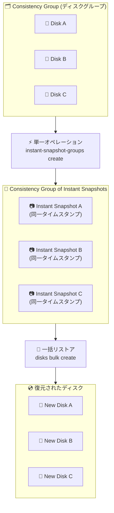

# Compute Engine: Consistency Groups for Instant Snapshots (Preview)

**リリース日**: 2026-02-10
**サービス**: Compute Engine
**機能**: Consistency Groups for Instant Snapshots
**ステータス**: Preview

📊 [このアップデートのインフォグラフィックを見る](https://takech9203.github.io/google-cloud-news-summary/20260210-compute-engine-consistency-groups-instant-snapshots.html)

## 概要

Compute Engine に「Consistency Groups for Instant Snapshots」機能が Preview として追加された。この機能により、複数のディスクを同一時点でまとめてバックアップし、データの整合性を保証できるようになる。従来のインスタントスナップショットは個別のディスク単位での取得のみに対応していたが、本機能ではディスクのコンシステンシーグループを作成し、そのグループ全体に対して単一のオペレーションでインスタントスナップショットを取得できる。

本機能は、複数ディスクにまたがるワークロード (データベース、分散アプリケーションなど) を運用するユーザーを主な対象としている。ワークロードに大きな変更を加える前に全ディスクを一括でバックアップし、問題発生時には同一時点の状態に一括リストアすることで、RPO (Recovery Point Objective) を大幅に短縮できる。

コンシステンシーグループのインスタントスナップショットは、個別のインスタントスナップショットと同じ機能を大規模に提供するものであり、追加コストなしで利用できる。

**アップデート前の課題**

- 複数ディスクにまたがるワークロードのバックアップでは、各ディスクのスナップショットを個別に取得する必要があり、取得タイミングにずれが生じてデータの整合性を保証できなかった
- 複数ディスクの一括リストアには手動で各ディスクを個別に復元する手順が必要であり、復旧時間 (RTO) が長くなる傾向があった
- マシンイメージを使った複数ディスクの一括バックアップは可能だったが、インスタントスナップショットほどの高速な復元は実現できなかった

**アップデート後の改善**

- コンシステンシーグループに属する全ディスクのインスタントスナップショットを、単一のオペレーションで同一時点に取得できるようになった
- コンシステンシーグループのインスタントスナップショットから複数ディスクを一括でリストアでき、復旧時間が大幅に短縮された
- 追加コストなしでコンシステンシーグループのインスタントスナップショット機能を利用できる

## アーキテクチャ図



コンシステンシーグループに含まれる複数ディスクに対して、単一のオペレーションで同一時点のインスタントスナップショットを作成し、必要に応じて一括リストアするフローを示している。

## サービスアップデートの詳細

### 主要機能

1. **同時バックアップ (Simultaneous Backups)**
   - コンシステンシーグループに属する全ディスクのインスタントスナップショットを、1 回のオペレーションで同一タイムスタンプにて取得
   - ゾーンディスクとリージョナルディスクの両方に対応
   - `gcloud beta compute instant-snapshot-groups create` コマンドまたは REST API で実行可能

2. **一括リストア (Bulk Restoration)**
   - コンシステンシーグループのインスタントスナップショットから、全ディスクを一括で復元
   - `gcloud beta compute disks bulk create` コマンドまたは REST API (`disks.bulkInsert`) で実行可能
   - 復元後のディスクは、必要に応じて新しいコンシステンシーグループに追加可能

3. **コンシステンシーグループの管理**
   - インスタントスナップショットグループの一覧表示、詳細確認、削除が可能
   - コンシステンシーグループ内の個別のインスタントスナップショットの確認も可能
   - コンシステンシーグループの削除時には、グループ内の全インスタントスナップショットも同時に削除される

## 技術仕様

### 対応ディスクタイプ

| 項目 | 詳細 |
|------|------|
| Hyperdisk Balanced | 対応 |
| Hyperdisk Balanced High Availability | 対応 |
| Hyperdisk Extreme | 対応 |
| Persistent Disk (Extreme PD 含む) | 対応 |
| Hyperdisk Throughput | 非対応 |
| Hyperdisk ML | 非対応 |

### コンシステンシーグループの制約

| 項目 | 詳細 |
|------|------|
| 最大ディスク数 | 1 コンシステンシーグループあたり 128 ディスク |
| ディスクの場所 | ゾーンディスクは同一ゾーン、リージョナルディスクは同一ゾーンペア |
| プロジェクト | 全ディスクがコンシステンシーグループと同一プロジェクトに属する必要あり |
| VM あたりの制限 | 異なるコンシステンシーグループのディスクを最大 16 個まで接続可能 (同一グループのディスクは 1 としてカウント) |
| 個別ディスクの制限 | ディスクあたり最大 32 個のインスタントスナップショット |
| スナップショット間隔 | ディスクあたり最低 30 秒間隔 |
| データ整合性 | クラッシュ整合性 (アプリケーション整合性ではない) |

### 必要な IAM 権限

```
compute.instantSnapshotGroups.create    - コンシステンシーグループのスナップショット作成
compute.instantSnapshotGroups.list      - コンシステンシーグループのスナップショット一覧
compute.instantSnapshotGroups.get       - コンシステンシーグループのスナップショット詳細
compute.instantSnapshotGroups.delete    - コンシステンシーグループのスナップショット削除
compute.instantSnapshotGroups.useReadOnly - リストア時に必要
compute.instantSnapshots.useReadOnly    - リストア時に必要
compute.resourcePolicies.useReadOnly    - リストア時に必要
compute.disks.create                    - ディスク復元時に必要
```

推奨 IAM ロール: `roles/compute.instanceAdmin.v1` (Compute Instance Admin v1)

## 設定方法

### 前提条件

1. Google Cloud プロジェクトで Compute Engine API が有効化されていること
2. `roles/compute.instanceAdmin.v1` ロールが付与されていること
3. gcloud CLI の beta コンポーネントがインストールされていること

### 手順

#### ステップ 1: コンシステンシーグループの作成

```bash
# コンシステンシーグループ (リソースポリシー) を作成
gcloud compute resource-policies create disk-consistency-group my-consistency-group \
    --region=us-central1
```

ディスクを論理的にグループ化するためのリソースポリシーを作成する。

#### ステップ 2: ディスクをコンシステンシーグループに追加

```bash
# ゾーンディスクの場合
gcloud compute disks add-resource-policies DISK_NAME \
    --resource-policies=my-consistency-group \
    --zone=us-central1-a
```

バックアップ対象の各ディスクをコンシステンシーグループに追加する。

#### ステップ 3: コンシステンシーグループのインスタントスナップショットを作成

```bash
# ゾーンディスクのコンシステンシーグループからスナップショット作成
gcloud beta compute instant-snapshot-groups create my-snapshot-group \
    --source-consistency-group=my-consistency-group \
    --zone=us-central1-a
```

単一のコマンドで、グループ内の全ディスクの同一時点のインスタントスナップショットが作成される。

#### ステップ 4: (必要に応じて) 一括リストア

```bash
# コンシステンシーグループのスナップショットからディスクを一括復元
gcloud beta compute disks bulk create \
    --zone=us-central1-a \
    --source-instant-snapshot-group=my-snapshot-group \
    --source-instant-snapshot-group-zone=us-central1-a
```

グループ内の全インスタントスナップショットから、新しいディスクを一括で作成する。

## メリット

### ビジネス面

- **RPO/RTO の短縮**: 複数ディスクのバックアップと復元を一括で実行できるため、データ保護の目標時間を大幅に改善できる
- **運用コストの削減**: 個別ディスクごとのバックアップスクリプトやオーケストレーションが不要になり、運用の複雑さとコストを低減できる
- **追加コストなし**: コンシステンシーグループのインスタントスナップショット機能に追加料金は発生しない

### 技術面

- **データ整合性の保証**: 全ディスクが同一時点でスナップショットされるため、ディスク間のデータ整合性が保証される
- **高速な復元**: インスタントスナップショットの特性により、数分以内でのディスク復元が可能
- **API の一貫性**: 既存のインスタントスナップショット API と一貫したインターフェースで利用できる

## デメリット・制約事項

### 制限事項

- 本機能は現在 Preview であり、SLA の対象外。本番環境での利用は慎重に検討が必要
- インスタントスナップショットはクラッシュ整合性であり、アプリケーション整合性ではない。インメモリデータはキャプチャされない
- ソースディスクが削除されると、そのディスクのインスタントスナップショットも削除される (コンシステンシーグループ内のスナップショットも含む)
- インスタントスナップショットはソースディスクと同じゾーンまたはリージョンにのみ保存される。災害復旧には標準スナップショットへの変換が必要
- 既存のコンシステンシーグループのインスタントスナップショットに新しいスナップショットを追加することはできない。ディスクグループを更新してから新しいスナップショットグループを作成する必要がある

### 考慮すべき点

- ゾーン障害やリージョン障害に対する保護にはならない。災害復旧には標準スナップショットまたはアーカイブスナップショットを併用すべき
- アプリケーション整合性が必要な場合は、スナップショット取得前にアプリケーション側でフラッシュ処理を実施するか、アプリケーション整合性のある標準スナップショットを使用する
- Preview 機能のため、API やコマンドに変更が入る可能性がある (現在 `gcloud beta` コマンドを使用)

## ユースケース

### ユースケース 1: マルチディスク構成のデータベースバックアップ

**シナリオ**: データディスク、WAL (Write-Ahead Log) ディスク、設定ディスクの 3 つのディスクで構成されるデータベースサーバーにおいて、メジャーバージョンアップグレード前にバックアップを取得したい。

**実装例**:
```bash
# 1. コンシステンシーグループを作成
gcloud compute resource-policies create disk-consistency-group db-backup-group \
    --region=asia-northeast1

# 2. 各ディスクをグループに追加
gcloud compute disks add-resource-policies db-data-disk \
    --resource-policies=db-backup-group --zone=asia-northeast1-a
gcloud compute disks add-resource-policies db-wal-disk \
    --resource-policies=db-backup-group --zone=asia-northeast1-a
gcloud compute disks add-resource-policies db-config-disk \
    --resource-policies=db-backup-group --zone=asia-northeast1-a

# 3. アップグレード前に一括スナップショット取得
gcloud beta compute instant-snapshot-groups create db-pre-upgrade-snapshot \
    --source-consistency-group=db-backup-group \
    --zone=asia-northeast1-a

# 4. 問題発生時に一括リストア
gcloud beta compute disks bulk create \
    --zone=asia-northeast1-a \
    --source-instant-snapshot-group=db-pre-upgrade-snapshot \
    --source-instant-snapshot-group-zone=asia-northeast1-a
```

**効果**: 3 つのディスクを同一時点でバックアップすることで、データとログの整合性を保った状態でのロールバックが可能になる。

### ユースケース 2: 分散アプリケーションのリリース前バックアップ

**シナリオ**: マイクロサービスアーキテクチャにおいて、複数の VM にアタッチされた永続ディスクを、アプリケーションのリリース前に一括でバックアップしたい。

**効果**: リリース後に問題が発生した場合、全ディスクを同一時点の状態にロールバックすることで、サービス間のデータ整合性を維持しながら迅速に復旧できる。

## 料金

コンシステンシーグループのインスタントスナップショット機能の利用に追加料金は発生しない。

インスタントスナップショット自体の料金は以下の通り:

- **オペレーション料金**: スナップショット作成時に適用
- **ストレージ料金**: スナップショット取得後にディスク上で変更されたデータ量に基づいて課金。ストレージはソースディスクと同じ料金レートで課金される

インスタントスナップショットはインクリメンタル (増分) で保存されるため、変更のないブロックには追加のストレージコストは発生しない。

詳細な料金情報は [Compute Engine ディスクと画像の料金ページ](https://cloud.google.com/compute/disks-image-pricing#disk) を参照。

## 利用可能リージョン

インスタントスナップショットはソースディスクと同じゾーンまたはリージョンに保存される。コンシステンシーグループは、Compute Engine が利用可能な全リージョンで作成可能。具体的な利用可能リージョンの一覧は [Compute Engine リージョンとゾーン](https://cloud.google.com/compute/docs/regions-zones) を参照。

## 関連サービス・機能

- **[Standard Snapshots](https://cloud.google.com/compute/docs/disks/snapshots)**: ゾーン障害・リージョン障害からの保護に対応したリモートバックアップ。インスタントスナップショットから標準スナップショットへの変換も可能
- **[Backup and DR Service](https://cloud.google.com/backup-disaster-recovery/docs)**: ポリシーベースのバックアップ管理、監視、レポート機能を提供する包括的なバックアップソリューション
- **[Machine Images](https://cloud.google.com/compute/docs/machine-images)**: VM にアタッチされた全ディスクのバックアップに対応。ただしインスタントスナップショットほどの高速復元は不可
- **[Asynchronous Replication](https://cloud.google.com/compute/docs/disks/async-pd/about)**: コンシステンシーグループはもともと非同期レプリケーション用に設計された機能であり、今回インスタントスナップショットとの連携が追加された

## 参考リンク

- 📊 [インフォグラフィック](https://takech9203.github.io/google-cloud-news-summary/20260210-compute-engine-consistency-groups-instant-snapshots.html)
- [公式リリースノート](https://cloud.google.com/release-notes#February_10_2026)
- [About instant snapshots](https://cloud.google.com/compute/docs/disks/instant-snapshots)
- [Create instant snapshots](https://cloud.google.com/compute/docs/disks/create-instant-snapshots)
- [Restore from instant snapshots](https://cloud.google.com/compute/docs/disks/restore-instant-snapshot)
- [Manage consistency groups](https://cloud.google.com/compute/docs/disks/async-pd/manage-consistency-groups)
- [Data protection options](https://cloud.google.com/compute/docs/disks/data-protection)
- [料金ページ](https://cloud.google.com/compute/disks-image-pricing#disk)

## まとめ

Compute Engine の Consistency Groups for Instant Snapshots は、複数ディスクにまたがるワークロードのバックアップと復元を大幅に簡素化する機能である。単一オペレーションでの一括バックアップと一括リストアにより、データ整合性を保ちながら RPO/RTO を短縮できる。現在 Preview 段階であるため、本番環境での利用には慎重な評価が推奨されるが、マルチディスク構成のデータベースや分散アプリケーションを運用している場合は、検証環境での評価を開始することを推奨する。

---

**タグ**: #ComputeEngine #InstantSnapshots #ConsistencyGroups #Backup #DataProtection #Preview #DisasterRecovery
