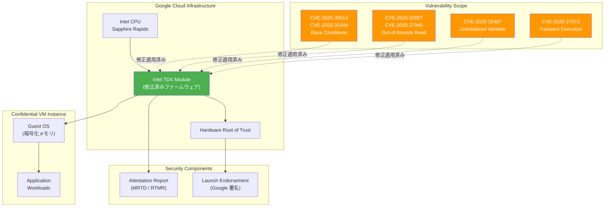

# Confidential VM: Intel TDX Firmware Security Bulletin (GCP-2026-008)

**リリース日**: 2026-02-10
**サービス**: Confidential VM
**機能**: Intel TDX Firmware セキュリティアップデート
**ステータス**: セキュリティ修正適用済み

[このアップデートのインフォグラフィックを見る](https://takech9203.github.io/google-cloud-news-summary/20260210-confidential-vm-intel-tdx-security-gcp-2026-008.html)

## 概要

Google Cloud は、Intel TDX (Trust Domain Extensions) ファームウェアに影響する複数のセキュリティ脆弱性に関するセキュリティ速報 GCP-2026-008 を公開した。これらの脆弱性は、レースコンディション、境界外読み取り、未初期化変数の使用、一時的実行中の機密情報漏洩など、多岐にわたる問題を含んでいる。深刻度は「高 (High)」と評価されている。

対象となるのは、Intel TDX を使用する Confidential VM インスタンス (c3-standard-* マシンタイプおよび a3-highgpu-1g マシンタイプ) を利用するユーザーである。ただし、Google は既に全サーバーフリートに対して修正を適用済みであり、顧客側での対応は不要である。

本速報は Intel の PSIRT 技術アドバイザリ INTEL-TA-01397 に基づくもので、合計 6 件の CVE が対象となっている。これらの脆弱性を悪用するには一般的にシステム上の特権ユーザーアクセスが必要であるが、情報漏洩、権限昇格、またはサービス拒否を引き起こす可能性がある。

**アップデート前の課題**

- Intel TDX ファームウェアにレースコンディション (CVE-2025-30513, CVE-2025-31944) が存在し、タイミング攻撃のリスクがあった
- 境界外読み取り (CVE-2025-32007, CVE-2025-27940) により、メモリ上の意図しないデータが読み取られる可能性があった
- 未初期化変数の使用 (CVE-2025-32467) により、予測不能な動作が発生する可能性があった
- 一時的実行中の機密情報漏洩 (CVE-2025-27572) により、サイドチャネル攻撃のリスクがあった

**アップデート後の改善**

- Google サーバーフリート全体に修正パッチが適用され、6 件すべての CVE が対処された
- 顧客側の対応は不要であり、自動的に保護が適用されている
- Intel TDX によるハードウェアベースのメモリ暗号化と分離の信頼性が回復された

## アーキテクチャ図

Intel TDX ファームウェアに存在した 6 件の脆弱性と、Google Cloud インフラストラクチャにおける Confidential VM の保護アーキテクチャを示す。すべての脆弱性は TDX モジュールレベルで修正が適用されている。

## サービスアップデートの詳細

### 対象脆弱性

1. **レースコンディション (CVE-2025-30513, CVE-2025-31944)**
   - Intel TDX ファームウェア内の並行処理に関する競合状態
   - 特権ユーザーがタイミングの不整合を悪用し、権限昇格やサービス拒否を引き起こす可能性があった

2. **境界外読み取り (CVE-2025-32007, CVE-2025-27940)**
   - ファームウェアが確保されたメモリ領域の外側を読み取る可能性
   - 攻撃者が本来アクセスできない機密データを取得するリスクがあった

3. **未初期化変数の使用 (CVE-2025-32467)**
   - 初期化されていない変数が使用されることにより、予測不能な動作やデータ漏洩の原因となる可能性があった

4. **一時的実行中の機密情報漏洩 (CVE-2025-27572)**
   - CPU の投機的実行に関連するサイドチャネル攻撃のベクトル
   - 一時的な実行中に機密情報が漏洩する可能性があった

### 対応状況

- **深刻度**: High (高)
- **顧客対応**: 不要 (Google が自動的に修正を適用済み)
- **修正範囲**: Google サーバーフリート全体
- **参照**: Intel PSIRT 技術アドバイザリ [INTEL-TA-01397](https://www.intel.com/content/www/us/en/security-center/advisory/intel-sa-01397.html)

## 技術仕様

### 脆弱性一覧

| CVE ID | 脆弱性タイプ | 影響 |
|--------|-------------|------|
| CVE-2025-30513 | レースコンディション | 権限昇格 / サービス拒否 |
| CVE-2025-31944 | レースコンディション | 権限昇格 / サービス拒否 |
| CVE-2025-32007 | 境界外読み取り | 情報漏洩 |
| CVE-2025-27940 | 境界外読み取り | 情報漏洩 |
| CVE-2025-32467 | 未初期化変数の使用 | 情報漏洩 / 予測不能な動作 |
| CVE-2025-27572 | 一時的実行中の情報漏洩 | 機密情報の漏洩 |

### Intel TDX 対応マシンタイプ

| マシンタイプ | CPU プラットフォーム | GPU サポート |
|-------------|---------------------|-------------|
| c3-standard-* | Intel Sapphire Rapids | なし |
| a3-highgpu-1g | Intel Sapphire Rapids | NVIDIA H100 (1 基) |

### Intel TDX の制限事項

- ローカル SSD マシンタイプは非対応
- シャットダウンに標準 VM より長い時間がかかる (メモリサイズに比例)
- NVMe インターフェースの Balanced Persistent Disk のみサポート
- ソールテナントノードグループへのプロビジョニング不可
- 予約 (Reservations) 非対応
- kdump 非対応 (代替としてゲストコンソールログを使用)

## メリット

### ビジネス面

- **運用負荷なし**: Google が自動的にサーバーフリート全体にパッチを適用しており、顧客側での作業や計画停止は一切不要
- **コンプライアンス維持**: Confidential Computing を利用する規制産業 (金融、医療、政府機関) において、セキュリティ要件を継続的に満たすことが可能

### 技術面

- **透過的なセキュリティ対応**: ハードウェアファームウェアレベルの修正がインフラストラクチャレイヤーで適用され、ワークロードへの影響なし
- **ハードウェアベースの信頼性回復**: TDX モジュールの修正により、ハードウェアルートオブトラストを通じたアテステーション (構成証明) の信頼性が維持されている

## デメリット・制約事項

### 制限事項

- 本速報は Intel TDX を使用する Confidential VM のみに関連する。AMD SEV / SEV-SNP を使用するインスタンスには影響しない
- 悪用には一般的に特権ユーザーアクセスが必要であるため、リモートからの直接的な攻撃ベクトルは限定的

### 考慮すべき点

- Intel TDX を使用するワークロードのアテステーションレポートを定期的に検証し、ファームウェアの整合性を確認することが推奨される
- 今後のファームウェアアップデートに伴い、アテステーションレポートの測定値が変更される可能性がある。カスタムのアテステーション検証パイプラインを運用している場合は、Google が管理するランチエンドースメント (launch endorsement) を使用して最新の測定値を確認すること

## ユースケース

### ユースケース 1: 金融機関における機密データ処理

**シナリオ**: 金融機関が Confidential VM (c3-standard-* + Intel TDX) を使用して、顧客の個人情報や取引データを処理している。

**効果**: Google による自動パッチ適用により、サービスの中断なく 6 件の脆弱性が修正された。規制当局への報告においても、クラウドプロバイダーによる迅速なセキュリティ対応を証明できる。

### ユースケース 2: AI/ML ワークロードの保護

**シナリオ**: a3-highgpu-1g マシンタイプ (Intel TDX + NVIDIA H100 GPU) を使用して、機密性の高い学習データで AI モデルをトレーニングしている。

**効果**: GPU を活用した Confidential Computing 環境のファームウェアレベルのセキュリティが強化され、学習データおよびモデルの機密性が引き続き保護される。

## 利用可能リージョン

Intel TDX (c3-standard-* マシンタイプ) は以下のゾーンで利用可能:

- **アジア太平洋**: asia-northeast1-b, asia-south1-b, asia-southeast1-a/b/c
- **ヨーロッパ**: europe-west4-a/b/c, europe-west9-a/b
- **北米**: us-central1-a/b/c, us-east1-c/d, us-east4-a/c, us-east5-b/c, us-west1-a/b

NVIDIA Confidential Computing (a3-highgpu-1g マシンタイプ) は以下のゾーンで利用可能:

- europe-west4-c, us-central1-a, us-east5-a

## 関連サービス・機能

- **[Confidential Space](https://cloud.google.com/confidential-computing/confidential-space/docs/confidential-space-overview)**: Confidential VM をベースとした、マルチパーティ計算のための信頼実行環境。AMD SEV、Intel TDX に対応
- **[Cloud Monitoring](https://cloud.google.com/confidential-computing/confidential-vm/docs/monitoring)**: Confidential VM のステータスやアテステーション結果を監視するための統合モニタリング
- **[Compute Engine セキュリティ速報](https://cloud.google.com/compute/docs/security-bulletins)**: Compute Engine 全体に関連するセキュリティ情報の一元的な参照先
- **[Security Command Center](https://cloud.google.com/security-command-center/docs)**: Confidential Computing が有効でないインスタンスを検知する `CONFIDENTIAL_COMPUTING_DISABLED` ファインディングを提供

## 参考リンク

- [インフォグラフィック](https://takech9203.github.io/google-cloud-news-summary/20260210-confidential-vm-intel-tdx-security-gcp-2026-008.html)
- [公式リリースノート](https://cloud.google.com/release-notes#February_10_2026)
- [Confidential VM セキュリティ速報](https://cloud.google.com/confidential-computing/confidential-vm/docs/security-bulletins#gcp-2026-008)
- [Google Cloud セキュリティ速報](https://cloud.google.com/support/bulletins#gcp-2026-008)
- [Intel PSIRT 技術アドバイザリ INTEL-TA-01397](https://www.intel.com/content/www/us/en/security-center/advisory/intel-sa-01397.html)
- [Confidential VM ドキュメント](https://cloud.google.com/confidential-computing/confidential-vm/docs/about-cvm)
- [Confidential VM サポート対象構成](https://cloud.google.com/confidential-computing/confidential-vm/docs/supported-configurations)
- [Confidential VM ファームウェアの検証](https://cloud.google.com/confidential-computing/confidential-vm/docs/verify-firmware)

## まとめ

GCP-2026-008 は、Intel TDX ファームウェアに存在する 6 件のセキュリティ脆弱性 (深刻度: 高) に対するセキュリティ速報である。Google は既にサーバーフリート全体に修正パッチを適用済みであり、顧客側での対応は不要である。Intel TDX を使用する Confidential VM のユーザーは、引き続きアテステーションレポートの検証を通じてファームウェアの整合性を確認し、今後のセキュリティ速報にも注視することを推奨する。

---

**タグ**: #ConfidentialVM #IntelTDX #Security #GCP-2026-008 #CVE #ファームウェア #Confidential Computing #セキュリティ速報
