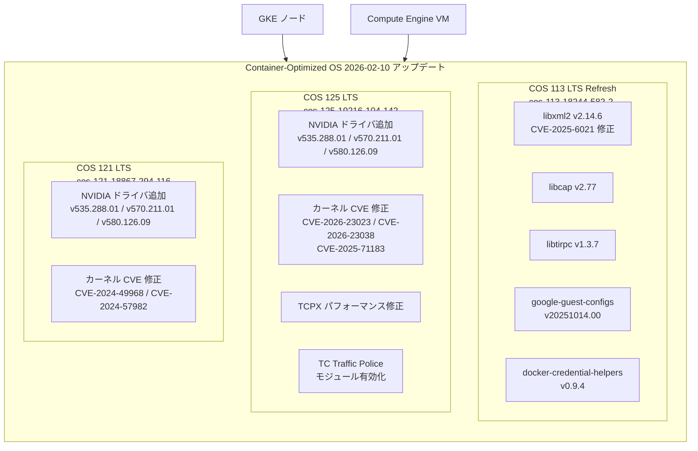

# Container-Optimized OS (COS): 複数イメージのセキュリティ・機能アップデート

**リリース日**: 2026-02-10
**サービス**: Container-Optimized OS (COS)
**機能**: セキュリティパッチ、NVIDIA ドライバ追加、パッケージアップグレード
**ステータス**: Available

[このアップデートのインフォグラフィックを見る](https://takech9203.github.io/google-cloud-news-summary/20260210-container-optimized-os-security-updates.html)

## 概要

2026 年 2 月 10 日、Google Cloud は Container-Optimized OS (COS) の 3 つの LTS マイルストーン (COS 113、COS 121、COS 125) に対して、セキュリティ修正、機能追加、パッケージアップグレードを含む一連のイメージアップデートをリリースした。

COS 125 (cos-125-19216-104-142) では、Linux カーネルの複数の CVE 修正に加え、NVIDIA ドライバ v535.288.01、v570.211.01、v580.126.09 の新規サポートが追加された。また、TC Traffic Police のモジュール有効化や TCPX パフォーマンス問題の修正も含まれている。COS 113 (cos-113-18244-582-2) は LTS Refresh リリースとして、libxml2 の CVE-2025-6021 修正を含む複数パッケージのアップグレードが行われた。COS 121 (cos-121-18867-294-116) でも NVIDIA ドライバの追加とカーネル CVE 修正が提供されている。

本アップデートの対象ユーザーは、GKE ノードや Compute Engine VM で Container-Optimized OS を使用しているすべてのユーザーであり、特に GPU ワークロードを実行しているユーザーにとっては NVIDIA ドライバの更新が重要である。

**アップデート前の課題**

- COS 125 および COS 121 では NVIDIA ドライバ v535.288.01、v570.211.01、v580.126.09 が利用できなかった
- Linux カーネルに CVE-2026-23023、CVE-2026-23038、CVE-2025-71183、CVE-2024-57982、CVE-2024-49968 など複数の脆弱性が存在していた
- COS 113 の libxml2 に CVE-2025-6021 の脆弱性が存在していた
- COS 125 で TCPX のパフォーマンスに問題があった
- COS 125 で TC Traffic Police がモジュールとして有効化されていなかった

**アップデート後の改善**

- COS 125 および COS 121 で NVIDIA ドライバ v535.288.01 (R535)、v570.211.01 (R570)、v580.126.09 (R580) が利用可能になった
- Linux カーネルの複数の CVE が修正され、セキュリティリスクが軽減された
- COS 113 の libxml2 が v2.14.6 に更新され、CVE-2025-6021 が解消された
- COS 125 の TCPX パフォーマンス問題が修正された
- COS 125 で TC Traffic Police がモジュールとして有効化され、トラフィック制御の柔軟性が向上した

## アーキテクチャ図



COS の 3 つの LTS マイルストーンに対するアップデートの全体像を示す。GKE ノードと Compute Engine VM の両方に影響する。

## サービスアップデートの詳細

### COS 113: cos-113-18244-582-2 (LTS Refresh)

これは LTS Refresh リリースであり、中優先度および低優先度のバグ修正とセキュリティ修正が含まれている。

| コンポーネント | バージョン |
|------|------|
| Kernel | COS-6.1.161 |
| Docker | v24.0.9 |
| Containerd | v1.7.27 |

1. **libxml2 セキュリティアップデート (CVE-2025-6021)**
   - dev-libs/libxml2 を v2.14.6 に更新
   - CVE-2025-6021 を解消

2. **sys-libs/libcap アップグレード**
   - v2.77 にアップグレード
   - Linux ケーパビリティの管理ライブラリ

3. **net-libs/libtirpc アップグレード**
   - v1.3.7 にアップグレード
   - TI-RPC (Transport Independent Remote Procedure Call) ライブラリ

4. **app-admin/google-guest-configs アップグレード**
   - v20251014.00 にアップグレード
   - Google Compute Engine ゲスト環境の設定パッケージ

5. **app-containers/docker-credential-helpers アップグレード**
   - v0.9.4 にアップグレード
   - Docker 認証情報ヘルパー

### COS 125: cos-125-19216-104-142

| コンポーネント | バージョン |
|------|------|
| Kernel | COS-6.12.55 |
| Docker | v27.5.1 |
| Containerd | v2.1.5 |

1. **NVIDIA GPU ドライバの追加**
   - v535.288.01 (R535 ブランチ): 長期安定版ドライバ
   - v570.211.01 (R570 ブランチ): 中期安定版ドライバ
   - v580.126.09 (R580 ブランチ): 最新版ドライバ
   - A2、A3、G2、N1 など GPU アタッチ可能なマシンタイプで利用可能

2. **TC Traffic Police モジュールの有効化**
   - Linux カーネルのトラフィック制御機能が拡張された
   - ネットワークトラフィックのポリシング（帯域幅制限）がモジュールとして利用可能に

3. **TCPX パフォーマンス修正**
   - TCPX のパフォーマンス問題を修正
   - 高帯域幅ネットワーキングワークロードの安定性が向上

4. **Linux カーネル CVE 修正**
   - CVE-2026-23023: Linux カーネルの脆弱性を修正
   - CVE-2026-23038: Linux カーネルの脆弱性を修正
   - CVE-2025-71183: Linux カーネルの脆弱性を修正

### COS 121: cos-121-18867-294-116

| コンポーネント | バージョン |
|------|------|
| Kernel | COS-6.6.113 |
| Docker | v27.5.1 |
| Containerd | v2.0.7 |

1. **NVIDIA GPU ドライバの追加**
   - v535.288.01 (R535 ブランチ)
   - v570.211.01 (R570 ブランチ)
   - v580.126.09 (R580 ブランチ)
   - COS 125 と同じドライババージョンが利用可能に

2. **Linux カーネル CVE 修正**
   - CVE-2024-49968: Linux カーネルの脆弱性を修正
   - CVE-2024-57982: Linux カーネルの脆弱性を修正

## 技術仕様

### COS LTS マイルストーン別対応状況

| マイルストーン | イメージ名 | イメージファミリ | サポート終了 |
|------|------|------|------|
| COS 113 LTS | cos-113-18244-582-2 | cos-113-lts | 2026 年 3 月 |
| COS 121 LTS | cos-121-18867-294-116 | cos-121-lts | 2027 年 3 月 |
| COS 125 LTS | cos-125-19216-104-142 | cos-125-lts | 2027 年 9 月 |

### 修正された CVE 一覧

| CVE | 対象コンポーネント | 影響を受けるマイルストーン |
|------|------|------|
| CVE-2025-6021 | dev-libs/libxml2 | COS 113 |
| CVE-2026-23023 | Linux kernel | COS 125 |
| CVE-2026-23038 | Linux kernel | COS 125 |
| CVE-2025-71183 | Linux kernel | COS 125 |
| CVE-2024-49968 | Linux kernel | COS 121 |
| CVE-2024-57982 | Linux kernel | COS 121 |

### NVIDIA GPU ドライバのインストール

```bash
# デフォルトドライバのインストール
sudo cos-extensions install gpu

# 特定バージョンを指定してインストール
sudo cos-extensions install gpu -- -version=580.126.09

# R535 ブランチの最新版をインストール
sudo cos-extensions install gpu -- -version=R535

# 利用可能なドライババージョンの一覧
sudo cos-extensions list
```

## 設定方法

### 前提条件

1. Container-Optimized OS の LTS マイルストーン 85 以降を使用していること
2. GPU を使用する場合、Compute Engine GPU クォータが設定されていること
3. VM に `https://www.googleapis.com/auth/devstorage.read_only` スコープが付与されていること

### 手順

#### ステップ 1: 最新の COS イメージで VM を作成

```bash
# COS 125 LTS の最新イメージで VM を作成 (GPU 付き)
gcloud compute instances create my-gpu-instance \
  --image-family=cos-125-lts \
  --image-project=cos-cloud \
  --accelerator=type=nvidia-l4,count=1 \
  --machine-type=g2-standard-4 \
  --maintenance-policy=TERMINATE \
  --zone=us-central1-a
```

#### ステップ 2: GPU ドライバのインストール

```bash
# VM に接続後、GPU ドライバをインストール
sudo cos-extensions install gpu

# インストールの確認
sudo mount --bind /var/lib/nvidia /var/lib/nvidia
sudo mount -o remount,exec /var/lib/nvidia
/var/lib/nvidia/bin/nvidia-smi
```

#### ステップ 3: 既存ノードのアップデート (GKE の場合)

```bash
# GKE ノードプールのアップグレード (ノードイメージの更新)
gcloud container clusters upgrade CLUSTER_NAME \
  --node-pool=POOL_NAME \
  --zone=ZONE
```

GKE では、ノードの自動アップグレード機能により COS イメージが自動的に更新される。手動でアップグレードする場合は上記コマンドを使用する。

## メリット

### ビジネス面

- **セキュリティリスクの低減**: 複数の Linux カーネル CVE と libxml2 の脆弱性が修正され、コンプライアンス要件への対応が容易になる
- **GPU ワークロードの柔軟性向上**: 3 つの NVIDIA ドライバブランチ (R535/R570/R580) がサポートされ、ワークロードに最適なドライバを選択可能

### 技術面

- **TCPX パフォーマンス改善**: 高帯域幅ネットワーキングを使用するワークロード (特に A3 マシンタイプ) のパフォーマンスが安定化
- **TC Traffic Police**: ネットワークトラフィックの帯域幅制限がモジュールとして利用可能になり、きめ細かなトラフィック制御が可能に
- **最新 NVIDIA ドライバ対応**: v580.126.09 により、最新の CUDA ツールキットとの互換性が確保される

## デメリット・制約事項

### 制限事項

- COS 125 には `a3-highgpu-(1|2|4|8)g` マシンタイプで既知のパフォーマンスおよび機能上の問題がある。`a3-highgpu` マシンタイプでは引き続き COS 121 の使用が推奨される
- COS 113 のサポートは 2026 年 3 月に終了予定であり、早期に COS 121 または COS 125 への移行を検討すべきである
- GPU ドライバは Container-Optimized OS の x86 イメージのみでサポートされ、Arm ベースのイメージでは利用できない

### 考慮すべき点

- LTS Refresh リリース (COS 113) は中・低優先度の修正が含まれるため、リグレッションの可能性があり、ロールアウト時には注意が必要
- GPU ドライバのインストールは VM の再起動ごとに実行する必要がある (startup script または cloud-init で自動化推奨)
- GKE Autopilot クラスタでは COS の自動アップグレードが GKE によって管理されるため、手動でのイメージ選択は不要

## ユースケース

### ユースケース 1: GPU を使用した ML 推論ワークロード

**シナリオ**: GKE Standard クラスタで NVIDIA L4 GPU を使用して機械学習推論を実行しているチームが、最新の CUDA ツールキットとの互換性を確保するために NVIDIA ドライバを更新する必要がある。

**実装例**:
```bash
# COS 125 LTS の最新イメージでノードプールを作成
gcloud container node-pools create gpu-pool \
  --cluster=my-cluster \
  --image-type=cos_containerd \
  --accelerator=type=nvidia-l4,count=1 \
  --machine-type=g2-standard-4 \
  --num-nodes=3 \
  --zone=us-central1-a
```

**効果**: NVIDIA ドライバ v580.126.09 が利用可能になり、CUDA 12.x 系の最新ツールキットとの互換性が確保される。

### ユースケース 2: セキュリティコンプライアンス対応

**シナリオ**: 金融機関のセキュリティチームが、CVE スキャンで検出された Linux カーネルの脆弱性 (CVE-2026-23023、CVE-2026-23038) に対応する必要がある。

**効果**: COS 125 の最新イメージに更新することで、これらの CVE が修正され、脆弱性スキャンのアラートが解消される。

## 関連サービス・機能

- **Google Kubernetes Engine (GKE)**: COS は GKE ノードのデフォルトイメージとして使用される。GKE Autopilot では常に `cos_containerd` が使用される
- **Compute Engine**: GPU アタッチ可能な VM (A2、A3、G2、N1 マシンタイプ) で COS イメージを直接使用可能
- **Cloud Monitoring**: COS ノードのセキュリティ状態やパフォーマンスメトリクスの監視に使用
- **Security Command Center**: COS イメージの CVE 状態を一元管理し、脆弱なイメージを使用しているインスタンスを特定

## 参考リンク

- [インフォグラフィック](https://takech9203.github.io/google-cloud-news-summary/20260210-container-optimized-os-security-updates.html)
- [公式リリースノート](https://docs.cloud.google.com/release-notes#February_10_2026)
- [COS 125 リリースノート](https://cloud.google.com/container-optimized-os/docs/release-notes/m125)
- [COS 121 リリースノート](https://cloud.google.com/container-optimized-os/docs/release-notes/m121)
- [COS 113 リリースノート](https://cloud.google.com/container-optimized-os/docs/release-notes/m113)
- [COS で GPU を実行する方法](https://cloud.google.com/container-optimized-os/docs/how-to/run-gpus)
- [COS バージョニングとライフサイクル](https://cloud.google.com/container-optimized-os/docs/concepts/versioning)
- [GKE ノードイメージ](https://cloud.google.com/kubernetes-engine/docs/concepts/node-images)

## まとめ

今回のアップデートは、Container-Optimized OS の 3 つの LTS マイルストーン全体にわたるセキュリティ強化と機能追加である。特に COS 125 および COS 121 での NVIDIA ドライバ 3 ブランチ (R535/R570/R580) の追加は、GPU ワークロードを運用するユーザーにとって重要な更新である。COS 113 のサポートが 2026 年 3 月に終了するため、COS 113 を使用しているユーザーは早期に COS 121 以降への移行を計画すべきである。セキュリティの観点からは、Linux カーネルの CVE 修正と libxml2 の脆弱性修正が含まれているため、影響を受ける環境では早期のアップデート適用を推奨する。

---

**タグ**: #ContainerOptimizedOS #COS #GKE #Security #NVIDIA #GPU #LinuxKernel #CVE #LTS
