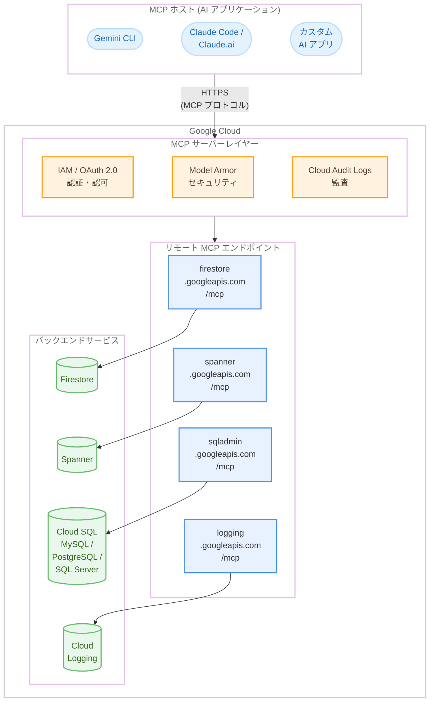

# Google Cloud: 複数サービスの MCP サーバー Preview リリース

**リリース日**: 2026-02-10 (Firestore, Spanner), 2026-02-09 (Cloud SQL, Cloud Logging)
**サービス**: Firestore, Spanner, Cloud SQL, Cloud Logging
**機能**: リモート MCP (Model Context Protocol) サーバー
**ステータス**: Preview

[このアップデートのインフォグラフィックを見る](https://takech9203.github.io/google-cloud-news-summary/20260210-google-cloud-mcp-servers.html)

## 概要

Google Cloud は 2026 年 2 月 9 日から 10 日にかけて、Firestore、Spanner、Cloud SQL (MySQL / PostgreSQL / SQL Server)、Cloud Logging の 4 サービスにおいてリモート MCP (Model Context Protocol) サーバーを Preview としてリリースした。MCP は Anthropic が開発したオープンソースプロトコルであり、LLM や AI アプリケーションが外部データソースに接続する方法を標準化するものである。

今回のリリースにより、Gemini CLI、Gemini Code Assist のエージェントモード、Claude Code、Claude.ai などの AI アプリケーションから、Google Cloud のデータベースサービスやログサービスに対して、標準化された MCP インターフェースを通じて直接操作できるようになった。リモート MCP サーバーは Google のインフラストラクチャ上で動作し、HTTP エンドポイントを提供するため、ローカル MCP サーバーと比較してセキュリティとガバナンスの面で優れた管理機能を備えている。

対象となるのは、AI アプリケーション開発者、データベース管理者、DevOps エンジニア、および AI エージェントを活用したワークフローの構築を検討しているチームである。

**アップデート前の課題**

このアップデート以前に存在していた課題を以下に示す。

- AI アプリケーションから Google Cloud のデータベースやログにアクセスするには、個別の API クライアントライブラリやカスタム統合コードの実装が必要だった
- ローカル MCP サーバー (stdio 通信) は各開発者のマシン上で個別に構成・管理する必要があり、セキュリティポリシーの一元管理が困難だった
- AI エージェントに対するきめ細かいアクセス制御を実装するには、独自の認可レイヤーを構築する必要があった
- AI ツール呼び出しの監査ログを収集する標準的な仕組みが存在しなかった

**アップデート後の改善**

今回のアップデートにより可能になったことを以下に示す。

- AI アプリケーションから標準化された MCP プロトコルを通じて、Firestore、Spanner、Cloud SQL、Cloud Logging に直接接続できるようになった
- Google マネージドのリモート HTTP エンドポイントにより、サーバーの構成・運用管理が不要になった
- IAM による細粒度の認可ポリシーと OAuth 2.0 認証により、エンタープライズ向けのセキュリティ制御が可能になった
- Model Armor によるプロンプトとレスポンスのセキュリティスキャンがオプションで利用可能になった
- Cloud Audit Logs によるツール呼び出しの一元的な監査が可能になった

## アーキテクチャ図



AI アプリケーション (MCP ホスト) からリモート MCP エンドポイントを経由して各 Google Cloud サービスに接続する全体構成を示す。すべての通信は IAM / OAuth 2.0 による認証・認可を経由し、オプションで Model Armor によるセキュリティスキャンと Cloud Audit Logs による監査が適用される。

## サービスアップデートの詳細

### 主要機能

1. **Firestore リモート MCP サーバー (2026-02-10)**
   - Firestore データベースに格納されたドキュメントを AI アプリケーションから操作可能
   - エンドポイント: `https://firestore.googleapis.com/mcp`
   - 提供ツール: `get_document`、`add_document`、`update_document`、`delete_document`、`list_documents`、`list_collections` の 6 ツール
   - Native モードの Enterprise または Standard エディションのデータベースが対象

2. **Spanner リモート MCP サーバー (2026-02-10)**
   - Spanner インスタンスおよびデータベースを AI アプリケーションから管理・操作可能
   - エンドポイント: `https://spanner.googleapis.com/mcp`
   - 提供ツール: `get_instance`、`list_instances`、`list_configs`、`create_instance`、`delete_instance`、`create_database`、`drop_database`、`get_database_ddl`、`list_databases`、`create_session`、`execute_sql`、`commit`、`update_database_schema`、`get_operation` の 14 ツール
   - インスタンスのプロビジョニングからスキーマ管理、SQL 実行まで幅広い操作をサポート

3. **Cloud SQL リモート MCP サーバー (2026-02-09)**
   - Cloud SQL for MySQL、PostgreSQL、SQL Server のインスタンスを AI アプリケーションから操作可能
   - エンドポイント: `https://sqladmin.googleapis.com/mcp`
   - 提供ツール: `list_instances`、`get_instance`、`create_instance`、`execute_sql`、`get_operation`、`create_user`、`update_user`、`clone_instance`、`update_instance`、`list_users`、`import_data` の 11 ツール
   - DDL、DCL、DQL、DML を含むあらゆる SQL ステートメントの実行が可能 (SQL Server の `execute_sql` は未対応)

4. **Cloud Logging MCP サーバー (2026-02-09)**
   - Cloud Logging のログエントリを AI エージェントや AI アプリケーションから検索・取得可能
   - エンドポイント: `https://logging.googleapis.com/mcp`
   - 提供ツール: `list_log_entries` の 1 ツール
   - 重大度、リソースタイプ、テキスト内容などによるフィルタリングが可能
   - 注意: 1 回の呼び出しで指定できるリソースプロジェクトは 1 つのみ

## 技術仕様

### MCP エンドポイント一覧

各サービスのエンドポイントと提供ツール数を以下の表にまとめる。

| サービス | MCP エンドポイント | ツール数 | リリース日 |
|---------|-------------------|---------|-----------|
| Firestore | `https://firestore.googleapis.com/mcp` | 6 | 2026-02-10 |
| Spanner | `https://spanner.googleapis.com/mcp` | 14 | 2026-02-10 |
| Cloud SQL | `https://sqladmin.googleapis.com/mcp` | 11 | 2026-02-09 |
| Cloud Logging | `https://logging.googleapis.com/mcp` | 1 | 2026-02-09 |

### 共通セキュリティ機能

すべての Google Cloud リモート MCP サーバーに共通するセキュリティ機能を以下の表にまとめる。

| 機能 | 説明 |
|------|------|
| MCP ディスカバリ | プロジェクトで有効化後、`tools/list` メソッドでツールを自動検出 |
| 管理制御 | 組織ポリシーによる組織・フォルダ・プロジェクトレベルでの MCP 使用制御 |
| 認証・認可 | OAuth 2.0 + IAM による MCP 認可仕様準拠の認証 |
| 細粒度の認可 | IAM によるリソースレベルのアクセス制御 |
| Model Armor | プロンプト・レスポンスのセキュリティスキャン (オプション) |
| 監査ログ | Cloud Audit Logs によるツール呼び出しの記録 |

### 認証設定

MCP クライアントの設定例 (Firestore の場合) を以下に示す。

```json
{
  "mcpServers": {
    "firestore": {
      "url": "https://firestore.googleapis.com/mcp",
      "transport": "http",
      "auth": {
        "type": "oauth2",
        "scope": "https://www.googleapis.com/auth/cloud-platform"
      }
    }
  }
}
```

### 各サービスの OAuth スコープ

各サービスの MCP 接続に必要な OAuth スコープを以下の表にまとめる。

| サービス | OAuth スコープ |
|---------|--------------|
| Firestore | `https://www.googleapis.com/auth/cloud-platform` |
| Spanner | `https://www.googleapis.com/auth/spanner.admin`、`https://www.googleapis.com/auth/spanner.data` |
| Cloud SQL | IAM 権限ベース (`cloudsql.instances.executeSql` など) |
| Cloud Logging | `https://www.googleapis.com/auth/cloud-platform` |

## 設定方法

### 前提条件

1. Google Cloud プロジェクトが作成済みであること
2. 対象サービス (Firestore、Spanner、Cloud SQL、Cloud Logging) が有効化済みであること
3. gcloud CLI がインストール・初期化済みであること
4. 適切な IAM ロールが付与されていること

### 手順

#### ステップ 1: MCP サーバーの有効化

```bash
# Firestore MCP サーバーの有効化
gcloud beta services mcp enable firestore.googleapis.com \
  --project=PROJECT_ID

# Spanner MCP サーバーの有効化
gcloud beta services mcp enable spanner.googleapis.com \
  --project=PROJECT_ID

# Cloud SQL MCP サーバーの有効化
gcloud beta services mcp enable sqladmin.googleapis.com \
  --project=PROJECT_ID

# Cloud Logging MCP サーバーの有効化
gcloud beta services mcp enable logging.googleapis.com \
  --project=PROJECT_ID
```

`PROJECT_ID` を対象の Google Cloud プロジェクト ID に置き換える。対象サービスが未有効化の場合、サービスの有効化を先に求められる。

#### ステップ 2: IAM ロールの付与

```bash
# MCP ツール呼び出し権限 (全サービス共通)
gcloud projects add-iam-policy-binding PROJECT_ID \
  --member="user:USER_EMAIL" \
  --role="roles/mcp.toolUser"

# Firestore の場合: ドキュメントの読み書き権限
gcloud projects add-iam-policy-binding PROJECT_ID \
  --member="user:USER_EMAIL" \
  --role="roles/datastore.user"
```

セキュリティのベストプラクティスとして、MCP ツールを使用するエージェントには専用の ID を作成し、アクセスを制御・監視することが推奨される。

#### ステップ 3: MCP クライアントの設定

AI アプリケーション (Gemini CLI、Claude など) で MCP サーバーへの接続を設定する。サーバー名、URL、認証情報を入力する。設定方法の詳細は対象の AI アプリケーションのドキュメントを参照すること。

## メリット

### ビジネス面

- **開発の迅速化**: AI アプリケーションからデータベースへのアクセスをコーディングレスで実現できるため、プロトタイピングや開発の速度が大幅に向上する
- **運用コスト削減**: Google マネージドのリモートエンドポイントにより、MCP サーバーのインフラ管理が不要になる
- **コンプライアンス対応**: IAM、OAuth 2.0、Cloud Audit Logs による認証・認可・監査の一元管理が可能になる

### 技術面

- **標準化されたインターフェース**: MCP プロトコルに準拠しており、対応する任意の AI アプリケーションから利用可能である
- **エンタープライズセキュリティ**: Model Armor によるプロンプトインジェクション防止、組織ポリシーによる MCP 使用制御など、多層的なセキュリティ機能を提供する
- **柔軟なツール構成**: 読み取り専用ツールと読み書きツールを IAM で個別に制御できるため、環境ごとに適切な権限を設定できる

## デメリット・制約事項

### 制限事項

- Preview ステータスのため、サポートが限定される場合がある。本番環境への導入は GA 昇格後に検討することが推奨される
- Firestore MCP サーバーは Native モードの Enterprise または Standard エディションのみ対応しており、Datastore モードは未サポートである
- Cloud SQL の `execute_sql` ツールは SQL Server では利用できない
- Cloud SQL の `execute_sql` ツールには 30 秒のタイムアウトとレスポンス 10 MB の制限がある
- Cloud Logging MCP サーバーは 1 回の呼び出しで 1 つのリソースプロジェクトのみ指定可能である
- Spanner MCP サーバーは API キーによる認証を受け付けない

### 考慮すべき点

- クライアント認証情報のプロジェクトとリソースのプロジェクトが異なる場合、両方のプロジェクトで MCP サーバーの有効化が必要である
- AI エージェントに過剰な権限を付与しないよう、最小権限の原則に基づいた IAM 設定が重要である
- Model Armor の有効化時、MCP トラフィックが自然言語データを含まない場合はプロンプトインジェクション・ジェイルブレイクフィルタの有効化は不要である

## ユースケース

### ユースケース 1: AI エージェントによるデータベース開発支援

**シナリオ**: 開発者が Gemini CLI や Claude Code を使用して、Spanner データベースのスキーマ設計とサンプルデータの投入を AI エージェントに依頼する。

**実装例**:

```
プロンプト例:
「PROJECT_ID プロジェクトの us-central1 リージョンに
Spanner インスタンスを作成し、在庫管理用データベースを作成して
サンプルデータを 5 件投入してください。」
```

AI エージェントは `create_instance` -> `create_database` -> `create_session` -> `execute_sql` -> `commit` の順にツールを呼び出し、一連の操作を自動実行する。

**効果**: データベースのプロビジョニングからスキーマ作成、データ投入までの作業を自然言語による指示で完了でき、開発のイテレーション速度が向上する。

### ユースケース 2: AI エージェントによるログ分析とデバッグ

**シナリオ**: 障害発生時に AI エージェントが Cloud Logging の `list_log_entries` ツールを使用して、関連するエラーログを自動検索・分析し、根本原因の特定を支援する。

**効果**: 手動でログエクスプローラーを操作する代わりに、自然言語で「過去 1 時間の ERROR レベルのログを検索して」と指示するだけで、AI エージェントが適切なフィルタを構築してログを取得・分析する。障害対応時間の短縮に貢献する。

### ユースケース 3: Firestore を活用した AI アプリケーション開発

**シナリオ**: AI アプリケーション開発者が、Firestore MCP サーバーを利用して、会話履歴やユーザープロファイルなどのドキュメントデータにリアルタイムでアクセスするエージェントを構築する。

**効果**: AI エージェントがユーザーのコンテキスト情報を Firestore から直接取得できるため、よりパーソナライズされた応答が可能になる。カスタム API レイヤーの構築が不要になり、開発工数を削減できる。

## 料金

今回リリースされた MCP サーバー機能自体の追加料金に関する公式情報は、本レポート作成時点で確認できていない。各サービスの基盤となるリソース (Firestore のドキュメント操作、Spanner のコンピュートノード、Cloud SQL のインスタンス、Cloud Logging のログ取り込み) に対する既存の料金体系が適用されると考えられる。

Data Access 監査ログを有効化した場合、追加のログ使用量に対して課金が発生する可能性がある。

料金の詳細は各サービスの料金ページを参照すること。

- [Firestore の料金](https://cloud.google.com/firestore/pricing)
- [Spanner の料金](https://cloud.google.com/spanner/pricing)
- [Cloud SQL の料金](https://cloud.google.com/sql/pricing)
- [Cloud Logging の料金](https://cloud.google.com/stackdriver/pricing)

## 利用可能リージョン

Google Cloud リモート MCP エンドポイントはグローバルまたはリージョナルで提供される。各サービスの MCP エンドポイントの利用可能リージョンについては、対応するサービスの MCP リファレンスドキュメントを参照すること。

## 関連サービス・機能

- **[BigQuery MCP サーバー](https://cloud.google.com/bigquery/docs/use-bigquery-mcp)**: BigQuery データの分析・操作にも MCP サーバーが提供されている
- **[Compute Engine MCP サーバー](https://cloud.google.com/compute/docs/use-compute-engine-mcp)**: VM インスタンスの管理にも MCP サーバーが提供されている
- **[GKE MCP サーバー](https://cloud.google.com/kubernetes-engine/docs/how-to/use-gke-mcp)**: Kubernetes クラスタの管理にも MCP サーバーが提供されている
- **[Cloud Monitoring MCP サーバー](https://cloud.google.com/monitoring/api/ref_v3/mcp)**: メトリクスの取得にも MCP サーバーが提供されている
- **[Model Armor](https://cloud.google.com/model-armor/model-armor-mcp-google-cloud-integration)**: MCP ツール呼び出しとレスポンスのセキュリティ保護を提供する
- **[MCP Toolbox for Databases](https://googleapis.github.io/genai-toolbox/)**: ローカル MCP サーバーとしてデータベース接続を提供するオープンソースツール

## 参考リンク

- [インフォグラフィック](https://takech9203.github.io/google-cloud-news-summary/20260210-google-cloud-mcp-servers.html)
- [公式リリースノート](https://cloud.google.com/release-notes#February_10_2026)
- [Google Cloud MCP サーバー概要](https://cloud.google.com/mcp/overview)
- [サポート対象プロダクト一覧](https://cloud.google.com/mcp/supported-products)
- [MCP サーバーの有効化・無効化](https://cloud.google.com/mcp/enable-disable-mcp-servers)
- [MCP サーバーへの認証](https://cloud.google.com/mcp/authenticate-mcp)
- [AI アプリケーションでの MCP 設定](https://cloud.google.com/mcp/configure-mcp-ai-application)
- [Firestore MCP サーバーの使用](https://cloud.google.com/firestore/native/docs/use-firestore-mcp)
- [Firestore MCP リファレンス](https://cloud.google.com/firestore/docs/reference/mcp)
- [Spanner MCP サーバーの使用](https://cloud.google.com/spanner/docs/use-spanner-mcp)
- [Spanner MCP リファレンス](https://cloud.google.com/spanner/docs/reference/mcp)
- [Cloud SQL for MySQL MCP サーバーの使用](https://cloud.google.com/sql/docs/mysql/use-cloudsql-mcp)
- [Cloud SQL for PostgreSQL MCP サーバーの使用](https://cloud.google.com/sql/docs/postgres/use-cloudsql-mcp)
- [Cloud SQL for SQL Server MCP サーバーの使用](https://cloud.google.com/sql/docs/sqlserver/use-cloudsql-mcp)
- [Cloud Logging MCP リファレンス](https://cloud.google.com/logging/docs/reference/v2/mcp)
- [MCP 監査ログ](https://cloud.google.com/mcp/audit-logging)
- [組織レベルでの MCP 使用制御](https://cloud.google.com/mcp/control-mcp-use-organization)

## まとめ

Google Cloud が Firestore、Spanner、Cloud SQL、Cloud Logging の 4 サービスにおいてリモート MCP サーバーを Preview リリースしたことは、AI エージェントとクラウドサービスの統合における大きな前進である。エンタープライズレベルのセキュリティ・ガバナンス機能を備えたマネージド MCP エンドポイントにより、AI アプリケーション開発者はカスタム統合コードを書くことなく、自然言語ベースのインターフェースでデータベース操作やログ分析を実現できる。現在 Preview ステータスであるため、まずは開発・検証環境での評価を開始し、GA 昇格後の本番導入に向けた準備を進めることを推奨する。

---

**タグ**: #MCP #Firestore #Spanner #CloudSQL #CloudLogging #AI #Agents #Preview #ModelContextProtocol #GoogleCloud
