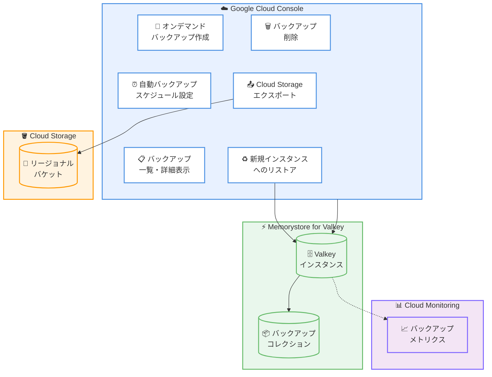

# Memorystore for Valkey: バックアップ管理が GA

**リリース日**: 2026-02-10
**サービス**: Memorystore for Valkey
**機能**: Google Cloud コンソールでのバックアップ管理
**ステータス**: GA (Generally Available)

[このアップデートのインフォグラフィックを見る](infographic/20260210-memorystore-valkey-backup-management.html)

## 概要

Memorystore for Valkey のバックアップ管理機能が GA (Generally Available) となり、Google Cloud コンソールからバックアップの作成、一覧表示、削除、エクスポート、およびリストアの操作が正式にサポートされました。これにより、gcloud CLI や REST API を使用せずに、GUI ベースで直感的にバックアップのライフサイクルを管理できるようになりました。

Memorystore for Valkey は Google Cloud のフルマネージド Valkey サービスであり、Cluster Mode Enabled と Cluster Mode Disabled の両方のインスタンスをサポートしています。バックアップ機能は、ディザスタリカバリ、データマイグレーション、データ共有、コンプライアンス対応など、複数のユースケースに対応します。

今回の GA 昇格により、本番環境での Google Cloud コンソールによるバックアップ管理が SLA の対象として正式にサポートされ、エンタープライズワークロードでの利用に適した信頼性が確保されました。

**アップデート前の課題**

今回のアップデート以前は、以下の制限がありました。

- バックアップ管理を Google Cloud コンソールから行う機能は Preview 段階であり、本番環境での利用には SLA が適用されなかった
- コンソール操作の安定性や機能の完全性が保証されていなかったため、運用チームが gcloud CLI に依存する場面が多かった
- Preview 段階の機能は仕様変更の可能性があり、運用手順の確立が難しかった

**アップデート後の改善**

今回のアップデートにより、以下の改善が実現しました。

- Google Cloud コンソールでのバックアップ管理が GA となり、SLA の対象として正式サポートされた
- オンデマンドバックアップの作成、自動バックアップスケジュールの設定、バックアップの一覧表示・削除・エクスポート・リストアのすべての操作がコンソールから実行可能になった
- 本番環境でのコンソールベースの運用が安心して行えるようになり、運用の効率化が期待できる

## アーキテクチャ図



Google Cloud コンソールから Memorystore for Valkey インスタンスのバックアップ操作を一元管理し、Cloud Storage へのエクスポートや Cloud Monitoring との連携が可能なアーキテクチャを示しています。

## サービスアップデートの詳細

### 主要機能

1. **オンデマンドバックアップの作成**
   - Google Cloud コンソールからインスタンスの [Backups] パネルにアクセスし、[Create backup] をクリックするだけでバックアップを即座に作成可能
   - バックアップに任意の名前を付与でき、名前を指定しない場合は日時スタンプが自動的に設定される

2. **自動バックアップスケジュールの設定**
   - インスタンス作成時または既存インスタンスに対して、日次の自動バックアップスケジュールをコンソールから設定可能
   - 保持期間は 1 日から 365 日まで設定可能 (デフォルトは 35 日)
   - バックアップ開始時刻を 1 時間単位で UTC 時間で指定可能
   - スケジュールの有効化・無効化もコンソールから切り替え可能

3. **バックアップの一覧表示と詳細確認**
   - コンソールのサイドナビゲーションパネルの [Backups] から、バックアップコレクションおよび個別バックアップの一覧を確認可能
   - インスタンスに紐づくバックアップコレクション内の全バックアップを視覚的に管理可能

4. **バックアップの削除**
   - コンソールから [More actions] メニューの [Delete] を選択し、確認ダイアログで "delete" と入力することで安全に削除可能
   - インスタンスを削除してもバックアップコレクションは自動削除されないため、不要なバックアップの手動削除が必要

5. **Cloud Storage へのバックアップエクスポート**
   - コンソールから [More actions] メニューの [Export] を選択し、宛先の Cloud Storage バケットを指定してエクスポート可能
   - エクスポート先のバケットはリージョナルバケットであり、バックアップと同一リージョンに存在する必要がある
   - Memorystore for Valkey サービスエージェントに Storage Admin ロールの付与が必要

6. **バックアップからの新規インスタンスへのリストア**
   - マネージドバックアップまたは Cloud Storage 上の RDB ファイルから新規インスタンスを作成可能
   - コンソールからバックアップの [Import into new instance] を選択し、インスタンスの構成を指定して復元
   - バックアップ元のノードタイプ、インスタンスサイズ、レプリカ数が自動的に設定される (増加は可能だが、減少は非推奨)

## 技術仕様

### バックアップの仕様

| 項目 | 詳細 |
|------|------|
| バックアップの種類 | オンデマンドバックアップ、自動バックアップ (日次) |
| 保持期間 | 1 日 ~ 365 日 (デフォルト: 35 日、TTL 未指定時のデフォルト: 100 年) |
| バックアップコレクション | インスタンスごとに 1 つのバックアップコレクションで管理 |
| インスタンス削除時の動作 | バックアップコレクションは自動削除されず、保持期間中は保持される (最大 365 日) |
| リストア先 | 新規インスタンスのみ (既存インスタンスへのインポートは不可) |
| エクスポート先 | リージョナル Cloud Storage バケット (バックアップと同一リージョン) |
| サポートバージョン | Valkey 7.2、8.0、9.0 (Preview) |

### 必要な IAM ロール

バックアップ操作に必要な IAM ロールは以下の通りです。

| 操作 | 必要なロール |
|------|-------------|
| 全バックアップ操作 (作成・削除・エクスポートなど) | Memorystore Admin (`roles/memorystore.admin`) |
| 全バックアップ操作 (作成・削除・エクスポートなど) | Memorystore Editor (`roles/memorystore.editor`) |
| バックアップの表示・エクスポート | Memorystore Viewer (`roles/memorystore.viewer`) |

### Cloud Storage エクスポートに必要なサービスエージェント権限

```bash
# Memorystore for Valkey サービスエージェントに Storage Admin ロールを付与
gcloud storage buckets add-iam-policy-binding gs://BUCKET_NAME \
  --member=serviceAccount:service-PROJECT_NUMBER@gcp-sa-memorystore.iam.gserviceaccount.com \
  --role=roles/storage.admin
```

## 設定方法

### 前提条件

1. Memorystore for Valkey インスタンスが作成済みであること
2. Memorystore Admin または Memorystore Editor ロールが付与されていること
3. エクスポートを行う場合は、同一リージョンのリージョナル Cloud Storage バケットが作成済みであること

### 手順

#### ステップ 1: オンデマンドバックアップの作成

Google Cloud コンソールから以下の手順でバックアップを作成できます。

1. Google Cloud コンソールで [Memorystore for Valkey] ページに移動
2. バックアップを取得するインスタンスの ID をクリック
3. サイドナビゲーションパネルの [Backups] をクリック
4. [Create backup] をクリック
5. バックアップの名前を入力 (省略可) し、[Create backup] をクリック

gcloud CLI を使用する場合は以下のコマンドを実行します。

```bash
gcloud memorystore instances backup INSTANCE_ID \
  --backup-id=BACKUP_ID \
  --ttl=TTL_PERIOD \
  --project=PROJECT_ID \
  --location=REGION_ID
```

#### ステップ 2: 自動バックアップスケジュールの有効化

既存インスタンスに対して自動バックアップを有効化するには、以下の手順を実行します。

1. Google Cloud コンソールで [Memorystore for Valkey] ページに移動
2. 対象インスタンスの ID をクリック
3. サイドナビゲーションパネルの [Backups] をクリック
4. [Settings] セクションの [Automated daily backups] の横にある [Edit] をクリック
5. [Automated daily backups] チェックボックスを選択
6. 保持日数とバックアップ開始時刻を設定し、[Save] をクリック

gcloud CLI を使用する場合は以下のコマンドを実行します。

```bash
gcloud memorystore instances update INSTANCE_ID \
  --automated-backup-config-mode=enabled \
  --fixed-frequency-schedule-start-time-hours=START_TIME \
  --automated-backup-config-retention=RETENTION_POLICY
```

#### ステップ 3: バックアップからのリストア

バックアップから新規インスタンスを作成するには、以下の手順を実行します。

1. Google Cloud コンソールで [Memorystore for Valkey] ページに移動
2. バックアップを含むインスタンスの ID をクリック
3. サイドナビゲーションパネルの [Backups] をクリック
4. リストアしたいバックアップの [More actions] メニューから [Import into new instance] を選択
5. インスタンスの構成 (名前、リージョン、ノードタイプ、シャード数など) を設定
6. [Create instance] をクリック

## メリット

### ビジネス面

- **運用効率の向上**: GUI ベースの操作により、CLI に精通していないチームメンバーでもバックアップ運用が可能になり、運用の属人化を解消できる
- **SLA による信頼性保証**: GA となったことで本番環境での利用が正式にサポートされ、エンタープライズワークロードに求められる信頼性が確保された
- **コンプライアンス対応の簡素化**: 定期的なバックアップの設定・確認・管理がコンソールから容易に行えるため、データ保持ポリシーの遵守が容易になる

### 技術面

- **直感的なバックアップライフサイクル管理**: オンデマンドバックアップ、自動スケジュール、エクスポート、リストア、削除の全操作をコンソールから一元管理可能
- **Cloud Storage 連携**: バックアップを Cloud Storage にエクスポートすることで、長期保存やリージョン間のデータ移動が可能
- **Cloud Monitoring 連携**: バックアップおよびインポート操作のメトリクスを Cloud Monitoring で監視可能
- **柔軟なリストアオプション**: マネージドバックアップからのリストアと Cloud Storage 上の RDB ファイルからのリストアの 2 つの方法をサポート

## デメリット・制約事項

### 制限事項

- 既存インスタンスへのバックアップデータのインポートはサポートされていない (新規インスタンスの作成のみ)
- Cluster Mode Enabled インスタンスは単一データベースのみサポートしており、複数データベースを含むバックアップのインポートは不可
- バックアップのエクスポート先 Cloud Storage バケットはリージョナルバケットであり、バックアップと同一リージョンに存在する必要がある
- インスタンスの更新操作が進行中の場合、バックアップ操作は拒否される
- メンテナンス操作とバックアップ操作が同時に発生した場合、バックアップがスキップされることがある

### 考慮すべき点

- バックアップにはサイズとリージョンに基づくストレージ料金が発生し、最低 24 時間の課金が適用される
- インスタンスを削除してもバックアップコレクションは自動削除されないため、不要なバックアップは手動で削除する必要がある
- リストア時にバックアップ元のノードタイプ・インスタンスサイズ・レプリカ数を減少させることは非推奨 (インポートの問題が発生する可能性がある)

## ユースケース

### ユースケース 1: ディザスタリカバリ計画の構築

**シナリオ**: ミッションクリティカルなキャッシュデータを保持する Memorystore for Valkey インスタンスに対して、日次の自動バックアップを設定し、障害発生時に迅速にデータを復元する。

**実装例**:

```bash
# 日次自動バックアップを有効化 (毎日 UTC 2:00、保持期間 30 日)
gcloud memorystore instances update my-valkey-instance \
  --automated-backup-config-mode=enabled \
  --fixed-frequency-schedule-start-time-hours=2 \
  --automated-backup-config-retention=30d
```

**効果**: 障害発生時にバックアップから新規インスタンスを作成し、データ損失を最小限に抑えた復旧が可能になる。保持期間内の任意の時点のバックアップからリストアできる。

### ユースケース 2: リージョン間のデータマイグレーション

**シナリオ**: 東京リージョン (asia-northeast1) の Memorystore for Valkey インスタンスのデータを、大阪リージョン (asia-northeast2) に移行する。

**実装例**:

```bash
# 1. バックアップを Cloud Storage にエクスポート
gcloud memorystore backup-collections backups export my-backup \
  --backup-collection=my-collection \
  --location=asia-northeast1 \
  --gcs-bucket=my-migration-bucket

# 2. エクスポートされた RDB ファイルを大阪リージョンのバケットにコピー
gcloud storage cp gs://my-migration-bucket/backup-folder/* \
  gs://my-osaka-bucket/

# 3. 大阪リージョンで新規インスタンスを作成しデータをインポート
gcloud memorystore instances create my-osaka-instance \
  --gcs-source-uris=gs://my-osaka-bucket/backup.rdb \
  --location=asia-northeast2 \
  --shard-count=3
```

**効果**: Cloud Storage を介したリージョン間のデータ移行により、マルチリージョン構成の構築やリージョン移行を計画的に実施できる。

## 料金

Memorystore for Valkey のバックアップには、バックアップのサイズとリージョンに基づくストレージ料金が発生します。各バックアップには最低 24 時間の課金が適用されます。

詳細な料金については、Memorystore for Valkey の料金ページを参照してください。

また、Memorystore for Valkey では Committed Use Discounts (CUDs) が提供されており、1 年契約で 20% 割引、3 年契約で 40% 割引が適用されます。CUD は Memorystore for Memcached、Memorystore for Redis、Memorystore for Redis Cluster を含むすべての Memorystore サービスで利用可能です。

## 利用可能リージョン

Memorystore for Valkey は全世界 40 以上のリージョンで利用可能です。主要なリージョンは以下の通りです。

| リージョン | 説明 |
|-----------|------|
| asia-northeast1 | 東京 |
| asia-northeast2 | 大阪 |
| asia-northeast3 | ソウル |
| asia-southeast1 | シンガポール |
| us-central1 | アイオワ |
| us-east1 | サウスカロライナ |
| us-west1 | オレゴン |
| europe-west1 | ベルギー |
| europe-west3 | フランクフルト |

全リージョンの一覧は [Memorystore for Valkey のロケーションページ](https://cloud.google.com/memorystore/docs/valkey/locations) を参照してください。

## 関連サービス・機能

- **Cloud Storage**: バックアップのエクスポート先として使用。リージョナルバケットへのバックアップデータの保存により、長期保存やクロスリージョン移行が可能
- **Cloud Monitoring**: バックアップおよびインポート操作のメトリクスを監視。バックアップの成功・失敗を可視化し、運用の信頼性を向上
- **Cloud KMS (CMEK)**: Customer-Managed Encryption Keys を使用してバックアップデータを暗号化。コンプライアンス要件に対応した暗号化キーの管理が可能
- **IAM**: Memorystore Admin、Editor、Viewer ロールによるバックアップ操作のアクセス制御。最小権限の原則に基づいた運用が可能
- **Memorystore for Valkey の永続化機能 (AOF/RDB)**: バックアップとは別に、RDB スナップショットや AOF ログによるデータ永続化を提供。バックアップと併用することでデータ保護を強化

## 参考リンク

- [インフォグラフィック](infographic/20260210-memorystore-valkey-backup-management.html)
- [公式リリースノート](https://cloud.google.com/release-notes#February_10_2026)
- [バックアップの管理 - ドキュメント](https://cloud.google.com/memorystore/docs/valkey/manage-backups)
- [バックアップの概要 - ドキュメント](https://cloud.google.com/memorystore/docs/valkey/backups)
- [Memorystore for Valkey 概要](https://cloud.google.com/memorystore/docs/valkey/product-overview)
- [料金ページ](https://cloud.google.com/memorystore/valkey/pricing)
- [IAM アクセス制御](https://cloud.google.com/memorystore/docs/valkey/access-control)
- [REST API リファレンス](https://cloud.google.com/memorystore/docs/valkey/reference/rest)

## まとめ

Memorystore for Valkey のバックアップ管理が GA となり、Google Cloud コンソールからのバックアップ操作が本番環境で正式にサポートされました。オンデマンドバックアップの作成、自動スケジュールの設定、Cloud Storage へのエクスポート、バックアップからのリストアなど、包括的なバックアップライフサイクル管理が GUI から実行可能です。ディザスタリカバリ計画の構築やコンプライアンス対応を進めている場合は、自動バックアップスケジュールの設定と適切な保持期間の設定を推奨します。

---

**タグ**: #Memorystore #Valkey #Backup #GA #DisasterRecovery #DataProtection #GoogleCloud
