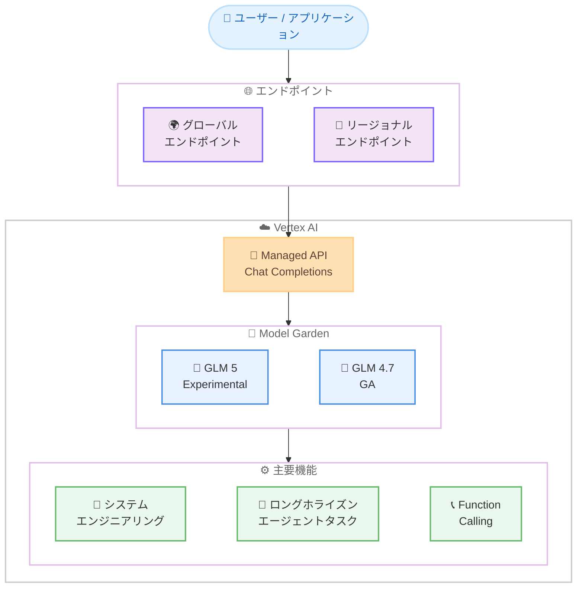

# Generative AI on Vertex AI: GLM 5 Experimental リリース

**リリース日**: 2026-02-10
**サービス**: Generative AI on Vertex AI
**機能**: GLM 5 Experimental
**ステータス**: Experimental

📊 [このアップデートのインフォグラフィックを見る](https://takech9203.github.io/google-cloud-news-summary/20260210-vertex-ai-glm-5.html)

## 概要

Google Cloud は 2026 年 2 月 10 日、Vertex AI の Model Garden において GLM 5 を Experimental ステータスで公開した。GLM 5 は、複雑なシステムエンジニアリングおよびロングホライズン (長期的な計画と実行が求められる) エージェントタスクを主要なターゲットとして設計されたモデルである。

GLM 5 は Vertex AI Model Garden 上でマネージド API として提供されており、サーバーレスで利用できるため、インフラストラクチャのプロビジョニングや管理は不要である。これは、GLM シリーズの前世代モデルである GLM 4.7 (2026 年 1 月 6 日に Experimental としてリリースされ、1 月 20 日に GA 昇格) の後継にあたるモデルであり、コーディングやツール使用、複雑な推論に強みを持っていた GLM 4.7 からさらに進化し、システムエンジニアリングやエージェントタスクへの特化が図られている。

主な対象ユーザーは、複雑なマルチステップの自動化ワークフローを構築する AI エンジニアやシステムアーキテクト、エージェントフレームワークを活用したアプリケーション開発者である。

**アップデート前の課題**

GLM 5 リリース以前のモデルに関する制約を以下に示す。

- GLM 4.7 はコーディング、ツール使用、複雑な推論に設計されていたが、複雑なシステムエンジニアリングタスクに特化した設計ではなかった
- ロングホライズンのエージェントタスク (長期間にわたる計画と段階的な実行が必要なタスク) に最適化されたモデルが Model Garden 上に限られていた
- 複雑なシステム設計タスクでは、複数のモデルやツールを組み合わせる必要があった

**アップデート後の改善**

今回のリリースにより以下が可能になった。

- 複雑なシステムエンジニアリングタスクに特化したモデルを Vertex AI のマネージド API として直接利用できるようになった
- ロングホライズンのエージェントタスクに最適化されたモデルにより、長期的な計画と段階的な実行を伴うワークフローの精度向上が期待できる
- GLM シリーズの進化により、コーディング・推論能力に加えてシステムエンジニアリング領域でもマネージドモデルの選択肢が拡大した

## アーキテクチャ図



この図は、ユーザーが Vertex AI のマネージド API を通じて GLM 5 モデルにアクセスする全体的なアーキテクチャを示している。GLM 5 は Model Garden 内でマネージド API として提供され、グローバルエンドポイントまたはリージョナルエンドポイント経由でリクエストを送信できる。

## サービスアップデートの詳細

### 主要機能

1. **複雑なシステムエンジニアリング対応**
   - 大規模システムの設計・構築に関わる複雑なタスクに特化した推論能力を備えている
   - マルチステップのシステム設計や構成タスクに対応

2. **ロングホライズンエージェントタスク**
   - 長期的な計画立案と段階的な実行が必要なエージェントタスクに最適化されている
   - 複数のステップにまたがるワークフローの管理と実行をサポート

3. **マネージド API としての提供**
   - サーバーレスで利用可能なため、インフラストラクチャの管理が不要
   - Vertex AI の Chat Completions API (OpenAI 互換) を通じてアクセス可能
   - ストリーミングおよび非ストリーミングの両方のレスポンス形式に対応

## 技術仕様

### GLM 5 と GLM 4.7 の比較

GLM 5 の仕様は Experimental ステータスのため一部未公開であるが、前世代の GLM 4.7 の仕様と比較して以下の通りである。

| 項目 | GLM 4.7 (GA) | GLM 5 (Experimental) |
|------|--------------|---------------------|
| モデル ID | `glm-4.7-maas` | 公式ドキュメントで要確認 |
| ステータス | GA (2026 年 1 月 20 日) | Experimental (2026 年 2 月 10 日) |
| 主な用途 | コーディング、ツール使用、複雑な推論 | システムエンジニアリング、ロングホライズンエージェントタスク |
| 入力 | テキスト、ドキュメント | 公式ドキュメントで要確認 |
| 出力 | テキスト | 公式ドキュメントで要確認 |
| コンテキスト長 | 200,000 トークン | 公式ドキュメントで要確認 |
| 最大出力 | 128,000 トークン | 公式ドキュメントで要確認 |
| リージョン | グローバル | 公式ドキュメントで要確認 |
| プロバイダー | ZAI Organization | ZAI Organization |

### API アクセス方式

GLM シリーズのモデルは Vertex AI の Chat Completions API を使用してアクセスする。以下は GLM 4.7 で確認されている仕様に基づく参考情報である。

```json
{
  "model": "zai-org/glm-5-maas",
  "messages": [
    {
      "role": "user",
      "content": "マイクロサービスアーキテクチャの設計について提案してください"
    }
  ],
  "max_tokens": 4096,
  "stream": false
}
```

**注意**: 上記のモデル ID (`zai-org/glm-5-maas`) は GLM 4.7 の命名規則 (`zai-org/glm-4.7-maas`) に基づく推定であり、正式なモデル ID は公式ドキュメントで確認が必要である。

## 設定方法

### 前提条件

1. Google Cloud プロジェクトが作成済みであること
2. Vertex AI API (`aiplatform.googleapis.com`) が有効化されていること
3. 課金が有効になっていること
4. Model Garden でモデルが有効化されていること

### 手順

#### ステップ 1: Vertex AI API の有効化

```bash
gcloud services enable aiplatform.googleapis.com --project=PROJECT_ID
```

Vertex AI API を有効化する。Service Usage Admin ロール (`roles/serviceusage.serviceUsageAdmin`) が必要である。

#### ステップ 2: Model Garden でモデルを有効化

Google Cloud Console の Model Garden ページにアクセスし、GLM 5 のモデルカードで [Enable] をクリックしてモデルを有効化する。

```
https://console.cloud.google.com/vertex-ai/model-garden
```

#### ステップ 3: API リクエストの送信

Python (OpenAI SDK) を使用する場合の例を以下に示す。

```python
from openai import OpenAI

client = OpenAI()

completion = client.chat.completions.create(
    model="MODEL_ID",  # GLM 5 のモデル ID を指定
    messages=[{"role": "user", "content": "メッセージ内容"}],
    max_tokens=4096,
    stream=False,
)
print(completion.choices[0].message)
```

`OPENAI_BASE_URL` 環境変数の設定が必要である。詳細は [Authentication and credentials](https://docs.cloud.google.com/vertex-ai/generative-ai/docs/migrate/openai/auth-and-credentials) を参照。

curl を使用する場合の例を以下に示す。

```bash
curl -X POST \
     -H "Authorization: Bearer $(gcloud auth print-access-token)" \
     -H "Content-Type: application/json; charset=utf-8" \
     -d '{
       "model": "MODEL_ID",
       "messages": [{"role": "user", "content": "メッセージ内容"}],
       "max_tokens": 4096,
       "stream": false
     }' \
     "https://aiplatform.googleapis.com/v1/projects/PROJECT_ID/locations/global/endpoints/openapi/chat/completions"
```

## メリット

### ビジネス面

- **エージェントワークフローの高度化**: ロングホライズンのエージェントタスクに特化することで、複雑な業務プロセスの自動化を支援する
- **マネージドサービスによるコスト最適化**: サーバーレスのマネージド API として提供されるため、インフラストラクチャの構築・運用コストが不要

### 技術面

- **サーバーレスアーキテクチャ**: インフラストラクチャのプロビジョニングや管理が不要で、即座に利用開始できる
- **OpenAI 互換 API**: Chat Completions API を使用するため、既存の OpenAI SDK 対応コードからの移行が容易
- **グローバル / リージョナルエンドポイント**: データレジデンシー要件に応じてエンドポイントを選択可能

## デメリット・制約事項

### 制限事項

- Experimental ステータスであるため、本番環境での使用は推奨されない
- SLA (サービスレベル契約) が適用されない可能性がある
- Experimental 期間中に仕様やパフォーマンスが変更される可能性がある

### 考慮すべき点

- GLM 4.7 からの移行を検討する場合、GLM 5 が GA に昇格してから本番環境への適用を判断することを推奨
- GLM 4.7 は GA ステータスであり、安定した本番利用が必要な場合は引き続き GLM 4.7 の使用を推奨
- Experimental モデルの詳細な技術仕様 (コンテキスト長、最大出力トークン数など) は公式ドキュメントで確認が必要

## ユースケース

### ユースケース 1: 複雑なシステム設計の支援

**シナリオ**: 大規模なマイクロサービスアーキテクチャの設計において、複数のコンポーネント間の依存関係、通信パターン、スケーリング戦略を包括的に検討する必要がある場合

**効果**: GLM 5 のシステムエンジニアリング特化の推論能力により、複雑な設計要件に対する包括的な提案を得られる可能性がある

### ユースケース 2: ロングホライズンエージェントワークフロー

**シナリオ**: ソフトウェア開発プロジェクトにおいて、要件定義から設計、実装、テストまでの複数フェーズにまたがるタスクをエージェントが自律的に計画・実行する場合

**効果**: ロングホライズンタスクに最適化された GLM 5 により、長期的な計画の一貫性を維持しながら段階的にタスクを遂行するエージェントの構築が期待できる

## 料金

GLM 5 の個別料金はリリースノートに記載されていない。Vertex AI の Generative AI 料金ページで最新情報を確認することを推奨する。

GLM 4.7 の場合は Dynamic Shared Quota が利用可能であり、GLM 5 も同様の消費オプションが提供される可能性がある。Vertex AI のマネージドモデルでは、一般的に以下の消費オプションが存在する。

| 消費オプション | 説明 |
|---------------|------|
| Provisioned Throughput | 保証されたスループットをコミットメント期間で提供 |
| PayGo Standard | 柔軟な従量課金 (プレミアムレート) |
| PayGo Priority | 優先処理による高い信頼性 (標準レート) |
| PayGo Flex | レイテンシ許容ワークロード向けの低価格オプション |
| Batch Inference | 大量処理向けの非同期オプション (割引レート) |

詳細は [Vertex AI Generative AI 料金ページ](https://cloud.google.com/vertex-ai/generative-ai/pricing) を参照。

## 利用可能リージョン

GLM 5 の利用可能リージョンはリリースノートに明記されていない。前世代の GLM 4.7 はグローバルエンドポイント (`global`) で利用可能であり、ML 処理は米国マルチリージョンで行われている。GLM 5 も同様の構成が想定されるが、公式ドキュメントでの確認が必要である。

## 関連サービス・機能

- **[Vertex AI Model Garden](https://docs.cloud.google.com/vertex-ai/generative-ai/docs/model-garden/explore-models)**: GLM 5 が提供される AI/ML モデルライブラリ。Google およびパートナーのモデルを検索、テスト、カスタマイズ、デプロイできる
- **[Vertex AI Agent Engine](https://docs.cloud.google.com/agent-builder/agent-engine/sessions/overview)**: エージェントのセッション管理やメモリバンク機能を提供するサービス。GLM 5 のエージェントタスク機能と組み合わせて利用可能
- **[Vertex AI Studio](https://docs.cloud.google.com/vertex-ai/generative-ai/docs/prompt-sharing)**: モデルのプロンプト設計・テストを行うインターフェース
- **[GLM 4.7](https://docs.cloud.google.com/vertex-ai/generative-ai/docs/maas/zaiorg/glm-47)**: GLM 5 の前世代モデル。コーディング、ツール使用、複雑な推論に対応 (GA ステータス)

## 参考リンク

- 📊 [インフォグラフィック](https://takech9203.github.io/google-cloud-news-summary/20260210-vertex-ai-glm-5.html)
- [公式リリースノート](https://docs.cloud.google.com/release-notes#February_10_2026)
- [Generative AI on Vertex AI リリースノート](https://docs.cloud.google.com/vertex-ai/generative-ai/docs/release-notes)
- [Model Garden の概要](https://docs.cloud.google.com/vertex-ai/generative-ai/docs/model-garden/explore-models)
- [GLM 4.7 ドキュメント](https://docs.cloud.google.com/vertex-ai/generative-ai/docs/maas/zaiorg/glm-47)
- [GLM モデルの概要 (ZAI Organization)](https://docs.cloud.google.com/vertex-ai/generative-ai/docs/maas/zaiorg)
- [オープンモデル API の呼び出し方法](https://docs.cloud.google.com/vertex-ai/generative-ai/docs/maas/call-open-model-apis)
- [マネージドモデルの概要](https://docs.cloud.google.com/vertex-ai/generative-ai/docs/maas/overview)
- [Vertex AI Generative AI 料金ページ](https://cloud.google.com/vertex-ai/generative-ai/pricing)

## まとめ

GLM 5 は、複雑なシステムエンジニアリングとロングホライズンエージェントタスクに特化した新しいモデルとして、Vertex AI Model Garden に Experimental ステータスで追加された。現時点では Experimental であるため、本番ワークロードへの適用は GA 昇格後を推奨するが、評価・検証環境での早期テストを通じて、自社のエージェントワークフローやシステム設計タスクとの適合性を確認しておくことが有効である。安定した本番利用が必要な場合は、GA ステータスの GLM 4.7 を引き続き使用することを推奨する。

---

**タグ**: Vertex AI, Generative AI, Model Garden, GLM, GLM 5, AI/ML, MaaS, Experimental, エージェント, システムエンジニアリング
