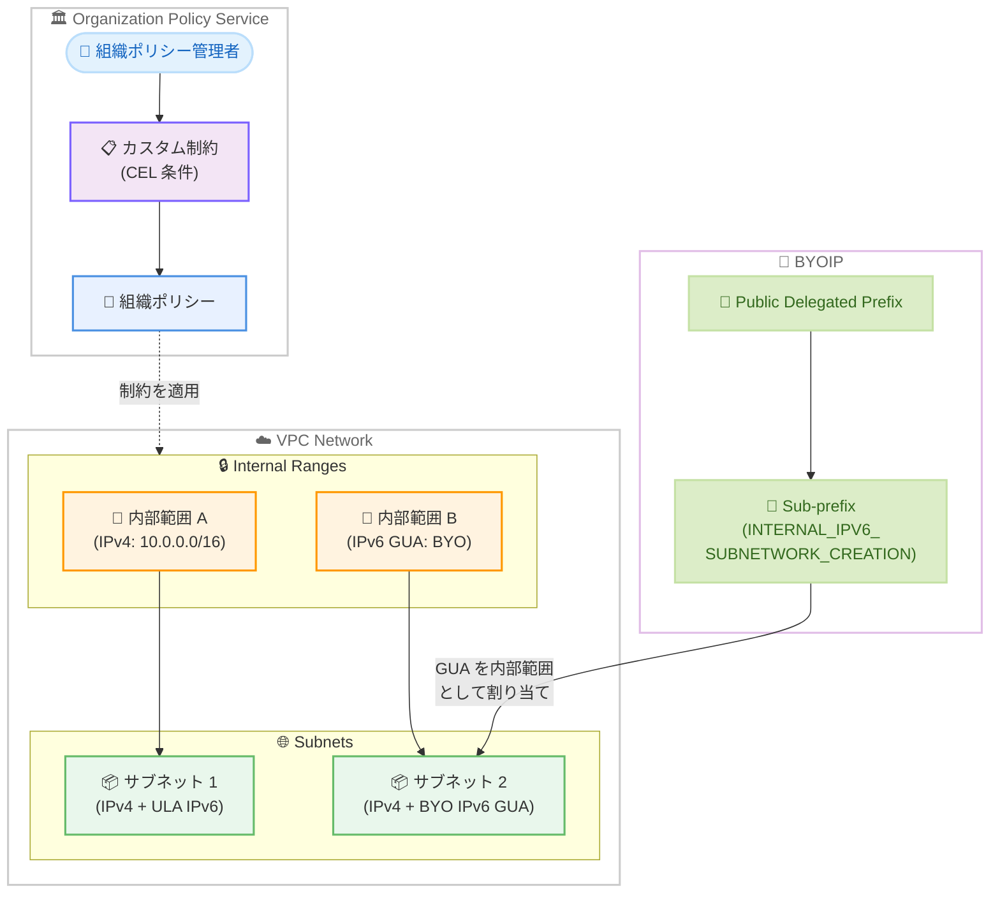

# Virtual Private Cloud: カスタム組織ポリシーの内部範囲対応と BYO IPv6 サポート

**リリース日**: 2026-02-10 (カスタム組織ポリシー) / 2026-02-09 (BYO IPv6)
**サービス**: Virtual Private Cloud (VPC)
**機能**: カスタム組織ポリシーによる内部範囲制御 / BYO IPv6 グローバルユニキャストアドレス
**ステータス**: GA

[このアップデートのインフォグラフィックを見る](infographic/20260210-vpc-custom-org-policies-byo-ipv6.html)

## 概要

Google Cloud Virtual Private Cloud (VPC) に 2 つのネットワーク管理機能が追加されました。1 つ目は、カスタム組織ポリシーで内部範囲 (Internal Ranges) リソースに対するきめ細かな制約を定義できるようになった機能です。2 つ目は、Bring Your Own IPv6 (BYO IPv6) として、自社が所有するグローバルユニキャストアドレス (GUA) をサブネットの内部 IPv6 アドレス範囲に割り当てられるようになった機能です。

カスタム組織ポリシーの内部範囲対応により、組織のネットワーク管理者は `networkconnectivity.googleapis.com/InternalRange` リソースのフィールドに対して、Common Expression Language (CEL) を使用した条件付きの制約を作成できます。これにより、IP アドレス割り当てやネットワーク設計に関するガバナンスを組織全体で統一的に適用できます。

BYO IPv6 機能は、企業が既に保有している IPv6 GUA をプライベート用途として VPC サブネットに割り当てることを可能にします。通常 GUA はパブリックアドレスですが、この構成ではプライベートに使用され、Google 提供のユニークローカルアドレス (ULA) と同様に機能します。

**アップデート前の課題**

今回のアップデート以前に存在していた課題は以下の通りです。

- カスタム組織ポリシーは VPC の Network、Subnetwork、Route などのリソースに対応していたが、内部範囲 (InternalRange) リソースのフィールドを制約する手段がなかった
- IPv6 の内部サブネット範囲は Google が提供する ULA (`fd20::/20` から割り当てられる `/48` 範囲) に限定されており、自社が所有する IPv6 アドレスをプライベート用途で使用できなかった
- オンプレミス環境やマルチクラウド環境で既に使用している IPv6 GUA と Google Cloud の内部 IPv6 アドレスの統一管理が困難だった

**アップデート後の改善**

今回のアップデートにより可能になったことは以下の通りです。

- `networkconnectivity.googleapis.com/InternalRange` の各フィールド (ipCidrRange、network、usage、peering など) に対してカスタム制約を定義し、組織全体の IP アドレス管理ポリシーを強制できるようになった
- 自社所有の IPv6 GUA をサブネットの内部 IPv6 アドレス範囲として割り当て可能になり、オンプレミスや他クラウドとのアドレス体系を統一できるようになった
- BYOIP で提供される内部サブネット範囲はインターネットにはアドバタイズされず、Google 提供の ULA 内部サブネット範囲と同じ方法で使用可能

## アーキテクチャ図



この図は、カスタム組織ポリシーによる内部範囲の制御と、BYOIP を使用した IPv6 GUA のサブネットへの割り当てフローを示しています。組織ポリシー管理者が CEL 条件でカスタム制約を定義し、VPC 内の内部範囲リソースに適用します。

## サービスアップデートの詳細

### 主要機能

1. **カスタム組織ポリシーによる内部範囲 (InternalRange) の制御**
   - `networkconnectivity.googleapis.com/InternalRange` リソースがカスタム制約の対象に追加された
   - CEL 条件を使用して、内部範囲の作成や更新に対するきめ細かな制約を定義可能
   - 制約は組織、フォルダ、プロジェクトの各レベルで適用可能
   - ポリシーの継承により、上位で設定した制約が下位のリソースにも自動適用

2. **BYO IPv6 グローバルユニキャストアドレスの内部利用**
   - 自社所有の IPv6 GUA をサブネットの内部 IPv6 アドレス範囲として割り当て可能
   - `INTERNAL_IPV6_SUBNETWORK_CREATION` モードの Sub-prefix を使用して GUA を内部範囲に変換
   - GUA はプライベートに使用され、インターネットにはアドバタイズされない
   - Google 提供の ULA と同様に、VM ネットワークインターフェース、フォワーディングルール、内部ロードバランサーで使用可能

3. **内部範囲リソースの制約可能フィールド**
   - 組織ポリシーで制約できる InternalRange のフィールドには、allocationOptions、ipCidrRange、network、usage、peering、overlaps、immutable などが含まれる
   - これらのフィールドを CEL 条件で評価し、ALLOW または DENY アクションを設定可能

## 技術仕様

### カスタム組織ポリシー: 対象リソースとフィールド

今回のアップデートで制約可能になった `networkconnectivity.googleapis.com/InternalRange` のフィールドは以下の通りです。

| フィールド | 説明 |
|-----------|------|
| `resource.allocationOptions.allocationStrategy` | IP アドレスブロックの割り当て戦略 |
| `resource.allocationOptions.firstAvailableRangesLookupSize` | RANDOM_FIRST_N_AVAILABLE 戦略でのルックアップサイズ |
| `resource.description` | 内部範囲の説明 |
| `resource.excludeCidrRanges` | 除外する CIDR 範囲 |
| `resource.immutable` | 不変性の設定 |
| `resource.ipCidrRange` | 割り当てられた IP CIDR ブロック |
| `resource.migration.source` | 移行元サブネット |
| `resource.migration.target` | 移行先サブネット |
| `resource.name` | 内部範囲の名前 |
| `resource.network` | 関連付けられた VPC ネットワーク |
| `resource.overlaps` | オーバーラップの許可設定 |
| `resource.peering` | ピアリングタイプ (FOR_SELF、FOR_PEER、NOT_SHARED) |
| `resource.prefixLength` | プレフィックス長 |
| `resource.targetCidrRange` | 自動割り当ての対象 CIDR 範囲 |
| `resource.usage` | 使用タイプ (FOR_VPC、EXTERNAL_TO_VPC、FOR_MIGRATION) |

### BYO IPv6: Sub-prefix のモード

BYO IPv6 で使用する Sub-prefix のモードと仕様は以下の通りです。

| モード | 用途 | アクセスタイプ |
|--------|------|---------------|
| `INTERNAL_IPV6_SUBNETWORK_CREATION` | 内部サブネット範囲への GUA 割り当て | Internal (プライベート利用) |
| `EXTERNAL_IPV6_SUBNETWORK_CREATION` | 外部サブネット範囲への GUA 割り当て | External (インターネットルーティング可能) |
| `EXTERNAL_IPV6_FORWARDING_RULE_CREATION` | フォワーディングルールへの GUA 割り当て | External |
| `DELEGATION` | さらなるサブ分割のための委譲 | - |

### カスタム制約の定義例

以下は、内部範囲の使用タイプを `FOR_VPC` に限定するカスタム制約の YAML 定義例です。

```yaml
name: organizations/ORGANIZATION_ID/customConstraints/custom.internalRangeUsageForVpc
resourceTypes:
  - networkconnectivity.googleapis.com/InternalRange
condition: "resource.usage == 'FOR_VPC'"
actionType: ALLOW
methodTypes:
  - CREATE
  - UPDATE
displayName: Restrict internal ranges to VPC usage only
description: Internal ranges must have usage type set to FOR_VPC.
```

## 設定方法

### 前提条件

1. Organization Policy Administrator (`roles/orgpolicy.policyAdmin`) IAM ロールが付与されていること
2. 組織 ID を把握していること
3. BYO IPv6 の場合: BYOIP の Public Delegated Prefix が作成済みであること

### 手順

#### ステップ 1: カスタム制約を作成して適用する

```bash
# カスタム制約の YAML ファイルを作成
cat > internalRangeConstraint.yaml << 'EOF'
name: organizations/ORGANIZATION_ID/customConstraints/custom.internalRangeForVpc
resourceTypes:
  - networkconnectivity.googleapis.com/InternalRange
condition: "resource.usage == 'FOR_VPC'"
actionType: ALLOW
methodTypes:
  - CREATE
  - UPDATE
displayName: Require internal ranges for VPC usage
description: Internal ranges must be configured for VPC usage only.
EOF

# カスタム制約を設定
gcloud org-policies set-custom-constraint internalRangeConstraint.yaml

# ポリシーを作成して適用
cat > internalRangePolicy.yaml << 'EOF'
name: projects/PROJECT_ID/policies/custom.internalRangeForVpc
spec:
  rules:
    - enforce: true
EOF

gcloud org-policies set-policy internalRangePolicy.yaml
```

上記のコマンドにより、組織内で内部範囲の使用タイプが `FOR_VPC` であることを強制するポリシーが適用されます。

#### ステップ 2: BYO IPv6 GUA をサブネットの内部範囲として割り当てる

```bash
# Sub-prefix を内部サブネット作成モードで作成
gcloud compute public-delegated-prefixes delegated-sub-prefixes create SUB_PREFIX_NAME \
    --public-delegated-prefix=PARENT_PDP_NAME \
    --range=IPV6_RANGE \
    --mode=INTERNAL_IPV6_SUBNETWORK_CREATION \
    --region=REGION

# BYO IPv6 GUA を使用してサブネットを作成
gcloud compute networks subnets create SUBNET_NAME \
    --network=NETWORK_NAME \
    --stack-type=IPV4_IPV6 \
    --ipv6-access-type=INTERNAL \
    --region=REGION \
    --range=PRIMARY_IPV4_RANGE \
    --ip-collection=SUB_PREFIX_NAME \
    --internal-ipv6-prefix=IPV6_CIDR_RANGE
```

`--ip-collection` で Sub-prefix を指定し、`--internal-ipv6-prefix` で具体的な `/64` IPv6 CIDR 範囲を指定します。範囲を省略した場合、Google Cloud が Sub-prefix のブロックからランダムに `/64` 範囲を割り当てます。

## メリット

### ビジネス面

- **ガバナンスの強化**: カスタム組織ポリシーにより、組織全体の IP アドレス管理ルールをコードとして定義し、自動的に適用できる
- **マルチクラウド・ハイブリッド対応**: BYO IPv6 により、既存の IPv6 アドレス体系を Google Cloud でも継続利用でき、運用の一貫性を確保できる

### 技術面

- **きめ細かな制御**: CEL 条件を使用して、内部範囲の CIDR ブロック、ピアリングタイプ、使用タイプなど個別のフィールドに対する制約を定義可能
- **アドレス体系の統一**: オンプレミスやマルチクラウド環境で使用している IPv6 GUA を Google Cloud の内部ネットワークでもそのまま利用でき、ルーティング設計が簡素化される
- **ULA と同等の機能**: BYO IPv6 GUA は ULA と同じ方法で VM ネットワークインターフェース、内部ロードバランサー、Private Service Connect エンドポイントで使用可能

## デメリット・制約事項

### 制限事項

- カスタム制約はルート (Route) リソースに対しては CREATE メソッドでのみ適用される
- BYOIP の IPv6 アドレスはプロジェクト間で移動できない
- BYOIP のプロビジョニングには数週間かかり、短縮できない
- Public Delegated Prefix は Public Advertised Prefix から最大 3 回までサブ委譲可能

### 考慮すべき点

- カスタム組織ポリシーの条件が既存リソースに違反している場合、既存リソースは影響を受けないが、違反を解消する変更以外のリソース更新はブロックされる
- BYO IPv6 GUA を内部用途で使用する場合、同じアドレス範囲をインターネット向けに使用することはできない (内部用途としてアドバタイズされないため)
- Policy Simulator を使用して、新しいポリシーが既存リソースに与える影響を事前にテストすることを推奨

## ユースケース

### ユースケース 1: 組織全体の IP アドレス設計ポリシーの強制

**シナリオ**: 大規模な組織で複数のチームが VPC ネットワークを運用しており、IP アドレス範囲の重複や不適切な割り当てを防ぎたい場合。

**実装例**:

```yaml
name: organizations/123456789/customConstraints/custom.restrictInternalRangeCidr
resourceTypes:
  - networkconnectivity.googleapis.com/InternalRange
condition: "resource.ipCidrRange.startsWith('10.')"
actionType: ALLOW
methodTypes:
  - CREATE
displayName: Restrict internal ranges to 10.0.0.0/8
description: Internal ranges must use addresses from the 10.0.0.0/8 block.
```

**効果**: すべてのプロジェクトで内部範囲が `10.0.0.0/8` ブロック内に限定され、アドレス体系の一貫性が保証される。

### ユースケース 2: ハイブリッドクラウド環境での IPv6 アドレス統一

**シナリオ**: オンプレミスと Google Cloud のハイブリッド環境で、既に保有している IPv6 GUA を使用して統一的なアドレス体系を構築したい場合。

**効果**: オンプレミスで使用している IPv6 GUA を Google Cloud のサブネットの内部範囲として割り当てることで、Cloud VPN や Cloud Interconnect を介した通信時にアドレス変換なしでルーティングが可能になる。

## 料金

VPC ネットワーク自体の使用に対する追加料金はありません。BYOIP の利用に関しても、IPv6 アドレスの使用自体には追加料金はかかりません。ただし、ネットワークトラフィックの Egress やロードバランサーの使用などには通常の料金が適用されます。

詳細は公式料金ページを参照してください。

## 関連サービス・機能

- **Organization Policy Service**: カスタム制約の作成と管理を行う基盤サービス。組織、フォルダ、プロジェクトレベルでポリシーを適用可能
- **BYOIP (Bring Your Own IP)**: 自社所有の IP アドレスを Google Cloud で使用するための仕組み。IPv4 と IPv6 の両方に対応
- **Cloud Interconnect / Cloud VPN**: オンプレミスとの接続サービス。BYO IPv6 GUA を使用したハイブリッド構成で重要な役割を果たす
- **VPC Network Peering**: VPC ネットワーク間の接続。内部範囲のピアリングタイプ設定と関連
- **Shared VPC**: 組織内で VPC ネットワークを共有する仕組み。カスタム組織ポリシーと組み合わせてガバナンスを強化可能

## 参考リンク

- [インフォグラフィック](infographic/20260210-vpc-custom-org-policies-byo-ipv6.html)
- [公式リリースノート](https://cloud.google.com/release-notes#February_10_2026)
- [Manage VPC resources by using custom organization policies](https://cloud.google.com/vpc/docs/custom-constraints)
- [Create and use IPv6 sub-prefixes](https://cloud.google.com/vpc/docs/create-ipv6-sub-prefixes)
- [Subnets - IPv6 ranges](https://cloud.google.com/vpc/docs/subnets)
- [Internal ranges overview](https://cloud.google.com/vpc/docs/internal-ranges)
- [Bring your own IP](https://cloud.google.com/vpc/docs/bring-your-own-ip)
- [VPC pricing](https://cloud.google.com/vpc/network-pricing)

## まとめ

今回の VPC アップデートは、エンタープライズ環境でのネットワークガバナンスと IPv6 移行を大幅に強化するものです。カスタム組織ポリシーの内部範囲対応により、IP アドレス管理に関する組織全体のルールをコードとして定義・適用でき、BYO IPv6 GUA の内部利用により、ハイブリッドクラウドやマルチクラウド環境でのアドレス体系の統一が可能になります。大規模な VPC ネットワークを運用している組織や IPv6 移行を計画している組織は、これらの機能を積極的に評価・導入することを推奨します。

---

**タグ**: #VPC #OrganizationPolicy #IPv6 #BYOIP #Networking #Security #Governance #HybridCloud
