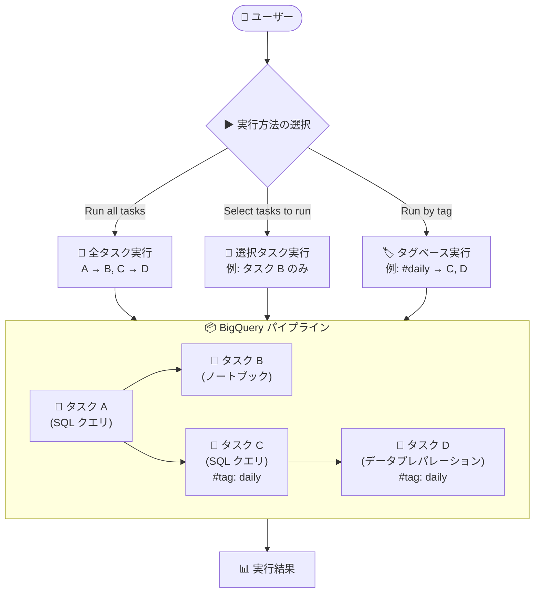

# BigQuery: パイプライン実行方法の GA

**リリース日**: 2026-02-11
**サービス**: BigQuery
**機能**: Pipeline Execution Methods
**ステータス**: GA (一般提供)

📊 [このアップデートのインフォグラフィックを見る](https://takech9203.github.io/google-cloud-news-summary/20260211-bigquery-pipeline-execution-methods.html)

## 概要

BigQuery パイプラインにおいて、3 つの異なる実行方法が一般提供 (GA) となった。具体的には「すべてのタスクを実行」「選択したタスクを実行」「選択したタグでタスクを実行」の 3 つの方法でパイプラインを実行できるようになった。

BigQuery パイプラインは Dataform を基盤として動作するデータ処理の自動化機能であり、SQL クエリ、ノートブック、データプレパレーションなどのコードアセットを順序立てて実行できる。今回の GA により、パイプライン内のタスクをより柔軟に制御して実行できるようになり、大規模なデータ変換ワークフローの運用効率が向上する。

この機能は、データエンジニアやデータアナリストが日常的にパイプラインを運用・デバッグする際に特に有用である。特定のタスクだけを再実行したり、タグベースで関連するタスク群をまとめて実行したりすることで、開発・テスト・本番運用のすべてのフェーズで効率的な作業が可能になる。

**アップデート前の課題**

- パイプラインを実行する際、すべてのタスクを一括で実行する方法のみが GA として提供されていた
- 特定のタスクだけを再実行したい場合でも、パイプライン全体を実行する必要がある場面があった
- タグベースでの実行選択がプレビュー段階であり、本番ワークロードでの使用にリスクがあった
- パイプラインのデバッグや部分的なリトライが効率的に行えなかった

**アップデート後の改善**

- 3 つの実行方法 (全タスク実行、選択タスク実行、タグベース実行) がすべて GA となり、本番環境で安心して使用できる
- 特定のタスクのみを選択して実行でき、依存関係や依存先タスクの自動包含オプションも利用可能
- タグを使ってタスクをグループ化し、論理的な単位でまとめて実行できる
- 実行時にインタラクティブジョブとバッチジョブの優先度選択、フルリフレッシュオプションなどの詳細な制御が可能

## アーキテクチャ図



BigQuery パイプラインの 3 つの実行方法を示す図。ユーザーは実行メニューから目的に応じた実行方法を選択し、パイプライン内のタスクを柔軟に制御できる。

## サービスアップデートの詳細

### 主要機能

1. **全タスク実行 (Run all tasks)**
   - パイプライン内のすべてのタスクを定義された依存関係の順序で実行する
   - Google Cloud コンソールから `Run > Run all tasks` で実行可能
   - Dataform API 経由でのプログラマティックな実行もサポート (サービスアカウント認証が必要)
   - API 実行時は `compilationResults.create` でコンパイル後、`workflowInvocations.create` で実行をトリガーする

2. **選択タスク実行 (Select tasks to run)**
   - パイプライン内の特定のタスクを手動で選択して実行できる
   - `Include dependencies` オプションで選択タスクの依存元タスクを自動的に含めることが可能
   - `Include dependents` オプションで選択タスクの下流依存タスク (推移的) を自動的に含めることが可能
   - タスク名で検索して選択でき、選択したタスクは SQL エディタで直接開くことも可能

3. **タグベース実行 (Run by tag)**
   - パイプラインのタスクに付与されたタグを基準に実行対象を選択できる
   - 単一タグの選択、または複数タグの選択に対応
   - タグベースでも依存関係の自動包含 (Include dependencies / Include dependents) が利用可能
   - `Run > Run by tag` メニューからタグ一覧を表示して選択する

## 技術仕様

### 実行オプション

| 項目 | 詳細 |
|------|------|
| Include dependencies | 選択タスクの上流依存タスクを自動的に含める |
| Include dependents | 選択タスクの下流依存タスク (推移的) を自動的に含める |
| Run with full refresh | すべてのテーブルをスクラッチから再構築する |
| ジョブ優先度 | インタラクティブジョブ (デフォルト・高優先度) またはバッチジョブ (低優先度) |

### 認証方法

| 認証タイプ | ステータス | 詳細 |
|-----------|-----------|------|
| サービスアカウント | GA | カスタムサービスアカウントを選択して実行 |
| ユーザー認証情報 | Preview | Google アカウントのユーザー認証情報で実行 (OAuth 認証が必要) |

### 必要な IAM ロール

| ロール | 用途 |
|--------|------|
| `roles/dataform.codeCreator` | パイプラインの作成 |
| `roles/dataform.editor` | パイプラインの編集と実行 |
| `roles/dataform.Admin` | パイプラインの削除 |
| `roles/dataform.Viewer` | パイプラインの表示と実行 |

### API による実行例

```bash
# ステップ 1: デフォルトワークスペースのコンパイル結果を作成
curl -X POST \
   -H "Authorization: Bearer $(gcloud auth print-access-token)" \
   -H "Content-Type: application/json" \
   -d '{
      "workspace": "projects/PROJECT_ID/locations/LOCATION/repositories/REPOSITORY_ID/workspaces/default"
   }' \
   "https://dataform.googleapis.com/v1/projects/PROJECT_ID/locations/LOCATION/repositories/REPOSITORY_ID/compilationResults"

# ステップ 2: コンパイル結果を使用してワークフロー呼び出しを作成
curl -X POST \
   -H "Authorization: Bearer $(gcloud auth print-access-token)" \
   -H "Content-Type: application/json" \
   -d '{
      "compilationResult": "COMPILATION_RESULT"
   }' \
   "https://dataform.googleapis.com/v1/projects/PROJECT_ID/locations/LOCATION/repositories/REPOSITORY_ID/workflowInvocations"
```

## 設定方法

### 前提条件

1. Google Cloud プロジェクトで課金が有効であること
2. BigQuery API、Dataform API、Vertex AI API が有効であること
3. 適切な IAM ロール (`roles/dataform.editor` 以上) が付与されていること
4. BigQuery パイプラインが作成済みであること

### 手順

#### ステップ 1: パイプラインの選択

Google Cloud コンソールで BigQuery ページを開き、Explorer ペインからプロジェクトを展開して `Pipelines` をクリックし、対象のパイプラインを選択する。

#### ステップ 2: 実行方法の選択

`Run` ボタンをクリックし、以下のいずれかを選択する。

- **Run all tasks**: すべてのタスクを実行
- **Select tasks to run**: 特定のタスクを選択して実行
- **Run by tag**: タグで絞り込んでタスクを実行

#### ステップ 3: 認証の設定

実行時の認証方法を選択する。

- **Run with selected service account**: カスタムサービスアカウントを選択 (推奨)
- **Run with user credentials**: ユーザー認証情報を使用 (Preview)

#### ステップ 4: 実行オプションの設定

必要に応じて以下のオプションを設定する。

- `Include dependencies`: 依存元タスクを含める
- `Include dependents`: 依存先タスクを含める
- `Run with full refresh`: テーブルを完全に再構築
- ジョブ優先度の選択 (インタラクティブ / バッチ)

## メリット

### ビジネス面

- **運用効率の向上**: 障害発生時に失敗したタスクのみを再実行でき、パイプライン全体の再実行が不要になるため、コスト削減とダウンタイムの短縮が見込める
- **開発サイクルの短縮**: タスク単位やタグ単位でのテスト実行が可能になり、パイプラインの開発・検証プロセスが効率化される
- **GA の信頼性**: プレビューからの昇格により SLA の対象となり、本番ワークロードでの使用に適した安定性が確保される

### 技術面

- **柔軟な実行制御**: 依存関係の自動解決 (Include dependencies / Include dependents) により、タスク間の関係を考慮した部分実行が容易になる
- **タグベースの管理**: タスクにタグを付与して論理グループとして管理・実行でき、大規模パイプラインの運用がシンプルになる
- **API サポート**: Dataform API 経由でのプログラマティックな実行が可能で、CI/CD パイプラインや外部オーケストレーションツールとの統合ができる

## デメリット・制約事項

### 制限事項

- パイプラインは Google Cloud コンソールでのみ利用可能 (CLI やその他のインターフェースからの直接操作は不可)
- パイプライン作成後にリージョンを変更することはできない
- 個々のタスクに対するアクセス制御はサポートされていない (パイプライン単位でのアクセス制御のみ)
- スケジュール実行が次のスケジュール開始までに完了しない場合、次回のスケジュール実行はスキップされエラーとなる
- API 経由の実行ではユーザー認証情報による認証がサポートされておらず、サービスアカウントが必須

### 考慮すべき点

- Dataform のクォータと制限が適用されるため、大規模パイプラインの場合は事前にクォータの確認が必要
- パイプラインの実行は BigQuery のコンピュートおよびストレージ料金が発生する
- ノートブックを含むパイプラインの場合、Colab Enterprise のランタイム料金も発生する

## ユースケース

### ユースケース 1: 障害時の部分リトライ

**シナリオ**: 日次で実行されるデータ変換パイプラインにおいて、5 つのタスクのうちタスク 4 で一時的なエラーが発生した場合。

**実装例**:
1. `Run > Select tasks to run` を選択
2. 失敗したタスク 4 を選択
3. `Include dependents` を有効にして、タスク 4 とその下流タスク (タスク 5) を再実行

**効果**: パイプライン全体を再実行する場合と比較して、既に成功しているタスク 1-3 の再実行コストを削減できる。また、再実行の所要時間も大幅に短縮される。

### ユースケース 2: タグを使ったドメイン別のデータ更新

**シナリオ**: 複数のビジネスドメイン (売上、在庫、顧客) のデータ変換タスクが 1 つのパイプラインに含まれており、売上データのソースのみが更新された場合。

**実装例**:
1. 各タスクにドメイン別のタグ (`sales`, `inventory`, `customer`) を付与
2. `Run > Run by tag` を選択
3. `sales` タグを選択して実行

**効果**: 変更のあったドメインに関連するタスクのみを実行でき、不要なデータ処理を回避してコストと時間を節約できる。

## 料金

BigQuery パイプラインの実行には、BigQuery のコンピュート料金とストレージ料金が適用される。パイプライン機能自体に追加料金はない。

- **オンデマンド料金**: クエリで処理されたデータ量 (TiB) に基づく課金
- **容量ベース料金 (Editions)**: スロット (コンピュートリソース) の使用量に基づく課金。Standard、Enterprise、Enterprise Plus の各エディションが利用可能
- **ストレージ料金**: BigQuery に保存されたデータ量に基づく課金 (論理バイトまたは物理バイト)
- **ノートブック含有パイプライン**: Colab Enterprise のデフォルトマシンタイプに基づくランタイム料金が追加で発生
- **ログ記録**: 各パイプライン実行は Cloud Logging で記録され、Cloud Logging の課金が適用される場合がある

詳細は [BigQuery 料金ページ](https://cloud.google.com/bigquery/pricing) を参照。

## 利用可能リージョン

BigQuery パイプラインは、以下を含む 40 以上のリージョンで利用可能。

**主要リージョン (一部抜粋)**:

| 地域 | リージョン名 |
|------|------------|
| 米国 (アイオワ) | `us-central1` |
| 米国 (バージニア北部) | `us-east4` |
| 米国 (オレゴン) | `us-west1` |
| 欧州 (ベルギー) | `europe-west1` |
| 欧州 (フランクフルト) | `europe-west3` |
| 欧州 (ロンドン) | `europe-west2` |
| アジア (東京) | `asia-northeast1` |
| アジア (大阪) | `asia-northeast2` |
| アジア (シンガポール) | `asia-southeast1` |
| アジア (シドニー) | `australia-southeast1` |
| 南米 (サンパウロ) | `southamerica-east1` |

サポートされる全リージョンの一覧は [BigQuery Studio locations](https://cloud.google.com/bigquery/docs/locations#bqstudio-loc) を参照。

## 関連サービス・機能

- **[Dataform](https://cloud.google.com/dataform/docs/overview)**: BigQuery パイプラインの基盤技術。SQL ベースのデータ変換ワークフローを管理・実行する
- **[Cloud Logging](https://cloud.google.com/logging/docs)**: パイプラインの実行ログが自動記録され、Cloud Monitoring と連携したアラート設定が可能
- **[Cloud Monitoring](https://cloud.google.com/monitoring/docs)**: パイプライン実行の失敗時にログベースのアラートポリシーを設定できる
- **[Colab Enterprise](https://cloud.google.com/colab/docs)**: パイプライン内のノートブックタスクの実行ランタイムを提供
- **[BigQuery Studio](https://cloud.google.com/bigquery/docs/bigquery-studio)**: パイプラインの作成・管理・実行の統合インターフェース
- **[Dataplex Universal Catalog](https://cloud.google.com/dataplex/docs/introduction)**: パイプラインメタデータの管理と検出に対応

## 参考リンク

- 📊 [インフォグラフィック](https://takech9203.github.io/google-cloud-news-summary/20260211-bigquery-pipeline-execution-methods.html)
- [公式リリースノート](https://cloud.google.com/release-notes#February_11_2026)
- [パイプラインの作成と実行](https://cloud.google.com/bigquery/docs/create-pipelines#run-pipeline)
- [BigQuery パイプラインの概要](https://cloud.google.com/bigquery/docs/pipelines-introduction)
- [パイプラインの管理](https://cloud.google.com/bigquery/docs/manage-pipelines)
- [パイプラインのスケジューリング](https://cloud.google.com/bigquery/docs/schedule-pipelines)
- [料金ページ](https://cloud.google.com/bigquery/pricing)

## まとめ

BigQuery パイプラインの 3 つの実行方法 (全タスク実行、選択タスク実行、タグベース実行) が GA となり、本番環境での柔軟なパイプライン運用が可能になった。特に、障害時の部分リトライやドメイン別のタスク実行など、大規模データ変換ワークフローの運用効率を大幅に向上させる機能である。BigQuery パイプラインを使用しているユーザーは、タスクへのタグ付与を検討し、タグベース実行による効率的な運用体制の構築を推奨する。

---

**タグ**: #BigQuery #Pipeline #Dataform #GA #DataEngineering #ETL #DataTransformation
