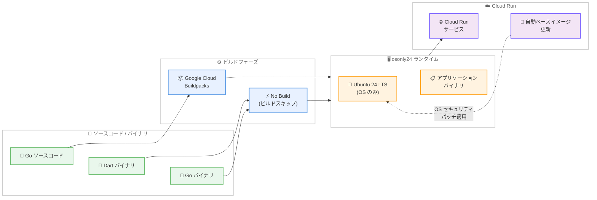

# Buildpacks / Cloud Run: osonly24 ランタイム GA

**リリース日**: 2026-02-11
**サービス**: Buildpacks / Cloud Run
**機能**: osonly24 ランタイム (OS only runtime) の一般提供開始
**ステータス**: GA (Generally Available)

[このアップデートのインフォグラフィックを見る](https://takech9203.github.io/google-cloud-news-summary/20260211-buildpacks-cloud-run-osonly24-ga.html)

## 概要

Google Cloud は 2026 年 2 月 11 日、Buildpacks と Cloud Run の両サービスにおいて、osonly24 ランタイムの一般提供 (GA) を発表した。osonly24 ランタイムは、言語に依存しない汎用ランタイムであり、ベースとなる Ubuntu オペレーティングシステムのみを含み、言語固有のランタイムコンポーネントを含まない最小構成のランタイムイメージである。

このランタイムにより、Go アプリケーションのソースからのデプロイや、Dart や Go などのコンパイル済みバイナリのデプロイが可能になる。また、独自のアプリケーションイメージをスクラッチから構築してデプロイすることもできる。osonly24 ランタイムは Cloud Run の自動ベースイメージ更新に対応しており、特定の言語ランタイムを使用しない場合でも、OS レベルのセキュリティパッチと更新が自動的に適用される。

osonly24 は 2025 年 12 月 18 日に Preview として公開されており、今回の GA 昇格により本番環境での利用が正式にサポートされることになる。

**アップデート前の課題**

osonly24 ランタイムの GA 以前には、以下のような課題が存在していた。

- Go や Dart のコンパイル済みバイナリを Cloud Run にデプロイする場合、Dockerfile を自前で作成してコンテナイメージをビルドする必要があった
- 言語固有のランタイム (例: go125) を使用すると、不要なランタイムコンポーネントが含まれ、イメージサイズが大きくなる可能性があった
- Preview 段階では本番ワークロードでの利用に SLA が適用されなかった

**アップデート後の改善**

今回の GA により、以下の改善が実現した。

- `--base-image=osonly24` を指定するだけで、最小構成の OS のみのランタイムにコンパイル済みバイナリをデプロイ可能になった
- GA ステータスにより SLA が適用され、本番環境での利用が正式にサポートされた
- Cloud Run の自動ベースイメージ更新との互換性により、OS レベルのセキュリティパッチがゼロダウンタイムで自動適用される

## アーキテクチャ図



この図は osonly24 ランタイムを使用したデプロイフローを示している。Go ソースコードは Buildpacks を経由してビルドされ、コンパイル済みバイナリ (Dart、Go) はビルドステップをスキップして直接 osonly24 ランタイム上にデプロイされる。Cloud Run の自動ベースイメージ更新により、OS レベルのセキュリティパッチがゼロダウンタイムで適用される。

## サービスアップデートの詳細

### 主要機能

1. **OS のみの最小ランタイム**
   - Ubuntu 24 LTS ベースの `google-24` スタック上で動作する
   - 言語固有のランタイムコンポーネントを含まず、OS パッケージのみを提供する
   - ランタイム ID は `osonly24`、ベースイメージは `google-24/osonly24`

2. **コンパイル済みバイナリのデプロイ**
   - Go や Dart などのコンパイル済みバイナリを直接デプロイ可能
   - コンパイル言語の場合、Linux OS をターゲットにバイナリをビルドする必要がある (例: `GOOS="linux" GOARCH=amd64 go build main.go`)
   - ランタイムエイリアス `osonly24` を指定してベースイメージをターゲットにできる

3. **2 つのデプロイ方式への対応**
   - **ビルド付きデプロイ**: `gcloud run deploy` に `--source .` と `--base-image=osonly24` を指定し、Buildpacks 経由でビルドしてデプロイする方式
   - **ビルドなしデプロイ (Preview)**: `gcloud beta run deploy` に `--no-build` フラグを追加し、Cloud Build ステップをスキップして直接デプロイする方式

4. **自動ベースイメージ更新との互換性**
   - Cloud Run の自動ベースイメージ更新機能に対応
   - 特定の言語ランタイムを使用しなくても、OS レベルのセキュリティパッチが自動適用される
   - ゼロダウンタイムで更新が実行される

## 技術仕様

### osonly24 ランタイム仕様

以下の表は osonly24 ランタイムの主要な技術仕様をまとめたものである。

| 項目 | 詳細 |
|------|------|
| ランタイム名 | OS only 24 |
| ランタイム ID | `osonly24` |
| スタック | `google-24` (デフォルト) |
| ベースイメージ | `google-24/osonly24` |
| ベース OS | Ubuntu 24 LTS |
| 非推奨予定日 | 2029 年 4 月 30 日 |
| 対応アーキテクチャ | x86 (linux/amd64) |
| ソースアーカイブ上限 (ビルドなしデプロイ時) | 250 MiB |

### デプロイ方式の比較

以下の表は 2 つのデプロイ方式の違いを示している。

| 項目 | ビルド付きデプロイ | ビルドなしデプロイ (Preview) |
|------|-------------------|---------------------------|
| コマンド | `gcloud run deploy` | `gcloud beta run deploy` |
| `--no-build` フラグ | 不要 | 必要 |
| Cloud Build の使用 | あり | なし |
| ビルド時間 | 標準 | 大幅に短縮 |
| 依存関係のインストール | Buildpacks が実行 | 事前にローカルでインストール |
| Go ソースからのビルド | 対応 | 非対応 (事前にコンパイルが必要) |
| ステータス | GA | Preview |

## 設定方法

### 前提条件

1. Google Cloud プロジェクトが作成済みであること
2. Cloud Run API が有効化されていること
3. `gcloud` CLI が最新バージョンにインストールされていること

### 手順

#### ステップ 1: Go アプリケーションをソースからデプロイ (ビルド付き)

```bash
gcloud run deploy SERVICE \
  --source . \
  --base-image=osonly24 \
  --project PROJECT_ID \
  --automatic-updates
```

`SERVICE` をサービス名、`PROJECT_ID` を Google Cloud プロジェクト ID に置き換える。`--automatic-updates` フラグにより、自動ベースイメージ更新が有効になる。

#### ステップ 2: コンパイル済みバイナリをデプロイ (ビルドなし)

Go バイナリを事前にコンパイルする。

```bash
GOOS="linux" GOARCH=amd64 go build main.go
```

ビルドなしでデプロイする。

```bash
gcloud beta run deploy SERVICE \
  --source . \
  --no-build \
  --base-image=osonly24 \
  --project PROJECT_ID \
  --command ./main
```

`--no-build` フラグにより Cloud Build ステップがスキップされ、デプロイ時間が大幅に短縮される。

## メリット

### ビジネス面

- **デプロイ時間の短縮**: ビルドなしデプロイを使用することで、Cloud Build ステップをスキップし、デプロイ時間を大幅に短縮できる
- **運用コストの削減**: 自動ベースイメージ更新により、OS レベルのセキュリティパッチ適用を手動で行う必要がなくなる

### 技術面

- **最小構成のランタイム**: 言語ランタイムを含まないため、不要なコンポーネントが排除され、攻撃対象領域が縮小する
- **柔軟なデプロイオプション**: ソースからのビルド付きデプロイと、コンパイル済みバイナリの直接デプロイの 2 つの方式を選択可能
- **自動セキュリティ更新**: ゼロダウンタイムで OS レベルのセキュリティパッチが自動適用される

## デメリット・制約事項

### 制限事項

- ビルドなしデプロイはまだ Preview 段階であり、GA ではない
- コンパイル済みバイナリは x86 アーキテクチャ (linux/amd64) と互換性がある必要がある
- ビルドなしデプロイ時のソースアーカイブサイズは 250 MiB 以下に制限される
- 自動ベースイメージ更新では、コンパイル言語のアプリケーションは再コンパイルされない (言語レベルのセキュリティ修正を適用するには再ビルドが必要)
- Dockerfile を使用したデプロイには対応していない

### 考慮すべき点

- コンパイル済みバイナリを使用する場合、Linux OS をターゲットにしたクロスコンパイルが必要
- ビルドなしデプロイの場合、依存関係を事前にローカルでインストールする必要がある
- osonly24 の非推奨予定日は 2029 年 4 月 30 日であり、長期的な移行計画を考慮する必要がある

## ユースケース

### ユースケース 1: Go マイクロサービスの高速デプロイ

**シナリオ**: Go で記述された複数のマイクロサービスを Cloud Run で運用しており、デプロイサイクルを高速化したい場合。

**実装例**:

```bash
# Go バイナリをクロスコンパイル
GOOS="linux" GOARCH=amd64 go build -o myservice main.go

# Cloud Build をスキップして直接デプロイ
gcloud beta run deploy my-go-service \
  --source . \
  --no-build \
  --base-image=osonly24 \
  --region=asia-northeast1 \
  --command=./myservice
```

**効果**: Cloud Build ステップを省略することで、デプロイ時間が大幅に短縮される。CI/CD パイプラインにおいて、ビルドはローカルまたは CI 環境で実行し、デプロイのみを Cloud Run に委譲するワークフローが実現できる。

### ユースケース 2: Dart アプリケーションのサーバーレスデプロイ

**シナリオ**: Dart で構築したバックエンド API サーバーを、言語固有のランタイムなしで Cloud Run にデプロイしたい場合。

**実装例**:

```bash
# Dart アプリケーションをコンパイル
dart compile exe bin/server.dart -o server

# osonly24 ランタイムでデプロイ
gcloud beta run deploy my-dart-api \
  --source . \
  --no-build \
  --base-image=osonly24 \
  --region=asia-northeast1 \
  --command=./server
```

**効果**: Dart 専用のランタイムが不要で、コンパイル済みバイナリを最小構成の OS 上で実行できる。

## 料金

osonly24 ランタイム自体には追加料金は発生しない。Cloud Run の標準料金体系が適用される。ソースデプロイでビルド付きデプロイを使用する場合、Cloud Build の料金が別途発生する。ビルドなしデプロイの場合は Cloud Build の料金が発生しない。

詳細は [Cloud Run の料金ページ](https://cloud.google.com/run/pricing) を参照。

## 利用可能リージョン

osonly24 ランタイムは Cloud Run が利用可能なすべてのリージョンで使用できる。Cloud Run は Tier 1 および Tier 2 の料金帯に分かれた 40 以上のリージョンで利用可能である。主要なリージョンは以下の通りである。

- asia-northeast1 (東京)
- asia-northeast2 (大阪)
- us-central1 (アイオワ)
- us-east1 (サウスカロライナ)
- europe-west1 (ベルギー)

全リージョンの一覧は [Cloud Run のロケーション](https://cloud.google.com/run/docs/locations) を参照。

## 関連サービス・機能

- **Google Cloud Buildpacks**: ソースコードからコンテナイメージを自動ビルドするサービス。osonly24 ランタイムは Buildpacks のランタイムの 1 つとして提供される
- **Cloud Build**: ソースデプロイ時のビルドステップで使用される。ビルドなしデプロイではスキップ可能
- **Artifact Registry**: ソースデプロイで生成されたコンテナイメージの保存に使用される
- **Cloud Run 自動ベースイメージ更新**: osonly24 ランタイムと互換性があり、OS レベルのセキュリティパッチをゼロダウンタイムで自動適用する

## 参考リンク

- [このアップデートのインフォグラフィック](https://takech9203.github.io/google-cloud-news-summary/20260211-buildpacks-cloud-run-osonly24-ga.html)
- [公式リリースノート (Buildpacks)](https://cloud.google.com/docs/buildpacks/release-notes#February_11_2026)
- [公式リリースノート (Cloud Run)](https://cloud.google.com/run/docs/release-notes#February_11_2026)
- [OS only ランタイムの設定 (Configure the OS only runtime)](https://cloud.google.com/docs/buildpacks/osonly)
- [Cloud Run ソースコードからのデプロイ](https://cloud.google.com/run/docs/deploying-source-code)
- [ランタイムサポートスケジュール](https://cloud.google.com/run/docs/runtime-support)
- [自動ベースイメージ更新の設定](https://cloud.google.com/run/docs/configuring/services/automatic-base-image-updates)
- [Cloud Run の料金](https://cloud.google.com/run/pricing)

## まとめ

osonly24 ランタイムの GA により、Go や Dart などのコンパイル済みバイナリを最小構成の OS ランタイム上で本番環境にデプロイできるようになった。自動ベースイメージ更新との互換性により、言語固有のランタイムを使用しない場合でも OS レベルのセキュリティが自動的に維持される。Go や Dart でマイクロサービスを構築しているチームは、osonly24 ランタイムの採用を検討することを推奨する。

---

**タグ**: #serverless #cloud-run #buildpacks #osonly24 #go #dart #ga
