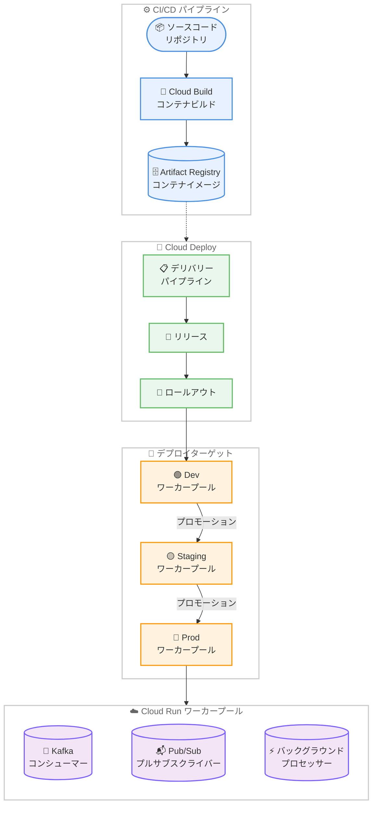

# Cloud Deploy: Cloud Run ワーカープール GA

**リリース日**: 2026-02-11
**サービス**: Cloud Deploy
**機能**: Cloud Run ワーカープールへのデプロイ
**ステータス**: GA (Generally Available)

## 概要

Cloud Deploy で Cloud Run ワーカープールへのコンテナワークロードのデプロイが GA (一般提供) になった。Cloud Deploy は、アプリケーションを定義されたターゲット環境のシーケンスに沿って自動的にデリバリーする継続的デリバリーサービスであり、今回のアップデートにより、Cloud Run サービスやジョブに加えて、ワーカープールも Cloud Deploy の管理対象として正式にサポートされた。

Cloud Run ワーカープールは、HTTP リクエストの処理に依存しないワークロード向けに設計された Cloud Run リソースである。Kafka コンシューマーや Pub/Sub プルサブスクライバーなどのプルベースのバックグラウンド処理に最適化されており、ロードバランシングされたエンドポイントや URL を持たない。今回の GA 昇格により、Cloud Deploy のすべての機能 (カナリアデプロイ、デプロイ検証、自動化ルールなど) がワーカープールのデプロイにも利用可能となった。

このアップデートは、マイクロサービスアーキテクチャにおけるバックグラウンドワークロードの継続的デリバリーを自動化したい DevOps エンジニアやプラットフォームエンジニアが主な対象ユーザーとなる。

**アップデート前の課題**

Cloud Deploy でワーカープールをデプロイする際には、以下の課題が存在していた。

- Cloud Run ワーカープール機能自体が Preview 段階であり、プロダクション環境での利用に SLA が適用されなかった
- Preview 段階のため、`workerpool.yaml` の定義に `run.googleapis.com/launch-stage: BETA` アノテーションの明示的な指定が必要だった
- GA レベルのサポートが提供されておらず、本番環境でのデプロイパイプラインに組み込むことにリスクがあった

**アップデート後の改善**

今回の GA 昇格により、以下の改善が実現された。

- Cloud Run ワーカープールが正式に GA となり、SLA の適用対象としてプロダクション環境での利用が可能になった
- Cloud Deploy のすべての機能 (カナリアデプロイ、デプロイ検証、並列デプロイ、自動化ルール) がワーカープールで利用可能になった
- Cloud Run サービス、ジョブ、ワーカープールの 3 種類のリソースを Cloud Deploy の統一されたデリバリーパイプラインで管理できるようになった

## アーキテクチャ図



この図は、CI/CD パイプラインから Cloud Deploy を経由して Cloud Run ワーカープールにデプロイされるまでのエンドツーエンドのフローを示している。Cloud Deploy のデリバリーパイプラインにより、Dev、Staging、Prod の各環境へのプロモーションが管理される。

## サービスアップデートの詳細

### 主要機能

1. **Cloud Run ワーカープールのデプロイサポート**
   - Cloud Deploy から `workerpool.yaml` を使用して Cloud Run ワーカープールを直接デプロイ可能
   - `skaffold.yaml` の `manifests.rawYaml` にワーカープール定義ファイルを指定するだけで設定完了
   - 新規ワーカープールの作成と既存ワーカープールのリビジョン更新の両方に対応

2. **カナリアデプロイ対応**
   - Cloud Run ワーカープールでカナリアデプロイ戦略が利用可能 (Cloud Run ジョブではカナリアデプロイは非対応)
   - ワーカープールではトラフィック分割ではなく、インスタンス数のリビジョン間分割によりカナリアを実現
   - 自動カナリア、カスタム自動カナリア、フルカスタムカナリアの 3 種類のカナリア戦略に対応

3. **統一されたデリバリーパイプライン管理**
   - Cloud Run サービス、ジョブ、ワーカープールを同一の Cloud Deploy パイプラインフレームワークで管理
   - プロモーション、承認ワークフロー、デプロイ検証、自動化ルールがワーカープールにも適用
   - マルチターゲット (並列デプロイ) もサポート

## 技術仕様

### ワーカープール定義 (workerpool.yaml)

Cloud Deploy でワーカープールをデプロイする際の YAML 定義の主な仕様は以下の通りである。

| 項目 | 詳細 |
|------|------|
| API バージョン | `run.googleapis.com/v1` |
| Kind | `WorkerPool` |
| スケーリング | 手動スケーリング (自動スケーリングは非対応) |
| ロードバランシング | なし (エンドポイント/URL なし) |
| VPC 接続 | Direct VPC Egress/Ingress サポート |
| サイドカー | 最大 10 コンテナ/インスタンス |
| コンテナレジストリ | Artifact Registry (推奨)、Docker Hub |
| gcloud CLI バージョン | 541.0.0 以上が必要 |

### 必要な IAM ロール

Cloud Deploy でワーカープールをデプロイするために必要な IAM ロールは以下の通りである。

| ロール | リソース |
|--------|----------|
| `roles/run.developer` | Cloud Run ワーカープール |
| `roles/iam.serviceAccountUser` | ワーカープールのサービスアカウント |
| `roles/artifactregistry.reader` | Artifact Registry リポジトリ |

### Skaffold 設定例

```yaml
apiVersion: skaffold/v4beta7
kind: Config
metadata:
  name: worker-pool-application
manifests:
  rawYaml:
  - workerpool.yaml
deploy:
  cloudrun: {}
```

## 設定方法

### 前提条件

1. gcloud CLI バージョン 541.0.0 以上がインストールされていること
2. Cloud Deploy のデリバリーパイプラインが作成済みであること
3. Cloud Run API と Cloud Deploy API が有効化されていること

### 手順

#### ステップ 1: ターゲット定義の作成

```yaml
apiVersion: deploy.cloud.google.com/v1
kind: Target
metadata:
  name: prod-worker
description: Production worker pool target
run:
  location: projects/my-project/locations/us-central1
```

#### ステップ 2: ワーカープール定義の作成

```yaml
apiVersion: run.googleapis.com/v1
kind: WorkerPool
metadata:
  name: my-worker-pool
spec:
  template:
    spec:
      containers:
      - image: us-docker.pkg.dev/my-project/my-repo/my-worker:latest
```

GA 昇格により、`run.googleapis.com/launch-stage: BETA` アノテーションの指定は不要になった。

#### ステップ 3: デリバリーパイプラインの定義と登録

```yaml
apiVersion: deploy.cloud.google.com/v1
kind: DeliveryPipeline
metadata:
  name: worker-pool-pipeline
serialPipeline:
  stages:
  - targetId: dev-worker
    profiles:
    - dev
  - targetId: staging-worker
    profiles:
    - staging
  - targetId: prod-worker
    profiles:
    - prod
```

```bash
# パイプラインとターゲットの登録
gcloud deploy apply --file=clouddeploy.yaml --region=us-central1
```

#### ステップ 4: リリースの作成

```bash
# リリースを作成してデリバリーパイプラインを開始
gcloud deploy releases create release-001 \
  --delivery-pipeline=worker-pool-pipeline \
  --region=us-central1 \
  --source=./config
```

## メリット

### ビジネス面

- **プロダクション環境での信頼性向上**: GA 昇格により SLA が適用され、本番環境でのバックグラウンド処理ワークロードのデプロイに対する信頼性が向上した
- **運用コストの削減**: Cloud Deploy の自動化ルール (自動プロモーション、自動ロールバック) により、ワーカープールのデプロイに関する運用オーバーヘッドが削減される

### 技術面

- **カナリアデプロイによるリスク低減**: ワーカープールのインスタンスをリビジョン間で段階的に分割することで、新バージョンのデプロイリスクを最小化できる
- **統一されたデプロイ管理**: Cloud Run サービス、ジョブ、ワーカープールを 1 つの Cloud Deploy パイプラインフレームワークで一貫して管理できるため、デプロイプロセスの標準化が容易になる
- **サイドカーコンテナのサポート**: 1 つのワーカープールインスタンスに最大 10 コンテナをデプロイでき、ログ収集やメトリクスエクスポーターなどの補助コンテナの同梱が可能

## デメリット・制約事項

### 制限事項

- ターゲットごとにデプロイできるのは 1 つの Cloud Run ワーカープールのみ
- ワーカープールは自動スケーリングに対応しておらず、手動スケーリングまたは独自のオートスケーラーの実装が必要
- インスタンス数を 0 に設定するとワーカープールは起動しない (最低 1 インスタンスが稼働に必要)

### 考慮すべき点

- 手動スケーリング使用時はリクエストの有無にかかわらず、すべてのインスタンスがアクティブインスタンスとして課金される
- ワーカープールにはロードバランシングされたエンドポイントがないため、ヘルスチェック用のポート管理は不要だが、外部からの HTTP リクエスト受信はできない
- 独自のオートスケーラーを構築する場合、Workflows との連携 (REST API 経由でのインスタンス数更新) を検討する必要がある

## ユースケース

### ユースケース 1: Kafka コンシューマーのデプロイパイプライン

**シナリオ**: イベント駆動アーキテクチャにおいて、Kafka トピックからメッセージを継続的に取得して処理するコンシューマーワークロードを、開発環境から本番環境まで段階的にデプロイする。

**実装例**:

```yaml
# clouddeploy.yaml
apiVersion: deploy.cloud.google.com/v1
kind: DeliveryPipeline
metadata:
  name: kafka-consumer-pipeline
serialPipeline:
  stages:
  - targetId: dev
    profiles: [dev]
  - targetId: staging
    profiles: [staging]
  - targetId: prod
    profiles: [prod]
    strategy:
      canary:
        runtimeConfig:
          cloudRun:
            automaticTrafficControl: true
        canaryDeployment:
          percentages: [25, 50, 75]
          verify: true
```

**効果**: カナリアデプロイにより、本番環境のワーカープールインスタンスを 25%、50%、75% と段階的に新リビジョンに切り替えることで、メッセージ処理の安定性を確認しながら安全にデプロイできる。

### ユースケース 2: Pub/Sub プルサブスクライバーの管理

**シナリオ**: 大量のイベントを処理する Pub/Sub プルサブスクライバーを Cloud Run ワーカープールとしてデプロイし、Workflows を使用して需要に応じたスケーリングを自動化する。

**効果**: Cloud Deploy による一貫したデプロイプロセスと Workflows による動的なインスタンス数調整を組み合わせることで、運用の自動化とコスト最適化を両立できる。

## 料金

### Cloud Deploy の料金

Cloud Deploy の料金体系は以下の通りである。

| 項目 | 料金 |
|------|------|
| 最初のアクティブなマルチターゲットデリバリーパイプライン (請求アカウントごと) | 無料 |
| 追加のアクティブなマルチターゲットデリバリーパイプライン | $5/月 |
| シングルターゲットのデリバリーパイプライン | 無料 |

「アクティブ」なパイプラインとは、請求月中にリリースまたはロールアウトが 1 つ以上作成されたパイプラインを指す。Cloud Deploy は Cloud Build、Cloud Storage、Cloud Audit Logs などの依存サービスの料金も別途発生する。

### Cloud Run ワーカープールの料金

Cloud Run ワーカープールはインスタンスベースの課金となり、インスタンスの稼働時間に基づいて課金される。手動スケーリング使用時は、リクエスト処理の有無にかかわらずすべてのインスタンスがアクティブインスタンスとして課金される。詳細は [Cloud Run 料金ページ](https://cloud.google.com/run/pricing) を参照のこと。Flexible CUD (確約利用割引) を適用した場合、1 年契約で 28%、3 年契約で 46% の割引が適用される。

## 利用可能リージョン

Cloud Run ワーカープールは Cloud Run がサポートするすべてのリージョンで利用可能である。代表的なリージョンは以下の通りである。

**Tier 1 料金リージョン (一部)**:

- `asia-northeast1` (東京)
- `asia-northeast2` (大阪)
- `us-central1` (アイオワ)
- `us-east1` (サウスカロライナ)
- `europe-west1` (ベルギー)

**Tier 2 料金リージョン (一部)**:

- `asia-northeast3` (ソウル)
- `asia-southeast1` (シンガポール)
- `australia-southeast1` (シドニー)
- `europe-west3` (フランクフルト)

全リージョンの一覧は [Cloud Run ロケーション](https://cloud.google.com/run/docs/locations) を参照のこと。Cloud Deploy のリージョンは [Cloud Deploy のドキュメント](https://cloud.google.com/deploy/docs/regions) で確認できる。

## 関連サービス・機能

- **Cloud Run**: ワーカープールのランタイム環境。サービス (HTTP ワークロード)、ジョブ (バッチ処理)、ワーカープール (バックグラウンド処理) の 3 種類のリソースを提供
- **Skaffold**: Cloud Deploy がマニフェストのレンダリングとデプロイ操作に使用するツール。`workerpool.yaml` のレンダリングを担当
- **Artifact Registry**: コンテナイメージの保存先として推奨されるレジストリ。ワーカープールのコンテナイメージを管理
- **Cloud Build**: CI パイプラインでのコンテナイメージビルドおよび Cloud Deploy のレンダリング・デプロイ実行環境として利用
- **Workflows**: ワーカープールのカスタムオートスケーラーを構築する際に利用可能。REST API 経由でインスタンス数を動的に更新

## 参考リンク

- [公式リリースノート](https://cloud.google.com/release-notes#February_11_2026)
- [Cloud Deploy から Cloud Run へのデプロイ](https://cloud.google.com/deploy/docs/run-targets)
- [Cloud Run ワーカープールのデプロイ](https://cloud.google.com/run/docs/deploy-worker-pools)
- [Cloud Run ワーカープールの概要](https://cloud.google.com/run/docs/overview/what-is-cloud-run)
- [Cloud Run ワーカープールの手動スケーリング](https://cloud.google.com/run/docs/configuring/workerpools/manual-scaling)
- [Cloud Deploy カナリアデプロイ (Cloud Run)](https://cloud.google.com/deploy/docs/deployment-strategies/canary/cloud-run)
- [Cloud Deploy 料金ページ](https://cloud.google.com/deploy/pricing)
- [Cloud Run 料金ページ](https://cloud.google.com/run/pricing)

## まとめ

Cloud Deploy で Cloud Run ワーカープールへのデプロイが GA になったことで、Kafka コンシューマーや Pub/Sub プルサブスクライバーなどの非 HTTP バックグラウンドワークロードに対しても、カナリアデプロイやデプロイ検証を含む本格的な継続的デリバリーパイプラインを構築できるようになった。プロダクション環境でバックグラウンド処理ワークロードを Cloud Run 上で運用しているチームは、Cloud Deploy のデリバリーパイプラインにワーカープールを組み込むことで、デプロイプロセスの標準化と安全性の向上を実現することを推奨する。

---

**タグ**: #CloudDeploy #CloudRun #WorkerPool #GA #ContinuousDelivery #CanaryDeployment #BackgroundProcessing #Kafka #PubSub
