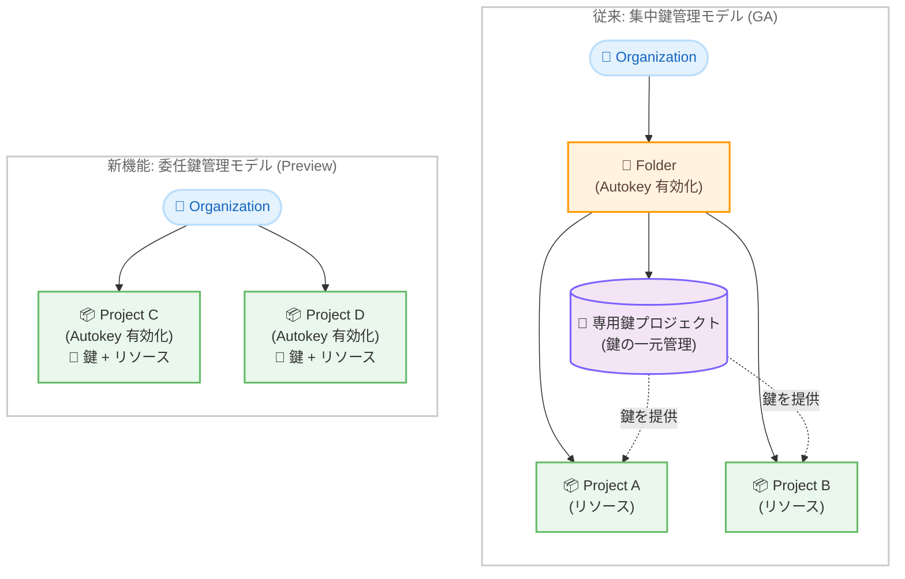

# Cloud KMS: Autokey for Projects (Public Preview)

**リリース日**: 2026-02-11
**サービス**: Cloud Key Management Service
**機能**: Autokey for Projects (委任鍵管理モデル)
**ステータス**: Public Preview

## 概要

Cloud KMS Autokey for Projects が Public Preview として利用可能になった。これまで Cloud KMS Autokey は、フォルダレベルでの有効化が必須であり、専用の鍵プロジェクトに暗号鍵を集約する「集中鍵管理モデル」(GA) のみが提供されていた。今回のアップデートにより、個別のプロジェクト単位で Autokey を有効化できる「委任鍵管理モデル」が Public Preview として利用可能になった。

Autokey for Projects では、暗号鍵がリソースと同じプロジェクト内に作成される。これにより、プロジェクト管理者が自身のプロジェクト内で鍵管理を完結でき、フォルダ構造への依存を排除できる。組織のリソース階層がフラットなプロジェクト構成であっても、CMEK (顧客管理暗号鍵) の自動プロビジョニングと割り当てを活用できるようになる。

この機能は、コンプライアンス要件として CMEK を必要としつつも、鍵管理の運用負荷を最小限に抑えたいプロジェクト管理者やセキュリティチームを主な対象としている。

**アップデート前の課題**

Autokey の導入にあたり、以下の課題が存在していた。

- Autokey を使用するには、組織リソース配下にフォルダリソースを作成し、そのフォルダレベルで有効化する必要があった
- 専用の鍵プロジェクトを別途作成し、Cloud KMS サービスエージェントへの権限付与などの初期セットアップが必要だった
- フォルダ構造を持たないフラットなプロジェクト構成の組織では、Autokey を導入するためにリソース階層の再編成が必要だった
- 1 つのプロジェクトだけで Autokey を試したい場合でも、フォルダ全体に影響する設定変更が必要だった

**アップデート後の改善**

今回のアップデートにより、以下の改善が実現した。

- 個別のプロジェクト単位で Autokey を有効化でき、フォルダレベルの設定が不要になった
- 暗号鍵がリソースと同じプロジェクト内に作成されるため、専用の鍵プロジェクトの作成が不要になった
- Cloud KMS サービスエージェントの手動作成が不要になり、必要に応じて自動的に作成される
- 既存のフォルダレベルの集中鍵管理と併用でき、プロジェクトレベルの設定がフォルダの設定をオーバーライドする

## アーキテクチャ図



左側の従来モデルでは、フォルダ配下に専用鍵プロジェクトを作成し、フォルダ内の各プロジェクトに鍵を提供する構成が必要だった。右側の新しい委任鍵管理モデルでは、各プロジェクトが独立して Autokey を有効化し、鍵とリソースを同一プロジェクト内で管理できる。

## サービスアップデートの詳細

### 主要機能

1. **プロジェクト単位の Autokey 有効化**
   - 個別のプロジェクトに対して REST API で `AutokeyConfig` を設定し、`key_project_resolution_mode` を `RESOURCE_PROJECT` に指定することで有効化できる
   - フォルダリソースの作成や組織レベルの構成変更が不要

2. **同一プロジェクト内での鍵管理 (Same-Project Keys)**
   - Autokey が作成する暗号鍵は、保護対象のリソースと同じプロジェクト内に配置される
   - 鍵リング名は `autokey`、鍵の命名規則は `PROJECT_NUMBER-SERVICE_SHORT_NAME-RANDOM_HEX`

3. **フォルダレベルの委任鍵管理との併用**
   - フォルダレベルで `RESOURCE_PROJECT` モードを設定すると、フォルダ内のすべてのプロジェクトで同一プロジェクト鍵管理が有効になる
   - プロジェクトレベルの設定はフォルダレベルの設定をオーバーライドする

4. **簡素化されたサービスエージェント管理**
   - 委任鍵管理モデルでは、Cloud KMS サービスエージェントが必要に応じて自動的に作成される
   - 集中鍵管理モデルで必要だった手動でのサービスエージェント作成と権限付与が不要

## 技術仕様

### Autokey で作成される鍵の属性

Autokey が自動生成する暗号鍵は以下の属性を持つ。

| 項目 | 詳細 |
|------|------|
| 保護レベル | HSM (Multi-tenant Cloud HSM) |
| アルゴリズム | AES-256 GCM |
| ローテーション期間 | 1 年 (作成後に管理者が変更可能) |
| 鍵のロケーション | リソースと同じロケーション |
| 鍵リング名 | `autokey` |
| 鍵の命名規則 | `PROJECT_NUMBER-SERVICE_SHORT_NAME-RANDOM_HEX` |
| FIPS 準拠 | FIPS 140-2 Level 3 |
| 鍵のエクスポート | 不可 (すべての Cloud KMS 鍵と同様) |

### 必要な IAM ロール

委任鍵管理モデルの設定に必要なロールは以下の通り。

| ロール | 説明 |
|--------|------|
| `roles/cloudkms.autokeyAdmin` | Autokey の設定・管理権限 |
| `roles/serviceusage.serviceUsageAdmin` | Cloud KMS API の有効化権限 |
| `roles/cloudkms.autokeyUser` | Autokey を使用してリソースを保護する権限 |

### 鍵管理モデルの比較

以下の表は、集中鍵管理モデルと委任鍵管理モデルの主要な違いを比較したものである。

| 項目 | 集中鍵管理モデル (GA) | 委任鍵管理モデル (Preview) |
|------|----------------------|--------------------------|
| 有効化の単位 | フォルダ | プロジェクトまたはフォルダ |
| 鍵の保管場所 | 専用鍵プロジェクト | リソースと同じプロジェクト |
| 前提条件 | 組織リソース + フォルダリソース | プロジェクトのみ |
| サービスエージェント | 手動で作成・権限付与が必要 | 自動作成 |
| 組織ポリシーとの統合 | 対応 | 対応 |
| Terraform サポート | 対応 | 対応 |

## 設定方法

### 前提条件

1. Google Cloud プロジェクトが存在すること
2. プロジェクトに対して `roles/cloudkms.autokeyAdmin` および `roles/serviceusage.serviceUsageAdmin` ロールが付与されていること
3. プロジェクトで `keyHandles.create` 権限が IAM deny ポリシーによってブロックされていないこと

### 手順

#### ステップ 1: プロジェクトで Autokey を有効化

REST API を使用して、プロジェクトの `AutokeyConfig` を作成する。

```bash
curl "https://cloudkms.googleapis.com/v1/projects/PROJECT_ID/autokeyConfig?updateMask=key_project_resolution_mode" \
    --request "PATCH" \
    --header "authorization: Bearer TOKEN" \
    --header "content-type: application/json" \
    --data '{"key_project_resolution_mode": "RESOURCE_PROJECT"}'
```

`PROJECT_ID` を Autokey を有効化するプロジェクトの ID に置き換える。

#### ステップ 2: Cloud KMS API を有効化

```bash
gcloud services enable cloudkms.googleapis.com --project=PROJECT_ID
```

Cloud KMS API が有効化されるまで、開発者はそのプロジェクトで Autokey を使用できない。

#### ステップ 3: Terraform での設定 (任意)

Terraform を使用する場合は、以下のリソース定義を使用する。

```hcl
resource "google_kms_autokey_config" "autokey_config_project" {
  provider = google-beta
  project  = "projects/PROJECT_ID"
  key_project_resolution_mode = "RESOURCE_PROJECT"
}
```

## メリット

### ビジネス面

- **導入障壁の低減**: フォルダ構造の再編成が不要になり、既存のプロジェクト構成のまま CMEK を導入できる
- **運用コストの削減**: 専用鍵プロジェクトの管理やサービスエージェントの手動設定が不要になり、鍵管理の運用負荷が軽減される
- **段階的な導入が容易**: 特定のプロジェクトから試験的に導入し、効果を確認してから組織全体に展開できる

### 技術面

- **シンプルなリソース階層**: 鍵とリソースが同一プロジェクト内に存在するため、権限管理やリソースの可視性が向上する
- **セキュリティベストプラクティスの自動適用**: HSM 保護レベル、鍵のローテーション、職務分離などが自動的に適用される
- **Terraform との統合**: Infrastructure as Code のワークフローに容易に組み込め、昇格した鍵作成権限が不要になる

## デメリット・制約事項

### 制限事項

- Public Preview のステータスであり、「Pre-GA Offerings Terms」が適用される (サポートが限定的な場合がある)
- gcloud CLI は Autokey リソースに対して利用できない (REST API または Terraform を使用する必要がある)
- Key Handle は Cloud Asset Inventory に含まれない
- Cloud HSM が利用できないロケーションでは、Autokey を使用して CMEK 保護リソースを作成できない

### 考慮すべき点

- 集中鍵管理モデルと異なり、鍵が各プロジェクトに分散するため、組織全体での鍵の一覧性が低下する可能性がある
- 保護レベルは HSM に固定されており、ソフトウェアキーやカスタムローテーション期間が必要な場合は手動 CMEK を使用する必要がある
- プロジェクトレベルの設定がフォルダの設定をオーバーライドするため、組織のポリシーとの整合性に注意が必要

## ユースケース

### ユースケース 1: フラットなプロジェクト構成での CMEK 導入

**シナリオ**: フォルダ構造を使用せず、組織直下に複数のプロジェクトを配置している企業が、コンプライアンス要件として CMEK の導入を求められている。

**実装例**:

```bash
# プロジェクトごとに Autokey を有効化
curl "https://cloudkms.googleapis.com/v1/projects/my-project/autokeyConfig?updateMask=key_project_resolution_mode" \
    --request "PATCH" \
    --header "authorization: Bearer $(gcloud auth print-access-token)" \
    --header "content-type: application/json" \
    --data '{"key_project_resolution_mode": "RESOURCE_PROJECT"}'

# Cloud KMS API を有効化
gcloud services enable cloudkms.googleapis.com --project=my-project
```

**効果**: フォルダ構造の再編成なしに、プロジェクト単位で CMEK を導入でき、コンプライアンス要件を満たせる。

### ユースケース 2: 段階的な Autokey 導入

**シナリオ**: 大規模な組織で、まず開発環境の 1 プロジェクトで Autokey を試験導入し、効果を確認してから本番環境に展開したい。

**効果**: プロジェクト単位で有効化できるため、他のプロジェクトへの影響なく試験導入が可能。効果確認後、フォルダレベルでの委任鍵管理や集中鍵管理モデルへの移行も選択できる。

## 料金

Cloud KMS Autokey の利用自体に追加料金は発生しない。Autokey で作成された鍵は、他の Cloud HSM 鍵と同じ料金が適用される。

### 料金例

以下は Cloud KMS の鍵タイプ別の料金比較である。

| 鍵タイプ | 月額料金 (鍵バージョンあたり) |
|----------|---------------------------|
| ソフトウェア鍵 (Cloud KMS) | $0.06 |
| ハードウェア鍵 (Cloud HSM) - Autokey で使用 | $1.00 - $2.50 |
| 外部鍵 (Cloud EKM) | $3.00 |

暗号化操作には別途料金が発生する。詳細は [Cloud KMS の料金ページ](https://cloud.google.com/kms/pricing) を参照。

## 利用可能リージョン

Cloud KMS Autokey は、Cloud HSM が利用可能なすべての Google Cloud ロケーションで使用できる。詳細は [Cloud KMS ロケーション](https://cloud.google.com/kms/docs/locations) を参照。

## 対応サービス

Autokey は以下の Google Cloud サービスと連携する。

| サービス | 保護対象リソース | 鍵の粒度 |
|----------|-----------------|---------|
| Artifact Registry | Repository | リソースごとに 1 つ |
| BigQuery | Dataset | リソースごとに 1 つ |
| Bigtable | Cluster | クラスタごとに 1 つ |
| AlloyDB for PostgreSQL | Cluster, Backup | リソースごとに 1 つ |
| Cloud Run | Service, Job | プロジェクト内のロケーションごとに 1 つ |
| Cloud SQL | Instance | リソースごとに 1 つ |
| Cloud Storage | Bucket | バケットごとに 1 つ |
| Compute Engine | Disk, Image, Instance, MachineImage | リソースごとに 1 つ |
| Pub/Sub | Topic | リソースごとに 1 つ |
| Secret Manager | Secret | プロジェクト内のロケーションごとに 1 つ |
| Secure Source Manager | Instance | リソースごとに 1 つ |
| Spanner | Database | リソースごとに 1 つ |
| Dataflow | Job | リソースごとに 1 つ |
| Dataproc | Cluster, SessionTemplate, WorkflowTemplate, Batch, Session | リソースまたはロケーションごと |

## 関連サービス・機能

- **Cloud KMS (集中鍵管理モデル)**: フォルダレベルで Autokey を有効化し、専用鍵プロジェクトに鍵を集約する GA モデル。大規模組織での鍵の一元管理に適している
- **CMEK (手動)**: Autokey を使用せず、手動で暗号鍵を作成・管理する方式。ソフトウェアキーやカスタムローテーション期間が必要な場合に使用する
- **Cloud HSM**: Autokey が使用するハードウェアセキュリティモジュール。FIPS 140-2 Level 3 に準拠した鍵保護を提供する
- **組織ポリシー**: `constraints/gcp.restrictNonCmekServices` や `constraints/gcp.restrictCmekCryptoKeyProjects` を使用して、Autokey の使用を強制できる

## 参考リンク

- [公式リリースノート](https://cloud.google.com/release-notes#February_11_2026)
- [Autokey の概要 (公式ドキュメント)](https://cloud.google.com/kms/docs/autokey-overview)
- [Cloud KMS Autokey の有効化手順](https://cloud.google.com/kms/docs/enable-autokey)
- [Cloud KMS Autokey の使用方法](https://cloud.google.com/kms/docs/kms-autokey)
- [Cloud KMS 料金ページ](https://cloud.google.com/kms/pricing)
- [Cloud KMS ロケーション](https://cloud.google.com/kms/docs/locations)

## まとめ

Cloud KMS Autokey for Projects は、CMEK の導入を大幅に簡素化する重要なアップデートである。フォルダ構造への依存を排除し、プロジェクト単位での柔軟な暗号鍵管理を実現する。コンプライアンス要件として CMEK を必要とするプロジェクトでは、このアップデートを活用することで、セキュリティベストプラクティスに準拠した暗号鍵管理を最小限の運用負荷で導入できる。現在は Public Preview のため、本番環境への適用前に十分な検証を行うことを推奨する。

---

**タグ**: Cloud KMS, Autokey, CMEK, 暗号鍵管理, HSM, セキュリティ, Public Preview, 委任鍵管理
