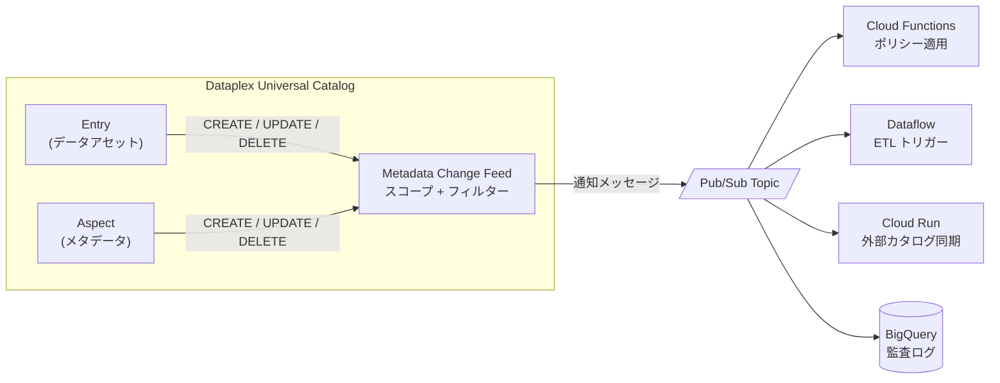

# Dataplex: Metadata Change Feeds

**リリース日**: 2026-02-11
**サービス**: Dataplex Universal Catalog
**機能**: Metadata Change Feeds
**ステータス**: GA (一般提供)

[このアップデートのインフォグラフィックを見る](https://takech9203.github.io/google-cloud-news-summary/20260211-dataplex-metadata-change-feeds.html)

## 概要

Dataplex Universal Catalog に Metadata Change Feeds 機能が追加された。この機能により、Dataplex Universal Catalog 内のメタデータ変更 (エントリやアスペクトの作成、更新、削除) をほぼリアルタイムで追跡し、指定した Pub/Sub トピックに通知メッセージを発行できるようになった。

Metadata Change Feeds は、データガバナンスとカタログ管理において重要な機能であり、イベント駆動型ワークフローの構築を可能にする。具体的には、外部カタログへのメタデータ同期、セキュリティポリシーの自動適用、データ品質チェックのトリガー、ETL/ELT ジョブの自動起動、コンプライアンス監査のためのメタデータ変更ログの記録といったユースケースに対応する。

対象ユーザーは、データガバナンスチーム、データエンジニア、プラットフォームエンジニアであり、特に大規模なデータ基盤においてメタデータの変更をリアクティブに処理する必要がある組織にとって大きな価値がある。

**アップデート前の課題**

Metadata Change Feeds が存在しなかった時点では、メタデータの変更を検知するために以下のような制約があった。

- メタデータの変更を検知するには、Dataplex API を定期的にポーリングする必要があり、リアルタイム性に欠けていた
- バッチ処理ベースのメタデータ同期では、変更の検知から対応までにタイムラグが発生していた
- メタデータ変更に基づくイベント駆動型ワークフローを構築する標準的な手段が提供されていなかった
- 外部カタログやサードパーティツールとのメタデータ同期は手動またはカスタムスクリプトに依存していた

**アップデート後の改善**

Metadata Change Feeds の導入により、以下の改善が実現された。

- Pub/Sub を介したほぼリアルタイムのメタデータ変更通知 (ターゲットレイテンシ: 3〜10 分) が可能になった
- スコープ (組織全体、プロジェクト、エントリグループ) とフィルター (エントリタイプ、アスペクトタイプ、変更タイプ) による柔軟な通知制御が可能になった
- Pub/Sub を起点としたイベント駆動型アーキテクチャにより、Cloud Functions、Dataflow、Cloud Run などの下流サービスとシームレスに連携できるようになった
- VPC Service Controls に準拠しており、セキュリティ境界内でのメタデータ変更追跡が可能になった

## アーキテクチャ図



Dataplex Universal Catalog でエントリやアスペクトが変更されると、Metadata Change Feed がスコープとフィルターに基づいて変更を検知し、Pub/Sub トピックに通知メッセージを発行する。下流のサービスがこの通知を受け取り、それぞれのユースケースに応じた処理を実行する。

## サービスアップデートの詳細

### 主要機能

1. **スコープベースのモニタリング**
   - 組織全体 (`organizationLevel: true`)、特定のプロジェクト、または特定のエントリグループをモニタリング対象として指定可能
   - API リソース名形式: `projects/PROJECT_ID/locations/LOCATION/metadataFeeds/FEED_ID`

2. **フィルターによる通知の精緻化**
   - エントリタイプ (例: `bigquery-table`)、アスペクトタイプ、変更タイプ (`CREATE`, `UPDATE`, `DELETE`) によるフィルタリング
   - フィルター未指定の場合はスコープ内のすべての変更タイプで通知が発行される

3. **構造化された通知メッセージ**
   - Pub/Sub メッセージの属性 (attributes) にタイムスタンプ、エントリ名、エントリタイプ、変更タイプなどの情報が含まれる
   - データペイロードには変更されたアスペクトの詳細 (作成、更新、削除されたアスペクトタイプのリスト) が含まれる
   - Pub/Sub のサブスクリプションフィルターを利用したメッセージのさらなる絞り込みが可能

4. **VPC Service Controls 対応**
   - 組織スコープの場合、VPC Service Controls 境界内のプロジェクトのみが通知を生成
   - プロジェクトまたはエントリグループスコープの場合、すべてのリソースが同一の VPC-SC 境界内に存在する必要がある

5. **CRUD 操作による管理**
   - REST API を通じた Metadata Change Feed の作成、表示、一覧取得、更新、削除が可能
   - スコープやフィルターの事後変更にも対応

## 技術仕様

### Metadata Change Feed の構成要素

| 項目 | 詳細 |
|------|------|
| リソース名形式 | `projects/PROJECT_ID/locations/LOCATION/metadataFeeds/FEED_ID` |
| スコープ | 組織全体、プロジェクト (複数指定可)、エントリグループ (複数指定可) |
| フィルター | エントリタイプ、アスペクトタイプ、変更タイプ (`CREATE`, `UPDATE`, `DELETE`) |
| 送信先 | Pub/Sub トピック (`projects/PROJECT_ID/topics/TOPIC_ID`) |
| 配信保証 | At least once (重複メッセージの処理が必要) |
| メッセージ順序 | 順序保証なし |
| ターゲットレイテンシ | 3〜10 分 |
| 有効化遅延 | 作成・更新後、最大 10 分で有効化 |

### 通知メッセージの属性

| 属性名 | 説明 |
|--------|------|
| `timestamp` | 変更が発生した時刻 |
| `entry_name` | エントリのリソース名 |
| `entry_fqn` | エントリの完全修飾名 |
| `feed_name` | Metadata Change Feed のリソース名 |
| `entry_type` | エントリタイプのリソース名 |
| `entry_change_type` | 変更タイプ (`CREATED`, `UPDATED`, `DELETED`) |

### Metadata Change Feed の設定例

```json
{
  "scope": {
    "projects": [
      "projects/PROJECT_ID_1",
      "projects/PROJECT_ID_2"
    ]
  },
  "filter": {
    "entryTypes": [
      "projects/PROJECT_ID/locations/global/entryTypes/bigquery-table"
    ],
    "changeTypes": [
      "CREATE",
      "UPDATE"
    ]
  },
  "pubsubTopic": "projects/PROJECT_ID_PUBSUB/topics/TOPIC_ID"
}
```

### 必要な IAM ロールと権限

| 対象 | ロール | 説明 |
|------|--------|------|
| ユーザー | `roles/dataplex.entryGroupExporter` | メタデータのエクスポート権限 |
| ユーザー | `roles/pubsub.subscriber` | Pub/Sub メッセージの受信権限 |
| Dataplex サービスアカウント | `roles/pubsub.publisher` | Pub/Sub トピックへのメッセージ発行権限 |

## 設定方法

### 前提条件

1. Dataplex Universal Catalog API と Pub/Sub API が有効化されていること
2. 通知を受信するための Pub/Sub トピックが作成済みであること
3. `gcloud` CLI がインストールされていること

### 手順

#### ステップ 1: Dataplex サービスアカウントに Pub/Sub Publisher ロールを付与

```bash
gcloud pubsub topics add-iam-policy-binding TOPIC_ID \
    --member="serviceAccount:service-PROJECT_NUMBER@gcp-sa-dataplex.iam.gserviceaccount.com" \
    --role="roles/pubsub.publisher"
```

Dataplex サービスアカウント (`service-PROJECT_NUMBER@gcp-sa-dataplex.iam.gserviceaccount.com`) に Pub/Sub トピックへの発行権限を付与する。ユーザーアカウントではなく、Dataplex サービスアカウントに対してロールを付与する必要がある点に注意。

#### ステップ 2: Metadata Change Feed を作成 (REST API)

```bash
# gcurl エイリアスの設定
alias gcurl='curl -H "Authorization: Bearer $(gcloud auth print-access-token)" -H "Content-Type: application/json"'

# DATAPLEX_API 変数の設定
DATAPLEX_API="dataplex.googleapis.com/v1/projects/PROJECT_ID/locations/LOCATION"

# プロジェクトスコープで Metadata Change Feed を作成
gcurl -X POST -d "$(cat <<EOF
{
  "scope": {
    "projects": [
      "projects/PROJECT_ID_1",
      "projects/PROJECT_ID_2"
    ]
  },
  "filter": {
    "entryTypes": [
      "projects/PROJECT_ID/locations/global/entryTypes/bigquery-table"
    ]
  },
  "pubsubTopic": "projects/PROJECT_ID_PUBSUB/topics/TOPIC_ID"
}
EOF
)" "https://${DATAPLEX_API}/metadataFeeds?metadataFeedId=FEED_ID"
```

スコープ、フィルター、送信先の Pub/Sub トピックを指定して Metadata Change Feed を作成する。

#### ステップ 3: Pub/Sub サブスクリプションを作成してメッセージを受信

```bash
# サブスクリプションの作成
gcloud pubsub subscriptions create SUBSCRIPTION_ID --topic=TOPIC_ID

# メッセージの確認 (テスト用)
gcloud pubsub subscriptions pull SUBSCRIPTION_ID --auto-ack --limit=10
```

Pub/Sub トピックに対するサブスクリプションを作成し、メタデータ変更通知を受信する。

## メリット

### ビジネス面

- **データガバナンスの強化**: メタデータ変更のリアルタイム追跡により、データカタログの鮮度と正確性が向上し、データに基づく意思決定の信頼性が高まる
- **コンプライアンス対応の効率化**: メタデータ変更の自動監査ログにより、規制要件への対応コストが削減される
- **運用コストの削減**: ポーリングベースのカスタムスクリプトが不要になり、メタデータ管理の自動化により運用負荷が軽減される

### 技術面

- **イベント駆動アーキテクチャの実現**: Pub/Sub を介した疎結合な設計により、柔軟でスケーラブルなメタデータ処理パイプラインが構築可能
- **きめ細かな制御**: スコープとフィルターの組み合わせにより、必要な変更通知のみを選択的に受信でき、不要な処理を回避可能
- **セキュリティ境界の維持**: VPC Service Controls との統合により、組織のセキュリティポリシーを遵守しながらメタデータ変更を追跡可能

## デメリット・制約事項

### 制限事項

- 配信保証は "at least once" であり、サブスクライバー側で重複メッセージの処理 (冪等性の確保) が必要
- メッセージの配信順序は保証されないため、順序依存の処理を行う場合は追加のロジックが必要
- ターゲットレイテンシは 3〜10 分であり、厳密なリアルタイム性が求められるユースケースには適さない場合がある
- 通知メッセージのペイロードには変更シグネチャ (エントリ名、変更タイプ、変更されたアスペクトタイプ) のみが含まれ、実際の変更データは含まれない。詳細データが必要な場合は GetEntry API を追加で呼び出す必要がある

### 考慮すべき点

- Metadata Change Feed の作成・更新後、有効化までに最大 10 分の遅延がある (バックエンドのキャッシュに起因)
- 組織スコープの場合、VPC-SC 境界外のプロジェクトの変更は通知されない
- Pub/Sub のメッセージ配信コストは別途発生するため、大量のメタデータ変更がある環境ではコストへの影響を事前に見積もる必要がある

## ユースケース

### ユースケース 1: 外部データカタログとのメタデータ同期

**シナリオ**: 社内で Dataplex Universal Catalog と並行してサードパーティのデータカタログ (例: Apache Atlas、Alation) を運用しており、メタデータの一貫性を維持する必要がある。

**実装例**:
```json
{
  "scope": {
    "organizationLevel": true
  },
  "pubsubTopic": "projects/my-project/topics/metadata-sync-topic"
}
```

Pub/Sub トピックに Cloud Functions をサブスクライブし、変更通知を受信するたびに外部カタログの API を呼び出してメタデータを同期する。

**効果**: 手動同期やバッチジョブが不要になり、カタログ間のメタデータの不整合を最小限に抑えることができる。

### ユースケース 2: スキーマ変更に基づくデータ品質チェックの自動トリガー

**シナリオ**: BigQuery テーブルのスキーマが変更された際に、下流のパイプラインに影響が出る前にデータ品質チェックを自動実行したい。

**実装例**:
```json
{
  "scope": {
    "projects": ["projects/data-warehouse-project"]
  },
  "filter": {
    "entryTypes": [
      "projects/data-warehouse-project/locations/global/entryTypes/bigquery-table"
    ],
    "changeTypes": ["UPDATE"]
  },
  "pubsubTopic": "projects/my-project/topics/schema-change-topic"
}
```

UPDATE 通知を受信した Cloud Functions が Dataplex のデータ品質スキャンをトリガーし、結果に基づいて下流パイプラインの一時停止やデータオーナーへのアラートを実行する。

**効果**: スキーマ変更に起因するデータ品質問題を早期に検出し、不整合なデータに基づく意思決定のリスクを低減できる。

## 料金

Dataplex Universal Catalog Metadata Change Feeds 自体には直接的な課金は発生しない。ただし、使用するリソースに対して以下のコストが発生する。

| コスト要素 | 課金対象 | 参考 |
|-----------|----------|------|
| Pub/Sub メッセージ配信 | メッセージ配信量に応じた従量課金 | [Pub/Sub 料金ページ](https://cloud.google.com/pubsub/pricing) |
| Pub/Sub ストレージ | 未確認メッセージの保存量に応じた課金 | [Pub/Sub 料金ページ](https://cloud.google.com/pubsub/pricing) |
| データ転送 (Egress) | リージョン間データ転送が発生する場合 | [ネットワーク料金ページ](https://cloud.google.com/vpc/network-pricing) |
| Dataplex API 呼び出し | GetEntry API などの追加呼び出し | [Dataplex 料金ページ](https://cloud.google.com/dataplex/pricing) |

## 関連サービス・機能

- **[Pub/Sub](https://cloud.google.com/pubsub)**: Metadata Change Feeds の通知メッセージの配信基盤。サブスクリプションフィルターによるメッセージのさらなる絞り込みも可能
- **[Cloud Functions](https://cloud.google.com/functions)**: Pub/Sub トリガーにより、メタデータ変更に応じた軽量な処理 (ポリシー適用、アラート送信) を実行するのに適している
- **[Dataflow](https://cloud.google.com/dataflow)**: Pub/Sub からのストリーミング入力を処理し、メタデータ変更に基づく大規模な ETL/ELT パイプラインの実行に利用可能
- **[Cloud Run](https://cloud.google.com/run)**: Pub/Sub からのプッシュサブスクリプションで外部カタログとのメタデータ同期処理を実行するのに適している
- **[BigQuery](https://cloud.google.com/bigquery)**: メタデータ変更のモニタリング対象として最も一般的なデータソースであり、監査ログの保存先としても利用可能
- **[Dataplex Universal Catalog](https://cloud.google.com/dataplex/docs/catalog-overview)**: メタデータ管理の基盤であり、エントリとアスペクトの管理、データリネージ、データ品質などの機能と連携

## 参考リンク

- [インフォグラフィック](https://takech9203.github.io/google-cloud-news-summary/20260211-dataplex-metadata-change-feeds.html)
- [公式リリースノート](https://cloud.google.com/release-notes#February_11_2026)
- [Metadata Change Feeds 概要ドキュメント](https://cloud.google.com/dataplex/docs/metadata-change-feeds-overview)
- [Metadata Change Feeds の設定ガイド](https://cloud.google.com/dataplex/docs/receive-metadata-notifications)
- [Metadata Change Feeds のトラブルシューティング](https://cloud.google.com/dataplex/docs/troubleshoot-metadata-change-feeds)
- [Dataplex Universal Catalog 概要](https://cloud.google.com/dataplex/docs/catalog-overview)
- [Dataplex 料金ページ](https://cloud.google.com/dataplex/pricing)
- [Pub/Sub 料金ページ](https://cloud.google.com/pubsub/pricing)

## まとめ

Dataplex Universal Catalog の Metadata Change Feeds は、データガバナンスとカタログ管理におけるイベント駆動型アプローチを実現する重要な機能である。ポーリングベースの監視からリアクティブな通知ベースの処理への移行により、メタデータ変更への対応速度と運用効率が大幅に向上する。データ基盤を運用する組織は、まず主要プロジェクトをスコープとした Metadata Change Feed を作成し、外部カタログ同期やデータ品質チェックの自動化から導入を開始することを推奨する。

---

**タグ**: #Dataplex #MetadataChangeFeeds #PubSub #DataGovernance #DataCatalog #EventDriven #DataQuality #メタデータ管理
