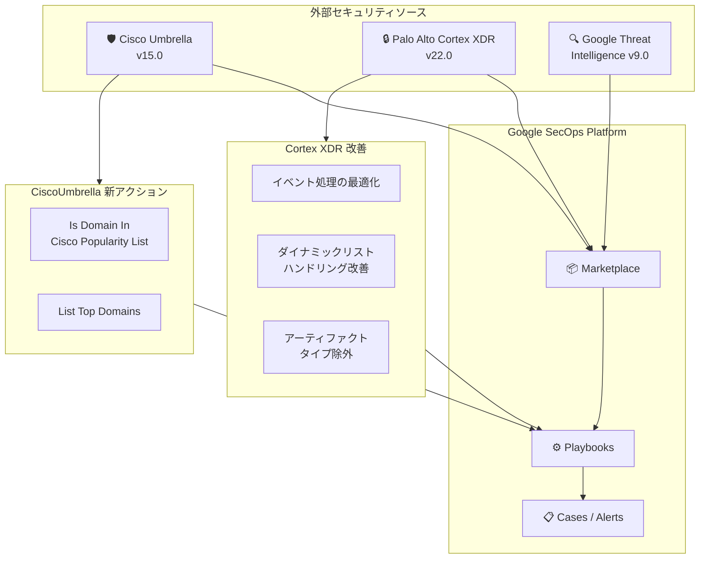

# Google SecOps Marketplace: 統合インテグレーションアップデート (CiscoUmbrella v15.0 / Palo Alto Cortex XDR v22.0 / Google Threat Intelligence v9.0)

**リリース日**: 2026-02-11
**サービス**: Google SecOps Marketplace
**機能**: CiscoUmbrella, Palo Alto Cortex XDR, Google Threat Intelligence インテグレーション更新
**ステータス**: FEATURE / CHANGED

[このアップデートのインフォグラフィックを見る](https://takech9203.github.io/google-cloud-news-summary/20260211-google-secops-marketplace-integration-updates.html)

## 概要

Google SecOps (旧 Chronicle SOAR) の Marketplace において、セキュリティ統合インテグレーションの複数の重要なバージョンアップデートがリリースされた。対象となるのは、CiscoUmbrella v15.0、Palo Alto Cortex XDR v22.0、Google Threat Intelligence v9.0 の 3 つのインテグレーションである。

CiscoUmbrella v15.0 では、ドメインの人気度リストに関する新しいアクション「Is Domain In Cisco Popularity List」と「List Top Domains」が追加され、ドメイン調査の精度が向上した。Palo Alto Cortex XDR v22.0 では、イベント処理の改善とダイナミックリストのハンドリングが更新され、特定のアーティファクトタイプを無視する機能が追加された。Google Threat Intelligence v9.0 は新しい機能で更新されている。

これらのアップデートは、SOC (Security Operations Center) チームがマルチベンダー環境でのセキュリティオーケストレーションと自動対応をより効果的に行えるようにするものであり、Google SecOps を利用するセキュリティ担当者に直接影響するアップデートである。

**アップデート前の課題**

- CiscoUmbrella インテグレーション (v13.0) では、ドメインが Cisco Popularity List に含まれているかどうかを直接確認するアクションが存在せず、誤検知の判定に手動の追加調査が必要だった
- CiscoUmbrella で人気ドメインの上位リストを取得する機能がなく、ホワイトリスト作成やベースライン構築に手間がかかっていた
- Palo Alto Cortex XDR コネクタ (v15.0) では、不要なアーティファクトタイプまで取り込まれ、SOAR 側でのイベント処理が煩雑になるケースがあった
- Palo Alto Cortex XDR のダイナミックリスト機能のハンドリングが最適化されておらず、効率的なブロックリスト管理に制約があった

**アップデート後の改善**

- CiscoUmbrella v15.0 で「Is Domain In Cisco Popularity List」アクションが追加され、ドメインの正当性を自動的に検証できるようになった
- CiscoUmbrella v15.0 で「List Top Domains」アクションが追加され、最大 100,000 件の人気ドメインリストを取得可能になった
- Palo Alto Cortex XDR v22.0 で「Artifacts To Ignore」パラメータにより、特定のアーティファクトタイプを除外してイベントを取り込めるようになった
- Palo Alto Cortex XDR v22.0 でイベント処理とダイナミックリストハンドリングが改善され、より効率的なインシデント管理が可能になった
- Google Threat Intelligence v9.0 で脅威インテリジェンスの機能が強化された

## アーキテクチャ図



この図は、Google SecOps Marketplace を中心とした 3 つのインテグレーションの連携構成と、今回のアップデートで追加・改善された機能の関係を示している。各外部セキュリティソースからの情報が Marketplace 経由で Playbooks に統合され、自動化されたインシデント対応に活用される。

## サービスアップデートの詳細

### 主要機能

1. **CiscoUmbrella v15.0 - Is Domain In Cisco Popularity List**
   - ドメインが Cisco Popularity List に存在するかを検証するアクション
   - Domain、Hostname、URL エンティティで実行可能
   - エンリッチメントテーブル、JSON 結果、出力メッセージ、スクリプト結果を返す
   - エンリッチメントフィールド `is_found_in_cisco_popular_list` でドメインの人気度を自動判定
   - JSON 結果には `found` (true/false) と `entries` (ドメインの順位情報) が含まれる

2. **CiscoUmbrella v15.0 - List Top Domains**
   - Cisco Popularity List に基づく人気ドメインの上位リストを取得するアクション
   - 「Max Domains To Return」パラメータで取得件数を指定 (最大 100,000 件、デフォルト 100 件)
   - JSON 結果としてドメインと順位情報を返す
   - ホワイトリスト作成やベースライン構築に活用可能

3. **Palo Alto Cortex XDR v22.0 - イベント処理とダイナミックリスト改善**
   - コネクタのイベント処理ロジックが更新され、インシデント取り込みの効率が向上
   - ダイナミックリストのハンドリングが改善され、`source` パラメータに対するダイナミックリスト機能が最適化
   - 「Artifacts To Ignore」パラメータが追加され、特定のアーティファクトタイプを除外してイベント生成を制御可能
   - 「Include Historical Artifacts」オプションにより、初回取り込み時の過去アーティファクト取得を制御可能

4. **Google Threat Intelligence v9.0 - 機能強化**
   - 脅威インテリジェンスの新しい機能が追加
   - Google SecOps の SIEM/SOAR 両方の機能と連携し、Applied Threat Intelligence (ATI) による自動脅威検出を強化
   - VirusTotal、Mandiant、SafeBrowsing などの脅威フィードとの統合を改善

## 技術仕様

### CiscoUmbrella v15.0 新アクション

| アクション | エンティティ | 主な出力 | パラメータ |
|-----------|-------------|---------|-----------|
| Is Domain In Cisco Popularity List | Domain, Hostname, URL | エンリッチメントテーブル, JSON 結果 | なし |
| List Top Domains | エンティティ不要 | JSON 結果 | Max Domains To Return (最大 100,000) |

### Palo Alto Cortex XDR v22.0 コネクタパラメータ

| パラメータ | 説明 | 備考 |
|-----------|------|------|
| Artifacts To Ignore | 除外するアーティファクトタイプのカンマ区切りリスト | v22.0 で追加 |
| Include Historical Artifacts | 初回取り込み時に過去のアーティファクトを取得 | データ量増加に注意 |
| Use dynamic list as a blocklist | ダイナミックリストをブロックリストとして使用 | ハンドリング改善 |
| Lowest Incident SmartScore To Fetch | 取得するインシデントの最小 SmartScore (0-100) | 重大度フィルタと独立 |

### CiscoUmbrella v15.0 - Is Domain In Cisco Popularity List JSON 結果例

```json
[{
   "Entity": "example.com",
   "EntityResult": {
       "found": "true",
       "entries": [
           {
               "order": 123,
               "domain": "example.com"
           }
       ]
   }
}]
```

### CiscoUmbrella v15.0 - List Top Domains JSON 結果例

```json
[{
  "order": 123,
  "domain": "example.com"
}]
```

## 設定方法

### 前提条件

1. Google SecOps プラットフォームへのアクセス権限があること
2. 各インテグレーションに対応する外部サービスの API キーまたは認証情報を取得済みであること
3. Google SecOps Marketplace でインテグレーションのインストールまたはアップグレード権限があること

### 手順

#### ステップ 1: Marketplace でインテグレーションをアップグレード

Google SecOps SOAR コンソールで Marketplace にアクセスし、対象のインテグレーションをアップグレードする。

1. Google SecOps SOAR コンソールで **Marketplace** > **Integrations** に移動
2. 対象のインテグレーション (CiscoUmbrella / Palo Alto Cortex XDR / Google Threat Intelligence) を検索
3. **Upgrade to VERSION_NUMBER** をクリック

#### ステップ 2: オントロジーマッピングの選択

アップグレード時にオントロジーマッピングの選択ダイアログが表示される。

- **Override (replace mapping)**: 既存のマッピングを新しいインテグレーションのルールで完全に置き換える
- **Retain (keep existing mapping)**: カスタマイズしたマッピングを保持する場合に選択

#### ステップ 3: コネクタの更新 (該当する場合)

コネクタが設定されている場合、インテグレーションのアップグレード後にコネクタを手動で更新する必要がある。

1. **Settings** > **Ingestion** > **Connectors** に移動
2. 対象のコネクタを選択し、**Update** をクリック

## メリット

### ビジネス面

- **誤検知の削減**: CiscoUmbrella の Popularity List 確認により、正規ドメインへのアラートを自動的にフィルタリングでき、アナリストの調査工数を削減
- **SOC 効率の向上**: Palo Alto Cortex XDR の不要アーティファクト除外により、SOAR プラットフォームに取り込まれるイベント量が最適化され、重要なインシデントへの集中度が向上
- **マルチベンダー対応の強化**: 3 つの主要セキュリティベンダーのインテグレーションが同時に強化され、統合セキュリティ運用の柔軟性が向上

### 技術面

- **自動化精度の向上**: CiscoUmbrella の新アクションをプレイブックに組み込むことで、ドメインベースのトリアージを自動化可能
- **データ取り込みの最適化**: Cortex XDR コネクタのアーティファクトフィルタリングにより、ストレージ使用量とイベント処理負荷を削減
- **脅威インテリジェンスの拡充**: Google Threat Intelligence v9.0 により、Applied Threat Intelligence (ATI) との連携がさらに強化

## デメリット・制約事項

### 制限事項

- CiscoUmbrella の「List Top Domains」は最大 100,000 件まで取得可能だが、それ以上の件数は対応していない
- Palo Alto Cortex XDR コネクタの最大取得件数は 1 イテレーションあたり 100 件に制限されている
- インテグレーションのアップグレード時にコネクタが設定されている場合、コネクタの手動更新が必要
- 各インテグレーションの新機能は、既存のプレイブックに自動的には適用されない。新アクションを活用するにはプレイブックの更新が必要

### 考慮すべき点

- オントロジーマッピングのアップグレード時に「Override」を選択すると、カスタマイズしたマッピングが失われるため、事前にバックアップの取得を推奨
- Palo Alto Cortex XDR の「Include Historical Artifacts」を有効にすると、初回取り込み時のデータ量が大幅に増加する可能性がある
- 各インテグレーションのバージョンアップに問題が生じた場合は、ロールバック機能 ([Roll back response integration version](https://cloud.google.com/chronicle/docs/soar/respond/integrations-setup/version-rollback)) で前バージョンに戻すことが可能

## ユースケース

### ユースケース 1: ドメインベースのアラート自動トリアージ

**シナリオ**: SOC チームが大量のドメイン関連アラートを受け取っており、正規ドメインへの誤検知を自動的にフィルタリングしたい場合。

**実装例**:
プレイブックで以下のフローを構築する。

1. アラートからドメインエンティティを抽出
2. CiscoUmbrella の「Is Domain In Cisco Popularity List」アクションを実行
3. `is_found_in_cisco_popular_list` が `true` の場合、アラートの優先度を自動的に下げる
4. `false` の場合、追加の脅威インテリジェンス調査を実行

**効果**: 正規ドメインに関するアラートの手動トリアージ工数が削減され、アナリストは真に疑わしいドメインの調査に集中できる。

### ユースケース 2: Cortex XDR インシデントの効率的な取り込み

**シナリオ**: Palo Alto Cortex XDR から Google SecOps に取り込むインシデントデータのノイズを削減し、重要なアーティファクトのみを処理したい場合。

**実装例**:
Palo Alto Cortex XDR コネクタの設定で以下を構成する。

1. 「Artifacts To Ignore」パラメータに不要なアーティファクトタイプを指定
2. 「Lowest Incident SmartScore To Fetch」を適切な閾値 (例: 50) に設定
3. 「Use dynamic list as a blocklist」を有効にし、既知の安全なソースを除外

**効果**: SOAR プラットフォームに取り込まれるイベント量が最適化され、処理コストとアナリストの負荷が軽減される。

## 料金

Google SecOps の料金は、Google SecOps のライセンスティアに基づく。Marketplace インテグレーション自体の追加料金は発生しないが、利用するには対応する Google SecOps ライセンス (Standard、Enterprise、または Enterprise+) が必要である。

詳細な料金情報については [Google SecOps Sales](https://chronicle.security/contact) に問い合わせが必要。

## 関連サービス・機能

- **[Google SecOps SIEM](https://cloud.google.com/chronicle/docs/secops/google-secops-siem-toc)**: セキュリティ情報・イベント管理。SOAR と統合してインシデント検出と対応を実現
- **[Applied Threat Intelligence (ATI)](https://cloud.google.com/chronicle/docs/detection/applied-threat-intel-overview)**: Google Threat Intelligence と連携し、自動的な IOC マッチングとアラート優先順位付けを提供
- **[Google SecOps Playbooks](https://cloud.google.com/chronicle/docs/soar/respond/working-with-playbooks/whats-on-the-playbooks-screen)**: 今回更新されたインテグレーションのアクションを組み込んで自動化ワークフローを構築
- **[Mandiant Threat Intelligence](https://cloud.google.com/chronicle/docs/soar/marketplace-integrations/mandiant-threat-intelligence)**: Google Threat Intelligence と補完関係にある脅威インテリジェンスサービス

## 参考リンク

- [インフォグラフィック](https://takech9203.github.io/google-cloud-news-summary/20260211-google-secops-marketplace-integration-updates.html)
- [公式リリースノート](https://cloud.google.com/release-notes#February_11_2026)
- [Google SecOps Marketplace Integrations](https://cloud.google.com/chronicle/docs/soar/marketplace-integrations)
- [CiscoUmbrella インテグレーション](https://cloud.google.com/chronicle/docs/soar/marketplace-integrations/cisco-umbrella)
- [Palo Alto Cortex XDR インテグレーション](https://cloud.google.com/chronicle/docs/soar/marketplace-integrations/palo-alto-cortex-xdr)
- [Google Threat Intelligence インテグレーション](https://cloud.google.com/chronicle/docs/soar/marketplace-integrations/google-threat-intelligence)
- [インテグレーションの設定方法](https://cloud.google.com/chronicle/docs/soar/respond/integrations-setup/configure-integrations)
- [インテグレーションのロールバック](https://cloud.google.com/chronicle/docs/soar/respond/integrations-setup/version-rollback)

## まとめ

今回の Google SecOps Marketplace インテグレーションアップデートは、CiscoUmbrella、Palo Alto Cortex XDR、Google Threat Intelligence の 3 つの主要セキュリティ製品との連携を強化するものである。特に CiscoUmbrella の Popularity List アクション追加と Cortex XDR のアーティファクトフィルタリング機能は、SOC チームの運用効率向上に直結する。既存のプレイブックに新アクションを組み込み、ドメインベースの自動トリアージやノイズ削減を実現することを推奨する。

---

**タグ**: #GoogleSecOps #SOAR #Marketplace #CiscoUmbrella #PaloAlto #CortexXDR #GoogleThreatIntelligence #セキュリティ #インテグレーション #SOC
