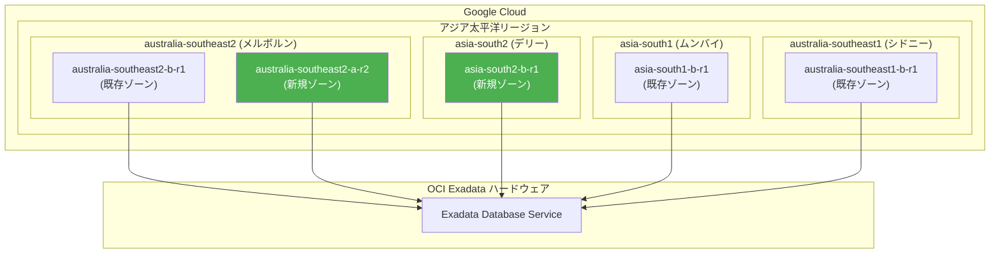

# Oracle Database@Google Cloud: Exadata Database Service リージョン拡張 (メルボルン、デリー)

**リリース日**: 2026-02-11
**サービス**: Oracle Database@Google Cloud
**機能**: Exadata Database Service 新リージョン・ゾーン追加
**ステータス**: FEATURE

[このアップデートのインフォグラフィックを見る](https://takech9203.github.io/google-cloud-news-summary/20260211-oracle-database-google-cloud-melbourne-delhi.html)

## 概要

Oracle Database@Google Cloud の Exadata Database Service において、新たに 2 つのリージョン・ゾーンがサポートされた。具体的には、australia-southeast2-a-r2 (メルボルン、オーストラリア) と asia-south2-b-r1 (デリー、インド) が追加された。これにより、アジア太平洋地域における Oracle Database@Google Cloud の利用可能範囲が拡大し、オーストラリアとインドの顧客がより低レイテンシで Oracle Exadata データベースサービスを利用できるようになる。

Oracle Database@Google Cloud は、Google Cloud のデータセンター内で OCI Exadata ハードウェア上に Oracle データベースサービスをデプロイできるサービスであり、Google Cloud のインフラストラクチャ、ネットワーク、物理/ネットワークセキュリティ、ハードウェアモニタリング機能を活用しながら、Oracle Database のフル機能を利用できる。今回のリージョン拡張により、特にオーストラリア南東部およびインド北部に拠点を持つ企業が、データレジデンシー要件を満たしつつ Oracle ワークロードを Google Cloud 上で運用する選択肢を得られる。

なお、メルボルンリージョン (australia-southeast2) は 2025 年 9 月に Exadata Database Service として最初のゾーン (australia-southeast2-b-r1) が追加されていたが、今回新たに 2 番目のゾーン (australia-southeast2-a-r2) が追加された形となる。デリーリージョン (asia-south2) は Exadata Database Service としては今回が初めてのサポートとなる。

**アップデート前の課題**

- Exadata Database Service のインド拠点はムンバイ (asia-south1) のみで、インド北部に近いリージョンが存在しなかった
- メルボルンリージョンでは Exadata Database Service のゾーンが 1 つ (australia-southeast2-b-r1) のみで、ゾーンレベルの冗長構成が取れなかった
- インド北部やオーストラリア南東部のユーザーは、遠方のリージョンを利用する必要があり、ネットワークレイテンシが課題だった

**アップデート後の改善**

- デリー (asia-south2-b-r1) が追加され、インド北部に近い拠点で Exadata Database Service を利用可能になった
- メルボルンに 2 番目のゾーン (australia-southeast2-a-r2) が追加され、同一リージョン内でのゾーン冗長構成が可能になった
- アジア太平洋地域全体で Exadata Database Service の利用可能ゾーンが拡大し、データレジデンシー要件への対応力が向上した

## アーキテクチャ図



今回のアップデートで追加された新規ゾーン (緑色) を含む、アジア太平洋地域における Oracle Database@Google Cloud Exadata Database Service のリージョン・ゾーン構成を示す。各ゾーンは Google Cloud データセンター内に配置された OCI Exadata ハードウェア上で Exadata Database Service を提供する。

## サービスアップデートの詳細

### 主要機能

1. **デリーリージョン (asia-south2) の新規追加**
   - ゾーン: `asia-south2-b-r1`
   - インド北部に位置するデリーリージョンで Exadata Database Service が利用可能に
   - 既存のムンバイリージョン (asia-south1) と合わせて、インド国内で 2 つのリージョンから選択可能

2. **メルボルンリージョン (australia-southeast2) の 2 番目のゾーン追加**
   - ゾーン: `australia-southeast2-a-r2`
   - 既存の `australia-southeast2-b-r1` に加え、同一リージョン内で 2 つのゾーンが利用可能に
   - ゾーン間の冗長構成によるデータ保護と可用性の向上が期待できる

3. **Exadata Database Service の対象**
   - 今回の追加は Exadata Database Service (Exadata Infrastructure、Exadata VM Cluster) が対象
   - Exadata Database Service on Exascale Infrastructure、Base Database Service、Autonomous Database Service は今回の追加対象外

## 技術仕様

### 新規追加リージョン・ゾーン

| 項目 | 詳細 |
|------|------|
| リージョン名 | `australia-southeast2` |
| リージョン説明 | メルボルン、オーストラリア |
| 新規ゾーン | `australia-southeast2-a-r2` |
| 既存ゾーン | `australia-southeast2-b-r1` |

| 項目 | 詳細 |
|------|------|
| リージョン名 | `asia-south2` |
| リージョン説明 | デリー、インド |
| 新規ゾーン | `asia-south2-b-r1` |

### Exadata Database Service で利用可能な全リージョン・ゾーン一覧

| 地域 | リージョン名 | リージョン説明 | ゾーン |
|------|-------------|---------------|--------|
| アジア太平洋 | `asia-northeast1` | 東京、日本 | `asia-northeast1-a-r1` |
| | `asia-northeast2` | 大阪、日本 | `asia-northeast2-a-r1` |
| | `australia-southeast1` | シドニー、オーストラリア | `australia-southeast1-b-r1` |
| | `australia-southeast2` | メルボルン、オーストラリア | `australia-southeast2-a-r2`, `australia-southeast2-b-r1` |
| | `asia-south1` | ムンバイ、インド | `asia-south1-b-r1` |
| | `asia-south2` | デリー、インド | `asia-south2-b-r1` |
| 北米 | `northamerica-northeast1` | モントリオール、カナダ | `northamerica-northeast1-a-r1` |
| | `northamerica-northeast2` | トロント、カナダ | `northamerica-northeast2-a-r2` |
| | `us-central1` | アイオワ | `us-central1-a-r1` |
| | `us-east4` | 北バージニア | `us-east4-a-r2`, `us-east4-b-r1` |
| | `us-west3` | ソルトレイクシティ | `us-west3-a-r1` |
| 南米 | `southamerica-east1` | サンパウロ、ブラジル | `southamerica-east1-a-r1` |
| ヨーロッパ | `europe-west2` | ロンドン | `europe-west2-a-r1`, `europe-west2-c-r2` |
| | `europe-west3` | フランクフルト | `europe-west3-a-r2`, `europe-west3-b-r1` |

### リソースの種類とスコープ

| リソース | スコープ | 説明 |
|---------|---------|------|
| Exadata Infrastructure | ゾーンリソース | 同一リージョン・ゾーン内で ODB Network と同じ場所に作成 |
| Exadata VM Cluster | ゾーンリソース | Exadata Infrastructure 上に作成 |
| ODB Network / ODB Subnet | ゾーンリソース | VPC ネットワークとの接続を管理 |
| Autonomous Database | リージョンリソース | リージョン内のどのゾーンからでも利用可能 |

## 設定方法

### 前提条件

1. Google Cloud Marketplace で Oracle Database@Google Cloud のサブスクリプションが有効であること
2. Oracle Database@Google Cloud API が有効化されていること
3. 必要な IAM ロール (`cloudExadataInfrastructureAdmin`) が割り当てられていること
4. VPC ネットワークが構成済みであること

### 手順

#### ステップ 1: ODB Network の作成

```bash
gcloud oracle-database odb-networks create ODB_NETWORK_ID \
  --project=PROJECT_ID \
  --location=asia-south2 \
  --network=projects/PROJECT_ID/global/networks/VPC_NETWORK
```

新規リージョン (例: デリー) に ODB Network を作成する。ODB Network は Exadata Infrastructure と同じリージョン・ゾーンに作成する必要がある。

#### ステップ 2: Exadata Infrastructure の作成

```bash
gcloud oracle-database cloud-exadata-infrastructures create INSTANCE_ID \
  --location=asia-south2 \
  --display-name=DISPLAY_NAME \
  --properties-shape="Exadata.X9M" \
  --properties-compute-count=2 \
  --properties-storage-count=3
```

新規ゾーンに Exadata Infrastructure インスタンスを作成する。リージョンとゾーンの選択は恒久的であり、後から変更できない。

#### ステップ 3: Exadata VM Cluster の作成

Exadata Infrastructure が作成されたら、Google Cloud Console または API を使用して Exadata VM Cluster を作成する。VM Cluster の作成には、Client Subnet と Backup Subnet を含む ODB Subnet が必要。

## メリット

### ビジネス面

- **データレジデンシー要件の充足**: インドおよびオーストラリアのデータ主権規制に対応するため、現地リージョンでのデータ保管が可能になる
- **市場拡大**: インド北部とオーストラリア南東部の顧客に対して、低レイテンシの Oracle Database サービスを提供できるようになる
- **災害対策の強化**: メルボルンリージョンでは 2 つのゾーンが利用可能になり、同一リージョン内でのゾーン冗長構成を検討できる

### 技術面

- **低レイテンシ**: デリーやメルボルンに近いユーザーは、遠方リージョンを利用する必要がなくなり、ネットワークレイテンシが改善される
- **柔軟なアーキテクチャ設計**: インド国内で 2 リージョン (ムンバイ・デリー)、オーストラリア国内で 2 リージョン (シドニー・メルボルン) を活用した DR 構成が可能になる
- **Google Cloud ネイティブ統合**: IAM、VPC、Cloud Monitoring、Cloud Logging と統合された Oracle Database 環境をこれらの新リージョンでも利用可能

## デメリット・制約事項

### 制限事項

- 今回の追加は Exadata Database Service のみが対象であり、Exadata Database Service on Exascale Infrastructure、Base Database Service、Autonomous Database Service はデリーリージョンでは利用できない
- リージョンとゾーンの選択は恒久的であり、作成後に変更することはできない
- Exadata Database の作成自体は Oracle Cloud Infrastructure (OCI) 側で行う必要がある

### 考慮すべき点

- 新規リージョンにデプロイする場合、ODB Network、Exadata Infrastructure、Exadata VM Cluster を同一リージョン・ゾーン内に作成する必要がある
- マシン構成の選択肢はリージョン・ゾーンによって異なる場合がある
- Google Cloud Marketplace でのサブスクリプションと OCI のライセンス体系 (BYOL またはマーケットプレイス購入) を事前に確認する必要がある

## ユースケース

### ユースケース 1: インド北部の金融機関における Oracle Database 移行

**シナリオ**: インド北部に本社を置く金融機関が、オンプレミスの Oracle Exadata 環境を Google Cloud に移行したい。インドのデータ主権規制により、データはインド国内に保管する必要がある。

**効果**: デリーリージョン (asia-south2) の追加により、インド北部に近い場所で Oracle Exadata Database Service を利用できるようになり、データレジデンシー要件を満たしながらクラウド移行が実現できる。ムンバイリージョンとの組み合わせによる国内 DR 構成も検討可能。

### ユースケース 2: オーストラリアの企業における高可用性構成

**シナリオ**: オーストラリアのメルボルンに拠点を持つ企業が、Oracle Database の高可用性構成を Google Cloud 上で実現したい。

**効果**: メルボルンリージョンに 2 つのゾーン (australia-southeast2-a-r2 と australia-southeast2-b-r1) が利用可能になったことで、同一リージョン内でのゾーン冗長構成を検討できる。さらに、シドニーリージョン (australia-southeast1) との組み合わせによるリージョン間 DR 構成も実現可能。

## 料金

Oracle Database@Google Cloud の料金は Oracle のライセンス体系に基づく。Google Cloud Marketplace を通じたサブスクリプションまたはプライベートオファーで契約する。請求は Google Cloud が一元管理し、Google Cloud の使用量と OCI Oracle Database サービスの使用量を統合して請求する。

ライセンスオプションとして、BYOL (Bring Your Own License) またはマーケットプレイスでのライセンス購入が選択可能。同一リージョン内でのアプリケーションと Oracle Exadata データベース間のデータ転送のネットワーク料金は、Oracle Database@Google Cloud の価格に含まれる。

詳細な料金については [Oracle Database@Google Cloud pricing](https://www.oracle.com/cloud/google/oracle-database-at-google-cloud/pricing/) を参照。

## 利用可能リージョン

Exadata Database Service は、今回の追加を含め、以下の 14 リージョンで利用可能:

- **アジア太平洋**: 東京、大阪、シドニー、メルボルン、ムンバイ、デリー
- **北米**: モントリオール、トロント、アイオワ、北バージニア、ソルトレイクシティ
- **南米**: サンパウロ
- **ヨーロッパ**: ロンドン、フランクフルト

## 関連サービス・機能

- **Exadata Database Service on Exascale Infrastructure**: Exascale Infrastructure 上での Exadata データベース。現時点ではデリー・メルボルンの新ゾーンは非対応
- **Autonomous Database Service**: サーバーレスの Oracle Autonomous Database。メルボルンでは利用可能だが、デリーは非対応
- **Base Database Service**: Oracle Base Database Service。デリー・メルボルンの新ゾーンは非対応
- **Cloud Monitoring / Cloud Logging**: Oracle Database@Google Cloud リソースのモニタリングとログ管理に利用
- **VPC ネットワーク**: ODB Network を通じた Oracle Database@Google Cloud リソースへの接続に使用
- **IAM**: Oracle Database@Google Cloud リソースへのアクセス制御に使用
- **CMEK (Cloud KMS)**: Exadata VM Cluster と Autonomous Database での顧客管理の暗号化キーに対応 (GA)

## 参考リンク

- [インフォグラフィック](https://takech9203.github.io/google-cloud-news-summary/20260211-oracle-database-google-cloud-melbourne-delhi.html)
- [公式リリースノート](https://cloud.google.com/release-notes#February_11_2026)
- [Oracle Database@Google Cloud リリースノート](https://cloud.google.com/oracle/database/docs/release-notes)
- [ドキュメント: Oracle Database@Google Cloud 概要](https://cloud.google.com/oracle/database/docs/overview)
- [サポートされるリージョンとゾーン](https://cloud.google.com/oracle/database/docs/regions-and-zones)
- [Exadata Infrastructure インスタンスの作成](https://cloud.google.com/oracle/database/docs/create-instances)
- [ODB Network と ODB Subnet の作成](https://cloud.google.com/oracle/database/docs/create-odb-network)
- [料金ページ](https://www.oracle.com/cloud/google/oracle-database-at-google-cloud/pricing/)

## まとめ

Oracle Database@Google Cloud の Exadata Database Service にデリー (インド) とメルボルン (オーストラリア) の新リージョン・ゾーンが追加され、アジア太平洋地域での利用可能範囲が大幅に拡大した。特にインド北部での Oracle Database の利用が初めて可能となり、メルボルンでは同一リージョン内の 2 ゾーン構成が実現した。インドやオーストラリアにワークロードを持つ企業は、データレジデンシー要件への対応や低レイテンシ接続の観点から、これらの新リージョン・ゾーンの活用を検討することを推奨する。

---

**タグ**: #OracleDatabase #GoogleCloud #ExadataDatabase #リージョン拡張 #メルボルン #デリー #アジア太平洋 #データレジデンシー
