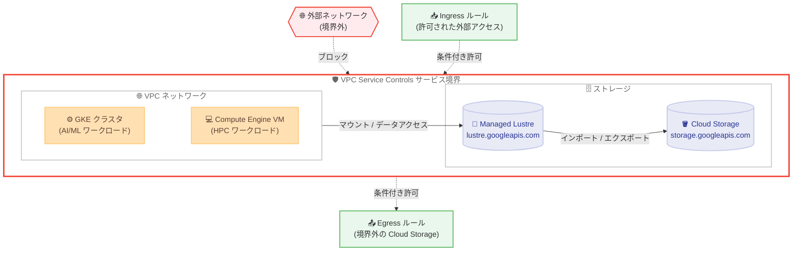

# VPC Service Controls: Managed Lustre Preview サポート

**リリース日**: 2026-02-11
**サービス**: VPC Service Controls
**機能**: Managed Lustre インテグレーション (Preview)
**ステータス**: Preview (新機能)

[このアップデートのインフォグラフィックを見る]({INFOGRAPHIC_BASE_URL}/20260211-vpc-service-controls-managed-lustre.html)

## 概要

VPC Service Controls が Google Cloud Managed Lustre を Preview ステージでサポートした。これにより、Managed Lustre インスタンスをサービス境界 (Service Perimeter) で保護し、データ流出リスクを軽減できるようになった。サービス名は `lustre.googleapis.com` であり、既存の VPC Service Controls のサービス境界に追加することで保護を有効化できる。

Managed Lustre は、AI/ML および HPC (ハイパフォーマンスコンピューティング) ワークロード向けに最適化されたフルマネージドの並列ファイルシステムであり、最大 1 TBps のスループットとペタバイト級のストレージ容量を提供する。このようなミッションクリティカルなストレージサービスに対して VPC Service Controls による境界保護が可能になったことは、規制要件やデータガバナンスの厳しい環境で Managed Lustre を採用するうえで重要なアップデートである。

対象ユーザーは、Managed Lustre を使用して大規模データセットを処理しており、データ流出防止やコンプライアンス要件への対応が求められる組織のセキュリティ管理者、クラウドアーキテクト、および DevOps エンジニアである。

**アップデート前の課題**

今回のアップデート以前は、Managed Lustre インスタンスを VPC Service Controls のサービス境界で保護することができなかった。

- Managed Lustre API (`lustre.googleapis.com`) が VPC Service Controls のサポート対象サービスに含まれていなかったため、サービス境界による API アクセス制御ができなかった
- Managed Lustre と Cloud Storage 間のデータ転送に対して、VPC Service Controls レベルでの境界保護を適用できなかった
- 規制要件の厳しい環境 (金融、ヘルスケアなど) において、Managed Lustre を使用する際にデータ流出防止の追加的なセキュリティレイヤーを適用する手段が IAM のみに限定されていた

**アップデート後の改善**

今回のアップデートにより、Managed Lustre を VPC Service Controls のサービス境界で保護できるようになった。

- `lustre.googleapis.com` をサービス境界に追加することで、境界外からの Managed Lustre API リクエストをブロックし、データ流出リスクを軽減できるようになった
- Cloud Storage との連携においても、同一サービス境界内に配置するか、Egress ルールを構成することで、制御されたデータ転送が可能になった
- IAM に加えて VPC Service Controls による多層防御 (Defense in Depth) が実現し、コンプライアンス要件への対応が強化された

## アーキテクチャ図



VPC Service Controls のサービス境界内に Managed Lustre と Cloud Storage を配置し、境界外からの不正アクセスをブロックする構成を示す。Ingress/Egress ルールにより、必要な外部アクセスを条件付きで許可できる。

## サービスアップデートの詳細

### 主要機能

1. **サービス境界による Managed Lustre API の保護**
   - `lustre.googleapis.com` をサービス境界に追加することで、境界外からの API リクエストを制御できる
   - 境界内のプロジェクト間では自由な通信が可能であり、既存のワークフローに影響を与えない

2. **Cloud Storage との連携におけるデータ転送制御**
   - Managed Lustre と Cloud Storage 間のデータインポート/エクスポートにおいて、同一境界内であれば追加設定不要で動作する
   - 境界外の Cloud Storage バケットとデータ転送する場合は、Managed Lustre サービスエージェント (`service-PROJECT_NUMBER@gcp-sa-lustre.iam.gserviceaccount.com`) に対する Egress ルールの構成が必要

3. **Shared VPC 環境でのサポート**
   - Shared VPC を使用している場合、ホストプロジェクト (ネットワーク) とサービスプロジェクト (Managed Lustre インスタンス) の両方を同一のサービス境界内に配置する必要がある
   - ホストプロジェクトとサービスプロジェクトを異なる境界で分離すると、既存インスタンスが利用不可になる可能性がある

## 技術仕様

### VPC Service Controls 統合の概要

VPC Service Controls と Managed Lustre の統合に関する主要な技術仕様は以下の通りである。

| 項目 | 詳細 |
|------|------|
| サービス名 | `lustre.googleapis.com` |
| ステータス | Preview |
| 境界保護 | 対応 (サービス境界でサービスを保護可能) |
| CMEK | VPC Service Controls 境界内では非対応 |
| Shared VPC | ホストプロジェクトとサービスプロジェクトは同一境界内に配置が必要 |

### Managed Lustre の基本仕様

Managed Lustre サービス自体の主要な仕様は以下の通りである。

| 項目 | 詳細 |
|------|------|
| ストレージ容量 | 9,000 GiB から最大 7.28 PiB (7,632,000 GiB) |
| スループット | 最大 1 TBps |
| IOPS | 読み取り: 最大 5,800 IOPS/TiB、書き込み: 最大 5,600 IOPS/TiB |
| 最大ファイルサイズ | 0.5 PiB |
| パフォーマンスティア | 4 段階 (125 MBps/TiB から 1000 MBps/TiB) |
| POSIX 準拠 | 対応 |
| 暗号化 | 保存時暗号化、転送中暗号化 (Google Cloud 内) |

### VPC Service Controls の IAM 権限

VPC Service Controls でサービス境界を管理するために必要な権限は以下の通りである。

```
accesscontextmanager.accessPolicies.list
accesscontextmanager.servicePerimeters.create
accesscontextmanager.servicePerimeters.update
accesscontextmanager.servicePerimeters.delete
```

## 設定方法

### 前提条件

1. VPC Service Controls が有効化された Google Cloud 組織
2. Access Context Manager API が有効化されていること
3. 既存の Managed Lustre インスタンス、または新規作成の計画
4. サービス境界の管理に必要な IAM 権限

### 手順

#### ステップ 1: サービス境界の作成

サービス境界が未作成の場合は、新規に作成する。

```bash
gcloud access-context-manager perimeters create PERIMETER_NAME \
  --title="PERIMETER_TITLE" \
  --resources="projects/PROJECT_NUMBER" \
  --restricted-services="lustre.googleapis.com" \
  --policy=POLICY_ID
```

#### ステップ 2: 既存のサービス境界に Managed Lustre を追加

既存のサービス境界がある場合は、`lustre.googleapis.com` を制限対象サービスに追加する。

```bash
gcloud access-context-manager perimeters update PERIMETER_NAME \
  --add-restricted-services="lustre.googleapis.com" \
  --policy=POLICY_ID
```

#### ステップ 3: Cloud Storage との連携用 Egress ルールの構成 (必要な場合)

境界外の Cloud Storage バケットとデータ転送する場合は、Egress ルールを構成する。

```yaml
# egress_policy.yaml
- egressFrom:
    identityType: ANY_SERVICE_ACCOUNT
  egressTo:
    operations:
    - serviceName: storage.googleapis.com
      methodSelectors:
      - method: "*"
    resources:
    - "projects/EXTERNAL_PROJECT_NUMBER"
```

```bash
gcloud access-context-manager perimeters update PERIMETER_NAME \
  --set-egress-policies=egress_policy.yaml \
  --policy=POLICY_ID
```

## メリット

### ビジネス面

- **コンプライアンス対応の強化**: 金融、ヘルスケア、政府機関など規制の厳しい業界において、Managed Lustre 上のデータに対するアクセス制御を強化し、コンプライアンス要件への対応を容易にする
- **データガバナンスの向上**: サービス境界によりデータ流出リスクを低減し、組織のデータガバナンスポリシーを技術的に実施できる

### 技術面

- **多層防御 (Defense in Depth)**: IAM による ID ベースのアクセス制御に加えて、VPC Service Controls による境界ベースのセキュリティを追加することで、セキュリティレイヤーを重層化できる
- **一貫したセキュリティポリシー**: Cloud Storage、BigQuery などの他の Google Cloud サービスと同じ VPC Service Controls のフレームワークで Managed Lustre を保護できるため、セキュリティポリシーの一貫性を維持できる

## デメリット・制約事項

### 制限事項

公式ドキュメントで確認された制限事項は以下の通りである。

- VPC Service Controls の境界内では CMEK (顧客管理暗号鍵) が Managed Lustre でサポートされていない。境界内で CMEK を使用したインスタンスを作成しようとすると失敗する
- Managed Lustre と Cloud Storage 間のデータ転送において、Cloud Storage バケットを含むプロジェクトが境界外にある場合は Egress ルールの構成が必須となる
- Shared VPC 環境では、ホストプロジェクトとサービスプロジェクトを異なる境界に分離できない。分離すると既存インスタンスが利用不可になり、新規インスタンスの作成が妨げられる

### 考慮すべき点

- Preview ステージであるため、本番環境での使用にはリスクがある。「Pre-GA Offerings Terms」の条件が適用される
- 境界の構成変更 (サービスの追加、Ingress/Egress ルールの変更) は既存のワークロードに影響を与える可能性があるため、dry-run モードでの事前テストを推奨する
- Network Connectivity Center (NCC) を使用してピアリング VPC から Managed Lustre にアクセスしている場合、VPC Service Controls との組み合わせにおける動作を事前に確認する必要がある

## ユースケース

### ユースケース 1: 金融機関における AI モデルトレーニングデータの保護

**シナリオ**: 金融機関が Managed Lustre を使用して大規模な取引データセットで AI モデルをトレーニングしている。規制要件により、トレーニングデータが組織外に流出しないことを技術的に保証する必要がある。

**実装例**:

```bash
# サービス境界を作成し、Managed Lustre と Cloud Storage を保護
gcloud access-context-manager perimeters create finance-ml-perimeter \
  --title="Finance ML Training Perimeter" \
  --resources="projects/PROJECT_NUMBER" \
  --restricted-services="lustre.googleapis.com,storage.googleapis.com" \
  --policy=POLICY_ID
```

**効果**: VPC Service Controls のサービス境界により、Managed Lustre 上のトレーニングデータおよび Cloud Storage 上のデータセットが境界外のプロジェクトやインターネットからアクセスされることを防止できる。

### ユースケース 2: HPC 環境における研究データの分離

**シナリオ**: 研究機関が複数のプロジェクトで Managed Lustre を使用しており、プロジェクト間でデータが混在しないよう分離する必要がある。

**効果**: プロジェクトごとにサービス境界を設定することで、各プロジェクトの Managed Lustre インスタンスと Cloud Storage バケットを論理的に分離し、プロジェクト間の意図しないデータアクセスを防止できる。

## 料金

VPC Service Controls 自体には追加料金は発生しない。Managed Lustre の料金は使用するストレージ容量とパフォーマンスティアに基づく。詳細な料金情報は公式料金ページを参照されたい。

- [Managed Lustre 料金ページ](https://cloud.google.com/products/managed-lustre/pricing)

## 利用可能リージョン

Managed Lustre は以下のリージョンで利用可能である。VPC Service Controls は全リージョンで利用できるため、Managed Lustre が利用可能なすべてのリージョンで今回のインテグレーションを使用できる。

主要なリージョンは以下の通りである。

| リージョン | 説明 | ゾーン |
|------------|------|--------|
| asia-northeast1 | 東京 | asia-northeast1-b, asia-northeast1-c |
| asia-south1 | ムンバイ | asia-south1-b |
| asia-southeast1 | シンガポール | asia-southeast1-a, asia-southeast1-b, asia-southeast1-c |
| us-central1 | アイオワ | us-central1-a, us-central1-b, us-central1-c, us-central1-f |
| us-east1 | サウスカロライナ | us-east1-b, us-east1-c, us-east1-d |
| us-west1 | オレゴン | us-west1-a, us-west1-b, us-west1-c |
| europe-west1 | ベルギー | europe-west1-b, europe-west1-c, europe-west1-d |
| europe-west3 | フランクフルト | europe-west3-a, europe-west3-b, europe-west3-c |
| europe-west4 | オランダ | europe-west4-a, europe-west4-b, europe-west4-c |

全リージョンの一覧は [Managed Lustre のサポートされるロケーション](https://cloud.google.com/managed-lustre/docs/locations) を参照されたい。

## 関連サービス・機能

- **[VPC Service Controls](https://cloud.google.com/vpc-service-controls/docs/overview)**: サービス境界によりデータ流出防止とアクセス制御を提供する Google Cloud のセキュリティサービス。今回の統合対象
- **[Cloud Storage](https://cloud.google.com/storage/docs)**: Managed Lustre とのデータインポート/エクスポートに使用するオブジェクトストレージ。同一境界内への配置が推奨される
- **[Access Context Manager](https://cloud.google.com/access-context-manager/docs/overview)**: VPC Service Controls のアクセスレベルやサービス境界を管理するサービス
- **[Google Kubernetes Engine (GKE)](https://cloud.google.com/kubernetes-engine/docs)**: Managed Lustre CSI ドライバーを通じて Managed Lustre をボリュームとしてマウントできる。AI/ML ワークロードの実行基盤
- **[Compute Engine](https://cloud.google.com/compute/docs)**: Managed Lustre インスタンスをマウントして HPC ワークロードを実行する仮想マシンサービス
- **[Cloud Monitoring](https://cloud.google.com/monitoring/docs)**: Managed Lustre インスタンスのパフォーマンスメトリクスを自動収集し、ダッシュボードやアラートで可視化するモニタリングサービス

## 参考リンク

- [このアップデートのインフォグラフィック]({INFOGRAPHIC_BASE_URL}/20260211-vpc-service-controls-managed-lustre.html)
- [公式リリースノート](https://cloud.google.com/release-notes#February_11_2026)
- [VPC Service Controls と Managed Lustre のドキュメント](https://cloud.google.com/managed-lustre/docs/vpc-sc)
- [VPC Service Controls でサポートされるサービス一覧](https://cloud.google.com/vpc-service-controls/docs/supported-products)
- [Managed Lustre 概要](https://cloud.google.com/managed-lustre/docs/overview)
- [Managed Lustre VPC ネットワーク構成](https://cloud.google.com/managed-lustre/docs/vpc)
- [VPC Service Controls 概要](https://cloud.google.com/vpc-service-controls/docs/overview)
- [Managed Lustre 料金ページ](https://cloud.google.com/products/managed-lustre/pricing)

## まとめ

VPC Service Controls による Managed Lustre の Preview サポートは、高性能並列ファイルシステムのセキュリティ態勢を大幅に強化するアップデートである。特に、規制要件の厳しい業界で AI/ML や HPC ワークロードに Managed Lustre を採用している組織にとって、データ流出防止の追加レイヤーとして重要な意味を持つ。Preview ステージであるため本番環境への適用は慎重に検討する必要があるが、dry-run モードを活用して事前にサービス境界の構成をテストし、GA 昇格に備えることを推奨する。

---

**タグ**: #VPCServiceControls #ManagedLustre #セキュリティ #Preview #データ流出防止 #HPC #AIML #サービス境界
