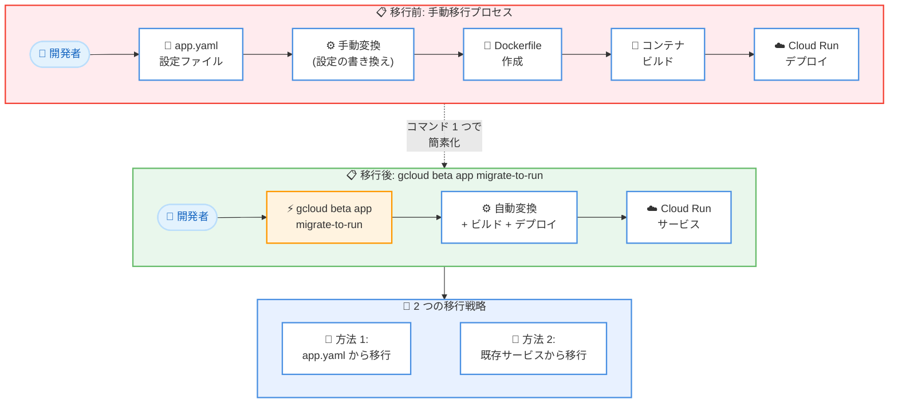

# App Engine Standard Environment: Cloud Run への移行コマンド (Preview)

**リリース日**: 2026-02-12
**サービス**: App Engine Standard Environment
**機能**: `gcloud beta app migrate-to-run` コマンドによる Cloud Run への移行
**ステータス**: Preview

📊 [このアップデートのインフォグラフィックを見る](infographic/20260212-app-engine-to-cloud-run-migration.html)

## 概要

Google Cloud は、App Engine Standard Environment で稼働する既存アプリケーションを Cloud Run へデプロイするための新しい CLI コマンド `gcloud beta app migrate-to-run` を Preview として公開した。このコマンドは Go、Java、Node.js、PHP、Python、Ruby の第 2 世代ランタイムに対応しており、App Engine の `app.yaml` 設定ファイルや既存のデプロイ済みサービスから直接 Cloud Run へ移行できる。

Cloud Run は App Engine Standard Environment と同じインフラストラクチャの多くを共有しており、Google Cloud のサーバーレスプラットフォームの最新進化系として位置づけられている。Google Cloud は公式に「新規プロジェクトには App Engine よりも Cloud Run を推奨」としており、既存の App Engine ユーザーにとっても Cloud Run へのモダナイゼーションが推奨されている。本コマンドはその移行プロセスを大幅に簡素化するものである。

今回の機能は Pre-GA (Preview) ステータスであり、サポートが限定される場合がある。本番環境への適用前にはテスト環境での検証を推奨する。

**アップデート前の課題**

App Engine から Cloud Run への移行には、従来いくつかの手動作業が必要であった。

- App Engine の `app.yaml` 設定を手動で Cloud Run のデプロイ設定に変換する必要があった
- Dockerfile の作成やコンテナイメージのビルドを個別に行う必要があった
- `app2run` ツールなどのサードパーティツールを使用して設定ファイルを変換する必要があった
- 移行時のインコンパチブルな設定の検出が手動であったため、デプロイ後に問題が発覚するリスクがあった

**アップデート後の改善**

今回の `gcloud beta app migrate-to-run` コマンドにより、移行プロセスが大幅に改善された。

- 1 つのコマンドで `app.yaml` から Cloud Run サービスへの変換とデプロイが可能になった
- 既存のデプロイ済み App Engine サービスを直接 Cloud Run にデプロイできるようになった
- インコンパチブルな設定 (第 1 世代ランタイム、バンドルサービス等) がコマンド実行時に自動検出されるようになった
- VPC コネクタ、Cloud SQL 接続、環境変数などの設定をコマンドフラグで一括指定できるようになった

## アーキテクチャ図



上図は、移行前の手動プロセスと、新しい `gcloud beta app migrate-to-run` コマンドによる簡素化されたプロセスの比較を示している。従来は設定ファイルの手動変換、Dockerfile 作成、コンテナビルドを個別に行う必要があったが、新コマンドでは 1 ステップで完了する。

## サービスアップデートの詳細

### 主要機能

1. **`app.yaml` ベースの移行**
   - 既存の App Engine `app.yaml` 設定ファイルを指定して Cloud Run サービスに変換できる
   - プロジェクトディレクトリにいる場合、`PATH` と `ENTRYPOINT` の引数は省略可能
   - コマンド: `gcloud beta app migrate-to-run --appyaml=PATH --entrypoint=ENTRYPOINT`

2. **デプロイ済みサービスの直接移行**
   - 既にデプロイされている App Engine サービスを直接 Cloud Run にデプロイできる
   - サービス名とバージョン ID を指定し、ソースコードディレクトリを対話的に選択する
   - コマンド: `gcloud beta app migrate-to-run --service=SERVICE --version=VERSION --entrypoint=ENTRYPOINT`

3. **インコンパチブル設定の自動検出**
   - 移行コマンドは `app.yaml` 内の非互換設定を自動的に検出して処理を停止する
   - 非互換の一覧が表示されるため、事前に修正すべき箇所が明確になる

4. **豊富な Cloud Run 設定オプション**
   - 認証設定 (`--allow-unauthenticated` / `--no-allow-unauthenticated`)
   - VPC コネクタ、Cloud SQL 接続、環境変数、シークレットなどの設定
   - スケーリング (最小/最大インスタンス数、同時実行数) の指定
   - Binary Authorization、CMEK 暗号化などのセキュリティ設定

## 技術仕様

### 対応ランタイムとサポート状況

本コマンドは第 2 世代ランタイムに対応しており、App Engine レガシーバンドルサービスを使用していないアプリケーションが対象である。

| 項目 | 詳細 |
|------|------|
| 対応ランタイム | Go、Java、Node.js、PHP、Python、Ruby (第 2 世代) |
| ステータス | Preview (Pre-GA) |
| コマンド | `gcloud beta app migrate-to-run` |
| 移行元 | App Engine Standard Environment |
| 移行先 | Cloud Run |

### インコンパチブルな設定 (移行不可)

以下の設定が `app.yaml` に含まれている場合、移行コマンドは失敗する。

| 非互換設定 | `app.yaml` での記述例 |
|------------|----------------------|
| インバウンドサービス | `inbound_services: - warmup` |
| カスタムエラーページ | `error_handlers: - file: default_error.html` |
| バンドルサービス (第 2 世代) | `app_engine_apis: true` |
| ビルド環境変数 | `build_env_variables: Foo: Bar` |
| 第 1 世代ランタイム | `runtime: python27` |

### App Engine と Cloud Run の主要な違い

移行時に留意すべき Cloud Run の特性を以下にまとめる。

| 項目 | App Engine | Cloud Run |
|------|-----------|-----------|
| バージョン管理 | Version | Revision |
| デフォルトアクセス | パブリック | プライベート (要認証設定) |
| URL ドメイン | `appspot.com` | `run.app` |
| リージョン | プロジェクト単位で固定 | サービスごとに異なるリージョン可 |
| ファイルベース設定 | `app.yaml` 必須 | オプション (`service.yaml`) |
| GPU サポート | なし | あり |
| サイドカーコンテナ | なし | あり |
| ボリュームマウント | なし | あり (Cloud Storage バケット) |

## 設定方法

### 前提条件

1. App Engine ソースコードにアクセス可能で、アプリケーションがエラーなく動作していること
2. Cloud Run Admin API と Artifact Registry API が有効であること
3. 必要な IAM ロールが付与されていること

### 手順

#### ステップ 1: API の有効化とプロジェクト設定

```bash
# Cloud Run Admin API と Artifact Registry API を有効化
gcloud services enable run.googleapis.com artifactregistry.googleapis.com

# プロジェクトとリージョンの設定
gcloud auth login
gcloud config set project PROJECT_ID
gcloud config set run/region REGION
gcloud components update
```

`PROJECT_ID` を Google Cloud プロジェクト ID に、`REGION` を対象リージョンに置き換える。

#### ステップ 2: IAM ロールの設定

```bash
# Cloud Build サービスアカウントに Cloud Run Builder ロールを付与
gcloud projects add-iam-policy-binding PROJECT_ID \
    --member=serviceAccount:PROJECT_NUMBER-compute@developer.gserviceaccount.com \
    --role=roles/run.builder
```

デプロイを実行するアカウントには以下のロールが必要である。

- `roles/run.sourceDeveloper` (Cloud Run Source Developer)
- `roles/serviceusage.serviceUsageConsumer` (Service Usage Consumer)
- `roles/iam.serviceAccountUser` (Service Account User)

#### ステップ 3: インコンパチブルな設定の確認と修正

`app.yaml` を確認し、インコンパチブルな設定 (第 1 世代ランタイム、バンドルサービス、カスタムエラーページ等) を削除する。

#### ステップ 4: 移行コマンドの実行

方法 1: `app.yaml` から移行する場合は以下のコマンドを実行する。

```bash
gcloud beta app migrate-to-run --appyaml=path/to/app.yaml --entrypoint=main
```

方法 2: 既存のデプロイ済みサービスから移行する場合は以下のコマンドを実行する。

```bash
gcloud beta app migrate-to-run --service=default --version=v1 --entrypoint=main
```

## メリット

### ビジネス面

- **移行コストの削減**: 手動での設定変換やコンテナイメージ作成が不要になり、移行にかかる工数が大幅に削減される
- **段階的な移行が可能**: `--no-traffic` フラグを使用して、トラフィックを新しい Cloud Run サービスに送らずにデプロイとテストを行える
- **CUD による長期的コスト最適化**: Cloud Run では Committed Use Discounts (CUD) が利用可能であり、App Engine にはなかった長期利用割引を享受できる

### 技術面

- **Cloud Run の先進機能の活用**: GPU サポート、サイドカーコンテナ、ボリュームマウント、マルチリージョンロードバランシングなど、App Engine にはない機能が利用可能になる
- **柔軟なスケーリング制御**: Cloud Run はサービスレベルとリビジョンレベルの両方でスケーリング制御が可能であり、手動スケーリングモードも提供する
- **セキュリティの強化**: Cloud Run Invoker ロールによるサービスレベルのアクセス制御、Binary Authorization、CMEK 暗号化に対応している
- **コンテナベースの可搬性**: Cloud Run はコンテナベースであるため、他のコンテナ環境への移行も容易になる

## デメリット・制約事項

### 制限事項

- 第 1 世代ランタイム (例: `python27`) は移行対象外である
- App Engine レガシーバンドルサービス (`app_engine_apis: true`) を使用しているアプリケーションは移行できない
- インバウンドサービスのウォームアップ (`inbound_services: - warmup`) は非互換である
- カスタムエラーページ (`error_handlers`) は Cloud Run でサポートされていない
- `build_env_variables` の設定は移行時に非互換となる

### 考慮すべき点

- Cloud Run サービスはデフォルトでプライベートであるため、App Engine と同様のパブリックアクセスを実現するには `--allow-unauthenticated` の設定が必要である
- Cloud Run のリクエストタイムアウトのデフォルトは 5 分であり、App Engine の自動スケーリング時の 10 分より短い。必要に応じて `--timeout` で調整が必要である
- App Engine の `target_cpu_utilization` に相当する設定は Cloud Run では固定 (約 60%) であり、変更できない
- Preview ステータスであるため、仕様変更の可能性がある。本番環境への適用には注意が必要である
- Cloud Run の URL 形式が異なるため (`run.app` ドメイン)、カスタムドメインの設定やリダイレクトの計画が必要である

## ユースケース

### ユースケース 1: Python Web アプリケーションの移行

**シナリオ**: App Engine Standard Environment で Flask ベースの Python Web アプリケーションを運用しており、Cloud Run の GPU サポートや柔軟なスケーリング機能を活用したい。

**実装例**:
```bash
# 方法 1: app.yaml から直接移行
gcloud beta app migrate-to-run \
    --appyaml=app.yaml \
    --allow-unauthenticated \
    --region=asia-northeast1

# 方法 2: デプロイ済みサービスから移行
gcloud beta app migrate-to-run \
    --service=my-flask-app \
    --version=v1 \
    --allow-unauthenticated \
    --region=asia-northeast1
```

**効果**: 手動でのコンテナ化作業が不要になり、数分で Cloud Run への移行が完了する。Cloud Run のマルチリージョンロードバランシングやサイドカーコンテナなどの機能も利用可能になる。

### ユースケース 2: マイクロサービスの段階的移行

**シナリオ**: 複数の App Engine サービスで構成されたマイクロサービスアーキテクチャを、リスクを最小化しながら段階的に Cloud Run へ移行したい。

**実装例**:
```bash
# ステップ 1: トラフィックなしでデプロイしてテスト
gcloud beta app migrate-to-run \
    --service=api-service \
    --version=v3 \
    --no-traffic \
    --min-instances=1

# ステップ 2: テスト後にトラフィックを移行
gcloud run services update-traffic api-service --to-latest
```

**効果**: `--no-traffic` フラグにより、既存の App Engine サービスへの影響なしに Cloud Run での動作確認が可能である。段階的にトラフィックを移行することでリスクを最小化できる。

## 料金

Cloud Run は従量課金制を採用しており、App Engine とは異なる料金体系を持つ。移行時にはコストの変化に留意する必要がある。

### 料金比較 (概要)

以下は App Engine Standard Environment と Cloud Run の料金比較である。

| 項目 | App Engine Standard | Cloud Run (インスタンスベース課金) |
|------|--------------------|---------------------------------|
| F4/B4 相当 (1 vCPU) | $0.20/時間 | vCPU: $0.0648/時間 + Memory: $0.0072/GiB/時間 |
| リクエスト課金 | なし | なし (インスタンスベース課金の場合) |
| CUD 割引 | なし | あり (最大 46% 割引) |
| アイドルインスタンス | アクティブと同額 | 低コスト |
| スケールゼロ | あり | あり |

詳細な料金情報は [Cloud Run 料金ページ](https://cloud.google.com/run/pricing) を参照。

## 利用可能リージョン

Cloud Run は 40 以上のリージョンで利用可能である。App Engine と異なり、Cloud Run ではプロジェクト内の各サービスを異なるリージョンにデプロイできる。

主要な日本リージョンは以下の通りである。

- asia-northeast1 (東京) - Tier 1 料金
- asia-northeast2 (大阪) - Tier 2 料金

Cloud Run の全リージョン一覧は [Cloud Run のロケーション](https://cloud.google.com/run/docs/locations) を参照。

## 関連サービス・機能

- **Cloud Run**: 移行先のフルマネージドコンテナプラットフォーム。App Engine と同じインフラストラクチャの多くを共有している
- **Artifact Registry**: 移行時にコンテナイメージを格納するレジストリサービス。移行コマンドの実行には API の有効化が必要である
- **Cloud Build**: ソースコードからコンテナイメージをビルドするサービス。移行コマンドが内部的に使用する
- **Cloud SQL**: App Engine および Cloud Run の両方で接続可能なマネージドデータベースサービス。`--add-cloudsql-instances` フラグで接続設定を移行できる
- **Secret Manager**: Cloud Run ではシークレットをボリュームとしてマウントするか、環境変数として渡すことが可能であり、`--update-secrets` フラグで設定できる

## 参考リンク

- 📊 [インフォグラフィック](infographic/20260212-app-engine-to-cloud-run-migration.html)
- [公式リリースノート](https://docs.cloud.google.com/release-notes#February_12_2026)
- [App Engine Standard から Cloud Run への移行ガイド](https://docs.cloud.google.com/appengine/migration-center/run/migrate-app-engine-standard-to-run)
- [gcloud beta app migrate-to-run リファレンス](https://docs.cloud.google.com/sdk/gcloud/reference/beta/app/migrate-to-run)
- [App Engine と Cloud Run の比較](https://docs.cloud.google.com/appengine/migration-center/run/compare-gae-with-run)
- [Cloud Run 料金ページ](https://cloud.google.com/run/pricing)
- [Cloud Run ドキュメント](https://docs.cloud.google.com/run/docs/overview/what-is-cloud-run)

## まとめ

`gcloud beta app migrate-to-run` コマンドの Preview リリースにより、App Engine Standard Environment から Cloud Run への移行が大幅に簡素化された。Go、Java、Node.js、PHP、Python、Ruby の第 2 世代ランタイムを使用しているアプリケーションは、1 つのコマンドで Cloud Run へデプロイできるようになった。Cloud Run への移行により、GPU サポート、サイドカーコンテナ、CUD 割引などの先進機能が利用可能になる。App Engine を運用中のチームは、まず Preview 環境でこのコマンドの動作を検証し、段階的な移行計画の策定を推奨する。

---

**タグ**: App Engine, Cloud Run, Migration, gcloud CLI, Serverless, Preview
