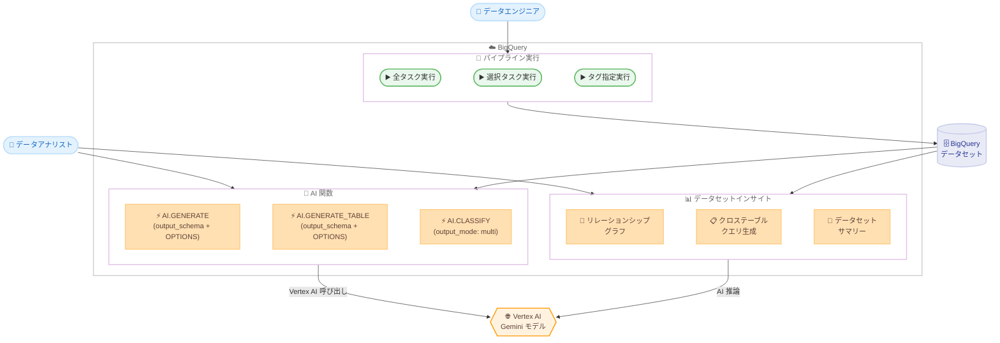

# BigQuery: AI 関数アップデートとデータセットインサイト

**リリース日**: 2026-02-12 (パイプライン実行は 2026-02-11)
**サービス**: BigQuery
**機能**: AI 関数 (AI.GENERATE / AI.GENERATE_TABLE / AI.CLASSIFY) およびデータセットインサイト、パイプライン実行
**ステータス**: GA (AI.GENERATE / AI.GENERATE_TABLE フィールド説明、パイプライン実行) / Preview (データセットインサイト、AI.CLASSIFY マルチカテゴリ)

[このアップデートのインフォグラフィックを見る](infographic/20260212-bigquery-ai-functions-dataset-insights.html)

## 概要

2026 年 2 月 11 日から 12 日にかけて、BigQuery に 4 つの機能アップデートがリリースされました。AI 関数の強化として、AI.GENERATE および AI.GENERATE_TABLE 関数のカスタム出力スキーマにフィールド説明を追加できるようになり (GA)、AI.CLASSIFY 関数がマルチカテゴリ分類に対応しました (Preview)。また、データセット全体のテーブル間リレーションシップを可視化するデータセットインサイト機能が Preview として追加されました。

これらのアップデートにより、BigQuery の生成 AI 機能がより実用的かつ柔軟になりました。特に AI.GENERATE の出力スキーマにフィールド説明を付与できるようになったことで、構造化データ抽出の精度が向上し、エンタープライズレベルのデータ分析ワークフローに直接組み込みやすくなっています。加えて、パイプライン実行方法の GA 化により、データエンジニアリングの運用効率が大幅に改善されます。

**アップデート前の課題**

今回のアップデート以前に存在していた課題は以下の通りです。

- AI.GENERATE / AI.GENERATE_TABLE の output_schema でフィールド名とデータ型のみ指定可能で、各フィールドの意味や期待する形式をモデルに伝える手段がなかった
- AI.CLASSIFY 関数では入力を 1 つのカテゴリにしか分類できず、複数のカテゴリに該当するデータ (例: テクノロジーとビジネスの両方に関連するニュース記事) を適切に処理できなかった
- 大規模データセット内のテーブル間のリレーションシップを理解するには、手動でスキーマを調査し、JOIN パスを特定する必要があった
- パイプラインの実行は全タスク一括実行のみで、特定のタスクやタグによる選択的実行ができなかった

**アップデート後の改善**

今回のアップデートにより以下が可能になりました。

- output_schema の各フィールドに OPTIONS(description = '...') で説明を付与でき、モデルがフィールドの意味を正確に理解して構造化データを生成できるようになった (GA)
- AI.CLASSIFY 関数に output_mode => 'multi' パラメータを指定することで、1 つの入力を複数のカテゴリに分類できるようになった (Preview)
- データセットインサイト機能により、Gemini がテーブル間のリレーションシップを自動推論し、関係グラフの可視化とクロステーブルクエリの生成を行えるようになった (Preview)
- パイプラインで「全タスク実行」「選択タスク実行」「タグ指定実行」の 3 つの実行方法が GA として利用可能になった

## アーキテクチャ図



この図は、今回アップデートされた BigQuery の 3 つの機能領域 (AI 関数、データセットインサイト、パイプライン実行) とそれらの関係を示しています。AI 関数とデータセットインサイトは Vertex AI の Gemini モデルを利用し、パイプラインはデータセットに対するタスク実行を制御します。

## サービスアップデートの詳細

### 主要機能

1. **AI.GENERATE / AI.GENERATE_TABLE: カスタム出力スキーマのフィールド説明 (GA)**
   - output_schema パラメータの各フィールドに OPTIONS(description = '...') 句を追加可能
   - フィールドの意味や期待する値の形式をモデルに明示的に伝えることで、構造化データ抽出の精度が向上
   - STRUCT 型のサブフィールドにも OPTIONS 句を指定可能
   - サポートされるデータ型: STRING、INT64、FLOAT64、BOOL、ARRAY、STRUCT

2. **AI.CLASSIFY: マルチカテゴリ分類 (Preview)**
   - 新しい output_mode パラメータを追加
   - output_mode => 'multi' を指定すると、1 つの入力を 0 個以上のカテゴリに分類
   - 戻り値の型が STRING から ARRAY&lt;STRING&gt; に変更
   - テキストデータおよび ObjectRefRuntime (画像など) の両方に対応
   - Gemini モデルが利用可能なすべてのリージョンと US / EU マルチリージョンで利用可能

3. **データセットインサイト (Preview)**
   - BigQuery Studio の Explorer ペインからデータセットを選択し、Insights タブで生成
   - Gemini がテーブル間のリレーションシップを 3 つの方法で検出: スキーマ定義 (PK/FK)、使用パターン (クエリログ)、LLM 推論
   - リレーションシップグラフで上位 10 個の接続テーブルをノードとして可視化
   - リレーションシップテーブルでソーステーブル、カラム、接続先を一覧表示
   - Gemini が自然言語の質問と対応する SQL クエリを自動生成
   - データセットの説明を自動生成し、メタデータとして保存可能
   - JSON 形式でリレーションシップをエクスポート可能

4. **パイプライン実行方法の拡張 (GA)**
   - 全タスク実行: パイプライン内のすべてのタスクを一括実行
   - 選択タスク実行: 特定のタスクを選択して実行 (依存関係や依存先の自動実行オプション付き)
   - タグ指定実行: タグで絞り込んだタスクを実行 (依存関係や依存先の自動実行オプション付き)
   - Google アカウントのユーザー認証情報またはサービスアカウントで認証可能
   - インタラクティブジョブ (高優先度) またはバッチジョブとして実行可能

## 技術仕様

### AI.GENERATE output_schema の OPTIONS 構文

output_schema でのフィールド説明の指定方法は以下の通りです。

| 項目 | 詳細 |
|------|------|
| 構文 | `OPTIONS(description = '説明文')` |
| 適用対象 | 各フィールドおよび STRUCT サブフィールド |
| サポートデータ型 | STRING、INT64、FLOAT64、BOOL、ARRAY、STRUCT |
| デフォルトエンドポイント | gemini-2.5-flash |
| 認証方式 | Cloud リソース接続またはエンドユーザー認証情報 |

### AI.CLASSIFY output_mode パラメータ

AI.CLASSIFY のマルチカテゴリ分類に関する仕様は以下の通りです。

| 項目 | 詳細 |
|------|------|
| パラメータ名 | output_mode |
| 値: single | 1 つのカテゴリに分類 (デフォルト) |
| 値: multi | 0 個以上のカテゴリに分類 |
| single の戻り値型 | STRING (従来と同じ) |
| multi の戻り値型 | ARRAY&lt;STRING&gt; |
| カテゴリ指定 | ARRAY&lt;STRING&gt; または ARRAY&lt;STRUCT&lt;STRING, STRING&gt;&gt; (説明付き) |

### データセットインサイトのリレーションシップ検出方法

データセットインサイトで検出されるリレーションシップの種類は以下の通りです。

| 検出方法 | 説明 |
|---------|------|
| Schema-defined | テーブルスキーマの主キー・外部キー制約から導出 |
| Usage based | クエリログから頻出する JOIN パターンを抽出 |
| LLM inferred | Gemini がテーブル名・カラム名・説明から推論 |

### AI.GENERATE の output_schema 使用例

```sql
-- フィールド説明付きの構造化データ抽出
SELECT
  complaint_id,
  AI.GENERATE(
    CONCAT('Analyze the following complaint: ', consumer_complaint_narrative),
    output_schema => """
    grievance_subject ARRAY<STRING>
      OPTIONS(description = 'a list of grievance subjects'),
    complaint_type STRING
      OPTIONS(description = 'classify the complaint type as
        Billing Dispute, Service Issue, or Reporting Error')
    """
  ).* EXCEPT (full_response, status)
FROM
  `bigquery-public-data.cfpb_complaints.complaint_database`
WHERE
  consumer_complaint_narrative IS NOT NULL
  AND LENGTH(consumer_complaint_narrative) > 100
LIMIT 3;
```

### AI.CLASSIFY のマルチカテゴリ分類使用例

```sql
-- 複数カテゴリへの分類
SELECT
  title,
  body,
  AI.CLASSIFY(
    body,
    categories => ['tech', 'sport', 'business',
                    'politics', 'entertainment', 'other'],
    output_mode => 'multi'
  ) AS categories
FROM `bigquery-public-data.bbc_news.fulltext`
LIMIT 100;
```

### STRUCT サブフィールドへの OPTIONS 指定例

```sql
-- STRUCT のサブフィールドにも説明を追加可能
SELECT
  AI.GENERATE(
    input,
    output_schema => '''
    location STRUCT<
      city STRING,
      state STRING OPTIONS(description = 'The 2-letter abbreviation of the state name')
    >
    '''
  ) AS info
FROM mydataset.mytable;
```

## 設定方法

### 前提条件

1. BigQuery と Vertex AI が有効化された Google Cloud プロジェクト
2. Vertex AI User ロール (roles/vertexai.user) がユーザーアカウントに付与されていること
3. AI 関数の使用には Cloud リソース接続の作成またはエンドユーザー認証情報の設定が必要

### 手順

#### ステップ 1: AI 関数の output_schema でフィールド説明を使用

```sql
-- output_schema に OPTIONS(description) を追加して精度向上
SELECT
  AI.GENERATE(
    'Extract person information from: John is a 30-year old engineer',
    output_schema => '''
    name STRING OPTIONS(description = 'Full name of the person'),
    age INT64 OPTIONS(description = 'Age in years'),
    occupation STRING OPTIONS(description = 'Job title or profession')
    '''
  ) AS extracted_info;
```

フィールド説明を追加することで、モデルが各フィールドに期待される値の形式や意味を理解し、より正確な構造化データを生成します。

#### ステップ 2: データセットインサイトの生成

```
1. Google Cloud コンソールで BigQuery Studio を開く
2. Explorer ペインでプロジェクトとデータセットを選択
3. Insights タブをクリック
4. Generate をクリック
5. マルチリージョンの場合はリージョンを選択
```

インサイトの生成には数分かかります。Dataplex Universal Catalog のデータプロファイリング結果がある場合、インサイトの品質が向上します。

#### ステップ 3: パイプラインのタグ指定実行

```
1. Google Cloud コンソールで BigQuery ページを開く
2. Explorer ペインでプロジェクト > Pipelines > 対象パイプラインを選択
3. Run > Run by tag をクリック
4. 実行するタグを選択
5. 認証方式を選択 (ユーザー認証情報またはサービスアカウント)
6. 必要に応じて Include dependencies / Include dependents を設定
7. Run をクリック
```

タグ指定実行により、大規模パイプラインの一部のみを効率的にテスト・実行できます。

## メリット

### ビジネス面

- **データ探索の効率化**: データセットインサイトにより、複雑なデータセットの構造理解にかかる時間を大幅に短縮でき、新しいデータソースのオンボーディングが加速する
- **分析精度の向上**: AI.GENERATE のフィールド説明により、非構造化データからの情報抽出精度が向上し、ビジネスインテリジェンスの品質が改善される
- **運用コストの削減**: パイプラインの選択的実行により、不要なタスクの実行を避け、コンピュートリソースの無駄を削減できる

### 技術面

- **構造化データ抽出の精度向上**: output_schema の OPTIONS(description) によりモデルへの指示が明確になり、特に曖昧なフィールド名 (例: state が「状態」か「州」か) の解釈が改善される
- **柔軟な分類処理**: AI.CLASSIFY の multi モードにより、従来は複数回のクエリ実行やカスタムプロンプトが必要だったマルチラベル分類がワンステップで実現可能
- **自動リレーションシップ検出**: スキーマ定義、クエリログ、AI 推論の 3 つの方法でリレーションシップを検出するため、ドキュメントが不十分なデータセットでも構造理解が可能
- **パイプラインのデバッグ効率化**: タスクやタグ単位での選択的実行により、障害発生時の原因特定とリカバリが迅速化

## デメリット・制約事項

### 制限事項

- データセットインサイトは Preview ステータスであり、Pre-GA Offerings Terms が適用される。本番ワークロードでの利用には注意が必要
- AI.CLASSIFY のマルチカテゴリ分類も Preview ステータスであり、サポートが限定される可能性がある
- AI 関数は Vertex AI への呼び出しを伴うため、実行ごとに Vertex AI の料金が発生する
- データセットインサイトのリレーションシップグラフは上位 10 個の最も接続されたテーブルのみ表示
- パイプラインは Google Cloud コンソールでのみ利用可能であり、API やコマンドラインからの操作はできない

### 考慮すべき点

- AI.GENERATE / AI.GENERATE_TABLE でフィールド説明を追加しても、モデルの出力が 100% 正確になるわけではない。出力の検証は引き続き必要
- データセットインサイトの LLM 推論によるリレーションシップは、テーブル名やカラム名が適切に命名されているほど精度が向上する
- Gemini 2.5 モデルを使用する場合、思考プロセス (thinking) にも課金される。thinking_budget パラメータでコスト制御が可能
- パイプライン実行のスケジュール設定時、前回の実行が完了する前に次のスケジュール実行が開始される場合、次の実行はスキップされエラーとなる

## ユースケース

### ユースケース 1: カスタマーサポートチケットの構造化分析

**シナリオ**: 大量のカスタマーサポートチケットのテキストから、問題のカテゴリ、重要度、関連製品を構造化データとして自動抽出したい。

**実装例**:

```sql
SELECT
  ticket_id,
  AI.GENERATE(
    CONCAT('Analyze this support ticket: ', ticket_text),
    output_schema => """
    issue_categories ARRAY<STRING>
      OPTIONS(description = 'List of issue categories such as
        billing, technical, account, shipping'),
    severity STRING
      OPTIONS(description = 'Issue severity: critical, high,
        medium, or low'),
    affected_product STRING
      OPTIONS(description = 'The specific product name
        mentioned in the ticket')
    """
  ).* EXCEPT (full_response, status)
FROM support_tickets
WHERE created_date >= '2026-02-01';
```

**効果**: フィールド説明により、severity フィールドが指定された 4 段階で統一的に出力され、後続の集計処理やダッシュボードとの連携が容易になる。

### ユースケース 2: マルチラベルコンテンツ分類パイプライン

**シナリオ**: ニュース記事やブログ投稿を複数のカテゴリに分類し、カテゴリ別のトレンド分析を行いたい。

**実装例**:

```sql
SELECT
  article_id,
  title,
  AI.CLASSIFY(
    body,
    categories => [
      ('technology', 'Articles about software, hardware, or IT'),
      ('business', 'Articles about finance, markets, or corporate news'),
      ('science', 'Articles about research or scientific discoveries'),
      ('policy', 'Articles about regulations or government policy')
    ],
    output_mode => 'multi'
  ) AS categories
FROM news_articles
WHERE publish_date >= '2026-02-01';
```

**効果**: 1 つの記事が「テクノロジー」と「ビジネス」の両方に分類されるようになり、カテゴリ横断的な分析が可能になる。

### ユースケース 3: 新規データセットのオンボーディング

**シナリオ**: 外部データソースから取り込んだ大規模データセットのテーブル構造とリレーションシップを迅速に理解し、分析に着手したい。

**効果**: データセットインサイトを使用することで、手動でのスキーマ調査やドキュメント参照なしに、テーブル間のリレーションシップを視覚的に把握でき、Gemini が生成するクロステーブルクエリを起点に分析を開始できる。

## 料金

AI 関数は Vertex AI への呼び出しを伴うため、BigQuery ML の料金に加えて Vertex AI の料金が発生します。データセットインサイトの料金は Gemini in BigQuery の料金体系に従います。

詳細な料金情報は以下のページを参照してください。

- [BigQuery の料金](https://cloud.google.com/bigquery/pricing)
- [Vertex AI の料金](https://cloud.google.com/vertex-ai/generative-ai/pricing)
- [Gemini in BigQuery の料金概要](https://cloud.google.com/gemini/pricing#gemini-in-bigquery-pricing)

## 利用可能リージョン

AI.GENERATE および AI.CLASSIFY は、Gemini モデルをサポートするすべてのリージョンと US / EU マルチリージョンで利用可能です。パイプラインはリージョン設定時に選択したリージョンで実行されます。詳細は [BigQuery Studio のロケーション](https://cloud.google.com/bigquery/docs/locations#bqstudio-loc) を参照してください。

## 関連サービス・機能

- **Vertex AI**: AI 関数のバックエンドとして Gemini モデルを提供。AI.GENERATE のデフォルトエンドポイントは gemini-2.5-flash
- **Dataplex Universal Catalog**: データセットインサイトで生成されたテーブル・カラム説明をカタログに公開可能。データプロファイリング結果がインサイトの品質を向上
- **Dataform**: BigQuery パイプラインの基盤技術。パイプラインのスケジューリングと実行管理を提供
- **BigQuery ML**: AI 関数は BigQuery ML の一部として提供され、SQL から直接 AI モデルを呼び出し可能
- **Cloud Storage**: パイプラインにノートブックが含まれる場合、出力の保存先として使用

## 参考リンク

- [インフォグラフィック](infographic/20260212-bigquery-ai-functions-dataset-insights.html)
- [公式リリースノート](https://cloud.google.com/release-notes#February_12_2026)
- [BigQuery リリースノート](https://docs.cloud.google.com/bigquery/docs/release-notes)
- [AI.GENERATE 関数ドキュメント](https://docs.cloud.google.com/bigquery/docs/reference/standard-sql/bigqueryml-syntax-ai-generate)
- [AI.GENERATE_TABLE 関数ドキュメント](https://docs.cloud.google.com/bigquery/docs/reference/standard-sql/bigqueryml-syntax-generate-table)
- [AI.CLASSIFY 関数ドキュメント](https://docs.cloud.google.com/bigquery/docs/reference/standard-sql/bigqueryml-syntax-ai-classify)
- [データセットインサイトの生成](https://docs.cloud.google.com/bigquery/docs/generate-dataset-insights)
- [データインサイト概要](https://docs.cloud.google.com/bigquery/docs/data-insights)
- [パイプラインの実行](https://docs.cloud.google.com/bigquery/docs/create-pipelines#run-pipeline)
- [パイプライン概要](https://docs.cloud.google.com/bigquery/docs/pipelines-introduction)
- [生成 AI 概要](https://docs.cloud.google.com/bigquery/docs/generative-ai-overview)
- [BigQuery の料金](https://cloud.google.com/bigquery/pricing)
- [Vertex AI の料金](https://cloud.google.com/vertex-ai/generative-ai/pricing)
- [Gemini in BigQuery の料金概要](https://cloud.google.com/gemini/pricing#gemini-in-bigquery-pricing)

## まとめ

今回の BigQuery アップデートは、AI 関数の実用性向上 (フィールド説明 GA、マルチカテゴリ分類 Preview)、データ探索の効率化 (データセットインサイト Preview)、パイプライン運用の柔軟性向上 (選択的実行 GA) という 3 つの軸で、データ分析ワークフロー全体を強化するものです。特に AI.GENERATE の output_schema にフィールド説明を追加できるようになった点は、非構造化データからの構造化データ抽出の精度を直接的に改善するため、すでに AI 関数を使用しているユーザーは早期の導入を推奨します。

---

**タグ**: #BigQuery #AI-Functions #AI-GENERATE #AI-CLASSIFY #Dataset-Insights #Pipelines #Gemini #Vertex-AI #Data-Analytics #GA #Preview
