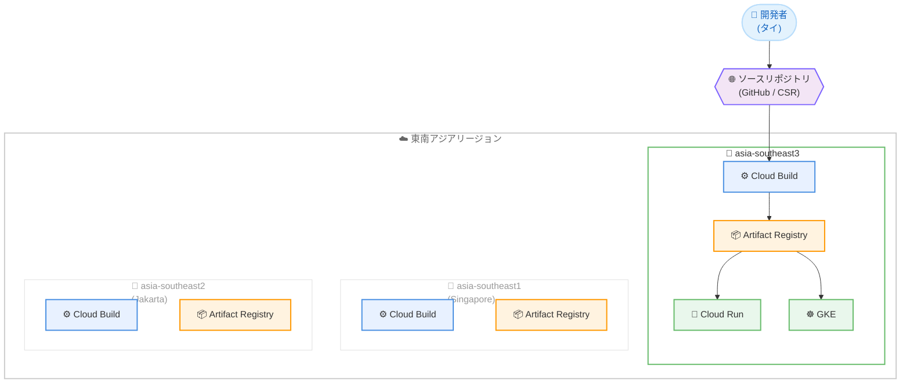

# Cloud Build: asia-southeast3 (Bangkok) リージョン追加

**リリース日**: 2026-02-12
**サービス**: Cloud Build
**機能**: asia-southeast3 リージョンサポート
**ステータス**: GA (一般提供)

## 概要

Cloud Build が新たに asia-southeast3 (バンコク、タイ) リージョンで利用可能になった。これにより、Cloud Build が利用可能なリージョンは合計 43 リージョンに拡大し、東南アジアでは asia-southeast1 (シンガポール)、asia-southeast2 (ジャカルタ) に続く 3 番目のリージョンとなる。

Cloud Build は Google Cloud 上でビルドを実行するサービスであり、ソースコードのインポートから Docker コンテナや Java アーカイブなどのアーティファクトの生成まで、CI/CD パイプラインの中核を担う。今回のリージョン追加により、タイおよびインドシナ半島周辺のユーザーは、より低レイテンシでビルドを実行できるようになる。

asia-southeast3 リージョンは Google Cloud のバンコクリージョンとして急速にサービス拡充が進んでおり、Cloud Run、GKE、Cloud Storage、Pub/Sub、Spanner など多数のサービスが同時期に対応を開始している。Cloud Build の追加により、バンコクリージョン内で完結する CI/CD パイプラインの構築が可能になった。

**アップデート前の課題**

今回のアップデート以前、東南アジアのタイ周辺で Cloud Build を利用する場合には以下の課題があった。

- タイのユーザーはシンガポール (asia-southeast1) またはジャカルタ (asia-southeast2) リージョンを使用する必要があり、地理的な距離によるレイテンシが発生していた
- タイ国内のデータレジデンシー要件がある場合、Cloud Build のビルドデータを国内に保持することが困難だった
- バンコクリージョンで稼働する他の Google Cloud サービス (Cloud Run、GKE など) と Cloud Build を同一リージョンで連携させることができなかった

**アップデート後の改善**

今回のアップデートにより以下が可能になった。

- asia-southeast3 リージョンでのビルド実行により、タイおよび周辺地域からのレイテンシが大幅に改善された
- リージョナルエンドポイントを使用することで、ビルドデータのデータレジデンシーが保証される
- バンコクリージョン内のサービス (Cloud Run、GKE、Artifact Registry など) と同一リージョンで連携する CI/CD パイプラインを構築できるようになった

## アーキテクチャ図



asia-southeast3 リージョンの追加により、タイの開発者はバンコクリージョン内で Cloud Build によるビルド、Artifact Registry へのアーティファクト保存、Cloud Run / GKE へのデプロイまでを完結できるようになった。

## サービスアップデートの詳細

### 主要機能

1. **デフォルトプールでのリージョナルビルド**
   - asia-southeast3 リージョンでデフォルトプールを使用したビルドが可能
   - `gcloud builds submit` コマンドまたは Google Cloud コンソールからリージョンを指定して実行
   - デフォルトプールは事前にウォームアップされたインスタンスで高速に起動

2. **プライベートプールのサポート**
   - asia-southeast3 リージョンでプライベートプールを作成し、VPC ネットワーク内のリソースにアクセス可能
   - プライベートプールはリージョン内の全ゾーンで冗長化されて管理される
   - VPC Service Controls との連携により、セキュリティ境界内でのビルドが可能

3. **リージョナルエンドポイント**
   - `https://cloudbuild.asia-southeast3.rep.googleapis.com` でリージョナルエンドポイントにアクセス可能
   - データレジデンシーとデータ主権の要件に準拠したビルド実行が可能
   - リクエストトラフィックが指定リージョンに直接ルーティングされる

## 技術仕様

### リージョン情報

| 項目 | 詳細 |
|------|------|
| リージョン ID | `asia-southeast3` |
| ロケーション | バンコク、タイ |
| 利用可能ゾーン | asia-southeast3-a, asia-southeast3-b, asia-southeast3-c |
| デフォルトプール | 利用可能 |
| プライベートプール | 利用可能 (マシンタイプの可用性はリージョンにより異なる) |
| リージョナルエンドポイント | `https://cloudbuild.asia-southeast3.rep.googleapis.com` |

### デフォルトプールとプライベートプールの比較

公式ドキュメントに基づく主要な違いは以下の通りである。

| 機能 | デフォルトプール | プライベートプール |
|------|-----------------|-------------------|
| フルマネージド | 対応 | 対応 |
| ビルド分単位課金 | 対応 | 対応 |
| オートスケーリング (0 までスケールダウン) | 対応 | 対応 |
| パブリックインターネットアクセス | 対応 | 設定可能 |
| VPC ピアリング | 非対応 | 対応 |
| VPC Service Controls | 非対応 | 対応 |
| 静的内部 IP アドレス | 非対応 | 対応 |
| 最大同時ビルド数 | 30 | 100 以上 |
| マシンタイプ | 5 種類 | 64 種類 |

## 設定方法

### 前提条件

1. Cloud Build API が有効であること
2. Google Cloud プロジェクトにクラウド請求先アカウントが紐づけられていること
3. gcloud CLI がインストールされていること (バージョン 402.0.0 以上を推奨)

### 手順

#### ステップ 1: デフォルトプールでリージョナルビルドを実行

```bash
# asia-southeast3 リージョンでビルドを実行
gcloud builds submit --region=asia-southeast3 \
  --tag=asia-southeast3-docker.pkg.dev/PROJECT_ID/REPO_NAME/IMAGE_NAME
```

ソースコードの場所から asia-southeast3 リージョンの Cloud Build にビルドジョブが送信される。

#### ステップ 2: ビルドトリガーの作成 (asia-southeast3 リージョン)

```bash
# asia-southeast3 リージョンにビルドトリガーを作成
gcloud builds triggers create cloud-source-repositories \
  --region=asia-southeast3 \
  --name="my-trigger" \
  --repo="my-repo" \
  --branch-pattern="main" \
  --build-config="cloudbuild.yaml"
```

ビルドトリガーのリージョンを asia-southeast3 に指定することで、コード変更時にバンコクリージョンでビルドが自動実行される。

#### ステップ 3: プライベートプールの作成 (オプション)

```bash
# asia-southeast3 リージョンにプライベートプールを作成
gcloud builds worker-pools create my-private-pool \
  --region=asia-southeast3 \
  --worker-machine-type=e2-standard-4 \
  --worker-disk-size=200
```

プライベートプールは作成後にリージョンを変更できないため、事前にリージョンを確認した上で作成する必要がある。

#### ステップ 4: リージョナルエンドポイントの設定 (オプション)

```bash
# リージョナルエンドポイントを設定
gcloud config set api_endpoint_overrides/cloudbuild \
  https://cloudbuild.asia-southeast3.rep.googleapis.com/
```

リージョナルエンドポイントを使用すると、データレジデンシー要件に準拠した形でビルドを実行できる。

## メリット

### ビジネス面

- **データレジデンシー対応**: タイ国内のデータ主権要件を満たす CI/CD パイプラインを構築可能。リージョナルエンドポイントにより、ビルドデータが asia-southeast3 リージョン外に移動しないことが保証される
- **タイ市場への展開加速**: バンコクリージョンで CI/CD からデプロイまで完結できるため、タイ市場向けアプリケーションの開発・運用体制を現地に最適化できる

### 技術面

- **レイテンシ改善**: タイおよびインドシナ半島のユーザーがシンガポールやジャカルタを経由せずにビルドを実行でき、ネットワークレイテンシが低減される
- **同一リージョン連携**: Cloud Run、GKE、Artifact Registry など、バンコクリージョンで利用可能な他のサービスと同一リージョンで連携でき、クロスリージョン通信によるコストとレイテンシを回避できる
- **冗長性**: プライベートプールはリージョン内の全ゾーンで冗長化されて管理され、高い可用性が確保される

## デメリット・制約事項

### 制限事項

- プライベートプールで利用可能なマシンタイプはリージョンによって異なる。asia-southeast3 で利用可能なマシンタイプは、[マシンタイプのリージョン別可用性](https://cloud.google.com/build/docs/private-pools/private-pool-config-file-schema#machinetype) を参照
- プライベートプールは作成後にリージョンを変更できない
- ビルドトリガーでプライベートプールを指定する場合、トリガーのリージョンとプライベートプールのリージョンを一致させる必要がある

### 考慮すべき点

- 複数リージョンにまたがるサービスとの連携では、クロスリージョン通信の料金とレイテンシが発生する可能性がある
- リージョナルエンドポイントは HTTPS のみサポートしており、HTTP は非対応である
- 既存のビルドを他のリージョンから asia-southeast3 に移行する場合、ビルドトリガーやプライベートプールの再作成が必要になる

## ユースケース

### ユースケース 1: タイ国内向けアプリケーションの CI/CD パイプライン

**シナリオ**: タイの金融機関が、データレジデンシー要件に準拠した形で Web アプリケーションを開発・デプロイする。ソースコードのビルドからコンテナデプロイまで、すべてバンコクリージョン内で完結させる必要がある。

**実装例**:

```yaml
# cloudbuild.yaml
steps:
  - name: 'gcr.io/cloud-builders/docker'
    args: ['build', '-t', 'asia-southeast3-docker.pkg.dev/$PROJECT_ID/my-app/web:$SHORT_SHA', '.']
  - name: 'gcr.io/cloud-builders/docker'
    args: ['push', 'asia-southeast3-docker.pkg.dev/$PROJECT_ID/my-app/web:$SHORT_SHA']
  - name: 'gcr.io/cloud-builders/gcloud'
    args:
      - 'run'
      - 'deploy'
      - 'my-web-app'
      - '--image=asia-southeast3-docker.pkg.dev/$PROJECT_ID/my-app/web:$SHORT_SHA'
      - '--region=asia-southeast3'
options:
  logging: CLOUD_LOGGING_ONLY
```

**効果**: ビルド、アーティファクト保存、デプロイがすべて asia-southeast3 リージョン内で完結し、タイのデータレジデンシー要件を満たしつつ、低レイテンシな CI/CD パイプラインを実現する。

### ユースケース 2: マルチリージョン CI/CD 戦略

**シナリオ**: 東南アジアに展開するサービスにおいて、シンガポール、ジャカルタ、バンコクの 3 リージョンにそれぞれ Cloud Build を配置し、各リージョンのユーザーに最も近い場所でビルドとデプロイを実行する。

**効果**: 東南アジア全体で低レイテンシかつ高可用性な CI/CD 環境を構築でき、いずれかのリージョンで障害が発生した場合も他のリージョンで継続運用が可能となる。

## 料金

Cloud Build の料金体系は全リージョン共通であり、ビルド分単位の課金となる。公式の料金詳細は [Cloud Build pricing](https://cloud.google.com/build/pricing) を参照。

### 料金の概要

Cloud Build の無料枠と課金の概要は以下の通りである。

| 項目 | 詳細 |
|------|------|
| 無料枠 | 2,500 ビルド分/月 (e2-standard-2 マシンタイプ) |
| デフォルトマシンタイプ | e2-standard-2 |
| 課金単位 | ビルド分 |

料金の詳細およびプライベートプールのマシンタイプ別料金については、[Cloud Build 料金ページ](https://cloud.google.com/build/pricing) を確認すること。

## 利用可能リージョン

Cloud Build は asia-southeast3 の追加により、以下の 43 リージョンで利用可能である (2026 年 2 月 12 日時点)。

東南アジアリージョンの一覧は以下の通りである。

| リージョン | ロケーション |
|-----------|-------------|
| asia-southeast1 | シンガポール |
| asia-southeast2 | ジャカルタ、インドネシア |
| **asia-southeast3** | **バンコク、タイ (今回追加)** |

その他のアジア太平洋リージョンは以下の通りである。

| リージョン | ロケーション |
|-----------|-------------|
| asia-east1 | 台湾 |
| asia-east2 | 香港 |
| asia-northeast1 | 東京、日本 |
| asia-northeast2 | 大阪、日本 |
| asia-northeast3 | ソウル、韓国 |
| asia-south1 | ムンバイ、インド |
| asia-south2 | デリー、インド |
| australia-southeast1 | シドニー、オーストラリア |
| australia-southeast2 | メルボルン、オーストラリア |

全リージョンの一覧は [Cloud Build locations](https://cloud.google.com/build/docs/locations) を参照。

## 関連サービス・機能

- **Artifact Registry**: ビルドアーティファクト (Docker イメージ、Maven パッケージなど) を保存するリポジトリサービス。Cloud Build と連携してバンコクリージョン内でアーティファクト管理が可能
- **Cloud Run**: コンテナ化されたアプリケーションをサーバーレスで実行するサービス。asia-southeast3 で利用可能であり、Cloud Build でビルドしたイメージを直接デプロイ可能
- **Google Kubernetes Engine (GKE)**: asia-southeast3 で利用可能な Kubernetes マネージドサービス。Cloud Build からの継続的デプロイ先として連携可能
- **Cloud Deploy**: Cloud Build と統合された CD サービス。ビルドされたアーティファクトのステージング環境・本番環境へのデプロイを管理
- **Cloud Storage**: ビルドログやソースコードの保存に使用。asia-southeast3 で利用可能
- **Cloud Logging**: ビルドログの確認に使用。asia-southeast3 リージョンをサポート

## 参考リンク

- [公式リリースノート](https://cloud.google.com/release-notes#February_12_2026)
- [Cloud Build locations ドキュメント](https://cloud.google.com/build/docs/locations)
- [Cloud Build 概要](https://cloud.google.com/build/docs/overview)
- [Cloud Build 料金ページ](https://cloud.google.com/build/pricing)
- [プライベートプール概要](https://cloud.google.com/build/docs/private-pools/private-pools-overview)
- [リージョナルエンドポイントの設定](https://cloud.google.com/build/docs/locations#access_cloud_build_resources_using_regional_endpoints)
- [Cloud Build リリースノート](https://cloud.google.com/build/docs/release-notes)

## まとめ

Cloud Build の asia-southeast3 (バンコク) リージョン追加は、タイおよびインドシナ半島周辺で Google Cloud を利用するユーザーにとって重要なアップデートである。特にデータレジデンシー要件がある組織や、バンコクリージョンで Cloud Run / GKE を運用している組織にとっては、同一リージョン内で CI/CD パイプラインを完結できるようになった点が大きなメリットとなる。タイ市場向けのアプリケーション開発を行っている場合は、既存のビルドトリガーやパイプラインの asia-southeast3 リージョンへの移行を検討することを推奨する。

---

**タグ**: Cloud Build, asia-southeast3, Bangkok, Thailand, リージョン追加, CI/CD, デフォルトプール, プライベートプール, リージョナルエンドポイント, データレジデンシー
