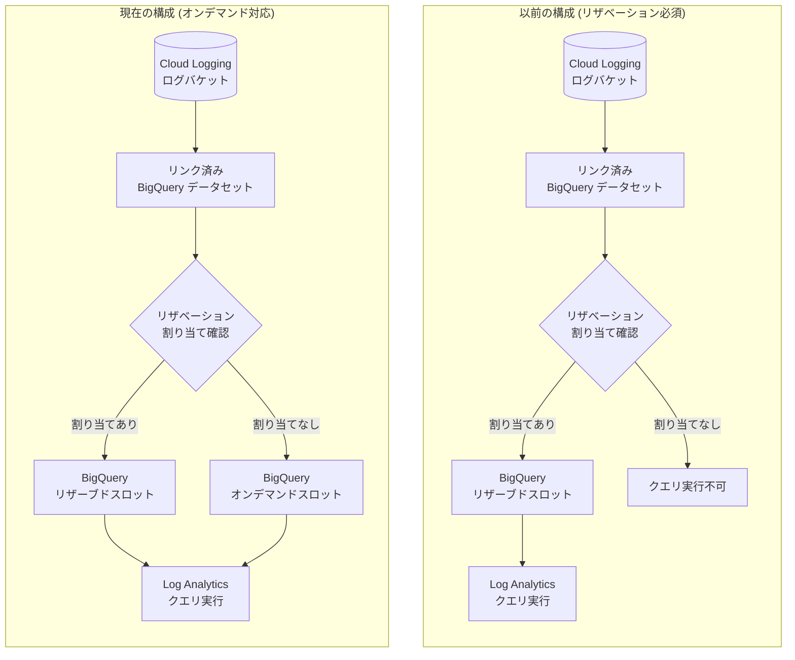

# Cloud Logging: Log Analytics のオンデマンドスロット対応

**リリース日**: 2026-02-12
**サービス**: Cloud Logging
**機能**: Log Analytics のオンデマンドスロット対応
**ステータス**: GA (Generally Available)

[このアップデートのインフォグラフィックを見る](https://takech9203.github.io/google-cloud-news-summary/20260212-cloud-logging-on-demand-slots.html)

## 概要

Cloud Logging の Log Analytics および SQL ベースのアラートポリシーにおいて、BigQuery のオンデマンドスロットがデフォルトで使用されるようになった。これにより、BigQuery のリザベーション割り当て (reservation assignment) を事前に構成しなくても、Log Analytics クエリや SQL ベースのアラートポリシーを BigQuery スロット上で実行できるようになる。

このアップデートの主な価値は、Log Analytics と SQL ベースアラートの利用開始に必要な初期設定の大幅な簡素化にある。従来は BigQuery のリザベーション作成とプロジェクトへの割り当てという追加ステップが必須であったが、今回のアップデートによりこれらが不要となり、ユーザーはリンク済み BigQuery データセットさえあれば即座にクエリやアラートの実行が可能になる。対象ユーザーは、Cloud Logging を使用しているすべての Google Cloud ユーザーであり、特にログデータの SQL 分析やアラート機能をこれから導入するチームにとって大きなメリットがある。

**アップデート前の課題**

従来、Log Analytics クエリを BigQuery エンジンで実行したり、SQL ベースのアラートポリシーを作成するには、以下の事前設定が必要であった。

- BigQuery リザベーションの作成 (専用スロットの購入) が必須であった
- 作成したリザベーションを Google Cloud プロジェクトに割り当てる (reservation assignment) 必要があった
- リザベーションの容量計画 (ベースラインスロット数やオートスケーリングの設定) を事前に行う必要があった

**アップデート後の改善**

今回のアップデートにより、BigQuery リザベーションの構成なしで Log Analytics の主要機能が利用可能になった。

- BigQuery リザベーション割り当てが存在しない場合、クエリは自動的にオンデマンドスロットを使用する
- SQL ベースのアラートポリシーの作成時にリザベーション構成ステップが不要になった
- Log Analytics の利用開始に必要なステップがリンク済み BigQuery データセットの作成のみになった

## アーキテクチャ図



従来はリザベーション割り当てがない場合にクエリが実行できなかったが、アップデート後はオンデマンドスロットにフォールバックすることで、リザベーションの有無にかかわらずクエリが実行可能になった。

## サービスアップデートの詳細

### 主要機能

1. **オンデマンドスロットのデフォルト使用**
   - BigQuery リザベーション割り当てが存在しない場合、Log Analytics クエリは自動的にオンデマンドスロットで実行される
   - 既存のリザベーション割り当てがある場合は、従来通りリザーブドスロットが使用される

2. **SQL ベースアラートポリシーの簡素化**
   - SQL ベースのアラートポリシーの作成にリザベーション構成が不要になった
   - アラートポリシーが実行する SQL クエリもオンデマンドスロットで処理可能
   - 条件タイプ (Row count threshold、Boolean) はそのまま利用可能

3. **リンク済み BigQuery データセットとの連携**
   - オンデマンドスロット利用時もリンク済み BigQuery データセットは引き続き必要
   - ログバケットとの連携構造に変更はなく、データセットの作成・管理方法も従来と同様

## 技術仕様

### BigQuery スロットモデルの比較

| 項目 | オンデマンド | リザベーション (容量ベース) |
|------|-------------|---------------------------|
| 課金方式 | 処理データ量 (TiB) 単位 | スロット時間単位 |
| 参考価格 | $6.25/TiB (US マルチリージョン) | エディションにより異なる |
| スロット上限 | プロジェクトあたり最大 2,000 スロット (ソフトキャップ) | 予約量に依存 |
| 事前設定 | 不要 | リザベーション作成 + 割り当て必要 |
| コスト予測性 | クエリ量に依存 (変動) | 固定コスト (予測可能) |
| ワークロード分離 | なし | リザベーション単位で分離可能 |

### 必要な IAM ロール

SQL ベースのアラートポリシーとオンデマンドスロットを使用するために必要な主要ロールは以下の通り。

| ロール | 用途 |
|--------|------|
| `roles/logging.viewer` | _Required / _Default ログバケットのクエリ |
| `roles/logging.viewAccessor` | プロジェクト内の全ログビューへのクエリ |
| `roles/logging.configWriter` | リンク済みデータセットの作成・表示 |
| `roles/monitoring.editor` | SQL ベースアラートポリシーの作成・管理 |
| `roles/logging.sqlAlertWriter` | SQL ベースアラートポリシーの作成・管理 |
| `roles/bigquery.dataViewer` | リンク済みデータセットの閲覧 |

## 設定方法

### 前提条件

1. ログバケットが Log Analytics を使用するようにアップグレードされていること
2. ログバケットにリンク済み BigQuery データセットが作成されていること

### 手順

#### ステップ 1: ログバケットの Log Analytics アップグレード確認

```bash
# Google Cloud Console で Logs Storage ページに移動
# Log Analytics available 列が "Open" であることを確認
# "Upgrade" と表示されている場合はクリックしてアップグレード
```

Google Cloud Console の Logs Storage ページ (`https://console.cloud.google.com/logs/storage`) で、対象のログバケットの Log Analytics 列を確認する。

#### ステップ 2: リンク済み BigQuery データセットの作成

```bash
# gcloud CLI でリンク済みデータセットを作成
gcloud logging links create LINK_ID \
  --bucket=BUCKET_ID \
  --location=LOCATION
```

`LINK_ID` は BigQuery データセット名として使用される。プロジェクト内で一意である必要がある。コマンドの完了には数分かかる。

#### ステップ 3: Log Analytics でクエリを実行

```sql
-- Log Analytics ページでクエリを実行
-- リザベーション割り当てがなくても、オンデマンドスロットで自動的に実行される
SELECT
  severity,
  COUNT(*) as count
FROM
  `PROJECT_ID.DATASET_NAME._AllLogs`
WHERE
  timestamp > TIMESTAMP_SUB(CURRENT_TIMESTAMP(), INTERVAL 1 HOUR)
GROUP BY severity
ORDER BY count DESC
```

ツールバーの「Run on BigQuery」ボタンをクリックしてクエリを実行する。リザベーション割り当てがない場合でも、オンデマンドスロットが自動的に使用される。

## メリット

### ビジネス面

- **導入障壁の低減**: BigQuery リザベーションの事前購入が不要になり、Log Analytics の導入コストが実質ゼロになった。小規模チームや PoC フェーズでの利用が容易になる
- **迅速な価値実現**: 設定ステップの削減により、ログ分析の価値をより早く実現できる。リンク済みデータセットの作成だけで SQL ベースの高度なログ分析が開始可能
- **コスト最適化の選択肢**: 少量のクエリにはオンデマンド、大量の定常ワークロードにはリザベーションと、使用量に応じた最適なコストモデルを選択可能

### 技術面

- **設定の簡素化**: リザベーション作成 + プロジェクト割り当てという 2 段階の設定が不要になり、構成エラーのリスクが低減
- **フォールバック動作**: リザベーションが存在する場合はそれを使用し、存在しない場合はオンデマンドにフォールバックする自動判定により、環境に応じた柔軟な動作を実現
- **アラートポリシーの即時利用**: SQL ベースのアラートポリシーをリザベーション構成なしで即座にデプロイ可能

## デメリット・制約事項

### 制限事項

- オンデマンドスロットにはプロジェクトあたり最大 2,000 スロットのソフトキャップがある (バーストにより超過する場合があるが保証はない)
- オンデマンドモデルではクエリの処理データ量に応じた課金となるため、大量のクエリを実行する場合はリザベーションの方がコスト効率が良い可能性がある
- SQL ベースのアラートポリシーのクエリ実行時間は最大 5 分に制限されている

### 考慮すべき点

- オンデマンドスロットは共有リソースであるため、他のユーザーのワークロードとスロットを共有する。クエリ実行の遅延が発生する可能性がある
- リザベーションによるワークロード分離が不要かどうか、運用要件を踏まえて判断する必要がある
- 予測不能なクエリコストを避けるために、プロジェクトレベルまたはユーザーレベルの日次クォータの設定を検討すべき

## ユースケース

### ユースケース 1: セキュリティイベントの SQL ベースアラート

**シナリオ**: セキュリティチームが、ログデータに基づく高度なアラートポリシーを迅速に設定したい。従来は BigQuery リザベーションの準備に時間がかかっていた。

**実装例**:
```sql
-- 直近 1 時間のエラーログの急増を検出するアラートクエリ
SELECT
  resource.type,
  COUNT(*) as error_count,
  COUNT(*) > 100 as notify
FROM
  `PROJECT_ID.DATASET_NAME._AllLogs`
WHERE
  severity >= 'ERROR'
GROUP BY resource.type
```

**効果**: リザベーション構成なしで即座に SQL ベースのアラートポリシーを作成でき、セキュリティ監視の立ち上げ時間を大幅に短縮

### ユースケース 2: 小規模プロジェクトでの Log Analytics 導入

**シナリオ**: 開発チームが新規プロジェクトで Cloud Logging のログを SQL で分析したいが、リザベーションの購入コストが障壁になっていた。

**効果**: オンデマンドスロットにより、小規模な使用量であれば BigQuery リザベーションを購入せずにログ分析を開始でき、処理データ量に応じた従量課金でコストを最小限に抑えられる

## 料金

今回のアップデートにより、Log Analytics クエリの料金モデルに以下の 2 つの選択肢が生じる。

### 料金比較

| モデル | 課金方式 | 参考価格 | 適するケース |
|--------|----------|----------|-------------|
| オンデマンド | 処理データ量 (TiB) 単位 | $6.25/TiB (US マルチリージョン) | 不定期・少量のクエリ |
| 容量ベース (リザベーション) | スロット時間単位 | エディションにより異なる | 定常的な大量クエリ |

- Cloud Logging 自体のログ取り込み料金は今回のアップデートとは独立して発生する
- BigQuery のオンデマンド課金には、クエリあたり最小 10 MiB の課金が適用される
- 詳細は [BigQuery 料金ページ](https://cloud.google.com/bigquery/pricing) および [Cloud Logging 料金ページ](https://cloud.google.com/products/observability/pricing) を参照

## 関連サービス・機能

- **BigQuery**: Log Analytics のクエリエンジンとして使用される。スロットモデル (オンデマンド / リザベーション) がクエリの実行基盤
- **Cloud Monitoring**: SQL ベースのアラートポリシーのインシデント管理と通知チャネルを提供
- **BigQuery リザベーション**: 引き続きリザベーションを使用することで、専用スロットによるパフォーマンス保証とワークロード分離が可能
- **Looker Studio**: リンク済み BigQuery データセットを使用してログデータの可視化が可能

## 参考リンク

- [インフォグラフィック](https://takech9203.github.io/google-cloud-news-summary/20260212-cloud-logging-on-demand-slots.html)
- [公式リリースノート](https://cloud.google.com/release-notes#February_12_2026)
- [リンク済み BigQuery データセットのクエリ](https://cloud.google.com/logging/docs/analyze/query-linked-dataset)
- [SQL ベースのアラートポリシー](https://cloud.google.com/logging/docs/analyze/sql-in-alerting)
- [BigQuery スロットの概要](https://cloud.google.com/bigquery/docs/slots)
- [BigQuery 料金](https://cloud.google.com/bigquery/pricing)
- [Cloud Logging 料金](https://cloud.google.com/products/observability/pricing)

## まとめ

Cloud Logging の Log Analytics におけるオンデマンドスロット対応は、BigQuery リザベーションの事前構成という導入障壁を取り除き、すべてのユーザーが即座に SQL ベースのログ分析とアラート機能を活用できるようにする GA アップデートである。既に Log Analytics を利用しているユーザーにとっては変更不要であるが、これから導入を検討しているチームにとっては、リンク済み BigQuery データセットを作成するだけで SQL ベースの高度なログ分析を開始できるようになったため、導入の検討を推奨する。大量のクエリを定常的に実行する場合は、引き続き BigQuery リザベーションの利用がコスト面で有利である可能性があるため、ワークロードに応じた料金モデルの選択を推奨する。

---

**タグ**: Cloud Logging, Log Analytics, BigQuery, オンデマンドスロット, SQL アラート, GA
