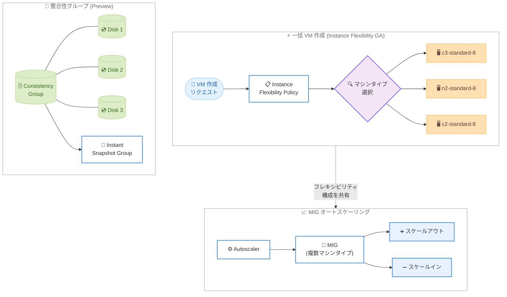

# Compute Engine: インスタンスフレキシビリティ GA およびインスタントスナップショット整合性グループ Preview

**リリース日**: 2026-02-09 / 2026-02-10 / 2026-02-12
**サービス**: Compute Engine
**機能**: インスタンスフレキシビリティ (GA)、インスタントスナップショット整合性グループ (Preview)、MIG オートスケーリング対応
**ステータス**: GA / Preview

## 概要

Compute Engine において、2026 年 2 月 9 日から 12 日にかけて 3 つの関連するアップデートが発表された。まず 2 月 12 日にインスタンスフレキシビリティが GA (一般提供) となり、リージョン内で VM を一括作成する際に複数のマシンタイプを指定してリソースの可用性を向上できるようになった。2 月 10 日にはインスタントスナップショットの整合性グループが Preview として公開され、複数ディスクを同一時点でバックアップできる機能が利用可能になった。さらに 2 月 9 日には、インスタンスフレキシビリティが構成されたマネージドインスタンスグループ (MIG) でオートスケーリングが可能になった。

これらのアップデートは、大規模な VM プロビジョニングを行うワークロードや、複数ディスクにまたがるデータの一貫性を確保する必要があるシステムにとって重要な改善となる。特にインスタンスフレキシビリティの GA は、特定のマシンタイプに依存せずに大量の VM を確実にプロビジョニングしたい Solutions Architect にとって、設計の選択肢を大きく広げるものである。

**アップデート前の課題**

以下は、今回のアップデート以前に存在していた課題である。

- 一括 VM 作成時に単一のマシンタイプしか指定できず、キャパシティ不足の場合にプロビジョニングが失敗する可能性があった
- 複数のディスクを持つワークロードでは、各ディスクを個別にインスタントスナップショットで取得する必要があり、ディスク間のデータ整合性を保証できなかった
- インスタンスフレキシビリティを構成した MIG ではオートスケーリングを利用できなかった

**アップデート後の改善**

今回のアップデートにより、以下の改善が実現した。

- 一括 VM 作成時に複数のマシンタイプを指定でき、キャパシティとクォータの可用性に基づいて Compute Engine が自動的にマシンタイプを選択する (GA)
- 整合性グループを使用して複数ディスクを同一時点で一括バックアップし、一括リストアも可能になった (Preview)
- インスタンスフレキシビリティを構成した MIG でオートスケーリングが有効になり、負荷に応じた自動スケーリングと柔軟なマシンタイプ選択を組み合わせて利用可能になった

## アーキテクチャ図



上の図は、今回のアップデートに含まれる 3 つの機能の関係を示している。インスタンスフレキシビリティは一括 VM 作成と MIG オートスケーリングの両方で利用可能であり、整合性グループは複数ディスクの同時バックアップを実現する。

## サービスアップデートの詳細

### 主要機能

1. **インスタンスフレキシビリティ (GA - 2 月 12 日)**
   - リージョン内で VM を一括作成 (`bulkInsert`) する際に、複数のマシンタイプを指定可能
   - `instanceFlexibilityPolicy` オブジェクトで 1 つ以上の `instanceSelections` を定義し、各選択に適したマシンタイプのリストを含める
   - Compute Engine がキャパシティ、クォータ、予約に基づいて最適なマシンタイプを自動選択
   - ランク (優先順位) を設定して、希望するマシンタイプの選択順序を制御可能
   - ターゲット配分シェイプ (`ANY_SINGLE_ZONE`、`BALANCED`、`ANY`) によるゾーン間の VM 分散制御をサポート

2. **インスタントスナップショット整合性グループ (Preview - 2 月 10 日)**
   - 複数のディスクを同一時点でバックアップし、ディスク間のデータ整合性を保証
   - 整合性グループ内のすべてのディスクに対して単一オペレーションでインスタントスナップショットを作成
   - 整合性グループからの一括リストアが可能
   - 個別のインスタントスナップショットと同等の機能を、より大規模に提供

3. **MIG オートスケーリングとインスタンスフレキシビリティの統合 (2 月 9 日)**
   - インスタンスフレキシビリティが構成された MIG でオートスケーラーが動作可能に
   - スケールアウト時: 非オートスケール MIG と同じロジックでマシンタイプを選択
   - スケールイン時: ターゲット配分シェイプの維持を優先し、低ランクのマシンタイプの VM を優先的に削除
   - 効果的な動作のためには、同程度のパフォーマンス (例: 同じ vCPU 数) のマシンタイプを使用することを推奨

## 技術仕様

### インスタンスフレキシビリティ (一括作成)

以下は、一括 VM 作成時のインスタンスフレキシビリティの主な仕様である。

| 項目 | 詳細 |
|------|------|
| 対象 API | `regionInstances.bulkInsert` (リージョナルリクエストのみ) |
| 最大マシンタイプ数 | 最大 10 種類 |
| 最大インスタンス選択数 | 最大 10 個 |
| カスタムマシンタイプ | サポートされない |
| AI Hypercomputer | サポートされない (A3 Ultra、A4 以降の GPU を含む) |
| ランク指定 | 可能 (数値が小さいほど優先度が高い) |
| ターゲット配分シェイプ | `ANY_SINGLE_ZONE`、`BALANCED`、`ANY` |
| `minCount` との連携 | 可能 (最大数のプロビジョニングをランクより優先) |

### インスタンスフレキシビリティ (MIG)

以下は、MIG でのインスタンスフレキシビリティの主な仕様である。

| 項目 | 詳細 |
|------|------|
| 対象 MIG | リージョナル MIG のみ (ゾーナル MIG はサポートされない) |
| ターゲット配分シェイプ | `BALANCED`、`ANY`、`ANY_SINGLE_ZONE` (`EVEN` はサポートされない) |
| 予約との連携 | 可能 (未使用予約を優先して選択) |
| Spot VM との連携 | 可能 (プリエンプション率が低いマシンタイプを自動選択) |
| VM 修復 | 元のマシンタイプが利用不可の場合、別のマシンタイプを自動選択 |

### インスタントスナップショット整合性グループ

以下は、整合性グループの主な仕様である。

| 項目 | 詳細 |
|------|------|
| ステータス | Preview (Pre-GA) |
| 対象ディスクタイプ | Hyperdisk Balanced、Hyperdisk Balanced HA、Hyperdisk Extreme、Persistent Disk |
| 非対応ディスク | Hyperdisk Throughput、Hyperdisk ML |
| 整合性レベル | クラッシュ整合性 (アプリケーション整合性ではない) |
| ディスクあたりの最大スナップショット数 | 32 |
| スナップショット作成間隔 | 最短 30 秒に 1 回 |
| ストレージ場所 | ソースディスクと同じゾーンまたはリージョン |
| 追加コスト | 整合性グループの利用自体に追加費用なし (Preview) |

### 一括作成の設定例 (REST API)

```json
{
  "count": 10,
  "namePattern": "batch-vm-#",
  "instanceFlexibilityPolicy": {
    "instanceSelections": {
      "most-preferred": {
        "machineTypes": ["c3-standard-16", "c2-standard-16"],
        "rank": 1
      },
      "least-preferred": {
        "machineTypes": ["n2-standard-16", "c3-standard-8", "n2-standard-8", "c2-standard-8"],
        "rank": 2
      }
    }
  }
}
```

## 設定方法

### 前提条件

1. Google Cloud プロジェクトと Compute Engine API が有効であること
2. 適切な IAM 権限 (Compute Instance Admin など) を持つアカウント
3. gcloud CLI の最新バージョン (整合性グループは `gcloud beta` が必要)

### 手順

#### ステップ 1: インスタンスフレキシビリティを使用した一括 VM 作成

```bash
gcloud compute instances bulk create \
    --name-pattern=batch-vm-# \
    --region=us-central1 \
    --count=10 \
    --instance-selection-machine-types=c3-standard-8,n2-standard-8,c2-standard-8
```

同一優先度の複数マシンタイプを指定した一括作成の例である。Compute Engine がキャパシティに基づいてマシンタイプを自動選択する。

#### ステップ 2: ランク付きインスタンスフレキシビリティを使用した一括 VM 作成

```bash
gcloud compute instances bulk create \
    --name-pattern=batch-vm-# \
    --region=us-central1 \
    --count=10 \
    --instance-selection "name=most-preferred,rank=0,machine-type=c3-standard-16,machine-type=n2-standard-16" \
    --instance-selection "name=least-preferred,rank=1,machine-type=c3-standard-8,machine-type=n2-standard-8"
```

ランクを指定して優先順位を設定した例である。`rank=0` が最も優先され、そのマシンタイプが利用不可の場合にランクが高い (数値が大きい) 選択肢にフォールバックする。

#### ステップ 3: MIG でのインスタンスフレキシビリティの設定

```bash
gcloud compute instance-groups managed create flex-mig \
    --region=us-central1 \
    --size=3 \
    --template=my-instance-template \
    --target-distribution-shape=any \
    --instance-redistribution-type=none \
    --instance-selection-machine-types=n1-standard-16,n2-standard-16,e2-standard-16
```

リージョナル MIG に複数のマシンタイプを設定する例である。

#### ステップ 4: 整合性グループからのインスタントスナップショット作成 (Preview)

```bash
# ディスクの整合性グループを作成
gcloud beta compute resource-policies create disk-consistency-group my-cg \
    --region=us-central1

# 整合性グループからインスタントスナップショットグループを作成
# (ディスクを整合性グループに追加した後)

# 整合性グループのスナップショットからディスクを一括復元
gcloud beta compute disks bulk create \
    --zone=us-central1-a \
    --source-instant-snapshot-group=my-snapshot-group \
    --source-instant-snapshot-group-zone=us-central1-a
```

整合性グループを使用した複数ディスクの一括バックアップとリストアの例である。

## メリット

### ビジネス面

- **リソース可用性の向上**: 複数のマシンタイプを指定することで、特定のマシンタイプのキャパシティ不足によるプロビジョニング失敗リスクを低減し、ビジネスクリティカルなワークロードの信頼性を向上
- **コスト最適化**: ランク機能を活用して、コストパフォーマンスの良いマシンタイプを優先しつつ、可用性を確保する柔軟な戦略を実現
- **ダウンタイム短縮**: 整合性グループによる複数ディスクの同時バックアップと一括リストアにより、災害復旧時間 (RTO) を短縮

### 技術面

- **プロビジョニング成功率の向上**: 複数のマシンタイプと分散シェイプの組み合わせにより、リージョン内のリソース取得可能性を最大化
- **データ整合性の保証**: 複数ディスクにまたがるワークロードで、同一時点のスナップショットを取得することでクラッシュ整合性を保証
- **自動スケーリングとの統合**: MIG のオートスケーラーがインスタンスフレキシビリティと連携し、負荷変動に応じた柔軟なスケーリングを自動化

## デメリット・制約事項

### 制限事項

以下は、公式ドキュメントで確認された制限事項である。

- インスタンスフレキシビリティはリージョナルリクエストにのみ対応し、ゾーナルリクエストでは使用不可
- カスタムマシンタイプはインスタンスフレキシビリティで指定できない
- AI Hypercomputer 機能 (将来の予約、A3 Ultra、A4 以降の GPU) はサポートされない
- MIG でのインスタンスフレキシビリティはゾーナル MIG をサポートしない (代わりにシングルゾーンのリージョナル MIG を使用)
- `EVEN` ターゲット配分シェイプはインスタンスフレキシビリティと併用不可
- 整合性グループは Preview であり、サポートが限定的な可能性がある
- インスタントスナップショットはクラッシュ整合性であり、アプリケーション整合性ではない

### 考慮すべき点

以下の点について事前に検討することを推奨する。

- MIG でオートスケーリングとインスタンスフレキシビリティを併用する場合、同程度のパフォーマンス (同じ vCPU 数) のマシンタイプを選択しないと、オートスケーラーが最も高性能なマシンタイプを頻繁に追加・削除する可能性がある
- ロードバランシング環境では、異なるパフォーマンスのマシンタイプを混在させると、小規模ハードウェアの過負荷や大規模ハードウェアの未活用が発生する可能性がある
- インスタントスナップショットはソースディスクの削除時に一緒に削除されるため、長期保存にはスタンダードスナップショットへの変換が必要
- 整合性グループの既存スナップショットグループには新しいスナップショットを追加できない。ディスクを整合性グループに追加した後、新しいスナップショットグループを作成する必要がある

## ユースケース

### ユースケース 1: 大規模バッチ処理のための柔軟な VM プロビジョニング

**シナリオ**: データ分析パイプラインで毎日数百台の VM を起動してバッチ処理を行うが、特定のマシンタイプのキャパシティ不足により頻繁にプロビジョニングが失敗していた。

**実装例**:

```bash
gcloud compute instances bulk create \
    --name-pattern=batch-analytics-# \
    --region=us-central1 \
    --count=200 \
    --instance-selection "name=preferred,rank=0,machine-type=c3-standard-8,machine-type=c3-standard-16" \
    --instance-selection "name=fallback,rank=1,machine-type=n2-standard-8,machine-type=n2-standard-16,machine-type=c2-standard-8"
```

**効果**: 優先度の高い C3 マシンファミリーが利用不可の場合でも、N2 や C2 ファミリーにフォールバックして必要数の VM を確実にプロビジョニングできる。

### ユースケース 2: マルチディスクデータベースの一貫性バックアップ

**シナリオ**: データベースがデータディスク、ログディスク、テンポラリディスクの 3 つの Persistent Disk を使用しており、バックアップ時にすべてのディスク間の整合性を保つ必要がある。

**効果**: 整合性グループを使用することで、3 つのディスクを同一時点でバックアップし、リストア時にも同一時点の状態に復元できる。個別にスナップショットを取得する場合と比較して、データの不整合リスクを排除できる。

### ユースケース 3: コスト最適化された自動スケーリング

**シナリオ**: Web アプリケーションの MIG で、トラフィックに応じた自動スケーリングを行いながら、最もコスト効率の良いマシンタイプを優先して使用したい。

**実装例**:

```bash
gcloud compute instance-groups managed create web-app-mig \
    --region=us-central1 \
    --size=3 \
    --template=web-app-template \
    --target-distribution-shape=any \
    --instance-redistribution-type=none \
    --instance-selection "name=cost-optimal,rank=0,machine-type=e2-standard-4,machine-type=e2-standard-8" \
    --instance-selection "name=alternative,rank=1,machine-type=n2-standard-4,machine-type=n2-standard-8"
```

**効果**: オートスケーラーがトラフィックに応じて VM を増減しつつ、コスト効率の良い E2 ファミリーを優先使用する。E2 が利用不可の場合は N2 ファミリーにフォールバックし、可用性を維持できる。

## 料金

### インスタンスフレキシビリティ

インスタンスフレキシビリティ自体には追加の料金は発生しない。作成された VM は、実際にプロビジョニングされたマシンタイプの通常料金が適用される。VM の料金はマシンシリーズ、vCPU 数、メモリ量、リージョンによって異なる。

詳細な料金については [VM インスタンスの料金](https://cloud.google.com/compute/vm-instance-pricing) を参照。

### インスタントスナップショット

インスタントスナップショットには以下のコストが適用される。

| 項目 | 説明 |
|------|------|
| オペレーションコスト | スナップショット作成時に発生 |
| ストレージコスト | スナップショット作成後にディスク上で変更されたデータ量に基づいて課金。ソースディスクと同じレートで課金される |
| 整合性グループの追加コスト | なし (Preview 期間中) |

詳細な料金については [ディスクと画像の料金](https://cloud.google.com/compute/disks-image-pricing#disk) を参照。

## 利用可能リージョン

インスタンスフレキシビリティは、Compute Engine が利用可能なすべてのリージョンで使用できる。ただし、指定するマシンタイプはリージョン内のゾーンで利用可能である必要がある。利用可能なリージョンとゾーンの一覧は [リージョンとゾーン](https://cloud.google.com/compute/docs/regions-zones#available) を参照。

## 関連サービス・機能

- **[Cloud Load Balancing](https://cloud.google.com/load-balancing/docs/load-balancing-overview)**: インスタンスフレキシビリティを使用した MIG をバックエンドとして構成可能。同程度のパフォーマンスのマシンタイプを選択することを推奨
- **[Compute Engine Autoscaler](https://cloud.google.com/compute/docs/autoscaler)**: MIG でのインスタンスフレキシビリティとオートスケーリングの統合を提供
- **[Committed Use Discounts (CUD)](https://cloud.google.com/compute/docs/instances/committed-use-discounts-overview)**: インスタンスフレキシビリティで選択されたマシンタイプに対して CUD が適用可能
- **[Spot VM](https://cloud.google.com/compute/docs/instances/spot)**: インスタンスフレキシビリティと組み合わせて、プリエンプション率が低いマシンタイプを自動選択
- **[非同期 PD レプリケーション](https://cloud.google.com/compute/docs/disks/async-pd/manage-consistency-groups)**: 整合性グループのディスク管理はこの機能と共通のインフラを使用

## 参考リンク

- [公式リリースノート](https://docs.cloud.google.com/compute/docs/release-notes#February_12_2026)
- [一括 VM 作成のインスタンスフレキシビリティについて](https://docs.cloud.google.com/compute/docs/instances/multiple/about-instance-flexibility-for-bulk-vms)
- [インスタンスフレキシビリティを使用した一括 VM 作成](https://docs.cloud.google.com/compute/docs/instances/multiple/create-in-bulk-with-instance-flexibility)
- [MIG のインスタンスフレキシビリティについて](https://docs.cloud.google.com/compute/docs/instance-groups/about-instance-flexibility)
- [MIG にインスタンスフレキシビリティを追加](https://docs.cloud.google.com/compute/docs/instance-groups/configure-instance-flexibility)
- [インスタントスナップショットについて](https://docs.cloud.google.com/compute/docs/disks/instant-snapshots)
- [インスタントスナップショットの作成](https://docs.cloud.google.com/compute/docs/disks/create-instant-snapshots)
- [インスタントスナップショットからのディスク復元](https://docs.cloud.google.com/compute/docs/disks/restore-instant-snapshot)
- [VM インスタンスの料金](https://cloud.google.com/compute/vm-instance-pricing)
- [ディスクと画像の料金](https://cloud.google.com/compute/disks-image-pricing#disk)

## まとめ

今回のアップデートにより、Compute Engine のリソース取得可能性とデータ保護機能が大幅に強化された。インスタンスフレキシビリティの GA は、大規模ワークロードのプロビジョニング信頼性を向上させる重要なマイルストーンである。特に MIG オートスケーリングとの統合により、運用の自動化とリソースの柔軟性を同時に実現できる。整合性グループは Preview 段階であるが、マルチディスクワークロードのバックアップ運用を大きく改善する機能であり、GA を見据えた早期の検証を推奨する。

---

**タグ**: #ComputeEngine #InstanceFlexibility #InstantSnapshots #ConsistencyGroups #MIG #Autoscaling #BulkInsert #GA #Preview
