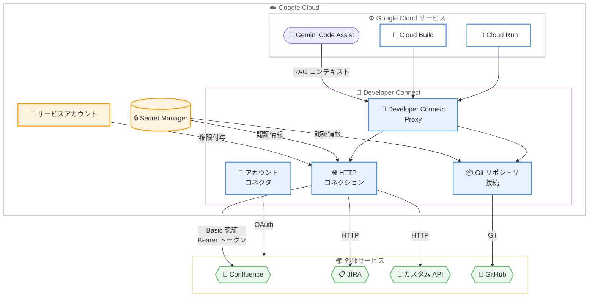

# Developer Connect: HTTP コネクション対応

**リリース日**: 2026-02-12
**サービス**: Developer Connect
**機能**: HTTP コネクション
**ステータス**: Preview (プレビュー)

📊 [このアップデートのインフォグラフィックを見る](https://takech9203.github.io/google-cloud-news-summary/20260212-developer-connect-http-connections.html)

## 概要

Developer Connect に HTTP コネクション機能が追加された。これにより、Git リポジトリ接続やアカウントコネクタに加え、任意の HTTP エンドポイントへの接続を Developer Connect で一元管理できるようになった。HTTP ベースの API でアクセス可能なサードパーティの開発者ツール、サービス、API への接続を標準化された方法で確立・管理できる。

この機能の主な対象ユーザーは、Google Cloud と外部の HTTP ベースのサービスを連携させる必要があるプラットフォーム管理者やアプリケーション開発者である。例えば、Confluence のドキュメントページへの HTTP コネクションを設定すると、Gemini Code Assist の RAG サービスがそのコネクションを使用してドキュメントにアクセスし、コンテキストとして活用できるようになる。

**アップデート前の課題**

Developer Connect では、従来以下の接続タイプのみがサポートされていた。

- Git リポジトリ接続のみが利用可能で、HTTP ベースの API エンドポイントへの接続は対象外だった
- Confluence などの HTTP ベースの外部ツールに Google Cloud サービスからアクセスする場合、認証の管理を個別に実装する必要があった
- 外部 HTTP エンドポイントへの接続において、サービスアカウントベースの権限管理が標準化されていなかった

**アップデート後の改善**

今回の HTTP コネクション機能の追加により、以下が可能になった。

- 任意の HTTP エンドポイントへの接続を Developer Connect で作成・管理できるようになった
- Developer Connect が HTTP エンドポイントへの認証を自動的に処理するようになった
- サービスアカウントに権限を付与することで、ユーザーが接続時に認証操作を行う必要がなくなった
- Basic 認証およびベアラートークン認証の両方がサポートされた

## アーキテクチャ図



Developer Connect の HTTP コネクション機能により、Git リポジトリ接続と同様に、任意の HTTP エンドポイントへの接続を一元管理できる。認証情報は Secret Manager で管理され、サービスアカウントを通じてアクセス制御が行われる。

## サービスアップデートの詳細

### 主要機能

1. **HTTP エンドポイントへの接続管理**
   - 任意の HTTP ベースの API エンドポイントへの接続を作成・管理可能
   - サービスアカウントに権限を付与し、ユーザー不在時でも接続を利用できる
   - Developer Connect Proxy を通じて HTTP リクエストをプロキシ可能

2. **複数の認証方式のサポート**
   - **Basic 認証**: ユーザー名とパスワードによる認証。Secret Manager にパスワードを格納
   - **Bearer トークン認証**: 個人アクセストークンや API トークンによる認証。Secret Manager にトークンを格納

3. **プライベートネットワークアクセス**
   - Service Directory を使用したプライベートネットワークへのアクセスに対応
   - オンプレミスネットワーク内の HTTP エンドポイントにも接続可能
   - カスタム SSL CA 証明書の指定にも対応

## 技術仕様

### 接続パラメータ

HTTP コネクション作成時に指定可能なパラメータは以下の通りである。

| パラメータ | 説明 | 必須/任意 |
|-----------|------|----------|
| `CONNECTION_ID` | コネクションの一意な識別子 | 必須 |
| `REGION` | Google Cloud リージョン | 必須 |
| `PROJECT_ID` | Google Cloud プロジェクト ID | 必須 |
| `HOST_URI` | ベース HTTPS エンドポイント (例: `https://api.myservice.com`) | 必須 |
| `TOKEN_SECRET_VERSION` | Secret Manager のシークレットバージョン (Bearer トークン認証用) | 認証方式により必須 |
| `USERNAME` | Basic 認証のユーザー名 | 認証方式により必須 |
| `PASSWORD_SECRET_VERSION` | Secret Manager のシークレットバージョン (Basic 認証用) | 認証方式により必須 |
| `SERVICE_DIRECTORY_SERVICE` | Service Directory リソース名 (プライベートネットワーク用) | 任意 |
| `SSL_CERTIFICATE_FILE_PATH` | SSL CA 証明書ファイルのパス | 任意 |
| `--git-proxy-config-enabled` | Developer Connect Proxy の有効化 | 任意 |

### IAM ロール

Developer Connect に関連する主要な IAM ロールは以下の通りである。

| ロール | 説明 |
|--------|------|
| `roles/developerconnect.admin` | Developer Connect リソースへのフルアクセス。コネクションの作成・更新・削除が可能 |
| `roles/developerconnect.viewer` | Developer Connect リソースへの読み取り専用アクセス |
| `roles/developerconnect.gitProxyReader` | Git Proxy を介した読み取り専用アクセス |
| `roles/developerconnect.gitProxyUser` | Git Proxy を介した読み書きアクセス |
| `roles/developerconnect.accountConnectorProxyUser` | Git および HTTP Proxy を介したアカウントコネクタへのアクセス |

## 設定方法

### 前提条件

1. Google Cloud プロジェクトで Developer Connect API が有効化されていること
2. Secret Manager に認証情報 (トークンまたはパスワード) が格納されていること
3. `roles/developerconnect.admin` ロールが付与されていること

### 手順

#### ステップ 1: Secret Manager にシークレットを作成

```bash
# Bearer トークン用のシークレットを作成
gcloud secrets create my-api-token \
  --replication-policy="automatic"

# シークレットバージョンを追加
echo -n "YOUR_API_TOKEN" | gcloud secrets versions add my-api-token --data-file=-
```

Secret Manager にアクセストークンまたはパスワードを安全に格納する。

#### ステップ 2: HTTP コネクションを作成 (Bearer トークン認証)

```bash
gcloud developer-connect connections create my-http-connection \
  --location=us-central1 \
  --project=my-project-id \
  --http-config-host-uri=https://api.myservice.com \
  --http-config-bearer-token-authentication-secret-version=projects/my-project-id/secrets/my-api-token/versions/1 \
  --git-proxy-config-enabled
```

Bearer トークン認証を使用して HTTP コネクションを作成する。`--git-proxy-config-enabled` オプションを指定すると、Developer Connect Proxy を介してアクセスが可能になる。

#### ステップ 3: HTTP コネクションを作成 (Basic 認証の場合)

```bash
gcloud developer-connect connections create my-http-connection \
  --location=us-central1 \
  --project=my-project-id \
  --http-config-host-uri=https://api.myservice.com \
  --http-config-basic-authentication-username=my-username \
  --http-config-basic-authentication-password-secret-version=projects/my-project-id/secrets/my-password/versions/1 \
  --git-proxy-config-enabled
```

Basic 認証を使用する場合は、ユーザー名と Secret Manager に格納したパスワードのシークレットバージョンを指定する。

## メリット

### ビジネス面

- **外部ツール統合の標準化**: サードパーティの開発者ツールへの接続を Developer Connect で一元管理することで、接続管理の運用コストを削減できる
- **セキュリティの向上**: 認証情報を Secret Manager で一元管理し、サービスアカウントベースのアクセス制御により、認証情報の散在を防止できる

### 技術面

- **認証の自動化**: Developer Connect が HTTP エンドポイントへの認証を自動的に処理するため、アプリケーション側での認証実装が不要になる
- **プライベートネットワーク対応**: Service Directory との連携により、オンプレミスやプライベートネットワーク内のエンドポイントにもアクセス可能
- **Gemini Code Assist との連携**: HTTP コネクションを通じて外部ドキュメント (Confluence など) を Gemini Code Assist の RAG コンテキストとして活用できる

## デメリット・制約事項

### 制限事項

- 現在 Preview ステータスであり、Pre-GA 提供条件が適用される。サポートが限定的な場合がある
- HTTP コネクションは HTTPS エンドポイントのみをサポートしている (ホスト URI の指定)
- 認証方式は Basic 認証と Bearer トークン認証の 2 種類のみ (OAuth 2.0 フローなどは HTTP コネクションでは非対応)

### 考慮すべき点

- Secret Manager のシークレットバージョン管理が必要であり、トークンのローテーション運用を検討する必要がある
- Preview 機能のため、GA までに仕様変更が発生する可能性がある
- Developer Connect Proxy を有効化した場合、Git Proxy と HTTP Proxy の両方が同時に有効化される

## ユースケース

### ユースケース 1: Gemini Code Assist への外部ドキュメント統合

**シナリオ**: 開発チームが Confluence に蓄積した設計ドキュメントやアーキテクチャガイドを、Gemini Code Assist のコードカスタマイズ機能のコンテキストとして活用したい場合。

**実装例**:

```bash
# Confluence への HTTP コネクションを作成
gcloud developer-connect connections create confluence-docs \
  --location=us-central1 \
  --project=my-project \
  --http-config-host-uri=https://mycompany.atlassian.net \
  --http-config-bearer-token-authentication-secret-version=projects/my-project/secrets/confluence-api-token/versions/1 \
  --git-proxy-config-enabled
```

**効果**: Gemini Code Assist の RAG サービスが Confluence のドキュメントにアクセスし、組織固有の設計パターンやコーディング規約をコンテキストとしてコード提案に反映できるようになる。

### ユースケース 2: プライベートネットワーク内の API エンドポイントへの接続

**シナリオ**: オンプレミス環境に配置された内部 API サーバーに Google Cloud のサービスからセキュアにアクセスしたい場合。

**効果**: Service Directory を使用してプライベートネットワーク内のエンドポイントに接続し、カスタム SSL CA 証明書を指定することで、セキュアな通信を維持しながら内部 API へのアクセスが実現できる。

## 料金

Developer Connect の HTTP コネクションに固有の料金情報は、公式ドキュメントでは確認できなかった。料金の詳細については、以下のページを参照されたい。

- [Developer Connect の公式ドキュメント](https://cloud.google.com/developer-connect/docs)

## 利用可能リージョン

Developer Connect は多数のリージョンで利用可能であり、インテグレーション先のサービスによって対応リージョンが異なる。公式ドキュメントによると、Cloud Build との連携では `asia-northeast1` (東京)、`asia-northeast2` (大阪) を含む 40 以上のリージョンで利用できる。Gemini Code Assist のコードカスタマイズでは `asia-southeast1` (シンガポール)、`europe-west1` (ベルギー)、`us-central1` (アイオワ) で利用可能である。

HTTP コネクションの対応リージョンの詳細は、以下のドキュメントを参照されたい。

- [Developer Connect のロケーション](https://cloud.google.com/developer-connect/docs/locations)

## 関連サービス・機能

- **Secret Manager**: HTTP コネクションの認証情報 (トークン、パスワード) の安全な格納・管理に使用される
- **Service Directory**: プライベートネットワーク内の HTTP エンドポイントへのアクセスに使用される
- **Gemini Code Assist**: HTTP コネクションを通じて外部ドキュメントを RAG コンテキストとして活用できる主要な連携サービス
- **Cloud Build / Cloud Run**: Developer Connect の Git リポジトリ接続と併せて、CI/CD パイプラインで活用できる
- **IAM**: サービスアカウントを通じた HTTP コネクションへのアクセス制御に使用される

## 参考リンク

- 📊 [インフォグラフィック](https://takech9203.github.io/google-cloud-news-summary/20260212-developer-connect-http-connections.html)
- [公式リリースノート](https://cloud.google.com/release-notes#February_12_2026)
- [HTTP コネクション概要](https://cloud.google.com/developer-connect/docs/http-connections)
- [HTTP コネクションの設定方法](https://cloud.google.com/developer-connect/docs/configure-http-connections)
- [Developer Connect 概要](https://cloud.google.com/developer-connect/docs/overview)
- [Developer Connect Proxy の設定](https://cloud.google.com/developer-connect/docs/configure-git-proxy)
- [IAM アクセス制御](https://cloud.google.com/developer-connect/docs/access-control)
- [利用可能リージョン](https://cloud.google.com/developer-connect/docs/locations)

## まとめ

Developer Connect の HTTP コネクション機能により、Git リポジトリに加え、任意の HTTP エンドポイントへの接続を標準化された方法で管理できるようになった。特に Gemini Code Assist との連携において、Confluence などの外部ドキュメントを RAG コンテキストとして活用できる点は、AI を活用した開発ワークフローの拡張に有用である。現在 Preview ステータスであるため、本番環境での利用は GA を待つことが推奨されるが、評価・検証環境での試用を開始することで、GA 時のスムーズな導入に備えることができる。

---

**タグ**: #DeveloperConnect #HTTP #Preview #GeminiCodeAssist #SecretManager #ServiceDirectory #認証 #外部ツール連携
