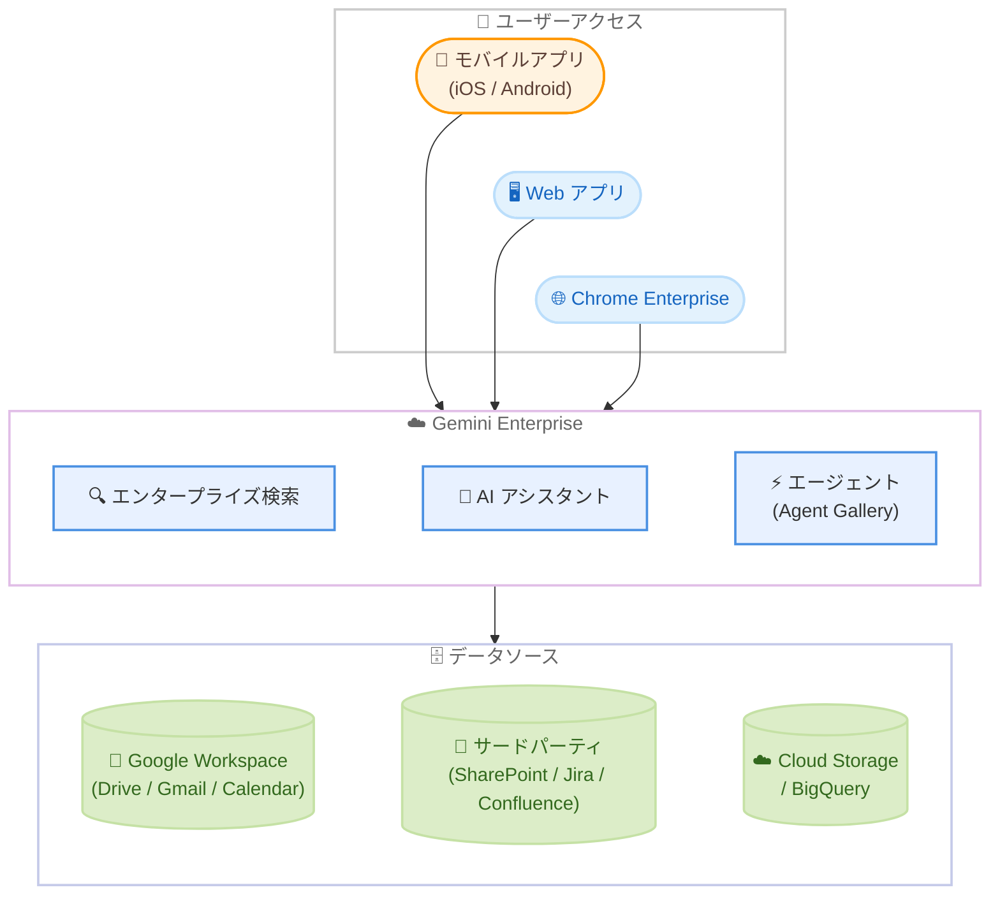

# Gemini Enterprise: モバイルアプリ Private GA

**リリース日**: 2026-02-12
**サービス**: Gemini Enterprise
**機能**: モバイルアプリ (Standard / Plus エディション)
**ステータス**: Private GA

## 概要

Gemini Enterprise のモバイルアプリが Private GA としてリリースされた。対象エディションは Standard および Plus で、ユーザーはモバイルデバイスから組織データへのアクセス、エージェントとの対話、タスクの実行をシームレスに行えるようになる。

Gemini Enterprise は、イントラネット検索、AI アシスタント、エージェントプラットフォームを統合したサービスであり、これまで Web アプリ経由でのみ利用可能だった。今回のモバイルアプリの提供により、外出先やデスクから離れた場所でも組織のナレッジベースやエージェントにアクセスできるようになる。

Private GA であるため、利用にはアカウントマネージャーへの連絡が必要となる。アプリは最新の機能やセキュリティを維持するため、定期的なアップデートが求められる場合がある。

**アップデート前の課題**

Gemini Enterprise の利用は Web アプリに限定されており、モバイル環境での利用には以下の課題があった。

- デスクから離れた場所では組織データの検索や AI アシスタントへの問い合わせができなかった
- 外出先でエージェントを活用したタスク実行ができなかった
- モバイルブラウザでの Web アプリ利用はネイティブアプリと比較してユーザー体験が限定的だった

**アップデート後の改善**

今回のモバイルアプリ提供により、以下の改善が実現された。

- モバイルデバイスから組織データへのアクセスが可能になった
- 外出先でもエージェントとの対話やタスク実行がシームレスに行えるようになった
- ネイティブモバイルアプリによる最適化されたユーザー体験が提供されるようになった

## アーキテクチャ図



Gemini Enterprise モバイルアプリは、既存の Web アプリや Chrome Enterprise と同様に Gemini Enterprise プラットフォームに接続し、エンタープライズ検索、AI アシスタント、エージェント機能を利用する。図中のモバイルアプリ (オレンジ) が今回の新規追加要素である。

## サービスアップデートの詳細

### 主要機能

1. **組織データへのモバイルアクセス**
   - モバイルデバイスから組織内のデータソース (Google Workspace、サードパーティ SaaS、Cloud Storage など) を検索できる
   - 権限管理 (パーミッションアウェア) が適用されるため、ユーザーがアクセス権を持つデータのみ表示される

2. **エージェントとの対話**
   - Agent Gallery に登録されたエージェント (Google 提供の Deep Research、Idea Generation、Data Insights など) をモバイルから利用できる
   - Agent Designer で作成されたカスタムノーコードエージェントや、ADK / A2A / Dialogflow で構築された外部エージェントにもアクセス可能

3. **タスクのシームレスな実行**
   - モバイルデバイスからサードパーティデータソースに対するアクション (Jira チケットの作成、Outlook カレンダーへの予定追加など) を実行できる
   - Gmail 送信や Google Calendar イベント作成などの Google Workspace アクションもサポート

## 技術仕様

### 対応エディションと機能比較

Gemini Enterprise のエディションごとのモバイルアプリ対応状況は以下の通りである。

| 項目 | Standard | Plus |
|------|----------|------|
| モバイルアプリ対応 | Private GA | Private GA |
| エンタープライズ検索 | 対応 | 対応 |
| AI アシスタント | - | 対応 |
| ストレージ / データインデックス (月間 / ユーザー) | 30 GiB (プール) | 75 GiB (プール) |
| フルデータコネクタエコシステム | 対応 | 対応 |
| 最新 Gemini モデルへの優先アクセス | 対応 | 対応 |
| NotebookLM Enterprise | 対応 | 対応 |
| Gemini Code Assist Standard | 対応 | 対応 |
| ノーコードエージェントの構築 | 対応 | 対応 |
| Deep Research | 対応 | 対応 |
| エンタープライズグレードのセキュリティ | 対応 | 対応 |

### セキュリティとコンプライアンス

Gemini Enterprise Standard および Plus エディションは、以下のセキュリティ制御をサポートしている。

| セキュリティ制御 | 対応状況 |
|------------------|----------|
| Data Residency (DRZ) | US / EU マルチリージョン API のみ |
| CMEK (カスタマーマネージド暗号鍵) | US / EU マルチリージョン API のみ (EKM / HSM は GA with allowlist) |
| VPC Service Controls | 対応 |
| Access Transparency | US / EU マルチリージョンのみ |

コンプライアンス認証については、HIPAA、FedRAMP、ISO 27001 / 27017 / 27018 / 27701、SOC 1 / 2 / 3、PCI DSS の各認証が取得予定または取得済みの状況である。

## 設定方法

### 前提条件

1. Gemini Enterprise Standard または Plus エディションのサブスクリプションが有効であること
2. Google Cloud プロジェクトで Gemini Enterprise がセットアップ済みであること
3. ユーザーに適切なライセンスが割り当てられていること (Discovery Engine User ロール以上)

### 手順

#### ステップ 1: アカウントマネージャーへの連絡

```
Private GA のため、モバイルアプリへのアクセスにはアカウントマネージャーへの連絡が必要。
Google Cloud のアカウントマネージャーに Gemini Enterprise モバイルアプリの利用を申請する。
```

アクセスが承認されると、モバイルアプリのダウンロード手順が案内される。

#### ステップ 2: アプリのインストールとサインイン

```
1. アカウントマネージャーから提供されたリンクまたは手順に従い、モバイルアプリをインストール
2. 組織の Google Cloud アカウントでサインイン
3. ライセンスが自動的に検証され、利用可能になる
```

最新の機能やセキュリティを維持するため、定期的なアップデートが求められる場合がある。一部のアップデートはアプリの継続利用に必須となる。

## メリット

### ビジネス面

- **生産性の向上**: 外出先や会議中でも組織のナレッジベースに即座にアクセスでき、意思決定のスピードが向上する
- **ワークフローの継続性**: デスクからモバイルへの切り替え時にもエージェントやアシスタントとの対話を継続でき、業務の中断を最小化できる
- **フロントラインワーカーへの展開**: 現場作業者や営業担当者など、デスクに常駐しない従業員にも AI アシスタント機能を提供できる

### 技術面

- **ネイティブモバイル体験**: Web ブラウザ経由ではなくネイティブアプリとして最適化されたインターフェースを提供
- **エンタープライズグレードのセキュリティ**: Web アプリと同等のセキュリティ制御 (VPC Service Controls、CMEK、Data Residency) がモバイルアプリにも適用される
- **既存のデータコネクタとの統合**: Web アプリで設定済みのデータソース (Google Workspace、Microsoft 365、Jira、Confluence、ServiceNow など) がモバイルアプリからもそのまま利用可能

## デメリット・制約事項

### 制限事項

- Private GA のため、利用にはアカウントマネージャーへの連絡が必要であり、すべての顧客が即座に利用できるわけではない
- Business エディションおよび Frontline エディションは現時点で対象外である (Standard および Plus エディションのみ)
- 定期的なアプリアップデートが必要となり、一部のアップデートは継続利用の前提条件となる

### 考慮すべき点

- モバイルデバイスの管理 (MDM) ポリシーとの整合性を確認する必要がある
- モバイルアプリからのデータアクセスに関するセキュリティポリシーの見直しが推奨される
- Private GA から GA への移行時に追加の設定変更が必要になる可能性がある

## ユースケース

### ユースケース 1: 外出先での営業支援

**シナリオ**: 営業担当者が顧客訪問前に、モバイルアプリから組織内のドキュメントを検索し、最新の提案資料や顧客情報を確認する。

**効果**: 移動中でも最新の情報にアクセスでき、顧客対応の質と迅速性が向上する。Deep Research エージェントを使えば、顧客の業界動向をまとめたレポートを移動中に生成することも可能となる。

### ユースケース 2: 現場作業での技術情報検索

**シナリオ**: フィールドエンジニアが現場で技術的な問題に直面した際、モバイルアプリからナレッジベースを検索し、トラブルシューティング手順やマニュアルを即座に確認する。

**効果**: オフィスに戻らずに問題解決に必要な情報を取得でき、対応時間の短縮とダウンタイムの削減につながる。

### ユースケース 3: 会議中のリアルタイム情報取得

**シナリオ**: 経営会議中にモバイルアプリから AI アシスタントに質問し、関連するプロジェクトの進捗データや分析結果をリアルタイムで取得する。

**効果**: 会議の場でデータに基づいた議論が可能になり、意思決定の質とスピードが向上する。

## 料金

Gemini Enterprise モバイルアプリは、既存の Gemini Enterprise Standard または Plus エディションのサブスクリプションに含まれる機能として提供される。モバイルアプリ単体での追加料金は公式ドキュメントでは確認されていない。

Gemini Enterprise のサブスクリプションは月額または年間契約で利用可能であり、ライセンスはプロジェクトおよびロケーション単位で管理される。具体的な料金については、アカウントマネージャーへ確認することが推奨される。

詳細は [Gemini Enterprise ライセンス](https://cloud.google.com/gemini/enterprise/docs/licenses) を参照。

## 利用可能リージョン

Gemini Enterprise は以下のリージョンで利用可能である。モバイルアプリも同様のリージョンで利用可能と想定されるが、Private GA の段階では提供範囲が限定される可能性がある。

- Global (グローバル)
- US マルチリージョン
- EU マルチリージョン

Data Residency (DRZ) が必要な場合は US または EU マルチリージョンを選択する必要がある。コンプライアンスや規制上の要件がない場合は、Google はグローバルマルチリージョンの利用を推奨している。

## 関連サービス・機能

- **NotebookLM Enterprise**: Gemini Enterprise Standard / Plus エディションに含まれるノートブック機能。モバイルアプリからも公開済みノートブックへのアクセスが可能
- **Agent Designer**: ノーコードでカスタム AI エージェントを構築するツール。構築したエージェントはモバイルアプリからも利用可能
- **Gemini Code Assist Standard**: Standard / Plus エディションに含まれる AI コーディング支援機能
- **Chrome Enterprise 連携**: Chrome Enterprise のアドレスバーから Gemini Enterprise を直接呼び出す機能 (2025 年 7 月 GA)
- **Cloud Logging 連携**: 管理者は Cloud Logging を通じて Gemini Enterprise のユーザークエリおよびレスポンスの監査ログにアクセス可能

## 参考リンク

- [公式リリースノート](https://cloud.google.com/release-notes#February_12_2026)
- [Gemini Enterprise リリースノート](https://cloud.google.com/gemini/enterprise/docs/release-notes)
- [Gemini Enterprise エディション比較](https://cloud.google.com/gemini/enterprise/docs/editions)
- [Gemini Enterprise 概要](https://cloud.google.com/gemini/enterprise/docs/concepts)
- [Gemini Enterprise ライセンス](https://cloud.google.com/gemini/enterprise/docs/licenses)
- [Gemini Enterprise セキュリティとコンプライアンス](https://cloud.google.com/gemini/enterprise/docs/compliance-security-controls)
- [Gemini Enterprise エージェント概要](https://cloud.google.com/gemini/enterprise/docs/agents-overview)

## まとめ

Gemini Enterprise モバイルアプリの Private GA リリースは、エンタープライズ AI アシスタントのモバイル対応という重要なマイルストーンである。Standard および Plus エディションのユーザーは、外出先からでも組織データの検索、エージェントとの対話、タスク実行が可能になり、ナレッジワーカーの生産性向上に大きく貢献する。Private GA の段階であるため、利用を検討する場合はアカウントマネージャーへ早期に連絡し、アクセス権の確保と社内のモバイルセキュリティポリシーとの整合性確認を進めることが推奨される。

---

**タグ**: #GeminiEnterprise #MobileApp #PrivateGA #AIAssistant #EnterpriseSearch #Agents
