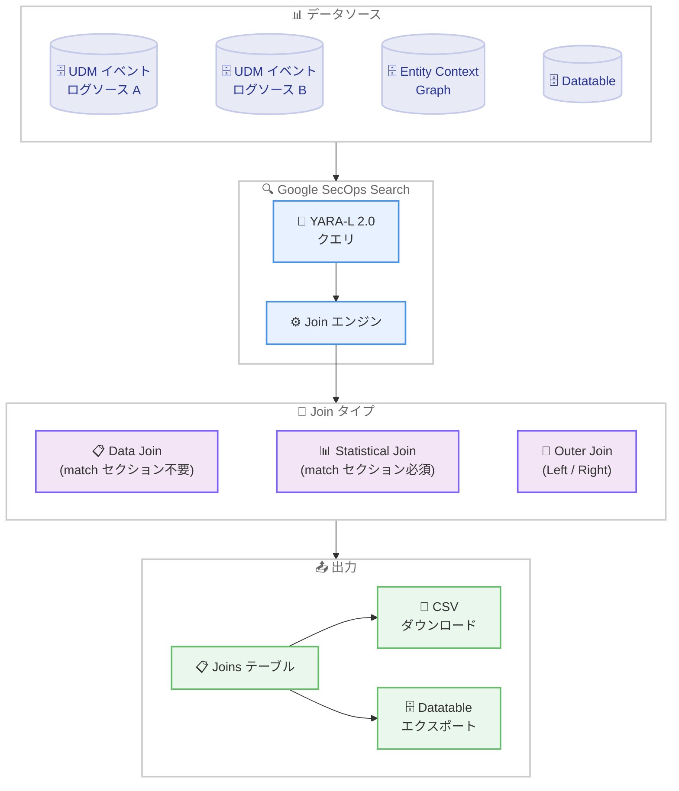

# Google SecOps: Advanced Joins in Search

**リリース日**: 2026-02-12
**サービス**: Google SecOps / Google SecOps SIEM
**機能**: Advanced Joins in Search
**ステータス**: Feature (新機能、Pre-GA)

[このアップデートのインフォグラフィックを見る]({INFOGRAPHIC_BASE_URL}/20260212-google-secops-advanced-joins.html)

## 概要

Google SecOps (旧 Chronicle) の Search 機能において、複数のデータソース間でのデータ相関を行うための Join 操作が大幅に拡張された。今回のアップデートでは、「match セクション不要の Join」と「Outer Join (Left Join / Right Join)」という 2 つの新しい Join タイプが追加され、マルチステージクエリでもサポートされる。

この機能強化により、セキュリティアナリストや Detection Engineer は、UDM (Unified Data Model) イベント、Entity Context Graph (ECG)、Datatable など異なるデータタイプのイベントを、より柔軟かつ直感的に組み合わせて調査できるようになる。従来の統計ベースの Join では match セクションによる集約が必須であったが、新しい Data Join では生データをそのまま結合して表示できるため、脅威ハンティングやインシデント調査の効率が大幅に向上する。

対象ユーザーは、Google SecOps を利用するセキュリティオペレーションチーム、SOC アナリスト、Detection Engineer であり、特に複数ログソースを横断した高度な調査を行う組織にとって大きな価値がある。

**アップデート前の課題**

今回のアップデート以前には、以下の制限が存在していた。

- Join 操作には必ず match セクションを定義する必要があり、集約された統計結果のみが取得可能だった
- Inner Join のみがサポートされていたため、一方のデータソースにマッチしないレコードは結果から除外されていた
- 生のイベントデータを結合して横断的に表示するには、複数の個別クエリを実行して手動で突き合わせる必要があった

**アップデート後の改善**

今回のアップデートにより、以下が可能になった。

- match セクションなしで Join を実行でき、完全なイベントデータを集約せずに結合・表示できるようになった
- Left Join / Right Join により、一方のデータソースの全レコードを保持しつつ、もう一方とマッチしないレコードも null として含められるようになった
- Join 結果を CSV としてダウンロード、または Event-to-Event Join の場合は Datatable にエクスポートして後続の分析に活用できるようになった

## アーキテクチャ図



この図は、Google SecOps Search における Advanced Joins の全体的なデータフローを示している。複数のデータソース (UDM イベント、ECG、Datatable) が Search エンジンに取り込まれ、3 種類の Join タイプ (Data Join、Statistical Join、Outer Join) を通じて結合され、結果が Joins テーブルとして出力される。

## サービスアップデートの詳細

### 主要機能

1. **match セクション不要の Join (Data Join)**
   - 従来の Statistical Join とは異なり、match セクションによる集約なしで複数データソースの生データを直接結合できる
   - フィールドの直接比較 (`$e1.principal.hostname = $e2.principal.hostname`) またはプレースホルダー変数 (`$host = $e1.principal.hostname` と `$host = $e2.principal.hostname`) による暗黙的な Join をサポート
   - Event-to-Event Join と Event-to-ECG Join の 2 種類をサポート
   - 結果は Joins テーブルに表示され、CSV ダウンロードや Datatable エクスポート (Event-to-Event のみ) が可能

2. **Outer Join (Left Join / Right Join)**
   - SQL の外部結合と同等の概念を YARA-L 2.0 で実現
   - Left Join: 左側のデータソースの全レコードを保持し、右側にマッチがない場合は null を返す
   - Right Join: 右側のデータソースの全レコードを保持し、左側にマッチがない場合は null を返す
   - match セクションの有無にかかわらず使用可能
   - Event-Event、Event-Entity、Event-Datatable の各組み合わせで利用可能

3. **マルチステージクエリ対応**
   - 今回追加された Join 操作は、マルチステージクエリ内でもサポートされる
   - 複雑な検出ロジックやハンティングクエリにおいて、段階的なデータ結合と分析が可能

## 技術仕様

### サポートされる Join タイプの比較

以下の表は、各 Join タイプの特徴をまとめたものである。

| 項目 | Statistical Join (従来) | Data Join (新規) | Outer Join (新規) |
|------|------------------------|-------------------|-------------------|
| match セクション | 必須 | 不要 | 任意 |
| 結果の表示 | 集約された統計値 | 完全なイベントデータ | 完全なイベントデータ (null 含む) |
| Event-Event | 対応 | 対応 | 対応 |
| Event-ECG | 対応 | 対応 | 対応 (Left Join のみ) |
| Event-Datatable | 対応 | 非対応 | 対応 |
| CSV ダウンロード | - | 対応 | 対応 |
| Datatable エクスポート | - | 対応 (Event-Event のみ) | - |

### 制限事項 (Data Join)

以下の表は、match セクション不要の Join (Data Join) の制限事項をまとめたものである。

| 項目 | 制限値 |
|------|--------|
| 最大 UDM イベント数 / クエリ | 2 |
| 最大 ECG イベント数 / クエリ | 1 |
| 最大クエリ時間範囲 | 14 日間 |
| クエリレート制限 | 120 QPH (queries per hour) |
| ECG-to-ECG Join | 非対応 |
| ECG-to-Datatable Join | 非対応 |
| Datatable エクスポート (Event-to-ECG) | 非対応 |

### 制限事項 (Outer Join)

以下の表は、Outer Join の制限事項をまとめたものである。

| 項目 | 制限値 |
|------|--------|
| Full Outer Join | 非対応 (Left と Right を同時に使用不可) |
| match なしクエリの時間範囲 | 最大 14 日間 |
| コンテキストソース間の直接結合 | 非対応 (Entity と Datatable の直接結合不可) |
| UDM イベントの配置制約 | 主要 UDM イベントは Outer Join の保持側に配置する必要がある |

### クエリ例: Data Join (match セクション不要)

```text
// ユーザーログインイベントとネットワーク接続イベントを
// ホスト名で結合する例

$e1.metadata.event_type = "USER_LOGIN"
$host = $e1.principal.hostname

$e2.metadata.event_type = "NETWORK_CONNECTION"
$host = $e2.principal.hostname
```

### クエリ例: Left Outer Join

```text
// 全てのユーザーログインイベントを保持しつつ、
// ネットワーク接続イベントとホスト名で結合する例

$e1.metadata.event_type = "USER_LOGIN"
$e2.metadata.event_type = "NETWORK_CONNECTION"
left join $e1.principal.hostname = $e2.principal.hostname

$host = $e1.principal.hostname

match:
  $host over 5m
```

## 設定方法

### 前提条件

1. Google SecOps プラットフォームへのアクセス権限があること
2. SIEM Search への適切な権限グループが割り当てられていること
3. 調査対象のデータが UDM 形式で取り込み済みであること

### 手順

#### ステップ 1: Search 画面にアクセス

Google SecOps プラットフォームの左側ナビゲーションから「Investigation」>「SIEM Search」に移動する。

#### ステップ 2: Data Join クエリを実行

検索バーに YARA-L 2.0 形式の Join クエリを入力する。

```text
// 例: ユーザーログインと後続のファイル作成を相関分析
$e1.metadata.event_type = "USER_LOGIN"
$e1.security_result.action = "ALLOW"
$e1.principal.user.userid = $user

$e2.metadata.event_type = "FILE_CREATION"
$e2.principal.user.userid = $user
```

時間範囲を選択して「Search」を実行する。結果は「Joins」テーブルに表示される。

#### ステップ 3: 結果をエクスポート

Joins テーブルから以下のエクスポートオプションを選択する。

- **CSV ダウンロード**: オフラインでの分析に使用
- **Datatable エクスポート**: Google SecOps 内での後続の相関分析に使用 (Event-to-Event Join のみ)

## メリット

### ビジネス面

- **インシデント調査の迅速化**: 複数のデータソースを単一のクエリで横断的に調査できるため、MTTD (Mean Time to Detect) と MTTR (Mean Time to Respond) の短縮が期待できる
- **SOC オペレーションの効率化**: 手動での突き合わせ作業が不要になり、アナリストがより高度な分析に集中できる

### 技術面

- **柔軟なデータ相関**: match セクション不要の Join により、集約せずに生データレベルでの相関が可能になった
- **データロスの防止**: Outer Join により、マッチしないレコードも結果に含められるため、調査の網羅性が向上した
- **YARA-L 2.0 との統合**: 既存の YARA-L 2.0 クエリ言語の自然な拡張として実装されており、学習コストが低い

## デメリット・制約事項

### 制限事項

- 本機能は Pre-GA (プレビュー) ステータスであり、GA 時に互換性のない変更が行われる可能性がある
- Full Outer Join (Left Join と Right Join の同時使用) は非対応
- Data Join (match セクション不要) では、クエリあたり最大 2 つの UDM イベント、1 つの ECG イベントまでに制限される
- クエリ時間範囲は match なしの場合は最大 14 日間に制限される

### 考慮すべき点

- Join クエリはリソース集約的であるため、フィルタを具体的かつ狭く設定することが推奨される
- 広範なフィルタ (例: `target.ip != ""`) はクエリの失敗やタイムアウトの原因となる可能性がある
- UDM イベントは Outer Join の保持側に配置する必要があるという制約に注意が必要

## ユースケース

### ユースケース 1: 認証情報の窃取と不正使用の検出

**シナリオ**: ユーザーが正常にログインした直後に重要なシステムファイルを削除するケースを検出する。アカウント乗っ取りや内部不正の兆候を早期に発見する。

**実装例**:

```text
// Event-Event Join: ログイン後の不審なファイル削除を検出
$e1.metadata.event_type = "USER_LOGIN"
$e1.security_result.action = "ALLOW"
$e1.principal.user.userid = $user

$e2.metadata.event_type = "FILE_DELETION"
$e2.target.file.full_path = /etc\/passwd|C:\\Windows\\System32\\/
$e2.principal.user.userid = $user

match:
  $user over 10m

condition:
  $e1 and $e2
```

**効果**: 単独では正常に見えるログインイベントとファイル削除イベントを相関させることで、高い確度で不正行動を検出できる。

### ユースケース 2: 重要資産からの不審な外部通信の特定

**シナリオ**: Entity Context Graph と Live イベントデータを結合し、重要なデータベースサーバーから外部の低プレバレンスドメインへの通信を特定する。Left Join を使用して、対象資産からの全ネットワーク接続を網羅的に把握する。

**実装例**:

```text
// Event-ECG Left Join: 重要資産の全通信を保持しつつエンリッチメント
$e.metadata.event_type = "NETWORK_CONNECTION"
$e.target.domain.prevalence.day_count <= 5

$asset.graph.metadata.entity_type = "ASSET"
$asset.graph.entity.asset.labels.value = "Critical Database Server"

left join $e.principal.asset.hostname = $asset.graph.entity.asset.hostname

$host = $e.principal.asset.hostname

match:
  $host over 1h

condition:
  $e and $asset
```

**効果**: Left Join を使用することで、ECG にマッチしない通信も含めて全件を確認でき、調査の抜け漏れを防止できる。

### ユースケース 3: 脅威インテリジェンスとの IOC マッチング

**シナリオ**: 脅威インテリジェンスチームが管理する Datatable 内の既知の悪性ドメインリストと、リアルタイムの DNS クエリイベントを結合して IOC (Indicators of Compromise) を即座に検出する。

**実装例**:

```text
// Datatable-Event Join: 脅威インテリジェンスと DNS クエリの照合
$domain = %ThreatActor_Domains.domain

$e.metadata.event_type = "NETWORK_DNS"
$e.network.dns.questions.name = $domain

match:
  $domain over 5m

condition:
  $e
```

**効果**: ユーザー定義の脅威インテリジェンスリストとリアルタイムイベントを直接照合でき、既知の脅威アクターによる活動を迅速に検出できる。

## 料金

Google SecOps の料金体系はサブスクリプションベースのモデルを採用しており、Standard、Enterprise、Enterprise Plus の 3 つのパッケージが提供されている。Advanced Joins in Search 機能の個別料金は公式ドキュメントで確認できなかったが、Google SecOps SIEM のサブスクリプションに含まれるものと考えられる。

料金はデータ取り込み量に基づくクレジットベースのモデルであり、詳細は Google Cloud の営業担当に問い合わせる必要がある。

詳細は [Google SecOps の料金ページ](https://cloud.google.com/security/products/security-operations#pricing) を参照。

## 関連サービス・機能

- **YARA-L 2.0**: Google SecOps の統一クエリ言語。Advanced Joins は YARA-L 2.0 の拡張として実装されている
- **Entity Context Graph (ECG)**: アセットやユーザーのコンテキスト情報を提供するエンティティグラフ。Event-ECG Join で活用される
- **Datatable**: ユーザー定義のデータテーブル。脅威インテリジェンスリストなどを格納し、Datatable-Event Join で参照される
- **UDM (Unified Data Model)**: Google SecOps のデータ正規化モデル。すべての Join 操作は UDM イベントを基盤として動作する
- **Google SecOps Detection Engine**: YARA-L 2.0 ルールベースの脅威検出エンジン。Join 操作はルール内でも活用可能
- **Security Command Center Enterprise**: Google SecOps の一部機能を含む CNAPP ソリューション。Enterprise ティアでは制限付きで Google SecOps SIEM を利用可能

## 参考リンク

- [公式リリースノート](https://cloud.google.com/release-notes#February_12_2026)
- [Use joins in Search - ドキュメント](https://cloud.google.com/chronicle/docs/investigation/search-joins)
- [Implement joins without a match section - ドキュメント](https://cloud.google.com/chronicle/docs/investigation/joins-without-match-section)
- [Correlate data with outer joins - ドキュメント](https://cloud.google.com/chronicle/docs/investigation/outer-joins)
- [YARA-L 2.0 入門ガイド](https://cloud.google.com/chronicle/docs/yara-l/getting-started)
- [Google SecOps SIEM 概要](https://cloud.google.com/chronicle/docs/overview)
- [Google SecOps 料金](https://cloud.google.com/security/products/security-operations#pricing)

## まとめ

Google SecOps の Advanced Joins in Search は、セキュリティ調査における複数データソース間の相関分析能力を大幅に強化する重要なアップデートである。match セクション不要の Data Join と Outer Join の追加により、SOC アナリストは生データレベルでの柔軟な横断調査が可能になり、マッチしないレコードも含めた網羅的な分析を実現できる。現在 Pre-GA ステータスであるため、本番環境での利用には制限事項を確認した上で、まずは脅威ハンティングやアドホックな調査から活用を開始することを推奨する。

---

**タグ**: #GoogleSecOps #SIEM #ThreatHunting #YARAL #Search #Join #SecurityOperations #IncidentResponse
