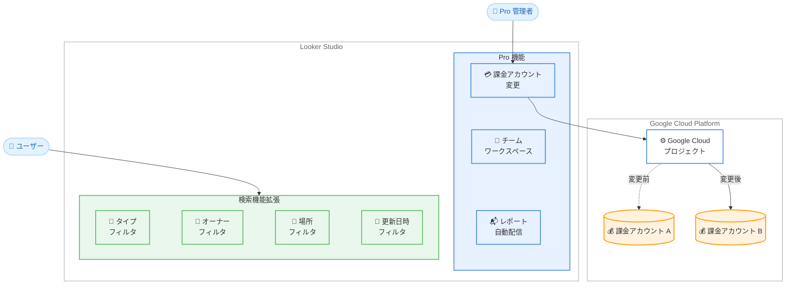

# Looker Studio: Pro 機能拡張 (課金アカウント変更 + 検索パラメータ追加)

**リリース日**: 2026-02-12
**サービス**: Looker Studio
**機能**: Pro 課金アカウント変更 / 検索パラメータ追加
**ステータス**: GA (一般提供)

[このアップデートのインフォグラフィックを見る]({INFOGRAPHIC_BASE_URL}/20260212-looker-studio-pro-enhancements.html)

## 概要

2026 年 2 月 12 日、Google Cloud は Looker Studio に対して 2 つの機能拡張を発表しました。1 つ目は Looker Studio Pro のサブスクリプションに関連付けられた Google Cloud 課金アカウントを変更できる機能、2 つ目はレポートやデータソースの検索時に追加のパラメータでフィルタリングできる機能です。

課金アカウント変更機能は、Looker Studio Pro のサブスクリプション管理を柔軟にするものです。組織再編やプロジェクト統合、コスト管理の見直しなどにより課金先を変更する必要がある場合に、Pro アセットへのアクセスを中断することなく課金アカウントを切り替えることが可能になります。

検索パラメータ追加機能は、Looker Studio のホームページにおけるレポートやデータソースの検索体験を向上させるものです。タイプ、オーナー、場所、更新日時などの追加パラメータを使用してフィルタリングできるようになり、大量のアセットを管理する組織においてコンテンツの発見性が大幅に改善されます。

**アップデート前の課題**

このアップデート以前には、以下のような課題がありました。

- Looker Studio Pro の課金アカウントを変更する手順が複雑で、サブスクリプションの一時キャンセルが必要であることが明確に案内されていなかった
- レポートやデータソースの検索において、利用可能なフィルタリングパラメータが限定されていた
- 大量のレポートやデータソースを管理する組織では、目的のアセットを効率的に見つけることが困難だった

**アップデート後の改善**

今回のアップデートにより、以下の改善が実現されました。

- Looker Studio Pro の課金アカウント変更手順が公式ドキュメントとして整備され、Pro アセットを維持したまま課金先を変更可能になった
- レポートやデータソースの検索時に、タイプ (Type)、オーナー (Owner)、場所 (Location)、更新日時 (Date Modified) などの追加パラメータでフィルタリング可能になった
- 検索結果のソート機能も強化され、名前、最終変更日時、自分の最終変更日時、最終閲覧日時での並び替えが可能になった

## アーキテクチャ図

この図は、今回のアップデートで強化された 2 つの領域を示しています。上部の Pro 機能エリアでは課金アカウント変更機能が追加され、Google Cloud プロジェクトに紐づく課金アカウントを A から B へ切り替えるフローを表現しています。下部の検索機能拡張エリアでは、4 種類の追加フィルタパラメータを表現しています。

## サービスアップデートの詳細

### 主要機能

1. **課金アカウント変更 (Pro 機能)**
   - Looker Studio Pro サブスクリプションに関連付けられた Google Cloud 課金アカウントを変更可能
   - 変更プロセスは 3 ステップで構成: サブスクリプション終了、課金アカウント更新、新規サブスクリプション開始
   - 「Cancel immediately. Skip the grace period and keep assets in your Google Cloud project.」オプションにより、30 日間の猶予期間をスキップして即座にキャンセルし、Pro アセットをプロジェクト内に維持可能
   - Google Workspace Admin console 経由で設定されたサブスクリプションには適用されない (この場合は Google Workspace の支払い方法変更を使用)

2. **検索パラメータ追加 (全ユーザー向け)**
   - ホームページの検索バーにおいて、以下のパラメータでフィルタリング可能
     - **Type**: レポート、データソース、ワークスペース、フォルダで絞り込み
     - **Owner**: 自分が所有するコンテンツ、共有されたコンテンツ、特定ユーザーが所有するコンテンツで絞り込み
     - **Location**: サンドボックス、ゴミ箱、特定の場所で絞り込み
     - **Date Modified**: 任意の期間での最終変更日時で絞り込み
   - 適用された検索オプションは Search Results セクションで編集または削除可能

3. **検索結果のソート機能**
   - レポート名での並び替え
   - 任意のユーザーによる最終変更日時での並び替え
   - 自分による最終変更日時での並び替え
   - 自分の最終閲覧日時での並び替え
   - フォルダをソートに含めるか、全ファイルの前に表示するかを選択可能

## 技術仕様

### 課金アカウント変更の要件

課金アカウント変更に必要な権限と条件を以下の表にまとめます。

| 項目 | 詳細 |
|------|------|
| 対象サブスクリプション | Looker Studio の無料版から直接セットアップ、または Google Cloud console からセットアップされたもの |
| 必要な権限 | Google Cloud プロジェクトを現在の課金アカウントからリンク解除し、新しい課金アカウントにリンクする権限 |
| 参照ドキュメント | Cloud Billing の「Enable, disable, or change billing for a project」ページに記載の権限 |
| 非対象 | Google Workspace Admin console 経由で設定されたサブスクリプション |
| 注意事項 | キャンセル後 30 日以内に再サブスクライブしない場合、Pro アセットへのアクセスを失う可能性あり |

### 検索パラメータの仕様

検索機能で利用可能なフィルタパラメータを以下にまとめます。

| パラメータ | フィルタ条件 |
|-----------|-------------|
| Type | Reports / Data Sources / Workspaces / Folders |
| Owner | Owned by me / Shared with me / Owned by specific user |
| Location | Sandbox / Trash / Specific location |
| Date Modified | Custom timeframe (任意の期間指定) |

### IAM ロール

Looker Studio Pro の管理に関連する IAM ロールは以下の通りです。

| ロール | 説明 |
|--------|------|
| `roles/owner` | プロジェクトオーナー。全権限を持つ |
| `roles/lookerstudio.proManager` | Looker Studio Pro Manager。Pro サブスクリプションの管理権限 |
| `resourcemanager.projects.updateLiens` 権限 | プロジェクトへのリーエン作成に必要 (Pro アセットの誤削除防止) |

## 設定方法

### 前提条件

1. Google Workspace または Cloud Identity の組織に属していること
2. Looker Studio Pro サブスクリプションが有効であること
3. 課金アカウント変更の場合: Cloud Billing の「Enable, disable, or change billing for a project」に記載された権限を保有していること

### 手順

#### ステップ 1: 課金アカウント変更 - 現在のサブスクリプションのキャンセル

1. Looker Studio にサインイン
2. ナビゲーションメニューで **Pro subscription** を選択
3. **Looker Studio Pro subscriptions** ページで対象プロジェクトを見つけ、**Cancel subscription** をクリック
4. キャンセルダイアログで **Cancel immediately. Skip the grace period and keep assets in your Google Cloud project.** のチェックボックスを選択

#### ステップ 2: 課金アカウント変更 - Google Cloud プロジェクトの課金アカウント更新

1. [Google Cloud console](https://console.cloud.google.com/) に移動
2. Cloud Billing の「Enable, disable, or change billing for a project」の手順に従い、プロジェクトの課金アカウントを変更

#### ステップ 3: 課金アカウント変更 - 新しい Pro サブスクリプションの開始

1. [Looker Studio](https://lookerstudio.google.com) にサインイン
2. ナビゲーションパネルで **Enterprise admin** をクリック
3. **Pro subscription** をクリックし、新しい Pro サブスクリプションの開始手順に従う
4. プロジェクト選択時に、以前使用していた Google Cloud プロジェクト (新しい課金アカウントに紐づいたもの) を選択

#### ステップ 4: 検索パラメータの使用

1. [Looker Studio](https://lookerstudio.google.com) にサインイン
2. ページ上部の検索バーを使用
3. Type、Owner、Location、Date Modified の各パラメータで検索結果をフィルタリング
4. **Sort** をクリックして検索結果を並び替え

## メリット

### ビジネス面

- **コスト管理の柔軟性向上**: 組織再編、部門統合、予算配分の変更に伴い、Pro サブスクリプションの課金先を柔軟に変更可能。FinOps の観点でコスト配分の最適化に貢献する
- **コンテンツ管理効率の改善**: 追加検索パラメータにより、大量のレポートやデータソースを持つ組織でも目的のアセットに迅速にアクセス可能。アセット管理のオーバーヘッドを削減できる

### 技術面

- **サブスクリプション継続性の確保**: 課金アカウント変更時に「即時キャンセル + アセット維持」オプションを使用することで、30 日間の猶予期間を待たずに迅速に移行可能。Pro アセットが失われるリスクを最小化できる
- **検索体験の高度化**: 複合的なフィルタ条件を組み合わせた検索が可能になり、特にマルチテナントやマルチプロジェクト環境でのアセット探索が効率化される

## デメリット・制約事項

### 制限事項

- 課金アカウント変更機能は、Looker Studio の無料版または Google Cloud console からセットアップされたサブスクリプションにのみ適用。Google Workspace Admin console 経由のサブスクリプションは対象外
- 課金アカウント変更時は、サブスクリプションの一時キャンセルが必要。直接的なアカウント切り替えではない
- サブスクリプションをキャンセルした後、30 日以内に再サブスクライブしなかった場合、Pro アセットへのアクセスが失われる可能性がある

### 考慮すべき点

- 課金アカウント変更のプロセスはダウンタイムを伴う (キャンセルから再サブスクリプションまでの間、Pro 機能が一時的に利用できなくなる可能性がある)
- MAU (Monthly Active User) サブスクリプションタイプの場合は、Google Cloud の営業担当者を通じて変更を依頼する必要がある
- 検索パラメータ機能は全ユーザー (無料版を含む) に提供されるが、ワークスペースやフォルダのフィルタは Looker Studio Pro のチームワークスペースに関連する

## ユースケース

### ユースケース 1: 組織再編に伴う課金アカウント移行

**シナリオ**: ある企業の IT 部門が、全社的な組織再編に伴い、Looker Studio Pro のサブスクリプション課金先を旧部門の Google Cloud 課金アカウントから新部門の課金アカウントに移行する必要がある。

**実装手順**:

1. 現在のサブスクリプションを「即時キャンセル + アセット維持」オプションでキャンセル
2. Google Cloud console で対象プロジェクトの課金アカウントを新部門のものに変更
3. Looker Studio で同じプロジェクトを使用して新しい Pro サブスクリプションを開始

**効果**: Pro コンテンツ (レポート、データソース、チームワークスペース) へのアクセスを維持しながら、課金先を変更可能。ユーザーへの影響を最小限に抑えた移行が実現できる

### ユースケース 2: 大規模組織におけるレポート検索の効率化

**シナリオ**: 数百のレポートとデータソースを保有するデータ分析チームが、特定のオーナーが作成した特定期間のレポートを素早く見つけたい。

**実装手順**:

1. Looker Studio ホームページの検索バーで Owner パラメータを使用して特定ユーザーのコンテンツに絞り込み
2. Date Modified パラメータで直近 1 週間に変更されたものに絞り込み
3. Type パラメータでレポートのみに絞り込み
4. Sort 機能で最終変更日時順に並び替え

**効果**: 複合的なフィルタ条件を活用することで、大量のアセットから目的のレポートを迅速に特定可能。データ分析チームの生産性向上に貢献する

## 料金

Looker Studio Pro の料金は、ユーザーライセンスベースの月額課金モデルです。詳細な料金については、[Looker Studio の料金ページ](https://cloud.google.com/looker-studio#pricing)を参照してください。

主要な料金に関する情報は以下の通りです。

| 項目 | 詳細 |
|------|------|
| 課金モデル | ユーザーライセンスベースの月額課金 |
| 無料版 | Looker Studio (無料) は引き続き利用可能 |
| 無料トライアル | 30 日間の無料トライアルあり (ユーザー数制限なし) |
| Looker ユーザー向け | Looker (original) および Looker (Google Cloud core) ユーザーには無料の補完ライセンスが提供される |
| 検索パラメータ追加 | 追加料金なし (Looker Studio 全ユーザーに提供) |

## 利用可能リージョン

Looker Studio はグローバルサービスとして提供されており、特定のリージョン制限はありません。Google Cloud 課金アカウントは利用可能なすべてのリージョンで使用可能です。

## 関連サービス・機能

- **Google Cloud Billing**: Looker Studio Pro サブスクリプションの課金管理に直接関連。課金アカウントの作成、変更、プロジェクトへの紐づけを管理する
- **Google Cloud IAM**: Looker Studio Pro の管理者権限 (`roles/lookerstudio.proManager`) やプロジェクトリーエンの権限管理に使用
- **Looker Studio チームワークスペース**: Pro 機能の一部として提供。検索パラメータの Location フィルタでワークスペース内のコンテンツを検索可能
- **Gemini in Looker**: Looker Studio Pro ユーザー向けの AI アシスタント機能。自然言語でのデータ質問や計算フィールドの作成をサポート
- **Looker (Google Cloud core)**: Looker Studio Pro と統合されたエンタープライズ BI プラットフォーム。Looker ユーザーには補完的な Pro ライセンスが提供される

## 参考リンク

- [インフォグラフィック]({INFOGRAPHIC_BASE_URL}/20260212-looker-studio-pro-enhancements.html)
- [公式リリースノート](https://cloud.google.com/release-notes#February_12_2026)
- [Change your Looker Studio Pro billing account](https://cloud.google.com/looker/docs/studio/change-billing-account)
- [View a Looker Studio report - Find and view reports](https://cloud.google.com/looker/docs/studio/view-a-looker-studio-report)
- [About Looker Studio Pro](https://cloud.google.com/looker/docs/studio/about-looker-studio-pro)
- [Looker Studio Pro subscription overview](https://cloud.google.com/looker/docs/studio/looker-studio-pro-subscription-overview)
- [Find your way around Looker Studio](https://cloud.google.com/looker/docs/studio/find-your-way-around-looker-studio)
- [Looker Studio 料金ページ](https://cloud.google.com/looker-studio#pricing)

## まとめ

今回の Looker Studio アップデートは、Pro サブスクリプションの課金管理の柔軟性向上と、全ユーザー向けの検索体験改善という 2 つの重要な機能拡張を提供します。特に、課金アカウント変更機能はエンタープライズ環境における組織変更への対応力を高め、検索パラメータ追加は大量のアセットを管理する組織の生産性向上に貢献します。Pro ユーザーは課金アカウント変更の手順を把握しておくことを推奨します。また、全ユーザーは新しい検索パラメータを活用して日常的なアセット管理を効率化することが推奨されます。

---

**タグ**: #LookerStudio #LookerStudioPro #BillingAccount #SearchParameters #BI #DataVisualization #GoogleCloud
