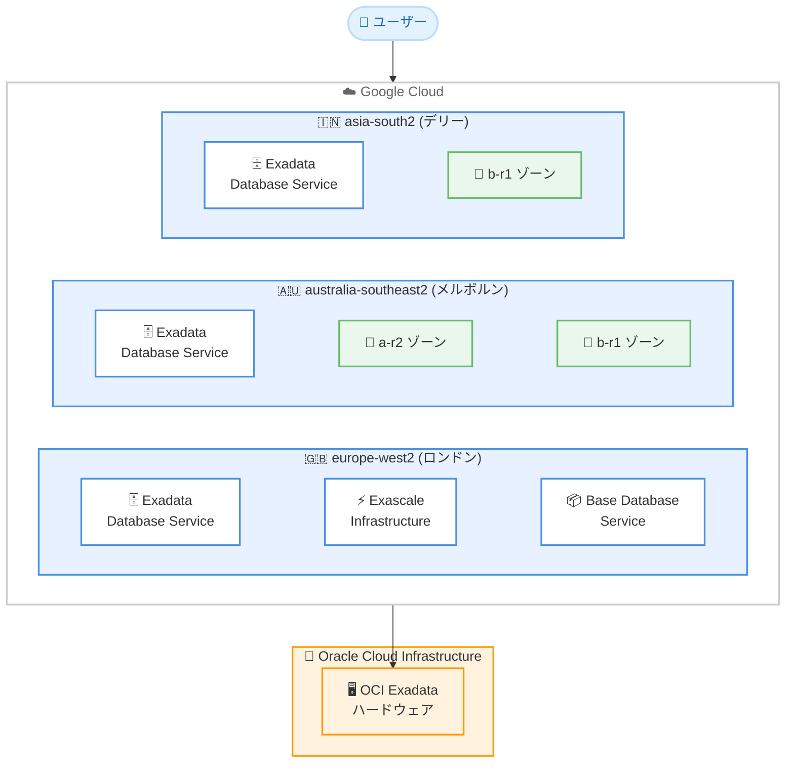

# Oracle Database@Google Cloud: リージョン拡張 (ロンドン、メルボルン、デリー)

**リリース日**: 2026-02-11 / 2026-02-12
**サービス**: Oracle Database@Google Cloud
**機能**: リージョン拡張 (europe-west2、australia-southeast2、asia-south2)
**ステータス**: GA (Generally Available)

## 概要

Oracle Database@Google Cloud は、2026 年 2 月 11 日および 12 日の 2 つのアップデートにより、ヨーロッパ、オーストラリア、インドの複数のリージョンとゾーンにサービス提供範囲を拡大した。Google Cloud と Oracle Cloud Infrastructure (OCI) のパートナーシップにより、Google Cloud データセンター内で OCI Exadata ハードウェア上に Oracle データベースサービスをデプロイできるマルチクラウドソリューションが、さらに多くの地域で利用可能になる。

2 月 12 日のアップデートでは、Exadata Database Service on Exascale Infrastructure と Base Database Service がロンドン (europe-west2-a-r1) ゾーンに対応した。2 月 11 日のアップデートでは、Exadata Database Service がメルボルン (australia-southeast2-a-r2) とデリー (asia-south2-b-r1) の各ゾーンに対応した。

これにより、英国、オーストラリア、インドでデータレジデンシー要件を持つ企業が、Oracle Database@Google Cloud をローカルリージョンで運用できるようになった。特にロンドンリージョンは Low CO2 認定を受けており、サステナビリティを重視する企業にとっても有利な選択肢となる。

**アップデート前の課題**

今回のアップデート以前には、以下の制限が存在していた。

- Exadata Database Service on Exascale Infrastructure と Base Database Service はロンドンリージョンで利用できなかった
- Exadata Database Service はデリー (asia-south2) リージョンで利用できなかった
- メルボルン (australia-southeast2) の Exadata Database Service は 1 つのゾーン (australia-southeast2-b-r1) のみ利用可能だった

**アップデート後の改善**

今回のアップデートにより、以下が可能になった。

- ロンドンリージョンで Exadata Database Service on Exascale Infrastructure と Base Database Service が利用可能になった
- デリー (asia-south2) でも Exadata Database Service が利用可能になり、インド国内で 2 リージョン (ムンバイ、デリー) の選択肢が確保された
- メルボルンリージョンで Exadata Database Service の新しいゾーン (australia-southeast2-a-r2) が追加され、ゾーンの選択肢が増えた

## アーキテクチャ図



Oracle Database@Google Cloud の今回のリージョン拡張により、ロンドン、メルボルン、デリーの 3 地域で新たにサービスが利用可能になった構成を示す。Google Cloud データセンター内で OCI Exadata ハードウェアが稼働し、低レイテンシでのデータベースアクセスを実現する。

## サービスアップデートの詳細

### 主要機能

1. **Exadata Database Service on Exascale Infrastructure - ロンドン対応 (2 月 12 日)**
   - europe-west2-a-r1 ゾーンで Exascale VM Clusters と Exascale Storage Vaults の作成が可能
   - Exascale Infrastructure はコスト効率の高いスケーラブルなストレージオプションを提供

2. **Base Database Service - ロンドン対応 (2 月 12 日)**
   - europe-west2-a-r1 ゾーンで DB Systems の作成が可能
   - Google Cloud コンソールおよび Google Cloud API から DB Systems を管理可能

3. **Exadata Database Service - メルボルン、デリー対応 (2 月 11 日)**
   - australia-southeast2-a-r2 (メルボルン) ゾーンの追加により、既存の b-r1 ゾーンと合わせて 2 ゾーン構成が可能
   - asia-south2-b-r1 (デリー) ゾーンの追加により、インド国内で 2 リージョン (ムンバイ、デリー) での運用が可能

## 技術仕様

### 2 月 12 日: ロンドンリージョン拡張

今回のアップデートでロンドンリージョンに追加されたサービスの詳細は以下の通りである。

| サービス | リージョン | ゾーン | 備考 |
|---------|-----------|--------|------|
| Exadata Database Service on Exascale Infrastructure | europe-west2 (ロンドン) | europe-west2-a-r1 | Low CO2 認定 |
| Base Database Service | europe-west2 (ロンドン) | europe-west2-a-r1 | Low CO2 認定 |

### 2 月 11 日: メルボルン、デリーリージョン拡張

| サービス | リージョン | ゾーン | 備考 |
|---------|-----------|--------|------|
| Exadata Database Service | australia-southeast2 (メルボルン) | australia-southeast2-a-r2 | 2 つ目のゾーン |
| Exadata Database Service | asia-south2 (デリー) | asia-south2-b-r1 | インド 2 リージョン目 |

### リソースの種別

Oracle Database@Google Cloud のリソースは、リージョナルリソースとゾーナルリソースに分類される。

| リソース種別 | リソース名 | スコープ |
|-------------|-----------|---------|
| リージョナル | Autonomous Database | リージョン内の任意のゾーンで利用可能 |
| ゾーナル | Exadata Infrastructure | 特定のゾーンにプロビジョニング |
| ゾーナル | Exadata VM Clusters | 特定のゾーンにプロビジョニング |
| ゾーナル | Exascale VM Clusters / Storage Vaults | 特定のゾーンにプロビジョニング |
| ゾーナル | ODB Networks / ODB Subnets | 特定のゾーンにプロビジョニング |
| ゾーナル | DB Systems (Base Database Service) | 特定のゾーンにプロビジョニング |

### ネットワーク構成

Oracle Database@Google Cloud では、ODB Network を使用してリソースの接続を管理する。ODB Network は Google Cloud VPC ネットワークと OCI 子サイトのリソース間の接続を提供する。

```bash
# ODB Network の作成例 (gcloud CLI)
gcloud oracle-database odb-networks create my-odb-network \
  --project=my-project \
  --location=europe-west2 \
  --network=projects/my-project/global/networks/my-vpc
```

## 設定方法

### 前提条件

1. Google Cloud Marketplace で Oracle Database@Google Cloud のオーダーが完了していること
2. Oracle のオンボーディングタスクが完了していること
3. VPC ネットワークが構成済みであること
4. gcloud CLI バージョン 532.0.0 以上がインストールされていること
5. 適切な IAM ロールが付与されていること

### 手順

#### ステップ 1: IAM ロールの設定

デプロイメントタイプに応じて、以下の IAM ロールを付与する。

| ユーザーロール | 必要な IAM ロール |
|--------------|-----------------|
| ネットワーク管理者 | `roles/oracledatabase.odbNetworkAdmin`、`roles/oracledatabase.odbSubnetAdmin` |
| Exadata Infrastructure 管理者 | `roles/oracledatabase.odbSubnetUser`、`roles/oracledatabase.cloudExadataInfrastructureAdmin`、`roles/oracledatabase.cloudVmClusterAdmin` |
| Exascale Infrastructure 管理者 | `roles/oracledatabase.odbSubnetUser`、`roles/oracledatabase.exadbVmClusterAdmin`、`roles/oracledatabase.exascaleDbStorageVaultAdmin` |
| DB System 管理者 | `roles/oracledatabase.odbSubnetUser`、`roles/oracledatabase.dbSystemAdmin` |

#### ステップ 2: ODB Network の作成

```bash
# ロンドンリージョンに ODB Network を作成
gcloud oracle-database odb-networks create london-odb-network \
  --project=my-project \
  --location=europe-west2 \
  --network=projects/my-project/global/networks/my-vpc
```

ODB Network はリージョン内にプロビジョニングされ、作成後にリージョンやゾーンを変更することはできない。

#### ステップ 3: リソースのプロビジョニング

ODB Network の作成後、Google Cloud コンソールまたは gcloud CLI を使用して Exadata Infrastructure、VM Cluster、DB System などのリソースをプロビジョニングする。

## メリット

### ビジネス面

- **データレジデンシー対応**: 英国、オーストラリア、インドのデータ主権要件を満たすことが可能になり、規制の厳しい業界 (金融、医療、政府機関) での採用が容易になる
- **レイテンシの低減**: ロンドン、メルボルン、デリーのユーザーに近い場所でデータベースを運用することで、アプリケーションのレスポンス時間を改善できる
- **統合請求**: Google Cloud の利用料と OCI Oracle Database サービスの利用料が統合された請求書で管理できる

### 技術面

- **マルチゾーン構成**: メルボルンでは 2 ゾーン (a-r2、b-r1) 構成が可能になり、可用性の向上に寄与する
- **Exascale Infrastructure の欧州展開**: ロンドンリージョンで Exascale Infrastructure が利用可能になり、コスト効率の高いスケーラブルなデータベース環境を欧州で構築できる
- **Low CO2 リージョン**: ロンドン (europe-west2) は Low CO2 認定リージョンであり、サステナビリティ目標の達成に貢献する

## デメリット・制約事項

### 制限事項

- ODB Network はリージョン単位でプロビジョニングされ、グローバルではない。リージョンをまたいだ ODB Network の共有はできない
- ODB Network 内に作成可能な ODB Subnet は最大 5 つまでに制限されている
- Exadata Database はプロビジョニング後に Oracle Cloud Infrastructure (OCI) で作成する必要がある
- 今回のアップデートは特定のサービスタイプのみが対象であり、すべてのサービスがすべてのリージョンに追加されたわけではない

### 考慮すべき点

- ODB Network とゾーナルリソース (Exadata Infrastructure、VM Cluster、DB System) は同一リージョン・同一ゾーンに作成する必要がある
- ゾーンの選択は永続的であり、後から変更できない
- Oracle ライセンスの調達が別途必要 (BYOL または Google Cloud Marketplace での購入)

## ユースケース

### ユースケース 1: 英国金融機関のデータレジデンシー対応

**シナリオ**: 英国の金融機関が、データレジデンシー規制により英国内でのデータ保管を必須としている。Oracle Database を使用したコアバンキングシステムをクラウドに移行したい。

**効果**: ロンドンリージョン (europe-west2) で Exadata Database Service on Exascale Infrastructure と Base Database Service が利用可能になったことで、英国内のデータセンターで Oracle Database を Google Cloud と統合して運用でき、データレジデンシー要件を満たしながらクラウドの利点を活用できる。Low CO2 認定リージョンであるため、ESG レポートにも貢献する。

### ユースケース 2: インド国内のディザスタリカバリ構成

**シナリオ**: インドの企業が、ムンバイ (asia-south1) をプライマリリージョン、デリー (asia-south2) をディザスタリカバリ (DR) サイトとして Oracle Database を運用したい。

**効果**: デリーリージョンで Exadata Database Service が利用可能になったことで、インド国内の 2 つのリージョンを使用した DR 構成が可能になった。データがインド国内に留まるため、インドのデータローカライゼーション要件にも対応できる。

## 料金

Oracle Database@Google Cloud の料金は、Oracle の公式料金ページで公開されている。Exadata VM Cluster 作成時には BYOL (Bring Your Own License) または Google Cloud Marketplace で購入したライセンスを選択できる。同一リージョン内のアプリケーションと Oracle Exadata データベース間のデータ転送のネットワーク料金は、Oracle Database@Google Cloud の価格に含まれている。

詳細な料金情報は以下を参照。

- [Oracle Database@Google Cloud Pricing (Oracle 公式)](https://www.oracle.com/cloud/google/oracle-database-at-google-cloud/pricing/)
- [Google Cloud Marketplace - Oracle Database@Google Cloud](https://console.cloud.google.com/marketplace/product/oracle/oracle-database-at-google-cloud)

## 利用可能リージョン

2026 年 2 月 12 日時点での Oracle Database@Google Cloud の全サービス対応リージョン一覧は以下の通りである。

### Exadata Database Service

| 地域 | リージョン | 説明 |
|------|-----------|------|
| アジア太平洋 | asia-northeast1 | 東京 |
| アジア太平洋 | asia-northeast2 | 大阪 |
| アジア太平洋 | australia-southeast1 | シドニー |
| アジア太平洋 | australia-southeast2 | メルボルン |
| アジア太平洋 | asia-south1 | ムンバイ |
| アジア太平洋 | asia-south2 | デリー |
| 北米 | northamerica-northeast1 | モントリオール |
| 北米 | northamerica-northeast2 | トロント |
| 北米 | us-central1 | アイオワ |
| 北米 | us-east4 | バージニア北部 |
| 北米 | us-west3 | ソルトレイクシティ |
| 南米 | southamerica-east1 | サンパウロ |
| 欧州 | europe-west2 | ロンドン |
| 欧州 | europe-west3 | フランクフルト |

### Exadata Database Service on Exascale Infrastructure

| 地域 | リージョン | 説明 |
|------|-----------|------|
| アジア太平洋 | asia-northeast1 | 東京 |
| 北米 | northamerica-northeast1 | モントリオール |
| 北米 | us-central1 | アイオワ |
| 北米 | us-east4 | バージニア北部 |
| 北米 | us-west3 | ソルトレイクシティ |
| 欧州 | europe-west2 | ロンドン |
| 欧州 | europe-west3 | フランクフルト |

### Base Database Service

| 地域 | リージョン | 説明 |
|------|-----------|------|
| アジア太平洋 | asia-northeast1 | 東京 |
| 北米 | northamerica-northeast1 | モントリオール |
| 北米 | us-central1 | アイオワ |
| 北米 | us-east4 | バージニア北部 |
| 北米 | us-west3 | ソルトレイクシティ |
| 欧州 | europe-west2 | ロンドン |
| 欧州 | europe-west3 | フランクフルト |

## 関連サービス・機能

- **Exadata Database Service on Exascale Infrastructure**: 2025 年 9 月に GA となった Exascale Infrastructure 上でのデータベースサービス。コスト効率の高いスケーラブルなストレージを提供する
- **Oracle Base Database Service**: 2025 年 9 月に GA となった DB Systems の作成・管理機能。Google Cloud コンソールおよび API から操作可能
- **ODB Networks / ODB Subnets**: Oracle Database@Google Cloud リソースと Google Cloud VPC ネットワーク間の接続を提供するネットワーキング機能
- **Cloud Key Management Service (CMEK)**: Oracle Database@Google Cloud リソースのカスタマー管理暗号鍵。2025 年 10 月に GA
- **Autonomous Data Guard**: クロスリージョンのディザスタリカバリ機能。2025 年 3 月に GA
- **Cloud Monitoring / Cloud Logging**: Oracle Database@Google Cloud リソースのモニタリングとログ管理

## 参考リンク

- [公式リリースノート - Oracle Database@Google Cloud](https://cloud.google.com/oracle/database/docs/release-notes)
- [Oracle Database@Google Cloud 概要](https://cloud.google.com/oracle/database/docs/overview)
- [サポート対象リージョンとゾーン](https://cloud.google.com/oracle/database/docs/regions-and-zones)
- [Oracle Database@Google Cloud 環境のセットアップ](https://cloud.google.com/oracle/database/docs/setup-oracle-database-environment)
- [ODB Network と ODB Subnet の作成](https://cloud.google.com/oracle/database/docs/create-odb-network)
- [Oracle Database@Google Cloud 料金 (Oracle 公式)](https://www.oracle.com/cloud/google/oracle-database-at-google-cloud/pricing/)
- [Google Cloud Marketplace - Oracle Database@Google Cloud](https://console.cloud.google.com/marketplace/product/oracle/oracle-database-at-google-cloud)

## まとめ

Oracle Database@Google Cloud のリージョン拡張により、ロンドンで Exadata Database Service on Exascale Infrastructure と Base Database Service が利用可能になり、メルボルンとデリーで Exadata Database Service の新ゾーンが追加された。これにより、英国、オーストラリア、インドでのデータレジデンシー対応、レイテンシ最適化、ディザスタリカバリ構成の選択肢が広がった。Oracle Database を Google Cloud 上で運用している、または移行を検討している企業は、新しいリージョンの利用可否を確認し、データレジデンシーや可用性の要件に基づいてデプロイメント計画を見直すことを推奨する。

---

**タグ**: Oracle Database@Google Cloud, Exadata Database Service, Exascale Infrastructure, Base Database Service, リージョン拡張, ロンドン, メルボルン, デリー, マルチクラウド, データレジデンシー
