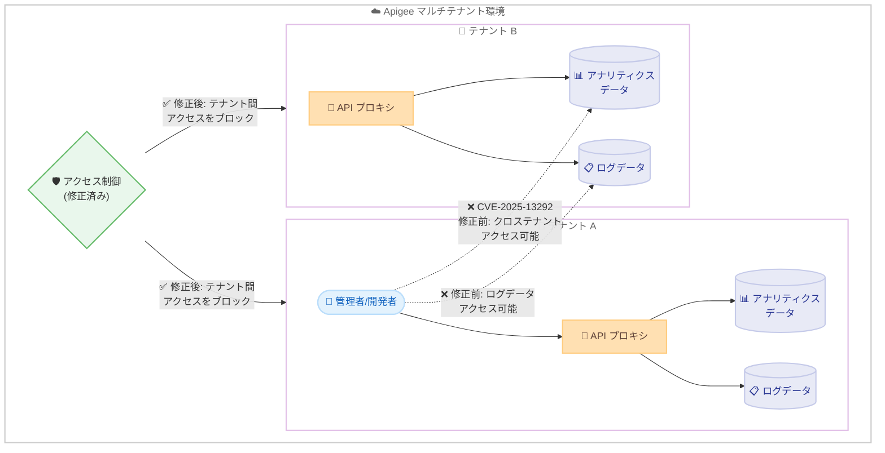

# Apigee X: セキュリティ脆弱性 CVE-2025-13292 および複数の CVE 修正

**リリース日**: 2026-02-13 (追加修正: 2026-02-10)
**サービス**: Apigee X
**機能**: セキュリティ脆弱性修正 (GCP-2026-010) およびインフラストラクチャセキュリティ更新
**ステータス**: Security Bulletin (GCP-2026-010)

[このアップデートのインフォグラフィックを見る](infographic/20260213-apigee-x-security-bulletin-gcp-2026-010.html)

## 概要

2026 年 2 月 13 日、Google Cloud は Apigee プラットフォームにおけるセキュリティ脆弱性 CVE-2025-13292 に関するセキュリティ速報 GCP-2026-010 を公開した。この脆弱性は、自身の Apigee 環境内で管理者または開発者レベルの権限を持つ悪意ある攻撃者が、権限昇格を行いクロステナントデータにアクセスできる可能性があるものである。

また、2026 年 2 月 10 日には Apigee の更新バージョン 1-17-0-apigee-2 がリリースされ、CVE-2025-61730、CVE-2025-68156、CVE-2025-54388、CVE-2025-61727、CVE-2025-61729 の 5 件のインフラストラクチャセキュリティ脆弱性が修正された。加えて、503 レスポンスの急増を引き起こす可能性のあるメモリリークも修正されている。

本アップデートは、Apigee X を利用するすべての組織に影響するセキュリティ上の重要な修正であり、API 管理プラットフォームのセキュリティ体制を強化するものである。特に CVE-2025-13292 はマルチテナント環境におけるアクセス制御の不備に起因する問題であり、速やかな対応が推奨される。

**アップデート前の課題**

今回のセキュリティ修正が適用される前には、以下の課題が存在していた。

- 不適切なアクセス制御により、管理者または開発者レベルの権限を持つユーザーがクロステナントのアナリティクスデータを変更し、ログデータにアクセスできる脆弱性が存在していた (CVE-2025-13292)
- Apigee インフラストラクチャに複数のセキュリティ脆弱性 (CVE-2025-61730、CVE-2025-68156、CVE-2025-54388、CVE-2025-61727、CVE-2025-61729) が存在していた
- メモリリークにより 503 レスポンス (no_healthy_upstream) が急増する可能性があった
- プロキシ呼び出しが "The URI contains illegal characters" エラーで失敗するケースがあった

**アップデート後の改善**

今回のアップデートにより、以下の改善が実現した。

- CVE-2025-13292 の修正によりクロステナントデータアクセスの脆弱性が解消され、テナント間のデータ分離が強化された
- 5 件のインフラストラクチャ CVE が修正され、Apigee 基盤のセキュリティが向上した
- メモリリークの修正により、503 レスポンスの急増が防止され、サービスの安定性が向上した
- URI 解析の不具合が修正され、プロキシ呼び出しの信頼性が向上した

## アーキテクチャ図



この図は CVE-2025-13292 の脆弱性のコンテキストを示している。修正前は、テナント A の管理者/開発者レベルのユーザーがアクセス制御の不備を利用して、テナント B のアナリティクスデータやログデータにアクセスできる可能性があった。修正後は、テナント間のアクセス制御が適切に強化され、クロステナントアクセスがブロックされる。

## サービスアップデートの詳細

### 主要機能

1. **セキュリティ速報 GCP-2026-010 (2026-02-13)**
   - CVE-2025-13292 に関するセキュリティ速報が公開された
   - Apigee プラットフォームにおける不適切なアクセス制御の脆弱性に対処
   - 管理者または開発者レベルの権限を持つ悪意あるアクターが、権限昇格を行いクロステナントデータにアクセスできる問題を修正
   - 具体的には、クロステナントのアナリティクスデータの変更およびログデータへのアクセスが可能となる不具合が修正された

2. **Apigee バージョン 1-17-0-apigee-2 (2026-02-10)**
   - 5 件のインフラストラクチャセキュリティ脆弱性を修正
   - CVE-2025-61730、CVE-2025-68156、CVE-2025-54388、CVE-2025-61727、CVE-2025-61729 に対処
   - ロールアウトは 2 月 10 日に開始され、すべての Google Cloud ゾーンへの展開には 4 営業日以上かかる可能性がある

3. **メモリリーク修正 (Bug ID: 470375542)**
   - 503 レスポンス (no_healthy_upstream メッセージ) の急増を引き起こすメモリリークを修正
   - API トラフィックの安定性と信頼性が向上

4. **URI 解析エラー修正 (Bug ID: 480997525)**
   - プロキシ呼び出しが "The URI contains illegal characters" エラーで失敗する問題を修正

## 技術仕様

### CVE 一覧

以下の表は、今回のアップデートで対処された CVE の一覧をまとめたものである。

| CVE 番号 | 対処日 | 影響範囲 | 説明 |
|----------|--------|----------|------|
| CVE-2025-13292 | 2026-02-13 (速報公開) | Apigee プラットフォーム全体 | 不適切なアクセス制御によるクロステナントアナリティクス変更およびログデータアクセス |
| CVE-2025-61730 | 2026-02-10 | Apigee インフラストラクチャ | インフラストラクチャセキュリティ修正 |
| CVE-2025-68156 | 2026-02-10 | Apigee インフラストラクチャ | インフラストラクチャセキュリティ修正 |
| CVE-2025-54388 | 2026-02-10 | Apigee インフラストラクチャ | インフラストラクチャセキュリティ修正 |
| CVE-2025-61727 | 2026-02-10 | Apigee インフラストラクチャ | インフラストラクチャセキュリティ修正 |
| CVE-2025-61729 | 2026-02-10 | Apigee インフラストラクチャ | インフラストラクチャセキュリティ修正 |

### バグ修正一覧

以下の表は、セキュリティ修正以外のバグ修正をまとめたものである。

| Bug ID | 説明 |
|--------|------|
| 470375542 | メモリリークにより 503 レスポンス (no_healthy_upstream) が急増する問題を修正 |
| 480997525 | プロキシ呼び出しが "The URI contains illegal characters" エラーで失敗する問題を修正 |

### CVE-2025-13292 の過去の修正履歴

CVE-2025-13292 は以前のリリースでも段階的に修正が行われていた。MCP ドキュメント検索により確認された修正履歴は以下の通りである。

| リリース | バージョン | 修正内容 |
|----------|-----------|----------|
| 2025-10-16 | 1-16-0-apigee-3 | CVE-2025-13292 の初回修正 (Bug ID: 443902061) |
| 2025-10-31 | 1-16-0-apigee-4 | 同修正の追加適用 |
| 2026-02-13 | GCP-2026-010 | セキュリティ速報として公式公開 |

### Apigee ロールと権限

CVE-2025-13292 の悪用には管理者または開発者レベルの権限が必要である。Apigee の主要なビルトインロールは以下の通りである。

| ロール | 権限レベル |
|--------|-----------|
| Organization Administrator | すべてのリソースへの完全な CRUD アクセス |
| Read-only Organization Administrator | すべてのリソースへの読み取り専用アクセス |
| Operations Administrator | API のデプロイとテスト、その他のリソースへの読み取り専用アクセス |
| Business User | API プロダクト、開発者、アプリの管理、カスタムレポートの作成 |
| User | API プロキシの作成とテスト環境でのテスト |

## 設定方法

### 前提条件

1. Apigee X 組織が Google Cloud プロジェクトでプロビジョニングされていること
2. Google Cloud Console へのアクセス権を有していること

### 手順

#### ステップ 1: 現在のバージョンを確認

Apigee のリリースロールアウトは自動的に適用される。現在のバージョンを Google Cloud Console の Apigee セクションで確認する。

```
Google Cloud Console > Apigee > 概要
```

バージョン 1-17-0-apigee-2 以降であれば、2 月 10 日の修正が適用されている。

#### ステップ 2: ロールアウトの状況を確認

ロールアウトは 2026 年 2 月 10 日に開始され、すべての Google Cloud ゾーンへの展開には 4 営業日以上かかる可能性がある。インスタンスにまだ修正が適用されていない場合は、ロールアウトの完了を待つ。

#### ステップ 3: アクセス権限の監査

CVE-2025-13292 は管理者または開発者レベルの権限が必要な脆弱性であるため、組織内のユーザーロール割り当てを監査し、信頼できるユーザーのみが管理者権限を保持していることを確認する。

```bash
# Apigee 組織のロール割り当てを確認 (gcloud CLI)
gcloud apigee organizations describe ORG_NAME
```

## メリット

### ビジネス面

- **データ保護の強化**: クロステナントデータアクセスの脆弱性が解消され、顧客データの分離が確実になった
- **サービス安定性の向上**: メモリリーク修正により 503 エラーの急増が防止され、API サービスの可用性が向上した
- **コンプライアンス対応**: セキュリティ脆弱性への迅速な対応により、規制要件への準拠が維持される

### 技術面

- **マルチテナントセキュリティの強化**: テナント間のアクセス制御が適切に実装され、アナリティクスデータとログデータの分離が保証された
- **インフラストラクチャセキュリティの向上**: 5 件の CVE 修正により、Apigee 基盤の攻撃対象面が縮小された
- **メモリ管理の改善**: メモリリークの修正により、長時間稼働時の安定性が向上した

## デメリット・制約事項

### 制限事項

- ロールアウトはすべての Google Cloud ゾーンへの展開に 4 営業日以上かかる場合がある
- ロールアウトが完了するまで、一部のインスタンスには修正が適用されない可能性がある

### 考慮すべき点

- CVE-2025-13292 は管理者または開発者レベルの権限を持つ内部ユーザーによる悪用が前提であるため、外部からの直接的な攻撃ベクトルではない
- セキュリティ速報 GCP-2026-010 の公開に伴い、脆弱性の詳細が公知となったため、未修正のインスタンスは速やかにロールアウトを完了させることが重要である
- Apigee Hybrid を利用している場合は、別途 Hybrid リリースノートを確認し、対応するパッチを適用する必要がある

## ユースケース

### ユースケース 1: マルチテナント SaaS プロバイダーのセキュリティ強化

**シナリオ**: 複数の顧客企業に API 管理プラットフォームを提供する SaaS プロバイダーが、テナント間のデータ分離を確実にする必要がある。

**効果**: CVE-2025-13292 の修正により、あるテナントの管理者が別のテナントのアナリティクスデータやログデータにアクセスするリスクが排除され、顧客間のデータ分離が保証される。SaaS プロバイダーは顧客に対して、プラットフォームのセキュリティが適切に維持されていることを説明できる。

### ユースケース 2: 高トラフィック API の安定性確保

**シナリオ**: 大量の API トラフィックを処理する企業が、メモリリークに起因する 503 エラーの急増により、サービスの可用性が低下している。

**効果**: Bug ID 470375542 のメモリリーク修正により、no_healthy_upstream メッセージを伴う 503 レスポンスの急増が防止される。これにより、長時間稼働時の API ゲートウェイの安定性が向上し、エンドユーザーへのサービス品質が維持される。

## 料金

Apigee X のセキュリティアップデートは追加費用なしで適用される。Apigee X の料金体系の詳細は以下のページを参照。

- [Apigee Pay-as-you-go 料金](https://cloud.google.com/apigee/docs/api-platform/reference/pay-as-you-go-updated-overview)

### 料金例

以下は Apigee Pay-as-you-go の代表的な料金である (公式ドキュメントより)。

| 項目 | 料金 |
|------|------|
| Standard API Proxy 呼び出し (100 万回あたり、最大 5,000 万回) | $20 |
| Extensible API Proxy 呼び出し (100 万回あたり、最大 5,000 万回) | $100 |
| Base 環境使用量 (1 時間あたり、1 リージョン) | $0.5 |
| Intermediate 環境使用量 (1 時間あたり、1 リージョン) | $2.0 |
| Comprehensive 環境使用量 (1 時間あたり、1 リージョン) | $4.7 |

## 利用可能リージョン

Apigee X はグローバルに利用可能であり、ロールアウトはすべての Google Cloud ゾーンに順次適用される。具体的なリージョン対応状況は [Apigee ロケーション](https://cloud.google.com/apigee/docs/api-platform/get-started/install-cli#supported-regions) を参照。

## 関連サービス・機能

- **Apigee Hybrid**: Apigee のハイブリッドデプロイメントモデル。CVE-2025-13292 は Hybrid リリースでも修正されている (Bug ID: 443902061)。Hybrid ユーザーは対応するパッチバージョンへのアップグレードが必要
- **Apigee Edge for Private Cloud**: プライベートクラウド版の Apigee。CVE-2025-13292 はバージョン 4.52.02.03 および 4.53.00.04 で修正されている
- **Cloud Monitoring**: Apigee のメトリクスを監視するサービス。503 レスポンスの急増を検知するアラートの設定に利用可能
- **Cloud Logging**: Apigee のログを収集・分析するサービス。セキュリティインシデントの調査に活用できる
- **Google Cloud Security Command Center**: Google Cloud 全体のセキュリティ状態を一元管理するサービス。Apigee のセキュリティ速報と連携して脅威を管理できる

## 参考リンク

- [インフォグラフィック](infographic/20260213-apigee-x-security-bulletin-gcp-2026-010.html)
- [公式リリースノート (Apigee X)](https://cloud.google.com/apigee/docs/release-notes#February_10_2026)
- [Apigee セキュリティ速報](https://cloud.google.com/apigee/docs/security-bulletins/security-bulletins)
- [Google Cloud セキュリティ速報 (GCP-2026-010)](https://cloud.google.com/support/bulletins)
- [CVE-2025-13292 (NVD)](https://nvd.nist.gov/vuln/detail/CVE-2025-13292)
- [Apigee X ドキュメント](https://cloud.google.com/apigee/docs)
- [Apigee Pay-as-you-go 料金](https://cloud.google.com/apigee/docs/api-platform/reference/pay-as-you-go-updated-overview)
- [Apigee セキュリティのベストプラクティス](https://cloud.google.com/architecture/best-practices-securing-applications-and-apis-using-apigee)

## まとめ

今回のアップデートは、Apigee X プラットフォームにおけるクロステナントデータアクセスの脆弱性 (CVE-2025-13292) および 5 件のインフラストラクチャ CVE を修正する重要なセキュリティ更新である。特にマルチテナント環境を運用する組織にとっては、テナント間のデータ分離を確実にする上で不可欠な修正であり、ロールアウトの完了を確認し、組織内のユーザーロール割り当てを監査することが推奨される。また、メモリリーク修正による 503 エラーの防止は、サービスの安定性向上にも寄与する。

---

**タグ**: Apigee, Security, Infrastructure, CVE-2025-13292, GCP-2026-010, Multi-tenant, Access Control
