# Bigtable: Flink Bigtable Connector v0.3.2 GA

**リリース日**: 2026-02-13
**サービス**: Cloud Bigtable
**機能**: Flink Bigtable Connector v0.3.2
**ステータス**: GA (Generally Available)

[このアップデートのインフォグラフィックを見る](https://takech9203.github.io/google-cloud-news-summary/20260213-bigtable-flink-connector-v0-3-2.html)

## 概要

Google Cloud は、Flink Bigtable Connector のバージョン 0.3.2 を GA (Generally Available) としてリリースしました。このコネクタを使用することで、Apache Flink バージョン 2.1.0 から Bigtable へのデータストリーミングとバッチ書き込みが可能になります。

v0.3.2 の主要な新機能として、Bigtable に送信する各バッチに含めるミューテーション数を指定できるようになりました。これにより、書き込みパフォーマンスのチューニングがより柔軟に行えるようになります。Flink のリアルタイムストリーム処理能力と Bigtable の大規模データ管理能力を組み合わせることで、IoT データの取り込み、リアルタイム分析、イベントドリブンアーキテクチャなどのユースケースに対応できます。

対象ユーザーは、Apache Flink を使用したストリーム処理パイプラインを構築しており、データシンクとして Bigtable を利用したいデータエンジニアやプラットフォームエンジニアです。

**アップデート前の課題**

このアップデート以前に存在していた課題は以下の通りです。

- Flink Bigtable Connector は Preview 段階であり、本番環境での利用には SLA の保証がなかった
- バッチに含めるミューテーション数を制御する機能がなく、書き込みパフォーマンスの細かなチューニングが困難だった
- Apache Flink の旧バージョンとの互換性に限定されていた

**アップデート後の改善**

今回のアップデートにより可能になったことは以下の通りです。

- GA リリースにより、本番環境での利用に対する SLA が保証されるようになった
- バッチあたりのミューテーション数を明示的に指定できるようになり、ワークロードに応じた書き込みパフォーマンスの最適化が可能になった
- Apache Flink 2.1.0 との互換性が確保された

## アーキテクチャ図

```mermaid
flowchart LR
    subgraph Sources["📥 データソース"]
        direction LR
        Kafka(["📨 Apache Kafka"])
        File[("🗄️ ファイルシステム")]
        Stream(["📡 ストリームソース"])
        Kafka ~~~ File ~~~ Stream
    end

    subgraph Flink["⚡ Apache Flink 2.1.0"]
        direction TB
        Pipeline["⚙️ Flink パイプライン"]
        Serializer["🔄 シリアライザ<br/>(AVRO / RowData / カスタム)"]
        Batch["📦 バッチミューテーション<br/>(バッチサイズ指定可能)"]
        Pipeline --> Serializer --> Batch
    end

    subgraph GCP["☁️ Google Cloud"]
        BT[("🗄️ Cloud Bigtable")]
    end

    Sources --> Pipeline
    Batch -->|"ミューテーション書き込み"| BT

    classDef cloud fill:none,stroke:#CCCCCC,stroke-width:2px,color:#666666
    classDef source fill:#E9F7EC,stroke:#66BB6A,stroke-width:2px,color:#333333
    classDef flink fill:#FFF3E0,stroke:#FF9800,stroke-width:2px,color:#333333
    classDef process fill:#FFFFFF,stroke:#4A90E2,stroke-width:2px,color:#333333
    classDef storage fill:#E8EAF6,stroke:#C5CAE9,stroke-width:2px,color:#283593

    class Sources,GCP cloud
    class Kafka,Stream source
    class File storage
    class Flink flink
    class Pipeline,Serializer,Batch process
    class BT storage
```



Apache Flink パイプラインがデータソースからデータを取得し、シリアライザでミューテーションエントリに変換した後、指定されたバッチサイズで Bigtable に書き込むデータフローを示しています。

## サービスアップデートの詳細

### 主要機能

1. **Apache Flink 2.1.0 対応**
   - Flink Bigtable Connector v0.3.2 は Apache Flink バージョン 2.1.0 と互換性がある
   - Flink Table API と Datastream API の両方を使用してパイプラインを構築可能

2. **バッチミューテーション数の指定**
   - Bigtable に送信する各バッチに含めるミューテーションの数を指定可能
   - ワークロードの特性に合わせた書き込みパフォーマンスの最適化が可能

3. **3 種類の組み込みシリアライザ**
   - `GenericRecordToRowMutationSerializer`: AVRO `GenericRecord` オブジェクト用
   - `RowDataToRowMutationSerializer`: Flink `RowData` オブジェクト用
   - `FunctionRowMutationSerializer`: カスタムシリアライゼーションロジック用
   - `BaseRowMutationSerializer` を継承したカスタムシリアライザの作成も可能

4. **2 つのシリアライゼーションモード**
   - **Column family モード**: すべてのデータを単一のカラムファミリに書き込む (ネストフィールド非対応)
   - **Nested-rows モード**: トップレベルフィールドがカラムファミリを表現し、複数のカラムファミリへの書き込みに対応

5. **Exactly-once 処理セマンティクス**
   - Bigtable の `mutateRow` ミューテーションはデフォルトで冪等性を持つ
   - サーバーサイドタイムスタンプ (`-1`) を使用しない限り、自動的に exactly-once セマンティクスを実現

## 技術仕様

### コネクタ仕様

| 項目 | 詳細 |
|------|------|
| コネクタバージョン | v0.3.2 |
| 対応 Flink バージョン | Apache Flink 2.1.0 |
| ステータス | GA (Generally Available) |
| 対応 API | Flink Table API、Datastream API |
| シリアライゼーションモード | Column family モード、Nested-rows モード |
| Exactly-once セマンティクス | 対応 (条件あり) |
| ソースコード | [GitHub リポジトリ](https://github.com/google/flink-connector-gcp/blob/main/connectors/bigtable/README.md) |

### 前提条件

コネクタを使用するにあたり、以下の前提条件があります。

- 既存の Bigtable テーブルがデータシンクとして必要
- テーブルのカラムファミリはパイプライン開始前に作成しておく必要がある (書き込み時にカラムファミリの作成は不可)
- Apache Flink の基本知識、Bigtable のストレージモデル、および Bigtable の書き込み操作に関する理解が必要

## 設定方法

### 前提条件

1. Google Cloud プロジェクトで Bigtable API が有効化されていること
2. Bigtable インスタンスおよびテーブルが作成済みであること
3. テーブルのカラムファミリが事前に定義されていること
4. Apache Flink 2.1.0 環境がセットアップ済みであること

### 手順

#### ステップ 1: コネクタのインストール

GitHub リポジトリからコネクタを取得します。

```bash
# Maven 依存関係として追加 (詳細はリポジトリの README を参照)
# https://github.com/google/flink-connector-gcp/blob/main/connectors/bigtable/README.md
```

詳細なインストール手順は [Flink Bigtable Connector リポジトリ](https://github.com/google/flink-connector-gcp/blob/main/connectors/bigtable/README.md) を参照してください。

#### ステップ 2: Bigtable テーブルの準備

```bash
# gcloud CLI でテーブルを作成する例
gcloud bigtable instances tables create my-table \
  --instance=my-instance \
  --column-families="cf1,cf2"
```

パイプライン開始前にテーブルとカラムファミリが存在する必要があります。

#### ステップ 3: パイプラインの構築

コネクタのコード例は [flink-examples-gcp-bigtable](https://github.com/google/flink-connector-gcp/tree/main/connectors/bigtable/flink-examples-gcp-bigtable) ディレクトリを参照してください。コネクタのコンフィギュレーションオプションの詳細は [GitHub 上のドキュメント](https://github.com/google/flink-connector-gcp/blob/main/connectors/bigtable/README.md#connector-options) に記載されています。

## メリット

### ビジネス面

- **本番環境での信頼性**: GA リリースにより SLA が保証され、ミッションクリティカルなストリーム処理パイプラインでの利用が可能になった
- **運用コストの最適化**: バッチサイズの調整により、書き込み効率を最適化し、不要なリソース消費を抑制可能

### 技術面

- **書き込みパフォーマンスの制御**: バッチあたりのミューテーション数を指定することで、ワークロード特性に合わせたパフォーマンスチューニングが可能
- **Exactly-once セマンティクス**: Bigtable の冪等性を活用し、データの重複処理や損失を防止
- **柔軟なシリアライゼーション**: 3 種類の組み込みシリアライザとカスタムシリアライザにより、多様なデータ形式に対応

## デメリット・制約事項

### 制限事項

- コネクタはデータシンク (書き込み) としてのみ動作し、Bigtable からの読み取り (ソース) 機能は提供されていない
- カラムファミリはパイプライン開始前に作成する必要があり、書き込み時に動的に作成することはできない
- Nested-rows モードでは二重ネストはサポートされていない
- Column family モードではネストフィールドがサポートされていない

### 考慮すべき点

- Exactly-once セマンティクスを確保するには、サーバーサイドタイムスタンプ (`-1`) をリトライ時に使用しないことが必要
- パイプライン全体が exactly-once 要件を満たしている必要がある
- バッチミューテーション数の最適値はワークロードによって異なるため、テスト環境での検証を推奨

## ユースケース

### ユースケース 1: IoT データのリアルタイム取り込み

**シナリオ**: 大量の IoT センサーデータを Apache Kafka から受信し、リアルタイムで Bigtable に書き込む。Flink パイプラインでデータのフィルタリングや変換を行いながら、バッチミューテーション数を調整して最適な書き込みスループットを実現する。

**効果**: リアルタイムのデータ取り込みにより、IoT デバイスの状態監視やアラート生成の遅延を最小化できる。バッチサイズの調整により、高スループットと低レイテンシのバランスを最適化可能。

### ユースケース 2: イベントドリブンアーキテクチャのデータパイプライン

**シナリオ**: ユーザーの行動イベントをストリーミング処理し、Bigtable にリアルタイムで集約データを書き込む。Flink の Window 関数を使用してイベントを集約し、Nested-rows モードで複数のカラムファミリに書き込む。

**効果**: リアルタイムの行動分析データが Bigtable に即座に反映され、レコメンデーションエンジンや不正検知システムが最新のデータに基づいて動作できる。

## 料金

Flink Bigtable Connector 自体はオープンソースソフトウェアであり、コネクタの使用に追加料金は発生しません。ただし、Bigtable の使用に対しては通常の料金が適用されます。

Bigtable の料金体系の概要は以下の通りです。

- **ノード料金**: ノードあたりの時間単位で課金 (リージョンにより異なる)
- **ストレージ料金**: SSD または HDD の使用量に応じて課金
- **ネットワーク料金**: データ転送量に応じて課金

確約利用割引 (CUD) も利用可能で、1 年契約で 20% 割引、3 年契約で 40% 割引が適用されます。

詳細な料金情報は [Bigtable 料金ページ](https://cloud.google.com/bigtable/pricing) を参照してください。

## 利用可能リージョン

Flink Bigtable Connector は Bigtable が利用可能なすべてのリージョンで使用できます。Bigtable はグローバルに展開されており、以下の主要リージョンを含む多数のロケーションで利用可能です。

- **アジア太平洋**: 東京 (asia-northeast1)、大阪 (asia-northeast2)、ソウル (asia-northeast3)、シンガポール (asia-southeast1)、ジャカルタ (asia-southeast2)、バンコク (asia-southeast3)、ムンバイ (asia-south1)、デリー (asia-south2)、シドニー (australia-southeast1)、メルボルン (australia-southeast2)、台湾 (asia-east1)、香港 (asia-east2)
- **北米**: アイオワ (us-central1)、サウスカロライナ (us-east1)、北バージニア (us-east4)、オレゴン (us-west1)、ロサンゼルス (us-west2)、モントリオール (northamerica-northeast1) など
- **ヨーロッパ**: ベルギー (europe-west1)、ロンドン (europe-west2)、フランクフルト (europe-west3)、フィンランド (europe-north1) など
- **その他**: サンパウロ (southamerica-east1)、ヨハネスブルグ (africa-south1) など

リージョンの完全なリストは [Bigtable locations](https://cloud.google.com/bigtable/docs/locations) を参照してください。

## 関連サービス・機能

- **Apache Beam / Dataflow**: Bigtable 向けの別のデータパイプラインフレームワーク。Beam connector (BigtableIO) を使用してバッチおよびストリーミング処理が可能
- **Bigtable Kafka Connect Sink Connector**: Apache Kafka から Bigtable にデータを書き込むための代替コネクタ
- **Cloud Monitoring**: Bigtable インスタンスのパフォーマンスメトリクスやストレージ使用率の監視に使用
- **BigQuery**: Bigtable のデータを外部テーブルとしてクエリしたり、BigQuery から Bigtable にデータをエクスポートする連携が可能
- **Dataproc**: Apache Hadoop を使用した Bigtable のバッチ処理に利用可能

## 参考リンク

- [このアップデートのインフォグラフィック](https://takech9203.github.io/google-cloud-news-summary/20260213-bigtable-flink-connector-v0-3-2.html)
- [公式リリースノート](https://cloud.google.com/release-notes#February_13_2026)
- [Flink Bigtable Connector ドキュメント](https://cloud.google.com/bigtable/docs/flink-connector)
- [Flink Bigtable Connector GitHub リポジトリ](https://github.com/google/flink-connector-gcp/blob/main/connectors/bigtable/README.md)
- [コード例 (flink-examples-gcp-bigtable)](https://github.com/google/flink-connector-gcp/tree/main/connectors/bigtable/flink-examples-gcp-bigtable)
- [Bigtable Integrations](https://cloud.google.com/bigtable/docs/integrations)
- [料金ページ](https://cloud.google.com/bigtable/pricing)

## まとめ

Flink Bigtable Connector v0.3.2 の GA リリースにより、Apache Flink 2.1.0 からの Bigtable へのストリーム書き込みが本番環境で信頼性をもって利用可能になりました。バッチミューテーション数の指定機能は、大規模なストリーム処理ワークロードにおける書き込みパフォーマンスの最適化に有用です。Apache Flink を使用したリアルタイムデータパイプラインを構築しているチームは、この GA リリースを機に Bigtable をデータシンクとして採用することを検討してください。

---

**タグ**: #Bigtable #ApacheFlink #DataProcessing #Connector #StreamProcessing #GA #FlinkConnector
