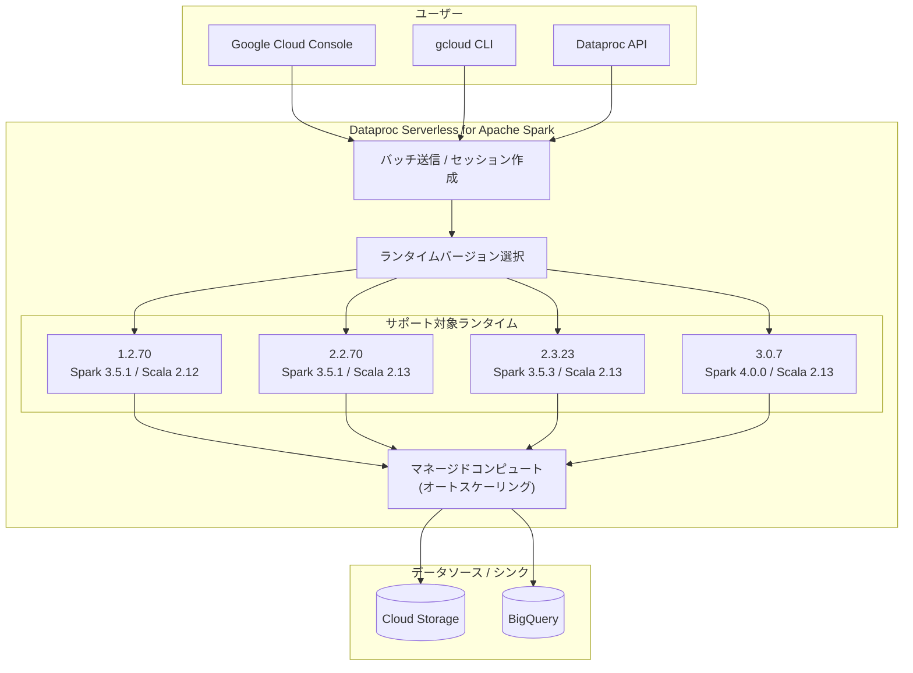

# Dataproc Serverless for Apache Spark: 新ランタイムバージョンリリース

**リリース日**: 2026-02-13
**サービス**: Dataproc Serverless for Apache Spark
**機能**: 新ランタイムバージョン 1.2.70, 2.2.70, 2.3.23, 3.0.7
**ステータス**: GA (General Availability)

:bar_chart: [このアップデートのインフォグラフィックを見る](https://takech9203.github.io/google-cloud-news-summary/20260213-dataproc-serverless-spark-runtime.html)

## 概要

Dataproc Serverless for Apache Spark の新しいランタイムバージョンがリリースされた。今回リリースされたバージョンは 1.2.70、2.2.70、2.3.23、3.0.7 の 4 つである。Dataproc Serverless は毎週のリリースサイクルで新しいサブマイナーバージョンを提供しており、今回のリリースもその一環として、セキュリティパッチ、バグ修正、パフォーマンス改善などが含まれる定期的なアップデートである。

Dataproc Serverless for Apache Spark は、クラスタのプロビジョニングや管理を必要とせずに Spark ワークロードを実行できるフルマネージドのサーバーレスサービスである。バッチワークロードとインタラクティブセッションの 2 つの方法でワークロードを実行でき、ジョブ実行中のリソース消費に対してのみ課金される。

今回のリリースは、現在サポートされている 4 つのランタイムバージョン系列すべてに新しいサブマイナーバージョンを提供するものであり、既存のワークロードへの後方互換性が保たれている。

**アップデート前の課題**

- 以前のサブマイナーバージョン (1.2.69, 2.2.69, 2.3.22, 3.0.5 等) で動作しており、最新のセキュリティパッチやバグ修正が適用されていなかった
- ランタイムバージョンのサブマイナーバージョンの固定 (ピンニング) はサポートされておらず、自動的に最新のサブマイナーバージョンが適用される

**アップデート後の改善**

- 最新のセキュリティパッチおよびバグ修正が適用されたランタイム環境が利用可能になった
- 週次リリースにより継続的な安定性向上とパフォーマンス改善が提供される
- 既存のワークロードは後方互換性が保たれているため、コード変更なしで新バージョンの恩恵を受けられる

## アーキテクチャ図



Dataproc Serverless for Apache Spark のアーキテクチャ概要を示す。ユーザーは Console、gcloud CLI、または API 経由でバッチワークロードを送信し、ランタイムバージョンを指定する。サービスはマネージドインフラストラクチャ上でワークロードを実行し、Cloud Storage や BigQuery などのデータソースと連携する。

## サービスアップデートの詳細

### 主要機能

1. **4 つのランタイム系列への同時リリース**
   - 1.2.70 (LTS): Spark 3.5.1 ベース、Scala 2.12
   - 2.2.70 (LTS / デフォルト): Spark 3.5.1 ベース、Scala 2.13
   - 2.3.23 (LTS): Spark 3.5.3 ベース、Scala 2.13
   - 3.0.7 (GA): Spark 4.0.0 ベース、Scala 2.13

2. **後方互換性の保証**
   - 週次リリースのサブマイナーバージョンアップデートは完全な後方互換性を持つ
   - Spark、Java ライブラリ、Python パッケージのサブマイナーバージョンアップグレードが含まれる場合がある

3. **自動適用**
   - サブマイナーバージョンの固定 (ピンニング) はサポートされていないため、メジャー.マイナーバージョン指定時に自動的に最新のサブマイナーバージョンが使用される

## 技術仕様

### ランタイムバージョン別コンポーネント構成

| コンポーネント | 1.2.70 | 2.2.70 | 2.3.23 | 3.0.7 |
|-------------|--------|--------|--------|-------|
| Apache Spark | 3.5.1 | 3.5.1 | 3.5.3 | 4.0.0 |
| Java | 17 | 17 | 17 | 21 |
| Python | 3.12 | 3.12 | 3.11 | 3.12 |
| Scala | 2.12 | 2.13 | 2.13 | 2.13 |
| R | 4.3 | 4.3 | 4.3 | - |
| Cloud Storage Connector | 3.0.3 | 3.0.3 | 3.1.2 | 3.1.9 |
| BigQuery Connector | 0.36.4 | 0.36.4 | 0.42.3 | 0.43.1-preview |

### ランタイムバージョンのサポート期間

| バージョン | リリース日 | サポート期限 | 利用可能期限 | 備考 |
|-----------|----------|------------|------------|------|
| 3.0 (GA) | 2025/12/04 | 2027/01/31 | 2029/01/31 | 非 LTS (12 ヶ月サポート) |
| 2.3 LTS | 2025/05/28 | 2027/11/26 | 2029/11/26 | LTS (30 ヶ月サポート) |
| 2.2 LTS | 2024/03/27 | 2026/09/30 | 2028/09/30 | **デフォルトバージョン** |
| 1.2 LTS | 2024/03/27 | 2026/09/30 | 2028/09/30 | LTS (30 ヶ月サポート) |

### ランタイムバージョンの特徴

| 特徴 | 1.2 / 2.2 | 2.3 | 3.0 |
|------|-----------|-----|-----|
| ノード配置 | リージョン内の単一ゾーン | リージョン内の単一ゾーン | リージョン内の複数ゾーン (マルチゾーン) |
| Persistent History Server | サポート | サポート | 非サポート (Spark UI を使用) |
| SparkR バッチ | サポート | サポート | 非サポート (sparklyr を使用) |
| Jupyter セッション | サポート | サポート | 非サポート (Spark Connect を使用) |
| 文字エンコーディング | UTF-8 | UTF-8 | UTF-8 |

## 設定方法

### 前提条件

1. Google Cloud プロジェクトで Dataproc API が有効化されていること
2. ランタイムバージョン 3.0 を使用する場合は `dataproc-rm.googleapis.com` API の有効化が追加で必要
3. ワークロードを実行するサービスアカウントに Dataproc Worker ロールが付与されていること

### 手順

#### ステップ 1: gcloud CLI でランタイムバージョンを指定してバッチを送信

```bash
# ランタイムバージョン 2.2 (デフォルト) を使用する場合
gcloud dataproc batches submit spark \
    --region=us-central1 \
    --jars=file:///usr/lib/spark/examples/jars/spark-examples.jar \
    --class=org.apache.spark.examples.SparkPi \
    -- 1000

# 特定のランタイムバージョン (例: 2.3) を指定する場合
gcloud dataproc batches submit spark \
    --region=us-central1 \
    --version=2.3 \
    --jars=file:///usr/lib/spark/examples/jars/spark-examples.jar \
    --class=org.apache.spark.examples.SparkPi \
    -- 1000

# ランタイムバージョン 3.0 (Spark 4.0) を指定する場合
gcloud dataproc batches submit spark \
    --region=us-central1 \
    --version=3.0 \
    --jars=file:///usr/lib/spark/examples/jars/spark-examples.jar \
    --class=org.apache.spark.examples.SparkPi \
    -- 1000
```

#### ステップ 2: Spark プロパティの設定 (オプション)

```bash
gcloud dataproc batches submit spark \
    --region=us-central1 \
    --version=2.3 \
    --properties=spark.checkpoint.compress=true \
    --jars=file:///usr/lib/spark/examples/jars/spark-examples.jar \
    --class=org.apache.spark.examples.SparkPi \
    -- 1000
```

## メリット

### ビジネス面

- **運用負荷の軽減**: サーバーレスアーキテクチャにより、クラスタの管理・スケーリング・プロビジョニングが不要で NoOps モデルを実現できる
- **コスト最適化**: ジョブ実行時間のみに課金され、起動・停止にかかるコストは発生しない。アイドル時のコンピュートオーバーヘッドもない
- **継続的な改善**: 週次リリースによりセキュリティパッチやバグ修正が自動的に適用される

### 技術面

- **後方互換性**: サブマイナーバージョンアップデートは完全な後方互換性を持ち、コード変更なしで最新バージョンの恩恵を受けられる
- **マルチゾーン対応 (3.0)**: ランタイム 3.0 以降ではリージョン内の複数ゾーンにノードを配置することで、ゾーン在庫切れの影響を軽減し、可用性を向上させる
- **高速起動**: 標準およびプレミアムティアともに平均 40-50 秒の起動時間を実現

## デメリット・制約事項

### 制限事項

- サブマイナーバージョンの固定 (ピンニング) はサポートされていない。メジャー.マイナーバージョンのみ指定可能
- ランタイム 3.0 では Persistent History Server、SparkR バッチ、Jupyter セッションが非サポート
- 分散 Spark XGBoost はオートスケーリングが有効な場合 (デフォルト動作) に使用できない

### 考慮すべき点

- ランタイム 1.2 および 2.2 のサポート期限は 2026/09/30 であり、これらを使用している場合は 2.3 または 3.0 への移行計画を検討する必要がある
- ランタイム 3.0 は Spark 4.0.0 を採用しており、既存の Spark 3.x ベースのワークロードからの移行時に互換性の確認が必要
- ランタイム 3.0 では `dataproc-rm.googleapis.com` API の有効化が新たに必要

## ユースケース

### ユースケース 1: バッチ ETL パイプライン

**シナリオ**: 定期的に実行される ETL パイプラインで、Cloud Storage のデータを BigQuery に変換・ロードする処理を Dataproc Serverless で実行する。

**実装例**:
```bash
gcloud dataproc batches submit pyspark \
    --region=us-central1 \
    --version=2.3 \
    gs://my-bucket/etl/transform.py \
    -- --input=gs://my-bucket/raw/ --output=my-project.my-dataset.my-table
```

**効果**: クラスタの管理が不要で、ジョブ実行時間分のみ課金される。オートスケーリングにより、データ量の変動にも自動対応できる。

### ユースケース 2: インタラクティブなデータ分析

**シナリオ**: データサイエンティストが BigQuery Studio ノートブックから Spark セッションを作成し、PySpark で探索的データ分析を行う。

**効果**: インフラストラクチャの設定なしに即座に分析を開始でき、開発者の生産性が向上する。

## 料金

Dataproc Serverless for Apache Spark はジョブ実行中のリソース消費に対してのみ課金される。主な課金要素は以下の通り。

- **Data Compute Unit (DCU)**: ワークロードの実行に消費されるコンピュートリソース
- **Shuffle ストレージ**: シャッフル操作で使用されるストレージ (GB x 秒 単位)

Standard ティアと Premium ティアが提供されており、Premium ティアでは Lightning Engine (クエリアクセラレーション)、Extended Memory、GPU サポートなどの高度な機能が利用可能である。Premium ティアは包括的な料金モデルを採用しており、追加のコンピュートコストなしでプレミアム機能にアクセスできる。

BigQuery の支出ベースの確約利用割引 (CUD) が Dataproc Serverless ジョブにも適用される。

詳細な料金については公式料金ページを参照。

## 関連サービス・機能

- **Dataproc on Compute Engine**: クラスタベースの Spark 実行環境。深いカスタマイズが必要な場合や、既存の Hadoop/Spark ワークロードの移行に適する
- **BigQuery**: Spark on BigQuery により BigQuery Studio ノートブックから直接 Spark セッションを作成可能
- **Cloud Storage**: Spark ワークロードのデータソースおよびシンクとして広く使用される
- **Cloud Composer**: Airflow ベースのワークフローオーケストレーションで Dataproc Serverless バッチワークロードをスケジュール実行可能
- **Cloud Monitoring / Cloud Logging**: ワークロードの監視とログ収集
- **Spark UI**: ワークロードのモニタリングとデバッグ (Event Timeline、Task Quantile ビュー対応)

## 参考リンク

- :bar_chart: [インフォグラフィック](https://takech9203.github.io/google-cloud-news-summary/20260213-dataproc-serverless-spark-runtime.html)
- [公式リリースノート](https://docs.cloud.google.com/release-notes#February_13_2026)
- [Dataproc Serverless for Apache Spark 概要](https://cloud.google.com/dataproc-serverless/docs/overview)
- [ランタイムバージョン一覧](https://cloud.google.com/dataproc-serverless/docs/concepts/versions/dataproc-serverless-versions)
- [Spark ランタイム 1.2 コンポーネント](https://cloud.google.com/dataproc-serverless/docs/concepts/versions/spark-runtime-1.2)
- [Spark ランタイム 2.2 コンポーネント](https://cloud.google.com/dataproc-serverless/docs/concepts/versions/spark-runtime-2.2)
- [Spark ランタイム 2.3 コンポーネント](https://cloud.google.com/dataproc-serverless/docs/concepts/versions/spark-runtime-2.3)
- [Spark ランタイム 3.0 コンポーネント](https://cloud.google.com/dataproc-serverless/docs/concepts/versions/spark-runtime-3.0)
- [Spark プロパティ設定](https://cloud.google.com/dataproc-serverless/docs/concepts/properties)
- [バッチワークロード送信クイックスタート](https://cloud.google.com/dataproc-serverless/docs/quickstarts/spark-batch)
- [料金ページ](https://cloud.google.com/dataproc-serverless/pricing)
- [Dataproc vs Serverless for Apache Spark 比較](https://cloud.google.com/dataproc-serverless/docs/concepts/dataproc-compare)
- [Standard / Premium ティア](https://cloud.google.com/dataproc-serverless/docs/tiers)

## まとめ

Dataproc Serverless for Apache Spark の新ランタイムバージョン (1.2.70, 2.2.70, 2.3.23, 3.0.7) は、週次リリースサイクルの一環としてリリースされた定期アップデートである。全バージョンが後方互換性を保っており、サブマイナーバージョンの固定はサポートされないため、既存ワークロードには自動的に最新バージョンが適用される。ランタイム 1.2 および 2.2 のサポート期限が 2026 年 9 月に迫っているため、これらを利用中のユーザーは 2.3 LTS または 3.0 への移行計画を早期に策定することを推奨する。

---

**タグ**: #Dataproc #ApacheSpark #Serverless #ランタイム #GoogleCloud
