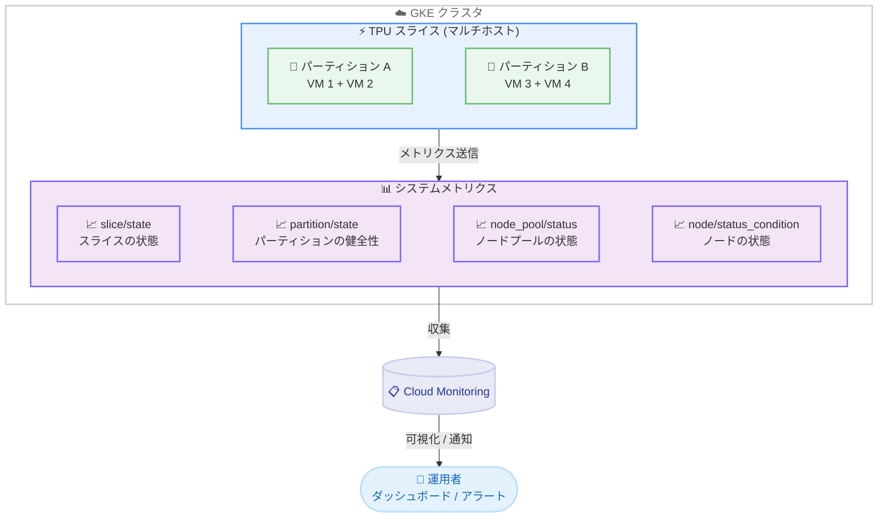

# Google Kubernetes Engine: TPU スライスヘルスモニタリングメトリクス

**リリース日**: 2026-02-13
**サービス**: Google Kubernetes Engine (GKE)
**機能**: TPU スライス / パーティションの状態監視メトリクス
**ステータス**: Beta (新機能)

[このアップデートのインフォグラフィックを見る](https://takech9203.github.io/google-cloud-news-summary/20260213-gke-tpu-slice-health-monitoring.html)

## 概要

Google Kubernetes Engine (GKE) に、TPU スライスおよびパーティションのヘルス状態を監視するための新しいベータシステムメトリクスが追加された。これにより、TPU インフラストラクチャの状態をリアルタイムで把握し、トレーニングジョブの障害原因の特定やインフラストラクチャの健全性管理が可能になる。

今回追加されたメトリクスは以下の 2 つである。

- `kubernetes.io/accelerator/slice/state`: TPU スライスの現在のステータスを示す
- `kubernetes.io/accelerator/partition/state`: TPU パーティションの健全性を示す

これらのメトリクスは、大規模な機械学習 (ML) トレーニングや推論ワークロードを GKE 上の TPU で実行しているユーザーにとって、インフラストラクチャレイヤーの可視性を大幅に向上させるアップデートである。

**アップデート前の課題**

今回のアップデート以前にも GKE では TPU に関連する複数の監視メトリクスが提供されていたが、スライスやパーティション単位での状態監視には制約があった。

- TPU ノードプールのステータス (`kubernetes.io/node_pool/status`) やノードの状態 (`kubernetes.io/node/status_condition`) は監視できたが、スライスやパーティションという論理的な単位での健全性を直接確認する手段がなかった
- トレーニングジョブが失敗した際に、障害がノードレベルの問題なのかスライスレベルの問題なのかを切り分けるために、複数のメトリクスを組み合わせて分析する必要があった
- マルチホスト TPU スライスの構成要素であるパーティションの健全性を個別に監視する専用メトリクスが存在しなかった

**アップデート後の改善**

今回のアップデートにより、TPU インフラストラクチャの階層的な状態監視が可能になった。

- `kubernetes.io/accelerator/slice/state` メトリクスにより、TPU スライス全体の現在のステータスを直接監視できるようになった
- `kubernetes.io/accelerator/partition/state` メトリクスにより、パーティション単位での健全性を個別に確認できるようになった
- これらのメトリクスを Cloud Monitoring や PromQL と組み合わせることで、TPU インフラストラクチャの障害検知とトラブルシューティングが効率化された

## アーキテクチャ図



GKE 上の TPU スライスおよびパーティションから新しいヘルスメトリクスが Cloud Monitoring に送信され、運用者がダッシュボードやアラートを通じてインフラストラクチャの健全性を監視できることを示している。既存のノードプール / ノードレベルのメトリクスに加えて、スライス / パーティションレベルの監視が階層的に構成されている。

## サービスアップデートの詳細

### 主要機能

1. **TPU スライス状態メトリクス (`kubernetes.io/accelerator/slice/state`)**
   - TPU スライス全体の現在のステータスを示すメトリクス
   - スライスが正常に動作しているか、エラー状態にあるかをリアルタイムで把握可能
   - GKE のシステムメトリクスとして Cloud Monitoring に自動的に送信される

2. **TPU パーティション状態メトリクス (`kubernetes.io/accelerator/partition/state`)**
   - TPU パーティションの健全性を示すメトリクス
   - マルチホスト TPU スライス内の各パーティションの状態を個別に監視可能
   - パーティション単位での障害検知により、問題の切り分けが迅速化

3. **既存メトリクスとの階層的な監視体系**
   - 既に提供されているノードプールステータス (`kubernetes.io/node_pool/status`)、ノード状態 (`kubernetes.io/node/status_condition`)、マルチホスト可用性 (`kubernetes.io/node_pool/multi_host/available`) と組み合わせることで、TPU インフラストラクチャの多層的な監視が実現
   - ノード → パーティション → スライス → ノードプールの各レイヤーで健全性を確認可能

## 技術仕様

### 新規追加メトリクス

今回追加された 2 つのベータメトリクスの仕様は以下の通りである。

| 項目 | `slice/state` | `partition/state` |
|------|---------------|-------------------|
| メトリクス名 | `kubernetes.io/accelerator/slice/state` | `kubernetes.io/accelerator/partition/state` |
| ステージ | Beta | Beta |
| 対象 | TPU スライス全体のステータス | TPU パーティションの健全性 |
| メトリクスタイプ | GKE システムメトリクス | GKE システムメトリクス |

### 既存の TPU 監視メトリクスとの関係

GKE で利用可能な TPU 関連のヘルスメトリクスを階層別に整理すると以下のようになる。

| レイヤー | メトリクス | ステージ | 概要 |
|---------|-----------|---------|------|
| ノードプール | `kubernetes.io/node_pool/status` | GA | ノードプールのステータス (Provisioning, Running, Error 等) |
| ノードプール | `kubernetes.io/node_pool/multi_host/available` | GA | マルチホスト TPU ノードプールの可用性 |
| ノード | `kubernetes.io/node/status_condition` | GA | ノードのコンディション (Ready, DiskPressure 等) |
| スライス | `kubernetes.io/accelerator/slice/state` | **Beta (新規)** | スライスの状態 |
| パーティション | `kubernetes.io/accelerator/partition/state` | **Beta (新規)** | パーティションの健全性 |

### 前提条件

これらのメトリクスを利用するためには、以下の条件を満たす必要がある。

- GKE クラスタでシステムメトリクスが有効化されていること
- TPU ノードプールが構成されていること
- Cloud Monitoring API が有効であること

### TPU スライスとパーティションの概念

GKE における TPU の構造を理解するために、主要な概念を以下に整理する。

| 概念 | 説明 |
|------|------|
| TPU スライス | 複数の TPU チップが ICI (Inter-Chip Interconnect) で接続された論理単位。シングルホストまたはマルチホストで構成される |
| パーティション | スライス内の論理的な区画。複数の VM とそれに接続された TPU チップで構成される |
| マルチホスト TPU スライス | 2 つ以上の相互接続された TPU VM を含むノードプール。ICI 経由でチップ間通信を行う |
| シングルホスト TPU スライス | 1 つ以上の独立した TPU VM を含むノードプール。VM 間は DCN 経由で通信 |

## 設定方法

### 前提条件

1. GKE クラスタが作成済みであること
2. TPU ノードプールが構成済みであること
3. GKE クラスタでシステムメトリクスが有効化されていること

### 手順

#### ステップ 1: システムメトリクスの有効化確認

GKE クラスタでシステムメトリクスが有効であることを確認する。TPU ダッシュボードはシステムメトリクスが有効な場合にのみデータが表示される。

```bash
# クラスタの監視設定を確認
gcloud container clusters describe CLUSTER_NAME \
  --location=LOCATION \
  --format="value(monitoringConfig)"
```

#### ステップ 2: Cloud Monitoring でメトリクスを確認

Cloud Monitoring の Metrics Explorer で新しいメトリクスを確認できる。

```
# メトリクス名で検索
kubernetes.io/accelerator/slice/state
kubernetes.io/accelerator/partition/state
```

#### ステップ 3: PromQL によるクエリ例

既存のノードプールステータスメトリクスと同様に、PromQL を使用してクエリを実行できる。以下は既存メトリクスの PromQL クエリ例であり、新しいメトリクスについても同様のパターンで利用可能と考えられる。

```promql
# 参考: ノードプールステータスの確認 (既存メトリクス)
kubernetes_io:node_pool_status{
  monitored_resource="k8s_node_pool",
  cluster_name="CLUSTER_NAME",
  node_pool_name="NODE_POOL_NAME",
  status="Running"
}
```

#### ステップ 4: GKE TPU Node Pool Status ダッシュボードの活用

Cloud Monitoring が提供する GKE TPU Node Pool Status ダッシュボードを使用して、TPU マルチホストノードプールの状態を包括的に確認できる。

Google Cloud コンソールから以下の URL にアクセスする。

```
https://console.cloud.google.com/monitoring/dashboards/integration/gke.gke-tpu-node-pool-status
```

## メリット

### ビジネス面

- **障害対応時間の短縮**: TPU スライスやパーティションの状態を直接監視できるため、トレーニングジョブの失敗時に原因特定までの時間を短縮できる
- **運用コストの削減**: インフラストラクチャの健全性を階層的に監視することで、不必要なリソース再プロビジョニングを回避し、TPU の稼働効率を向上できる

### 技術面

- **多層的な障害切り分け**: ノード、パーティション、スライス、ノードプールの各レイヤーで状態を確認できるため、障害の発生箇所を正確に特定できる
- **プロアクティブな監視**: Cloud Monitoring のアラートポリシーと組み合わせることで、問題が発生する前に異常を検知し、対処できる
- **既存の監視エコシステムとの統合**: GKE システムメトリクスとして提供されるため、既存の Cloud Monitoring ダッシュボードや PromQL ベースの監視ワークフローにシームレスに統合できる

## デメリット・制約事項

### 制限事項

- 現時点では Beta ステータスであり、GA までに仕様が変更される可能性がある
- メトリクスの詳細な値域 (スライスやパーティションがとり得るステータス値の一覧) については、公式ドキュメントの更新を確認する必要がある

### 考慮すべき点

- システムメトリクスが GKE クラスタで有効化されている必要があるため、メトリクス収集に伴う Cloud Monitoring の料金が発生する
- Beta 機能であるため、本番環境での使用にあたっては Google Cloud のベータ機能に関するサービス利用規約を確認すること

## ユースケース

### ユースケース 1: 大規模トレーニングジョブの障害原因特定

**シナリオ**: マルチホスト TPU スライス上で大規模言語モデル (LLM) のトレーニングジョブを実行中に、ジョブが予期せず失敗した場合。

**実装例**:

```promql
# スライスの状態を確認
kubernetes_io:accelerator_slice_state{
  cluster_name="ml-training-cluster",
  node_pool_name="tpu-v5-pool"
}

# パーティションの健全性を確認
kubernetes_io:accelerator_partition_state{
  cluster_name="ml-training-cluster",
  node_pool_name="tpu-v5-pool"
}
```

**効果**: ジョブの失敗がアプリケーションの問題なのか、TPU インフラストラクチャの問題なのかを迅速に切り分けることができる。パーティション単位で状態を確認できるため、特定の VM グループに局在する問題の特定にも有効である。

### ユースケース 2: TPU インフラストラクチャの継続的ヘルスモニタリング

**シナリオ**: 複数のマルチホスト TPU スライスノードプールを運用しており、インフラストラクチャ全体の健全性をダッシュボードで常時監視したい場合。

**効果**: Cloud Monitoring のアラートポリシーを設定し、スライスやパーティションの異常状態を検知した際に自動通知を受けることで、プロアクティブなインフラストラクチャ管理が可能になる。これにより、ML ワークロードの可用性と信頼性を向上させることができる。

## 料金

今回追加されたメトリクスは GKE のシステムメトリクスとして提供される。システムメトリクスの料金については、Cloud Monitoring の料金体系に準じる。

詳細な料金については以下のページを参照。

- [Google Kubernetes Engine の料金](https://cloud.google.com/kubernetes-engine/pricing)
- [Cloud Monitoring の料金](https://cloud.google.com/stackdriver/pricing)

## 利用可能リージョン

TPU スライスヘルスモニタリングメトリクスは、GKE で TPU がサポートされているすべてのリージョンで利用可能と考えられる。TPU の利用可能なリージョンについては、公式ドキュメントの [TPU availability in GKE](https://cloud.google.com/kubernetes-engine/docs/concepts/plan-tpus#availability) を参照。

## 関連サービス・機能

- **Cloud Monitoring**: メトリクスの収集、可視化、アラート設定に使用。GKE システムメトリクスの格納先
- **GKE TPU Node Pool Status ダッシュボード**: Cloud Monitoring が提供する TPU マルチホストノードプールの専用ダッシュボード
- **Cloud Logging**: TPU VM 上のコンテナログを収集。メトリクスと組み合わせた障害分析に活用
- **Cloud TPU**: GKE で利用する TPU のベースサービス。スライスやパーティションの物理的な構成を管理

## 参考リンク

- [このアップデートのインフォグラフィック](https://takech9203.github.io/google-cloud-news-summary/20260213-gke-tpu-slice-health-monitoring.html)
- [公式リリースノート](https://cloud.google.com/release-notes#February_13_2026)
- [GKE で TPU を使用する](https://cloud.google.com/kubernetes-engine/docs/how-to/tpus)
- [GKE システムメトリクス](https://cloud.google.com/monitoring/api/metrics_kubernetes#kubernetes-kubernetes)
- [TPU ノードプールのヘルスメトリクスの監視](https://cloud.google.com/kubernetes-engine/docs/how-to/tpus#tpu-node-pool-health-metrics)
- [GKE TPU Node Pool Status ダッシュボード](https://console.cloud.google.com/monitoring/dashboards/integration/gke.gke-tpu-node-pool-status)
- [TPU の概念と計画](https://cloud.google.com/kubernetes-engine/docs/concepts/tpus)
- [GKE の料金](https://cloud.google.com/kubernetes-engine/pricing)

## まとめ

GKE に新たに追加された TPU スライス / パーティションのヘルスモニタリングメトリクスは、大規模 ML ワークロードを運用するチームにとって重要なオブザーバビリティの向上をもたらす。Beta ステータスではあるが、既存のノードプールやノードレベルのメトリクスと組み合わせることで、TPU インフラストラクチャの多層的な監視が実現できる。GKE 上で TPU ワークロードを運用している場合は、システムメトリクスが有効化されていることを確認し、Cloud Monitoring ダッシュボードでこれらの新しいメトリクスの活用を検討することを推奨する。

---

**タグ**: #GKE #TPU #Monitoring #MachineLearning #Accelerators #CloudMonitoring #SystemMetrics #Beta
