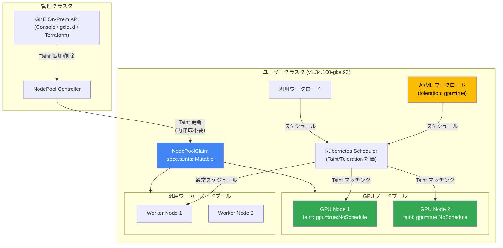

# Google Distributed Cloud (software only) for bare metal: 1.34.100-gke.93 リリース - NodePoolClaim Taint の可変化

**リリース日**: 2026-02-13
**サービス**: Google Distributed Cloud (software only) for bare metal
**機能**: NodePoolClaim リソースの spec.taints フィールドが可変 (Mutable) に対応
**ステータス**: Feature / Announcement

📊 [このアップデートのインフォグラフィックを見る](https://takech9203.github.io/google-cloud-news-summary/infographic/20260213-google-distributed-cloud-bare-metal-1-34-100.html)

## 概要

Google Distributed Cloud (software only) for bare metal 1.34.100-gke.93 がダウンロード可能になった。本リリースの主要な機能として、NodePoolClaim リソースの `spec.taints` フィールドが可変 (Mutable) となり、既存のノードプールを再作成することなく、Taint の追加・削除が可能になった。この機能は特に GPU ノードの管理において有用であり、AI/ML ワークロードを実行するベアメタル環境での運用効率が大幅に向上する。

本バージョンは Kubernetes v1.34.1-gke.4700 上で動作する。リリース後、GKE On-Prem API クライアント (Google Cloud コンソール、gcloud CLI、Terraform) でインストールまたはアップグレードが利用可能になるまでに約 7 ~ 14 日かかる。

Google Distributed Cloud (software only) for bare metal は、オンプレミスのベアメタルハードウェア上に直接 GKE クラスタをデプロイするソフトウェア専用ソリューションである。GPU や SSD などのパフォーマンス最適化ハードウェアに直接アクセスできるため、AI ワークロードの実行に適している。

**アップデート前の課題**

- NodePoolClaim リソースの `spec.taints` フィールドは不変 (Immutable) であり、ノードプールの Taint を変更するには NodePoolClaim を削除して再作成する必要があった
- GPU ノードの Taint 管理において、ノードプールの再作成が必要なため、運用中のワークロードに影響を与える可能性があった
- Taint の変更のために計画的なダウンタイムやワークロードの再配置が必要であった

**アップデート後の改善**

- `spec.taints` フィールドが Mutable になり、既存の NodePoolClaim に対して Taint の追加・削除が可能になった
- NodePoolClaim の再作成が不要なため、GPU ノードプールの Taint 管理がダウンタイムなしで実行できるようになった
- GPU ノードの動的な管理が可能になり、AI/ML ワークロードのスケジューリング制御がより柔軟になった

## アーキテクチャ図



NodePoolClaim リソースの `spec.taints` フィールドが可変になったことで、管理者は NodePoolClaim を再作成することなく、GPU ノードプールの Taint を動的に変更できる。Kubernetes Scheduler は更新された Taint/Toleration に基づいてワークロードを適切なノードに配置する。

## サービスアップデートの詳細

### 主要機能

1. **NodePoolClaim の spec.taints フィールドが可変 (Mutable) に対応**
   - 既存の NodePoolClaim リソースに対して `spec.taints` の追加・削除が可能
   - ノードプールの再作成が不要となり、運用中の変更が可能
   - GPU ノードの管理において特に有効であり、ワークロードのスケジューリング制御が柔軟に

2. **Kubernetes v1.34.1-gke.4700 ベース**
   - 本リリースは Kubernetes v1.34.1-gke.4700 上で動作する
   - 1.34 系の最新パッチとして、前バージョン 1.34.0-gke.566 (Kubernetes v1.34.1-gke.2900) からの更新

3. **GKE On-Prem API クライアントでの利用可能性**
   - リリース後、Google Cloud コンソール、gcloud CLI、Terraform での利用可能になるまで約 7 ~ 14 日

## 技術仕様

### Taint の設定パラメータ

| 項目 | 詳細 |
|------|------|
| リソースタイプ | NodePoolClaim |
| フィールド | `spec.taints` |
| 可変性 | Mutable (本リリースで対応) |
| 必須/任意 | Optional |

### Taint の Effect 値

| Effect | 動作 |
|--------|------|
| `NoSchedule` | 対応する Toleration がない Pod はスケジュールされない |
| `PreferNoSchedule` | 対応する Toleration がない Pod のスケジュールは回避されるが、必須ではない |
| `NoExecute` | 対応する Toleration がない Pod は即座に退避される。Toleration がある Pod は退避されない |

### リリースバージョン情報

| 項目 | 詳細 |
|------|------|
| GDC バージョン | 1.34.100-gke.93 |
| Kubernetes バージョン | v1.34.1-gke.4700 |
| 前バージョン | 1.34.0-gke.566 (Kubernetes v1.34.1-gke.2900) |
| リリース日 | 2026-02-13 |

### NodePoolClaim リソースの設定例

Taint を使用して GPU ノードプールを定義する例を以下に示す。

```yaml
apiVersion: baremetal.cluster.gke.io/v1
kind: NodePoolClaim
metadata:
  name: gpu-node-pool
  namespace: cluster-my-cluster
spec:
  clusterName: my-cluster
  taints:
    - key: nvidia.com/gpu
      value: "true"
      effect: NoSchedule
```

### Taint の追加・削除操作

Taint を追加する場合、`spec.taints` フィールドに新しいエントリを追加して `kubectl apply` を実行する。

```yaml
# Taint の追加例: GPU ノードプールに maintenance Taint を追加
apiVersion: baremetal.cluster.gke.io/v1
kind: NodePoolClaim
metadata:
  name: gpu-node-pool
  namespace: cluster-my-cluster
spec:
  clusterName: my-cluster
  taints:
    - key: nvidia.com/gpu
      value: "true"
      effect: NoSchedule
    - key: maintenance
      value: "scheduled"
      effect: NoExecute
```

### Taint の同期制御

Google Distributed Cloud では、Taint はノードプールのノードに自動的に反映 (Reconcile) される。`baremetal.cluster.gke.io/label-taint-no-sync` アノテーションをクラスタに適用することで、この自動同期を無効化できる。

## 設定方法

### 前提条件

1. Google Distributed Cloud (software only) for bare metal クラスタがバージョン 1.34.100-gke.93 以上であること
2. `bmctl` ツールがインストール済みであること、または GKE On-Prem API クライアント (Google Cloud コンソール、gcloud CLI、Terraform) が利用可能であること
3. GPU ノードを使用する場合、NVIDIA GPU ドライバがインストール済みであること

### 手順

#### ステップ 1: バージョンのダウンロードとアップグレード

```bash
# クラスタのアップグレードを実行
bmctl upgrade cluster --kubeconfig=ADMIN_KUBECONFIG \
    --cluster=CLUSTER_NAME
```

クラスタのアップグレード手順の詳細は [Upgrade clusters](https://cloud.google.com/kubernetes-engine/distributed-cloud/bare-metal/docs/how-to/upgrade) を参照。

#### ステップ 2: 既存 NodePoolClaim の Taint を更新

```bash
# NodePoolClaim の YAML を編集して spec.taints を更新
kubectl edit nodepoolclaim gpu-node-pool \
    --namespace=cluster-my-cluster \
    --kubeconfig=USER_KUBECONFIG
```

#### ステップ 3: Taint の反映を確認

```bash
# ノードの Taint を確認
kubectl get nodes -o jsonpath='{range .items[*]}{.metadata.name}{"\t"}{.spec.taints}{"\n"}{end}' \
    --kubeconfig=USER_KUBECONFIG
```

## メリット

### ビジネス面

- **運用コストの削減**: ノードプールの再作成が不要になることで、GPU ノードの管理に必要な作業時間とダウンタイムが大幅に削減される
- **AI/ML ワークロードの俊敏性向上**: GPU リソースの割り当て変更が迅速に行えるようになり、ビジネス要件の変化に即座に対応可能

### 技術面

- **ゼロダウンタイムでの Taint 管理**: 既存ノードプールの Taint を変更する際に、NodePoolClaim の削除・再作成が不要
- **GPU ノードの動的スケジューリング制御**: Taint/Toleration を活用して GPU ノードへのワークロード配置をきめ細かく制御可能
- **Kubernetes ネイティブな操作**: 標準的な `kubectl apply` 操作で Taint の更新が可能であり、既存の CI/CD パイプラインとの統合が容易

## デメリット・制約事項

### 制限事項

- GKE On-Prem API クライアント (Google Cloud コンソール、gcloud CLI、Terraform) での利用は、リリースから 7 ~ 14 日後に利用可能
- サードパーティのストレージベンダーを使用する場合、本リリースに対するストレージベンダーの認定を確認する必要がある
- Dynamic Resource Allocation (DRA) for GPU は別途 Preview 機能として提供されており、`resource.k8s.io/v1beta1` API グループを使用する (オープンソース Kubernetes の `v1` とは異なる)

### 考慮すべき点

- Taint の変更は即座にノードに反映されるため、稼働中のワークロードへの影響を事前に確認すること (特に `NoExecute` Effect の場合)
- `baremetal.cluster.gke.io/label-taint-no-sync` アノテーションが設定されている場合、Taint の自動同期が無効化されるため注意が必要

## ユースケース

### ユースケース 1: GPU ノードの動的なワークロード制御

**シナリオ**: AI/ML チームが GPU ノードプール上でトレーニングジョブと推論サービスを使い分けたい場合、Taint を動的に変更して特定のワークロードだけを GPU ノードにスケジュールする。

**実装例**:
```yaml
# GPU ノードプールに推論専用の Taint を追加
apiVersion: baremetal.cluster.gke.io/v1
kind: NodePoolClaim
metadata:
  name: gpu-inference-pool
  namespace: cluster-ml-cluster
spec:
  clusterName: ml-cluster
  taints:
    - key: workload-type
      value: inference
      effect: NoSchedule
---
# 推論ワークロードに Toleration を付与
apiVersion: apps/v1
kind: Deployment
metadata:
  name: inference-service
spec:
  template:
    spec:
      tolerations:
        - key: workload-type
          value: inference
          operator: Equal
          effect: NoSchedule
      containers:
        - name: inference
          image: my-inference-model:latest
          resources:
            limits:
              nvidia.com/gpu: 1
```

**効果**: GPU ノードプールの用途を推論からトレーニングへ、またはその逆に切り替える際に、NodePoolClaim を再作成する必要がなく、Taint の変更のみで対応可能になる。

### ユースケース 2: メンテナンス時のノードプール隔離

**シナリオ**: GPU ノードのファームウェア更新やドライバ更新のため、一時的にワークロードをスケジュールさせたくない場合に、`NoExecute` Taint を追加してワークロードを退避させる。

**効果**: NodePoolClaim の Taint を一時的に `NoExecute` に変更するだけで、当該ノードプール上のワークロードを自動的に他のノードに退避させ、メンテナンス完了後に Taint を除去して再度ワークロードを受け入れ可能にできる。

## 料金

Google Distributed Cloud (software only) for bare metal のクラスタは vCPU 単位で課金される。GKE Enterprise API を有効にすることで、Google Distributed Cloud を含む GKE Enterprise の全機能を利用できる。

詳細な料金情報については、[Google Kubernetes Engine の料金](https://cloud.google.com/kubernetes-engine/pricing) を参照。

## 関連サービス・機能

- **[Dynamic Resource Allocation (DRA) for GPU](https://cloud.google.com/kubernetes-engine/distributed-cloud/bare-metal/docs/how-to/use-dra-for-gpus)**: Kubernetes の DRA API を使用して、Pod とコンテナ間で GPU リソースを動的に割り当てる機能 (Preview)。バージョン 1.33.0 以降で利用可能
- **[GKE On-Prem API](https://cloud.google.com/kubernetes-engine/distributed-cloud/reference/on-prem-api-overview)**: Google Cloud コンソール、gcloud CLI、Terraform を通じてオンプレミスクラスタのライフサイクルを管理する API
- **[NVIDIA GPU Operator](https://cloud.google.com/kubernetes-engine/distributed-cloud/bare-metal/docs/how-to/update-clusters#gpu-oper)**: ベアメタルクラスタで GPU ワークロードを実行するための NVIDIA GPU Operator のインストール・管理
- **[VM Runtime on GDC](https://cloud.google.com/kubernetes-engine/distributed-cloud/bare-metal/docs/vm-runtime/overview)**: Kubernetes 上で既存の VM ベースのワークロードをコンテナと同様に実行する機能
- **Cloud Monitoring / Cloud Logging**: Connect Agent を通じて、クラスタとワークロードの監視・ログ管理を一元化

## 参考リンク

- 📊 [インフォグラフィック](https://takech9203.github.io/google-cloud-news-summary/infographic/20260213-google-distributed-cloud-bare-metal-1-34-100.html)
- [公式リリースノート](https://docs.cloud.google.com/release-notes#February_13_2026)
- [Google Distributed Cloud (software only) for bare metal リリースノート](https://cloud.google.com/kubernetes-engine/distributed-cloud/bare-metal/docs/release-notes)
- [クラスタ構成フィールドリファレンス](https://cloud.google.com/kubernetes-engine/distributed-cloud/bare-metal/docs/reference/cluster-config-ref)
- [クラスタのアップグレード手順](https://cloud.google.com/kubernetes-engine/distributed-cloud/bare-metal/docs/how-to/upgrade)
- [ノードプールの追加と削除](https://cloud.google.com/kubernetes-engine/distributed-cloud/bare-metal/docs/how-to/add-remove-node-pools)
- [GPU ワークロードの Dynamic Resource Allocation](https://cloud.google.com/kubernetes-engine/distributed-cloud/bare-metal/docs/how-to/use-dra-for-gpus)
- [Google Distributed Cloud (software only) for bare metal 概要](https://cloud.google.com/kubernetes-engine/distributed-cloud/bare-metal/docs/concepts/about-bare-metal)
- [GKE Enterprise 料金ページ](https://cloud.google.com/kubernetes-engine/pricing)
- [バージョン履歴](https://cloud.google.com/kubernetes-engine/distributed-cloud/bare-metal/docs/version-history)

## まとめ

Google Distributed Cloud (software only) for bare metal 1.34.100-gke.93 では、NodePoolClaim リソースの `spec.taints` フィールドが可変となり、GPU ノードの Taint 管理が大幅に簡素化された。これにより、AI/ML ワークロードを実行するオンプレミス環境において、ノードプールの再作成なしにスケジューリング制御を動的に変更できるようになった。GPU を活用した AI ワークロードをベアメタル環境で運用している組織は、本バージョンへのアップグレードを検討することを推奨する。

---

**タグ**: #GoogleDistributedCloud #BareMetal #Kubernetes #HybridCloud #GPU #NodePoolClaim #Taint #OnPremises #GKEEnterprise #AIWorkloads
