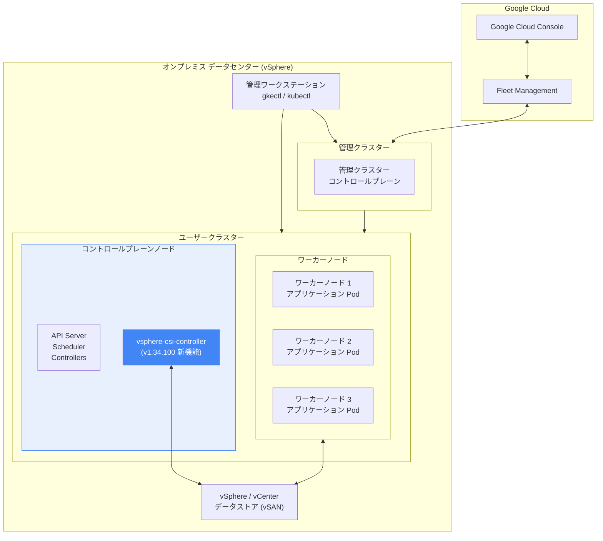

# Google Distributed Cloud for VMware: バージョン 1.34.100-gke.93 リリース

**リリース日**: 2026-02-13
**サービス**: Google Distributed Cloud (software only) for VMware
**機能**: バージョン 1.34.100-gke.93 リリース / vsphere-csi-controller のコントロールプレーンノードへのデプロイ対応
**ステータス**: GA (一般提供)

📊 [このアップデートのインフォグラフィックを見る](https://takech9203.github.io/google-cloud-news-summary/20260213-google-distributed-cloud-vmware-1-34-100.html)

## 概要

Google Distributed Cloud (software only) for VMware 1.34.100-gke.93 がダウンロード可能になった。本リリースは Kubernetes v1.34.1-gke.4700 上で動作し、1.34 系の最初のパッチリリースとなる。

今回のリリースの主要な新機能として、advanced cluster のユーザークラスターにおいて、vsphere-csi-controller をコントロールプレーンノードにデプロイできるようになった。これにより、ストレージコントローラーの配置に関する柔軟性が向上し、ワーカーノードのリソースをアプリケーションワークロードに集中させることが可能になる。

リリース後、GKE On-Prem API クライアント (Google Cloud コンソール、gcloud CLI、Terraform) で利用可能になるまで約 7~14 日を要する。サードパーティストレージベンダーを使用している場合は、GDC Ready ストレージパートナーのドキュメントで当該リリースの認定状況を確認する必要がある。

**アップデート前の課題**

- vsphere-csi-controller はワーカーノード上にデプロイされており、アプリケーションワークロードとストレージコントローラーがリソースを共有していた
- ストレージコントローラーのリソース消費がワーカーノードのアプリケーションパフォーマンスに影響を与える可能性があった
- コントロールプレーンノードとワーカーノードの役割分離が完全ではなかった

**アップデート後の改善**

- advanced cluster のユーザークラスターで vsphere-csi-controller をコントロールプレーンノードにデプロイ可能になった
- ワーカーノードのリソースをアプリケーションワークロードに専念させることが可能になった
- コントロールプレーンコンポーネントとストレージコントローラーの配置を統合し、インフラストラクチャの役割分離がより明確になった

## アーキテクチャ図



本図は、Google Distributed Cloud for VMware のアーキテクチャにおいて、vsphere-csi-controller がユーザークラスターのコントロールプレーンノード上にデプロイされる新しい構成を示している。従来はワーカーノード上に配置されていた vsphere-csi-controller が、コントロールプレーンノードに移動することで、ワーカーノードのリソースをアプリケーションに集中させることが可能になる。

## サービスアップデートの詳細

### 主要機能

1. **vsphere-csi-controller のコントロールプレーンノードへのデプロイ**
   - advanced cluster のユーザークラスターにおいて、vsphere-csi-controller をコントロールプレーンノードにデプロイできるようになった
   - vSphere CSI ドライバーは vSphere 環境のストレージを Kubernetes のコンテナワークロードに提供する CSI (Container Storage Interface) 準拠のドライバーであり、PersistentVolume のプロビジョニング、ボリューム拡張、ボリュームスナップショットなどをサポートする
   - これにより、ストレージ管理コンポーネントとアプリケーションワークロードの分離が強化される

2. **Kubernetes v1.34.1-gke.4700 ベース**
   - 本リリースは Kubernetes v1.34.1-gke.4700 上で動作する
   - 1.34 系初期リリース (1.34.0-gke.566) の Kubernetes v1.34.1-gke.2900 からのアップデートとなる

3. **Advanced Cluster アーキテクチャの継続**
   - バージョン 1.34 では、すべてのクラスターが advanced cluster として動作する
   - バージョン 1.33 から 1.34 へのアップグレード時、非 advanced クラスターは自動的に advanced cluster に変換される
   - advanced cluster は Google Distributed Cloud for Bare Metal を基盤フレームワークとして使用する統合アーキテクチャを採用している

## 技術仕様

### バージョン情報

| 項目 | 詳細 |
|------|------|
| GDC VMware バージョン | 1.34.100-gke.93 |
| Kubernetes バージョン | v1.34.1-gke.4700 |
| メジャーバージョン (1.34 系) 初期リリース | 1.34.0-gke.566 (2025 年 12 月 11 日) |
| containerd | 2.0 (1.34 系から) |
| クラスターモード | Advanced Cluster (必須) |

### vSphere CSI ドライバー要件

| 項目 | 要件 |
|------|------|
| vCenter Server | Linux ベースのサポートされたバージョン |
| ESXi | サポートされたバージョン |
| オフライン ボリューム拡張 | vCenter Server / ESXi 7.0 Update 1 以降 |
| オンライン ボリューム拡張 | vCenter Server / ESXi 7.0 Update 2 以降 |
| ボリュームスナップショット | vCenter Server / ESXi 7.0 Update 3 以降 |
| vCenter ユーザー権限 | Cns.Searchable 権限 (ルート vCenter オブジェクト) |
| vCenter ユーザー名 | 完全修飾ドメイン名 (FQDN) 形式 (例: user@example.com) |

### GKE On-Prem API 利用可能時期

| 項目 | 詳細 |
|------|------|
| ダウンロード可能日 | 2026 年 2 月 13 日 |
| API クライアント利用可能予定 | 2026 年 2 月 20 日～2 月 27 日頃 |
| 対象クライアント | Google Cloud コンソール、gcloud CLI、Terraform |

## 設定方法

### 前提条件

1. 管理ワークステーション、管理クラスターが既にセットアップされていること
2. gkectl のバージョンがターゲットバージョンと一致していること
3. vSphere 環境が CSI ドライバーの要件を満たしていること
4. クラスターが advanced cluster モードで動作していること (1.34 では必須)

### 手順

#### ステップ 1: gkectl と管理ワークステーションのアップグレード

```bash
# gkectl のダウンロード (通常は管理ワークステーション経由で自動取得)
gcloud storage cp gs://gke-on-prem-release/gkectl/1.34.100-gke.93/gkectl ./
chmod +x gkectl
```

#### ステップ 2: 管理クラスターのアップグレード

```bash
# アップグレード前の診断
gkectl diagnose cluster --kubeconfig ADMIN_CLUSTER_KUBECONFIG

# 管理クラスターのアップグレード
gkectl upgrade admin --kubeconfig ADMIN_CLUSTER_KUBECONFIG \
    --config ADMIN_CLUSTER_CONFIG
```

#### ステップ 3: ユーザークラスターのアップグレード

```bash
# ユーザークラスターのアップグレード
gkectl upgrade cluster --kubeconfig ADMIN_CLUSTER_KUBECONFIG \
    --config USER_CLUSTER_CONFIG
```

#### ステップ 4: vSphere CSI ドライバーの確認

```bash
# StorageClass の確認
kubectl --kubeconfig USER_CLUSTER_KUBECONFIG get storageclass

# CSI ドライバーのインストール確認
kubectl --kubeconfig USER_CLUSTER_KUBECONFIG get csinode \
    -o="custom-columns=NAME:metadata.name,DRIVERS:spec.drivers[].name"
```

## メリット

### ビジネス面

- **運用効率の向上**: コントロールプレーンとワーカーノードの役割分離が明確になることで、運用管理がシンプルになる
- **アプリケーションパフォーマンスの改善**: ワーカーノードからストレージコントローラーのオーバーヘッドを排除し、アプリケーションにリソースを集中させることが可能になる

### 技術面

- **リソース分離の強化**: vsphere-csi-controller がコントロールプレーンノードで動作することで、ストレージ管理のリソース消費がワーカーノードに影響しなくなる
- **セキュリティ境界の改善**: コントロールプレーンコンポーネントとストレージコントローラーを同一ノードに配置することで、セキュリティポリシーの適用が統一される
- **Kubernetes 最新バージョンの恩恵**: Kubernetes v1.34.1-gke.4700 ベースにより、最新のセキュリティ修正と機能改善が含まれる

## デメリット・制約事項

### 制限事項

- リリース後、GKE On-Prem API クライアント (Google Cloud コンソール、gcloud CLI、Terraform) で利用可能になるまで約 7~14 日を要する
- バージョン 1.34 では、すべてのクラスターが advanced cluster として動作する必要がある (非 advanced クラスターは 1.33 から 1.34 へのアップグレード時に自動変換される)
- サードパーティストレージベンダーを使用している場合、GDC Ready ストレージパートナーの認定を確認する必要がある
- vCenter ユーザー名は完全修飾ドメイン名 (FQDN) 形式である必要がある (バージョン 1.29 以降の要件)

### 考慮すべき点

- 1.34 系へのアップグレードには、管理ワークステーション、管理クラスター、ユーザークラスターの順にアップグレードが必要
- 非 advanced クラスターからのアップグレードでは、カスタムコードが advanced cluster の設定に依存している場合、破壊的変更となる可能性がある
- アップグレード前に必ず管理クラスターとユーザークラスターのバックアップを取得すること
- containerd が 1.7 から 2.0 にアップグレードされているため (1.34.0 から)、レジストリミラー設定が hosts.toml 形式に移行されている点に注意

## ユースケース

### ユースケース 1: ストレージ集約型ワークロードの運用改善

**シナリオ**: データベースや分析基盤など、大量の PersistentVolume を使用するステートフルアプリケーションをオンプレミスの vSphere 環境で運用しているケース。vsphere-csi-controller をコントロールプレーンに移動することで、ワーカーノードのリソースをデータ処理に集中させることができる。

**効果**: ワーカーノード上の vsphere-csi-controller によるリソース競合が解消され、データベースやストレージ集約型ワークロードのパフォーマンスが安定する。

### ユースケース 2: ハイブリッドクラウド環境の統合管理

**シナリオ**: Google Cloud 上の GKE クラスターとオンプレミスの GDC VMware クラスターをフリートとして一元管理し、規制要件に応じてオンプレミスでデータを保持しつつ、Google Cloud のマネージドサービスと連携する環境。

**効果**: 最新バージョンにアップグレードすることで、Google Cloud コンソールからの統合管理、セキュリティ修正の適用、advanced cluster アーキテクチャによる運用の一貫性が確保される。

## 料金

Google Distributed Cloud (software only) for VMware のオンプレミスクラスターは vCPU 単位で課金される。課金を有効にするには、Google Cloud プロジェクトで Anthos API を有効にする必要がある。

詳細な料金情報については [GKE の料金ページ](https://cloud.google.com/kubernetes-engine/pricing) を参照。

## 関連サービス・機能

- **GKE Enterprise**: Google Distributed Cloud は GKE Enterprise の中核コンポーネントであり、フリート管理、Config Management、Cloud Service Mesh などの機能を利用できる
- **vSphere CSI ドライバー**: vSphere 環境のストレージを Kubernetes に統合する CSI 準拠ドライバー。PersistentVolume のプロビジョニング、ボリューム拡張、スナップショットをサポート
- **Fleet Management (フリート管理)**: オンプレミスクラスターと Google Cloud 上の GKE クラスターを統合的に管理するための機能
- **Connect Agent**: オンプレミスクラスターと Google Cloud 間の接続を管理するエージェント
- **Cloud Monitoring / Cloud Logging**: クラスターの監視とログ収集を Google Cloud の監視基盤に統合
- **MetalLB**: GDC VMware のデフォルトロードバランサー

## 参考リンク

- 📊 [インフォグラフィック](https://takech9203.github.io/google-cloud-news-summary/20260213-google-distributed-cloud-vmware-1-34-100.html)
- [公式リリースノート](https://docs.cloud.google.com/release-notes#February_13_2026)
- [Google Distributed Cloud for VMware リリースノート](https://cloud.google.com/kubernetes-engine/distributed-cloud/vmware/docs/release-notes)
- [Google Distributed Cloud for VMware 概要](https://cloud.google.com/kubernetes-engine/distributed-cloud/vmware/docs/overview)
- [vSphere CSI ドライバーの使用](https://cloud.google.com/kubernetes-engine/distributed-cloud/vmware/docs/how-to/using-vsphere-csi-driver)
- [Advanced Cluster の概要](https://cloud.google.com/kubernetes-engine/distributed-cloud/vmware/docs/concepts/advanced-clusters)
- [アップグレード手順](https://cloud.google.com/kubernetes-engine/distributed-cloud/vmware/docs/how-to/upgrading)
- [アップグレードのベストプラクティス](https://cloud.google.com/kubernetes-engine/distributed-cloud/vmware/docs/how-to/upgrade-best-practices)
- [ダウンロード](https://cloud.google.com/kubernetes-engine/distributed-cloud/vmware/docs/downloads)
- [バージョン履歴](https://cloud.google.com/kubernetes-engine/distributed-cloud/vmware/docs/version-history)
- [GKE 料金ページ](https://cloud.google.com/kubernetes-engine/pricing)

## まとめ

Google Distributed Cloud for VMware 1.34.100-gke.93 は、1.34 系の最初のパッチリリースであり、Kubernetes v1.34.1-gke.4700 上で動作する。最も注目すべき新機能は、advanced cluster のユーザークラスターにおいて vsphere-csi-controller をコントロールプレーンノードにデプロイできるようになった点であり、ワーカーノードのリソース効率化とインフラストラクチャの役割分離の強化に寄与する。1.34 系を利用中の環境では、セキュリティ修正と機能改善のためにアップグレードを推奨する。なお、GKE On-Prem API クライアントでの利用開始にはリリースから 7~14 日を要するため、アップグレード計画にはこの期間を考慮されたい。

---

**タグ**: #GoogleDistributedCloud #VMware #Kubernetes #HybridCloud #vSphereCSI #GKEEnterprise #AdvancedCluster #OnPremises
